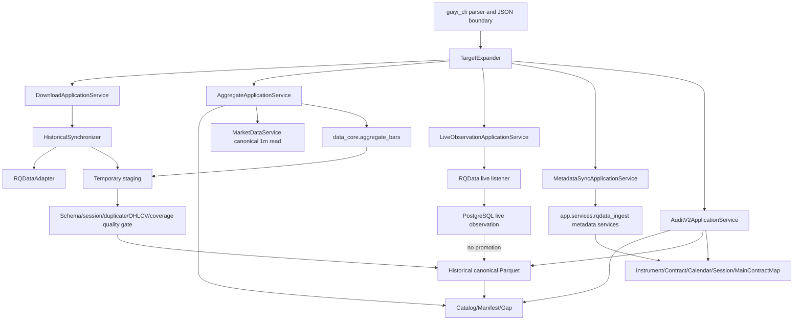
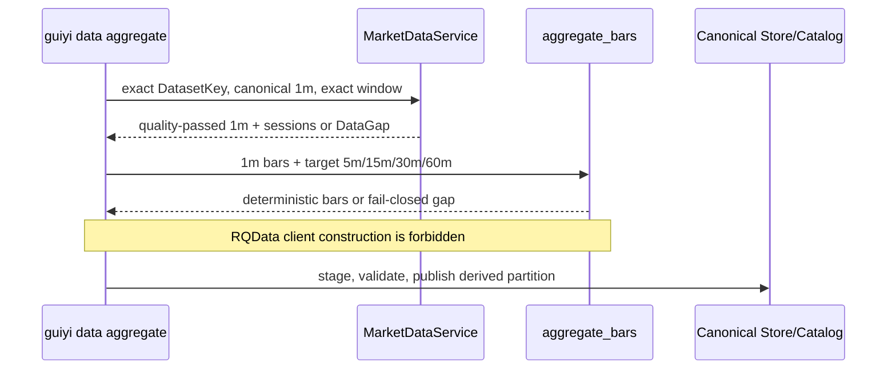
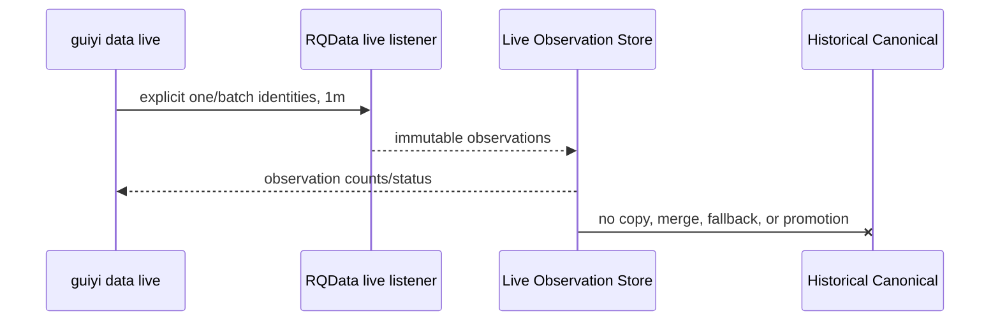

# Design Document: Scripts CLI Consolidation

## Overview

本设计把分散在 `scripts/` 的行情下载、聚合、实时观察、元数据同步和审计能力收口到 `uv run --project services/quant-api guiyi data ...`。CLI 只负责参数校验、目标展开、调用应用服务和结构化结果输出；数据算法继续由 `app.data_core` 与 `app.services.rqdata_ingest` 提供，禁止在 CLI 中复制。

迁移采用“新命令与等价测试先落地，引用切换后才删除旧入口”的顺序。该 spec 只规划仓库代码；不授权 RQData 真实调用、正式 Parquet 或 PostgreSQL 变更、Runtime/live 启用、receipt/report/evidence 删除或仓库外删除。后续实现全部在独立 task worktree 中进行，不在 `develop` 工作区直接修改。

## Key Design Decisions

1. **pre-2020 完全并入 `download`，不新增 `backfill` 命令。** pre-2020 不是新的数据身份或 provider 模式；V2 `HistoricalSynchronizer.plan_missing_windows()` 已能把任何显式 `(start, end]` 请求分解为缺失前缀/中段/尾段。旧 `1m/1d/1w` 专用实现中的固定 2020 边界、legacy 文件锚点、CSV/JSON resume 和 supersede 路径均属旧存储迁移机制，不进入目标合同。上市日、provider 最早日期、流量分批和重试改为适用于所有年份的通用校验/批处理规则。若目标窗口越过不可用日期，系统登记精确 DataGap 并失败可见，不静默截短。
2. **Direct 与 derived 频率严格分开。** `download` 仅接受 `1m/1d/1w`；`aggregate` 仅接受 `5m/15m/30m/60m`，且只读同 Dataset identity、同窗口、质量通过的 canonical `1m`，不构造 RQData client。
3. **数据种类必须显式。** 每个 download/aggregate/live 目标都必须声明 `continuous` 或 `actual_dominant`。两者不可推断、互换或 fallback；actual-dominant 必须由 MainContractMap rank=1 解析。
4. **historical 与 live 物理及身份隔离。** historical 只经 staging→validation→canonical publish；live 只写 observation 层。CLI 不提供 live→canonical promotion。
5. **`sync` 只做 metadata orchestration。** 命令复用 `app.services.rqdata_ingest` 中的 instrument/contract/calendar/session/MainContractMap 服务；不得复制查询、映射或 upsert 算法。
6. **Audit V2 以稳定 scope 命名。** `catalog/coverage/schema/physical/gap/all` 取代阶段号、日期和 closeout 命名；audit 全部只读，输出同一 envelope。
7. **普通仓库删除与受控外部删除分离。** 本 spec 允许后续删除 Git 跟踪的旧源码、测试、Shell 和 active references；正式数据、DB、Runtime、receipt/report/evidence 的删除必须另行取得精确、单次人工执行意图。
8. **不保留 compatibility shim。** 旧脚本名和旧 Profile/Binding 参数不转发到新 CLI；迁移窗口由测试与引用切换保证，而非永久 shim。

## Target Command Tree

```text
guiyi
└── data
    ├── download
    │   ├── --symbol SYMBOL | --symbols-file PATH
    │   ├── --dataset-kind continuous|actual_dominant   (required)
    │   ├── --contract-or-series VALUE                  (required for single target; batch row field otherwise)
    │   ├── --frequency 1m|1d|1w                        (required)
    │   ├── --start ISO-8601 --end ISO-8601             (both required)
    │   ├── --batch-size N                               (optional execution bound)
    │   └── --apply                                     (absent = read-only plan)
    ├── aggregate
    │   ├── --symbol SYMBOL | --symbols-file PATH
    │   ├── --dataset-kind continuous|actual_dominant   (required)
    │   ├── --contract-or-series VALUE
    │   ├── --frequency 5m|15m|30m|60m                  (required)
    │   ├── --start ISO-8601 --end ISO-8601             (both required)
    │   ├── --batch-size N
    │   └── --apply                                     (absent = read-only plan)
    ├── live
    │   ├── --symbol SYMBOL | --symbols-file PATH
    │   ├── --dataset-kind continuous|actual_dominant   (required)
    │   ├── --contract-or-series VALUE
    │   ├── --frequency 1m                              (only accepted source)
    │   └── --confirm-observation-write                 (explicit local effect flag; not external authorization)
    ├── sync
    │   ├── --scope instruments|contracts|calendar|sessions|main-contract-map|all
    │   ├── --symbol SYMBOL | --symbols-file PATH       (scope-dependent)
    │   ├── --start ISO-8601 --end ISO-8601             (scope-dependent)
    │   └── --apply                                     (absent = read-only plan)
    ├── audit
    │   ├── --scope catalog|coverage|schema|physical|gap|all
    │   ├── --symbol SYMBOL | --symbols-file PATH       (optional filter)
    │   ├── --dataset-kind continuous|actual_dominant   (optional filter, never inferred)
    │   ├── --frequency 1m|5m|15m|30m|60m|1d|1w        (optional filter)
    │   └── --start ISO-8601 --end ISO-8601             (optional paired window)
    └── verify                                           (retained V2 read-only consumer check)
```

There is deliberately no `data backfill`, `data migrate`, `data task07`, phase-numbered command, Profile command, backup/restore command, or compatibility alias in the target tree. Existing `data plan/sync/migrate/task07` routes remain only until replacement commands and tests pass, then are removed with their references.

## Architecture



### Historical Download Flow

```mermaid
sequenceDiagram
    participant U as Operator
    participant C as guiyi data download
    participant E as TargetExpander
    participant S as HistoricalSynchronizer
    participant R as RQData
    participant Q as Quality Gate
    participant K as Canonical Store/Catalog

    U->>C: explicit identity + start/end (+ optional --apply)
    C->>E: validate and expand one/batch targets
    E-->>C: deterministic DatasetKey list
    C->>S: plan exact missing windows
    alt plan only
        S-->>C: no-side-effect plan
        C-->>U: readonly JSON
    else apply
        S->>R: direct 1m/1d/1w only
        R-->>S: provider batch
        S->>Q: stage and validate
        alt validation passed
            Q->>K: atomic publish + metadata
            K-->>C: manifest/checksum/row count
        else failed or retry exhausted
            Q->>K: preserve last valid canonical; record DataGap
            Q-->>C: fail-visible error
        end
        C-->>U: bounded JSON without secrets/internal paths
    end
```

### Aggregate Flow



### Live Flow



## Components and Interfaces

### CLI Parser and JSON Boundary

**Purpose:** Define the stable command grammar, reject invalid combinations before opening DB/RQData, and return a versioned envelope.

```pascal
STRUCTURE CommandResult
  schema_version: Integer
  command: String
  status: planned | passed | partial | blocked | error
  readonly: Boolean
  effects: EffectSummary
  targets: List<TargetResult>
  error: Optional<PublicError>
END STRUCTURE

PROCEDURE ParseDataCommand(arguments) RETURNS ValidatedCommand
  REQUIRE command and enum values are allow-listed
  REQUIRE exactly one of symbol or symbols_file is supplied
  REQUIRE start and end are paired, timezone-aware, and start < end
  ENSURE no database, provider, filesystem mutation, or live listener is opened on failure
END PROCEDURE
```

### TargetExpander

**Purpose:** Normalize a single target or parse a bounded batch manifest into deterministic, unique DatasetKeys. Batch files are treated as untrusted input, size-bounded, schema-validated, and cannot provide arbitrary output paths.

```pascal
INTERFACE TargetExpander
  ExpandSingle(request: SingleTargetRequest) RETURNS List<DataTarget>
  ExpandBatch(request: BatchTargetRequest) RETURNS List<DataTarget>
END INTERFACE
```

### DownloadApplicationService

**Purpose:** Convert validated targets to direct DatasetKeys and delegate coverage planning/provider ingestion to existing data-core services.

```pascal
INTERFACE DownloadApplicationService
  Plan(request: DownloadRequest) RETURNS DownloadPlan
  Execute(plan: DownloadPlan) RETURNS DownloadResult
END INTERFACE
```

**Responsibilities:**
- allow only `1m/1d/1w`;
- use `DatasetKey + Catalog/Manifest/Gap/MainContractMap` identity;
- delegate retries, staging, validation, publish and DataGap handling;
- never read legacy Profile/ActiveBinding or choose a dataset by glob.

### AggregateApplicationService

```pascal
INTERFACE AggregateApplicationService
  Plan(request: AggregateRequest) RETURNS AggregatePlan
  Execute(plan: AggregatePlan) RETURNS AggregateResult
END INTERFACE
```

**Responsibilities:** read canonical 1m through `MarketDataService`, verify exact coverage/quality/session identity, call `app.data_core.aggregation.aggregate_bars`, and publish via the canonical writer. Construction or invocation of an RQData client is an invariant violation.

### LiveObservationApplicationService

```pascal
INTERFACE LiveObservationApplicationService
  Listen(request: LiveRequest) RETURNS ObservationSessionResult
END INTERFACE
```

**Responsibilities:** allow explicit one/batch target identities, persist only observation records, keep Runtime/notifications/orders disabled unless separately governed, and expose no historical promotion method.

### MetadataSyncApplicationService

```pascal
INTERFACE MetadataSyncApplicationService
  Plan(request: MetadataSyncRequest) RETURNS MetadataSyncPlan
  Execute(plan: MetadataSyncPlan) RETURNS MetadataSyncResult
END INTERFACE
```

**Responsibilities:** dispatch scopes to existing `app.services.rqdata_ingest` services. The CLI layer may coordinate transactions and summarize effects but may not implement provider queries, mapping resolution, reconciliation, or upsert algorithms.

### AuditV2ApplicationService

```pascal
INTERFACE AuditV2ApplicationService
  Run(request: AuditRequest) RETURNS AuditReport
END INTERFACE
```

**Responsibilities:** compose read-only catalog, coverage, schema, physical and DataGap checks; use stable finding codes; never repair, register, delete, download, or mutate while auditing.

## Proposed Module Boundaries

```text
services/quant-api/app/guiyi_cli/
  main.py                         # top-level domain registration only
  data_parser.py                  # argument grammar and allow-lists
  output.py                       # versioned safe JSON envelope

services/quant-api/app/services/data_operations/
  contracts.py                    # validated request/result dataclasses
  target_expander.py              # single/batch normalization
  download.py                     # application orchestration only
  aggregate.py                    # canonical 1m orchestration only
  live.py                         # observation-only orchestration
  metadata_sync.py                # delegates rqdata_ingest services
  audit_v2.py                     # read-only audit composition

services/quant-api/app/data_core/ # retained algorithm authority
  contracts.py
  historical_sync.py
  aggregation.py
  canonical_store.py
  catalog.py
  quality.py
  historical_reader.py

services/quant-api/app/services/rqdata_ingest/ # retained provider/metadata authority
```

Legacy phase/task/profile modules are not imported by `data_operations`. Reusable algorithm code currently trapped in a script must first be moved into one of the two retained service authorities with tests; scripts never become import libraries.

## Data Models

```pascal
ENUM DatasetKind = continuous | actual_dominant
ENUM DirectFrequency = 1m | 1d | 1w
ENUM DerivedFrequency = 5m | 15m | 30m | 60m
ENUM AuditScope = catalog | coverage | schema | physical | gap | all

STRUCTURE DataTarget
  provider: rqdata
  dataset_kind: DatasetKind
  symbol: String
  contract_or_series: String
  frequency: DirectFrequency | DerivedFrequency
  adjustment: String
  schema_version: String
  start: AwareDateTime
  end: AwareDateTime
END STRUCTURE

STRUCTURE EffectSummary
  calls_rqdata: Boolean
  writes_staging: Boolean
  writes_canonical: Boolean
  writes_postgresql: Boolean
  writes_live_observation: Boolean
  writes_historical_active: Boolean
  sends_notification: Boolean
  creates_order: Boolean
END STRUCTURE
```

**Validation rules:** symbol/contract values use domain allow-lists and canonical normalization; direct/derived frequency sets are disjoint; batch target count and file size are bounded; all path inputs are normalized under configured roots; actual-dominant mapping must be complete and unambiguous; `start < end`; dates are not silently clamped; duplicate targets collapse only when all identity/window fields match.

## Fail-Closed Safety Rules

1. Parser errors occur before session/provider construction and return exit code 2 with `CLI_ARGUMENT_INVALID`.
2. Missing identity, ambiguous identity, mixed dataset kinds, unsupported frequency, invalid timezone/window, untrusted path, malformed/oversized batch, incomplete MainContractMap, Catalog ambiguity, failed quality, checksum/digest/row-count mismatch, or intersecting DataGap blocks the affected target.
3. Batch execution is deterministic and reports each target. A failed target is not marked passed; default batch status is non-success if any target fails. Successful targets are never used to fill failed identities.
4. Download retries only transient provider failures within the existing bounded retry policy. Exhaustion records exact DataGap and preserves the last valid canonical partition.
5. Aggregate fails when any expected source minute/session is missing or duplicated incompatibly. It never calls RQData, crosses dataset identity, fills, truncates, or falls back to another frequency.
6. Live observations cannot be selected as historical canonical and cannot trigger historical notifications, repair, replay, or order creation. `auto_order=false` is invariant.
7. `sync` and mutating commands default to read-only plan. `--apply` is an explicit CLI effect selector, not authorization for production/official data; each real external mutation still requires a fresh, exact user execution intent at execution time.
8. Audit is structurally read-only: dependency injection excludes mutating repositories/providers and effect summary must remain all false.
9. Public errors contain stable codes/types only; secrets, credentials, SQL, stack traces, internal URLs, approval materials and sensitive absolute paths are not emitted or logged.
10. This spec and its tests must not delete or mutate formal data, PostgreSQL, Runtime, receipts, reports or evidence.

## Disposition Manifest for 145 Tracked Scripts

Baseline is `git ls-files scripts/**` at design time: exactly **145** tracked paths. Rules are applied top-to-bottom; every path matches exactly one rule. Implementation must regenerate the inventory in its task worktree and fail if count, overlap, or unmatched paths drift.

| Order | Match / exceptions | Count | Disposition |
|---:|---|---:|---|
| 1 | `scripts/engineering/**` | 9 | **KEEP_IN_PLACE**. Preserve the directory; any independent worktree changes are reconciled, not overwritten. |
| 2 | `scripts/dev-*.sh` | 4 | **MOVE** to `scripts/dev/` with references/tests updated. |
| 3 | Exact: `install-local-services.sh`, `local-services-status.sh`, `post-reboot-verify.sh`, `rotate-local-service-logs.sh`, `run-local-service.sh`, `server-recover.sh` | 6 | **MOVE** to `scripts/ops/macos/`. |
| 4 | Exact: `server-status.sh` | 1 | **MOVE** to `scripts/ops/linux/`. |
| 5 | Exact: `local-tunnel-healthcheck.sh`, `public-healthcheck.sh`, `tunnel-healthcheck.sh` | 3 | **MOVE** to `scripts/ops/network/`. |
| 6 | `scripts/backup/**` | 5 | **DELETE** backup entrypoints/modules after references/tests close. No replacement backup command. |
| 7 | `scripts/restore/**` | 3 | **DELETE** restore entrypoints/modules after references/tests close. No replacement restore command. |
| 8 | `scripts/rqdata_*` (all `.py` and `.sh`, including `rqdata_sync_common.py`; no exceptions) | 71 | **REPLACE_THEN_DELETE** through download/aggregate/live/sync/audit or delete as one-off repair/history. No Shell wrapper or compatibility shim remains. |
| 9 | Runtime/history family: paths matching `*after-market*`, `*after_market*`, `*htdy*`, `*s607*`, `*s6_08*`, `*s6_09*`, `*s6_10*`, `*live_signal*`, `*live_t3*`, `stage9_*` | 27 | **DELETE** S6-07～S6-10, after-market, old Runtime Gate/live deployment and one-shot history entrypoints plus dedicated tests/references. |
| 10 | Exact data replacements: `backfill_jm_price_tick.py`, `data_stage_closure_audit.py`, `derived_reference_inventory.py`, `full_history_audit_v2_closure.py`, `regenerate_jm_aggregated_bars.sh` | 5 | **REPLACE_THEN_DELETE** after corresponding new CLI equivalence and V2 audit tests pass. |
| 11 | Exact Profile/compat/history: `consumer_contract_final_closeout_006.py`, `profile_binding_rollout.py`, `profile_binding_rollout_closeout_008b.py`, `signal_review_lineage_gate_003.py`, `stage13g_repair_report14_lineage.py` | 5 | **DELETE** Profile compatibility and phase/closeout entrypoints plus dedicated tests/references. |
| 12 | Exact one-off exports/audits: `backtest_trust_audit.py`, `export_su_bing_daily_score2of4_package.py`, `export_su_bing_daily_trend_cross_score2_package.py`, `export_su_bing_report_10_review_package.py`, `oos_validation_run.py` | 5 | **DELETE** as one-time/historical scripts after active-reference scan. |
| 13 | Exact old Runtime Gate: `jm_eod_automation_gate.py` | 1 | **DELETE** with after-market/S6 dedicated implementation references. |
|  | **Total** | **145** | 9 keep + 14 move + 122 replace/delete. |

The manifest governs tracked script source only. Dedicated tests and references are discovered by reverse-reference scan and removed/updated in the same implementation change; receipt/report/evidence content is excluded from deletion and may only have active links reclassified as historical where necessary.

## Migration Sequence

1. Create an isolated task worktree from the chosen base; capture `git status`, baseline script manifest and active references. Abort on overlap/unmatched paths or accidental `develop` worktree execution.
2. Add shared validated contracts, target expansion, safe output envelope and parser tests without removing old routes.
3. Implement `download` plan/apply over V2 HistoricalSynchronizer for single and batch targets, including pre-2020 vectors for `1m/1d/1w`.
4. Implement `aggregate` over trusted canonical 1m and prove no RQData construction/calls.
5. Implement observation-only `live`, keeping Runtime, notification and order effects disabled by default.
6. Implement metadata `sync` by delegation to `app.services.rqdata_ingest`; add spy/contract tests proving no algorithm duplication.
7. Implement read-only Audit V2 scopes and stable findings.
8. Add golden/equivalence tests comparing supported legacy behavior with new commands, then update docs, Make targets, schedulers and imports to new paths.
9. Move retained operational scripts into `dev/ops` categories using reference-aware relocation; keep `scripts/engineering` intact.
10. Run active-reference closure. Only after all replacement tests pass, remove legacy CLI routes, 122 obsolete script files, dedicated implementation/tests and active references. Do not create shims.
11. Run backend, data-core, CLI, engineering, docs/reference, secret, Shell/PowerShell and affected build checks. Confirm exactly the intended retained/moved scripts remain.

## Rollback Strategy

- Before legacy deletion, rollback means disabling/reverting the new command commits while old entrypoints still exist; no data format rollback is required because new writes use the existing V2 canonical contract.
- During cutover, each migration slice is a separate commit so code rollback uses normal Git revert/history. Do not create backup directories, rollback tags, approval packets or deletion receipts.
- After legacy deletion, source restoration uses Git history only. A restored legacy entrypoint cannot be executed against formal data without a new execution decision and applicable safety checks.
- A failed download/aggregate publish leaves the previous canonical active and records DataGap. Live observations remain isolated. Metadata transactions roll back atomically on failure.
- Production DB/formal data/Runtime rollback is outside this spec and requires a separate exact human Gate when an actual operation is proposed.

## Error Handling

| Condition | Response | Recovery |
|---|---|---|
| Invalid CLI/batch input | Exit 2, stable public code, no dependency construction | Correct input and rerun |
| Missing/ambiguous MainContractMap | Block target, no fallback | Sync/audit metadata under a separately authorized operation |
| Provider transient failure | Bounded retry; then DataGap | Rerun exact download window later |
| Staging/quality failure | Reject publish, retain previous canonical | Inspect audit findings; repair through explicit future task |
| Missing canonical 1m for aggregate | Block target; `calls_rqdata=false` | Download valid 1m first |
| Live write disabled/misconfigured | Refuse listener/write | Correct configuration and obtain operation-specific intent |
| Audit inconsistency | Return failed findings, no repair | Use findings to create a separate repair task |
| Batch partial failure | Preserve per-target outcomes, overall non-success | Rerun only failed exact targets |

## Testing Strategy

### Unit and Example Tests

- parser matrix for every command, mutually exclusive single/batch selectors, paired windows and allow-lists;
- exact JSON envelope, exit codes and redaction;
- pre-2020 examples around listing/provider boundaries and partial first week;
- batch malformed/oversized/duplicate/conflicting rows;
- metadata delegation spies and transaction rollback;
- audit scope snapshots and stable finding codes;
- relocation/reference tests for dev/macOS/Linux/network scripts;
- explicit tests that old routes, shims, Profile arguments and deleted script paths are absent after cutover.

### Property-Based Tests

Use Hypothesis in Python implementation, minimum 100 generated cases per property. Each test is tagged `Feature: scripts-cli-consolidation, Property N: <title>` and references the final property below. Pure target expansion, window planning, aggregation and audit projection are suitable; real RQData, PostgreSQL, filesystem publication and live listeners use mocks plus bounded integration examples.

### Integration Tests

- CLI→application service→mocked provider/catalog/canonical store for download;
- CLI→MarketDataService fixture→aggregate→canonical writer, asserting zero provider calls;
- CLI→observation repository fixture, asserting no historical writes;
- sync against service fakes and isolated transaction fixture;
- audit against inconsistent Catalog/Manifest/physical fixtures;
- complete 145-path disposition validator and active-reference closure.

## Performance Considerations

Batch manifests and target counts are bounded; expansion is streaming or size-limited. Download uses existing bounded missing-window planning and retry policy. Aggregate processes per target/window and may chunk canonical 1m without changing bucket boundaries. Audit streams catalog/physical inventories and avoids unbounded caches. Live backpressure must fail visible rather than drop observations silently.

## Security Considerations

All CLI and file inputs are untrusted. Batch and root paths are normalized and constrained to configured roots; no shell command is built from user input. Database access uses existing parameterized repositories. Credentials come from existing environment/configuration and are never printed. Output paths, SQL, provider details and stack traces are redacted. Mutating features default off/read-only, and `--apply`/`--confirm-observation-write` do not replace the repository's operation-specific human authorization boundary.

## Dependencies

No new runtime dependency is required. Reuse Python/argparse, existing FastAPI service modules, SQLAlchemy repositories, RQData adapter, Parquet/canonical store, `MarketDataService`, and Hypothesis already used by the backend test suite. Dependency versions remain governed by `services/quant-api/uv.lock`.

## Correctness Properties

*A property is a behavior that must hold across all valid generated inputs. These properties complement example, integration and smoke tests for fixed command surfaces, external wiring, repository layout and execution gates.*

### Property 1: Explicit and Deterministic Target Expansion

For any valid single-target or batch request, expansion produces the same ordered, duplicate-free Data_Target sequence on every run, every target remains inside the supplied identity/window, and every target contains the explicitly supplied Dataset_Kind.

**Validates: Requirements 1.2, 1.3, 1.4, 8.1**

### Property 2: Invalid Input Has No Effects

For any request containing an invalid selector combination, enum, time/window, manifest size/schema, or path, command evaluation fails before database/provider/mutating-store construction and reports no mutating effect.

**Validates: Requirements 1.5, 1.6**

### Property 3: Result Envelope Is Total

For any planned, passed, partial, blocked, or error outcome, the serialized result contains the version, command, status, readonly flag, complete Effect_Summary, per-target outcomes, and an optional schema-valid Stable_Error_Code.

**Validates: Requirements 1.7**

### Property 4: Exact Date-Agnostic Missing-Window Planning

For any valid requested historical window and any set of canonical covered intervals, download planning returns exactly the interval difference between the request and coverage, uses the same rule before and after 2020, and performs no provider or write effect in plan mode.

**Validates: Requirements 2.1, 3.1, 3.5**

### Property 5: Frequency Sets Are Disjoint and Closed

For any requested frequency, download accepts the request if and only if the frequency is `1m`, `1d`, or `1w`, while aggregate accepts the request if and only if the frequency is `5m`, `15m`, `30m`, or `60m`.

**Validates: Requirements 2.3, 3.2, 4.5**

### Property 6: Download Preserves Dataset Identity

For any valid direct Data_Target and provider result that passes validation, every provider request and published partition retains the requested provider, Dataset_Kind, symbol, contract-or-series, frequency, adjustment, schema version, and window without cross-kind fallback.

**Validates: Requirements 2.2, 2.4, 2.8**

### Property 7: Batch Outcome Confluence

For any ordered batch of target outcomes, the command preserves exactly one outcome per target independent of execution grouping, and the overall status is non-success if at least one target failed.

**Validates: Requirements 2.7**

### Property 8: Unavailable Historical Prefix Is Explicit

For any request whose start precedes an instrument listing date or provider-supported start, the unavailable interval is represented exactly as DataGap and is not removed by clamping or silent truncation.

**Validates: Requirements 3.3**

### Property 9: Trusted Aggregation Is Deterministic and Identity-Preserving

For any complete Trusted_Canonical_1m source and valid session set, aggregation equals the reference session-bucket OHLCV model and preserves provider, Dataset_Kind, symbol, contract-or-series, adjustment, schema version, and requested window in every derived result.

**Validates: Requirements 4.1, 4.2, 4.6, 4.7**

### Property 10: Aggregation Never Uses RQData

For any valid or invalid aggregate request, RQData client construction and RQData call counts remain zero.

**Validates: Requirements 4.3**

### Property 11: Incomplete Aggregate Source Cannot Publish

For any otherwise valid aggregate source, removing or ambiguating any required source minute, session mapping, quality proof, or coverage interval causes publication count to remain zero and returns a DataGap error.

**Validates: Requirements 4.4, 4.7**

### Property 12: Live Writes Remain Observation-Only

For any accepted live target and any sequence of received 1m bars, writes are confined to the Live_Observation repository; Historical_Canonical, Runtime promotion, notification, and order effects remain zero/false in both execution and Effect_Summary.

**Validates: Requirements 5.1, 5.2, 5.3, 5.6**

### Property 13: Metadata Plan Is Read-Only Delegation

For any valid metadata scope and filter set, plan mode performs no provider or PostgreSQL write, and applied orchestration with service fakes returns the same normalized per-scope results as the delegated `app.services.rqdata_ingest` services.

**Validates: Requirements 6.2, 6.3, 6.4**

### Property 14: Audit Is Read-Only and Complete

For any audit scope, filters, and generated set of Catalog/Manifest/physical/schema/coverage/gap inconsistencies, every detected inconsistency produces one bounded stable finding while all RQData and mutation effects remain zero; `all` preserves every component scope exactly once.

**Validates: Requirements 7.2, 7.3, 7.4, 7.6**

### Property 15: Ambiguous or Untrusted Data Fails Closed

For any actual-dominant request with missing/duplicate rank=1 mappings or any request intersecting DataGap/failed-quality coverage, the target fails without continuous/concrete-contract substitution, fill, shortening, or cross-frequency fallback.

**Validates: Requirements 8.2, 8.3**

### Property 16: Errors Are Redacted and Orders Stay Disabled

For any exception type/message containing credentials, SQL, stack text, internal URLs, or absolute paths and for any command outcome, the public result contains only stable error metadata and `auto_order=false`.

**Validates: Requirements 8.4, 8.6**

### Property 17: Disposition Manifest Is a Total Partition

For the 145-path design baseline, every path matches exactly one ordered disposition rule and totals are 9 keep, 14 move, and 122 replace/delete; for any added, removed, overlapping, or unmatched path mutation, the disposition validator fails.

**Validates: Requirements 9.1, 9.2, 9.3**

### Property 18: Replacement Gate Permits No Early Deletion

For any combination of replacement-test results, active-reference state, and required validation results, deletion is permitted if and only if all replacement tests pass, active non-historical references are zero, and all required validations pass.

**Validates: Requirements 9.4, 9.5, 12.6**

### Property 19: Protected Resources Never Enter Repository Deletion

For any generated migration/deletion plan, formal data, production database state, Runtime state, receipts, reports, evidence, repository-external resources, and `.kiro/specs/personal-development-mode` are absent from the deletion set.

**Validates: Requirements 11.2, 11.5**
