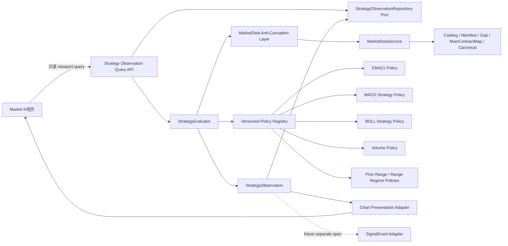
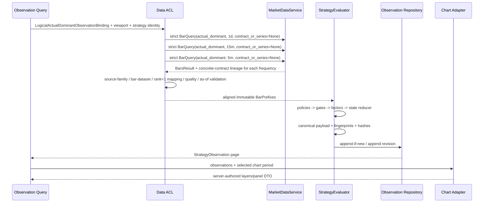

# Design Document: Su Bing Multi-Timeframe Confluence Chart

## Overview

本设计定义一个新的、通用且不绑定品种的 `Su_Bing_Multi_Timeframe_Confluence_Strategy_Family` 首版工程基线，以及 Market K线页上的只读解释图层。首版固定使用 `1d` 定方向、`15m` 选图、`5m` 择时；每次观察绑定一个 `LogicalActualDominantObservationBinding`，固定 `provider=rqdata`、`kind=actual_dominant`、产品 symbol、adjustment/schema、`mapping_rule=volume_open_interest` 与 `rank=1`。三个周期分别由服务端解析具体合约 lineage；换月窗口内可合法消费多个具体合约。输出是可解释、可复算、前缀稳定的 `StrategyObservation`，不是订单、持仓、退出交易、建议手数、通知或交易指令。

设计优先级是：

1. **先发现并解释研究机会**：`candidate` 与 `confirmed` 都是可供未来独立预警规格选择的研究状态；本设计不包含预警。
2. **周期共振是硬 Gate**：任一周期不可用、未完成、方向冲突或 `15m` 为震荡环境时，不得以指标分数抵消。
3. **五因子只计票一次**：EMA21、BOLL 固定归属 `15m`；MACD、Volume、Prior Range 固定归属 `5m`。`1d` EMA21 只形成方向 Gate，不重复进入五因子计分。
4. **只读已完成 bar**：以每根已完成 `5m` bar 的 `bar_end` 作为 `BarAsOfTime`；只选择 `bar_end <= BarAsOfTime` 的最新已完成 `1d/15m/5m` bar。
5. **服务端生成语义，前端只渲染**：主图只消费 `StrategyObservation` 与服务端图层 DTO，不在前端重算策略、状态、分数或风险参考。
6. **失败关闭**：身份、质量、能力、版本、warm-up、时序或哈希不完整时返回 `unavailable`，不跨频回退、不填零、不静默采用 legacy 行为。

### Scope boundary

本设计不定义交易退出、持仓周期、止盈、仓位、资金、保证金、费用、滑点、订单、自动交易、Runtime/live、企微、Notification Gate、Channel、回测或参数优化。Opportunity expiration 是“研究机会观察窗口结束”，不是持仓期限或退出交易。

### Research findings

设计基于以下仓库事实与规范：

- `requirements.md` 已冻结通用策略族、单一 LogicalActualDominantObservationBinding、固定 `1d/15m/5m` 和研究观察边界。
- `docs/strategy_knowledge/su_bing/SU_BING_RULEBOOK.md` 的 `RULE-003/004/005/007/008/013` 只支持“趋势、多周期、EMA、MACD、量能、震荡回避、突破确认”等候选框架，不提供精确阈值；因此本文所有精确参数均属于工程设计假设。
- `.agents/skills/su-bing-strategy/references/STRATEGY_GENERATION_PROTOCOL.md` 要求新策略独立版本化，不得从旧 `su_bing_ema21`、旧规格、旧代码或旧测试补默认值。
- `docs/INDICATOR_KERNEL.md` 中 EMA21 `ema_sma_window_v1` 已是 validated、confirmed-only、无重绘口径；MACD 公共函数存在，但 `MACD_VERSION=v1-draft`、Registry 状态为 `compatibility_validated`，`web_macd_legacy_v1` 明确禁止 formal strategy signal。
- 当前 Indicator Kernel 没有 BOLL 公共函数、模型、Registry 或正式策略 policy；BOLL 是新增合同需求。
- `DatasetKey(actual_dominant)` 标识具体合约；`BarQuery(actual_dominant, contract_or_series=None)` 允许 reader 按 MainContractMap 解析窗口内的实际主力。
- `BarsResult.source_datasets` 对 `actual_dominant` 可包含一个或多个具体合约 DatasetKey，但全部来源必须属于唯一 source family；source family 由 provider/kind/symbol/frequency/adjustment/schema 组成，不包含 contract。
- 每根 `CanonicalBar` 必须匹配 `BarsResult.source_datasets` 中某个 DatasetKey，并且具体合约必须匹配该 bar 的 trading day/effective interval 对应的 MainContractMap `rule=volume_open_interest, rank=1`。
- `MarketDataService` 是 Canonical 历史数据唯一入口，只接受完整 `BarQuery`，返回带 `source_datasets`、manifest digest、source data version 和 requested window 的 `BarsResult`。
- 为读取三个周期，Observation 在领域上绑定一个 `LogicalActualDominantObservationBinding`；传输层对 `1d/15m/5m` 分别发起 strict、`contract_or_series=None` 查询。每个周期结果具有唯一 source family，但换月窗口可含多个具体合约 DatasetKey。
- 三个周期必须共享相同产品逻辑绑定；由于已完成 bar 的选择时点不同，换月边界上 aligned `1d/15m/5m` 可合法对应不同具体合约。
- 当前 Market K线页已有 viewport、marker、overlay、质量提示和 MACD override，但也保留前端 EMA/MACD/ATR 展示计算。新策略图层不得把这些展示计算当作策略事实。
- `docs/SIGNAL_EVENTS.md` 要求未来事件保持 append-only、identity/payload 幂等、`observation_only=true`、`not_trading_instruction=true`、`auto_order=false`；本文只预留 adapter 所需字段，不设计 adapter 或事件写入。

## Architecture

### Context and data flow



### Layer responsibilities

| Layer | Responsibility | Must not do |
|---|---|---|
| Domain (`quant-core`) | Value Objects、纯指标 policy、Specification、State reducer、observation hash | DB、HTTP、MarketDataService 调用、通知、订单 |
| Application (`quant-api`) | 解析观察请求、读取三个周期、对齐、调用 evaluator、查询 observation | 自行选择 active 文件、跨频聚合、放宽 quality |
| Data ACL | 将 `BarsResult/CanonicalBar/MainContractMap` 变成领域输入，并验证每周期唯一 source family、bar-to-dataset 与 bar-to-rank=1 mapping lineage | 吞掉 DataGap、把 continuous 转 actual_dominant、强迫换月窗口只含一个具体合约 |
| Repository Port | 按稳定 identity 读取/追加 observation revision | 覆盖旧 revision、从通知反写状态 |
| Presentation Adapter | 将 observation 映射为 marker/line/band/panel DTO | 重新计算因子、分数、状态或风险参考 |
| Vue chart | viewport 请求、图层渲染、tooltip、证据面板、缩放 | 策略计算、future alignment、风险计算 |

### Adopted design patterns

| Pattern | Adoption | Responsibility and restraint |
|---|---|---|
| Policy / Strategy | Adopt | 每个公式由不可变、版本化 policy 实现；`StrategyEvaluator` 组合 policy。首版只注册一套 baseline，不做运行时自动择优。 |
| Specification / Composite | Adopt | `DirectionGateSpec`、`SelectionGateSpec`、`TimingGateSpec`、`ConfirmationSpec` 组合为硬 Gate；五因子计分是独立 composite，不能抵消 Gate。 |
| State | Adopt | 纯 `OpportunityStateReducer(previous, currentEvidence) -> transition` 管理 lifecycle；不把状态转移散落在 API/UI。 |
| Factory / Registry | Adopt, narrow | 仅按明确 `strategy_code + strategy_version + parameter_version` 构造 evaluator；未知或 capability 不足时 fail-closed。没有插件发现、动态 import 或用户脚本。 |
| Adapter | Adopt | Canonical bar adapter、chart presentation adapter、未来 SignalEvent adapter 分离。SignalEvent adapter 本期只留端口，不实现。 |
| Value Object | Adopt | Dataset identity、as-of、Decimal price、policy identity、reason code、hash 都是不可变值对象并在构造时校验。 |
| Repository / Port | Adopt | observation 的追加式保存/查询用端口隔离；可先以内存实现测试，持久化不是本设计授权。 |
| Anti-Corruption Layer | Adopt | 阻止 legacy Profile/Binding、旧 `su_bing_ema21` DTO、前端展示指标侵入新领域模型。 |
| Event Sourcing / CQRS | Not adopted | lifecycle history 只需不可变 observation/revision 链；不引入完整事件溯源或双模型。 |
| Generic rule DSL / plugin engine | Not adopted | 首版规则固定且少；DSL 会扩大输入面、版本面和验证成本。 |

### Hard gates and precedence

一次 bar 评估按以下优先级返回恰好一个状态：

1. **Availability Gate**：logical binding、每周期唯一 source family、bar-to-DatasetKey、bar-to-MainContractMap rank=1 mapping、quality、DataGap、confirmed/as-of、policy capability、warm-up 任一失败 → `unavailable`。
2. **Existing lifecycle terminal transition**：active opportunity 的方向翻转、选择失效、breakout 失败、风险参考被确认收盘穿越、expiration → `invalidated`。
3. **Timeframe Confluence Gate**：`1d` 方向必须为 long/short；`15m` 必须同向 eligible 且非 Range Regime；`5m` timing 必须不冲突。未通过时，active opportunity 按原因 invalidated；无 active opportunity 时 `idle`。
4. **Candidate Gate**：首次 `5m` confirmed close 满足 Prior Range breakout threshold → `candidate`。此时保存全部五因子，但不要求达到确认门槛。
5. **Confirmation Gate**：candidate 后续确认窗口内满足确认 bar 规则、五因子全部 available、至少 `3/5` positive，且硬条件仍成立 → `confirmed`。
6. 其余 → 保持 active state 或 `idle`。

**采用 `3/5` 门槛，但只用于 candidate → confirmed。** Candidate 不靠分数创建，而靠硬周期 Gate + 首次突破创建。Confirmed 的硬条件是：三个周期 Gate 通过、`15m` 非 Range Regime、同一 prior-range boundary 仍有效、确认 bar 完成、五因子全部 available、Prior Range 因子为 positive、Research Risk Reference available；在这些条件之外还要求五因子 positive count >= 3。Negative/neutral outcome 不做加权，所有分项仍完整保存。分数不能抵消任何硬条件。

### Baseline identity and source classification

```text
strategy_family = su_bing_multi_timeframe_confluence
strategy_code = su_bing_mtf_confluence_observation
strategy_version = 1.0.0
parameter_version = baseline-1
state_policy_version = opportunity-state-v1
chart_contract_version = su-bing-mtf-chart-v1
```

- Course-derived candidates：`RULE-003/004/005/007/008/013`，来源 `sbn-002/003/004/012/013/014`，仅记录短摘要与 source id。
- Current product requirements：通用品种、LogicalActualDominantObservationBinding + MainContractMap `volume_open_interest/rank=1`、固定三周期、五因子、状态集合、Market K线页、Standard Density、无订单/通知。
- Design Engineering Baseline：下述所有精确公式、窗口、阈值、readiness、timeout、颜色和性能数值。
- Legacy references：旧 `services/quant-api/app/strategy/su_bing_ema21.py`、旧 specs 只标记 `legacy_reference` 或 `engineering_reference`，不参与 policy factory、不提供默认参数。

> **统一标注：本节及后续所有精确公式和参数均为“工程设计假设、非课程原始参数、待未来验证”。首版只有这一套参数，不提供候选组合，不做自动择优。**

## Engineering Baseline

### Numeric and comparison policy

- Canonical OHLCV 输入保持 `Decimal`；price、boundary、risk level、risk distance、ratio 的领域值均为 finite `Decimal`。
- Indicator arithmetic 使用固定 decimal context precision 28；中间过程不量化到 tick、不按显示位提前 round。DTO 以规范化十进制字符串传输价格和比率，图表 adapter 才转为有限 JavaScript number 显示。
- 等号属于 neutral/边界保持语义，除非公式显式写 `>=` 或 `<=`。
- long/short 通过 `DirectionSign(+1/-1)` 归一化比较实现镜像，禁止分别维护两套手写规则。
- 无效、非有限、非正价格或负 volume 输入 fail-closed；volume=0 是合法当前值，但 prior mean=0 使 Volume Evidence unavailable。

### EMA21 baseline

Applicable roles：`1d` Direction Gate 与 `15m` EMA factor。两处使用相同 policy identity，但只有 `15m` 结果进入五因子一次。

```text
period = 21
alpha = 2 / (21 + 1)
seed_policy = sma_window
seed = mean(first 21 consecutive valid closes)
EMA_t = EMA_(t-1) + alpha * (close_t - EMA_(t-1))
readiness = current and previous EMA valid (minimum 22 consecutive valid closes)
long = close_t > EMA_t AND EMA_t > EMA_(t-1)
short = close_t < EMA_t AND EMA_t < EMA_(t-1)
neutral = all other valid combinations
```

Policy id：`su_bing_ema21_sma_slope_price_v1`。它与 Indicator Kernel `ema_sma_window_v1` 的 seed 和递推公式一致；正式实现应复用/扩展同一合同与 golden vectors，而不是调用旧 `su_bing_ema21` 的 first-value helper。

### MACD baseline

Applicable role：仅 `5m` MACD factor。

```text
fast = 12
slow = 26
signal = 9
ema_seed_policy = sma_window
histogram_scale = 2
round_digits = display only; no rule comparison rounding
first fully ready index = 33 (minimum 34 consecutive valid closes)
DIF = EMA12 - EMA26
DEA = EMA9(DIF values after DIF becomes ready)
HIST = (DIF - DEA) * 2
long positive = DIF > 0 AND DIF > DEA AND HIST > 0
short positive = DIF < 0 AND DIF < DEA AND HIST < 0
opposite triple = negative
otherwise = neutral
```

Policy id：`su_bing_macd_12_26_9_sma_scale2_v1`。

**Capability gap**：现有 `macd_series()` 可作为公式与 golden oracle，但 `v1-draft` / `compatibility_validated` 和 `web_macd_legacy_v1` 不允许正式策略消费。实现前必须新增独立 strategy-capable、confirmed-only、`repainting_risk=none` 的 policy/registry capability，并用 golden + prefix stability 验证；不得把 Web policy 静默升级或复用为策略准入。该 gap 未关闭时 Strategy Spec 为 not implementation-ready，evaluation 返回 `POLICY_CAPABILITY_UNAVAILABLE`。

### BOLL baseline

Applicable role：仅 `15m` BOLL factor。

```text
period = 20
center = arithmetic mean(last 20 closes)
dispersion = population standard deviation, divisor N=20
multiplier = 2
upper = center + 2 * stddev
lower = center - 2 * stddev
bandwidth = upper - lower
readiness = current and previous complete BOLL values (minimum 21 consecutive valid closes)
long positive = close_t > center_t AND center_t > center_(t-1) AND bandwidth_t >= bandwidth_(t-1)
short positive = close_t < center_t AND center_t < center_(t-1) AND bandwidth_t >= bandwidth_(t-1)
opposite directional triple = negative
otherwise = neutral
```

Policy id：`su_bing_boll_20_population_2_v1`。

**New contract requirement**：Indicator Kernel 需新增纯函数、channel output model（center/upper/lower/bandwidth）、policy、registry capability、Decimal/golden/prefix tests。当前不存在可复用 BOLL 正式合同；实现不得在 Vue 或 StrategyEvaluator 内临时复制公式。

### Volume baseline

Applicable role：仅 `5m` Volume factor。

```text
comparison_window = previous 20 confirmed 5m bars, excluding current bar
normalization = current_volume / arithmetic_mean(previous_20_volumes)
readiness = 21 consecutive bars with non-missing, non-negative volume and prior mean > 0
positive = ratio >= 1.50
neutral = 1.00 <= ratio < 1.50
negative = ratio < 1.00
```

Volume outcome 对 long/short 相同，表示突破时量能支持程度，不表达方向。Policy id：`su_bing_volume_ratio_prior20_v1`。缺失 volume、负值或 prior mean=0 → unavailable，不填零、不改用 turnover/open interest。

### Prior Range and breakout baseline

Applicable role：仅 `5m` Prior Range factor 与 candidate anchor。

```text
range_window = previous 20 confirmed 5m bars, excluding current bar
upper = max(previous_20.high)
lower = min(previous_20.low)
breakout_ratio = 0.001 (0.10%)
long_threshold = upper * (1 + breakout_ratio)
short_threshold = lower * (1 - breakout_ratio)
long positive = current close >= long_threshold
short positive = current close <= short_threshold
neutral = close lies between boundary and threshold in desired direction
negative = close is at or inside the original boundary against desired breakout
readiness = 21 valid confirmed 5m bars including current
```

Boundary 在 candidate 创建时冻结并属于 opportunity identity；后续 bar 不滚动重算该 opportunity 的 boundary。Policy id：`su_bing_prior_range_20_close_10bp_v1`。

### 15m Range Regime and selection baseline

只使用 `15m` Confirmed Bars：

```text
cross_window = latest 11 ready bars, producing 10 transitions
cross_count = sign(close - EMA21) changes across those transitions; zero sign breaks a run and counts no cross
boll_bandwidth_ratio = (upper - lower) / center
ema_flatness = abs(EMA_t - EMA_(t-5)) / EMA_(t-5)
range_regime = cross_count >= 4
               AND boll_bandwidth_ratio <= 0.040
               AND ema_flatness <= 0.003
readiness = at least 31 consecutive valid 15m closes and positive denominators
```

Selection long eligible：not range_regime AND EMA factor long-positive AND BOLL factor long-positive。Selection short 是镜像。其余 valid 情况为 ineligible。Policy id：`su_bing_15m_range_cross4_bw4pct_flat30bp_v1`。

### 5m candidate, confirmed, invalidated and expired baseline

Candidate：

- 当前 `5m` bar 已 confirmed，三个周期硬 Gate 通过，`15m` 非 range。
- 当前 bar 是 active opportunity 之外首次满足冻结 prior range threshold 的 bar。
- 创建 `opportunity_id`、冻结 boundary、candidate evidence 和 Research Risk Reference。
- 五因子分数只记录，不阻止 candidate；任何 required factor unavailable 会阻止 confirmed。

Confirmation：从 candidate 后的第 1 至第 3 根后续 confirmed `5m` bar 中，首根同时满足以下条件的 bar 完成确认：

- long：`close >= frozen_long_threshold` 且 `low > frozen_upper_boundary`；short 镜像为 `close <= frozen_short_threshold` 且 `high < frozen_lower_boundary`。
- Timeframe Gate 仍通过，Range Regime 仍 false。
- 五因子全部 available，Prior Range positive，positive count >= 3。
- Research Risk Reference available。

Candidate invalidation：确认前任一 confirmed `5m` close 回到原始 range 内（long `close <= upper`；short `close >= lower`）、方向/selection 失效、相反方向 timing conflict 或风险参考被收盘穿越。

Candidate expiration：第 3 根后续 confirmed `5m` bar 结束仍未确认，输出 `invalidated + CANDIDATE_CONFIRMATION_EXPIRED`。

Confirmed invalidation：任一后续 confirmed `5m` close 穿越冻结 risk reference、`1d` 方向变 neutral/opposite、`15m` 变 ineligible/range，或出现相反方向 Prior Range breakout。

Confirmed expiration：confirmation 后第 12 根后续 confirmed `5m` bar 结束仍无 invalidation，输出 `invalidated + CONFIRMED_OBSERVATION_WINDOW_EXPIRED`。这是研究状态 TTL，不是最大持有期、平仓或退出规则。

Unavailable suspension：数据/质量/identity/policy 暂不可用时输出 `unavailable`，不计 lifecycle bar、不得推断 invalidation 或 expiration。恢复后只按实际连续 confirmed bars 重算；若中间存在 DataGap，则继续 unavailable，不能跳过 gap。

Policy ids：`su_bing_breakout_confirm_3bars_v1`、`su_bing_opportunity_lifecycle_v1`。

### Research Risk Reference baseline

在 candidate 创建时冻结：

```text
long invalidation_price = min(frozen prior upper boundary, candidate bar low)
short invalidation_price = max(frozen prior lower boundary, candidate bar high)
long distance = reference_close - invalidation_price
short distance = invalidation_price - reference_close
risk_distance_ratio = distance / reference_close
```

- `reference_close` 是当前 observation 的 confirmed `5m` close；invalidation price 在同一 opportunity 内不随新 bar 后移。
- distance 必须 finite 且 `> 0`；对外同时给出 Decimal string 的 price-unit distance 与 ratio。
- 缺失、非正、stale、identity 不一致或因果不可用 → `ResearchRiskReference.available=false`；confirmed 被阻止。
- 字段固定包含 inputs、policy version、unit=`price_units`、Research Observation Label。
- 不包含 quantity、position、capital、margin、fee、order、execution 或盈亏字段。

Policy id：`su_bing_risk_reference_candidate_structure_v1`。

## Time Semantics and Causality

### Confirmed bar definition

Canonical historical bar 只有在满足以下条件时才进入 evaluator：

1. 来自 `MarketDataService` strict `actual_dominant` query，`contract_or_series=None`、`quality_status=passed`，且无 DataGap/manifest mismatch。
2. 所属 BarsResult 的全部具体合约 DatasetKey 位于该 frequency 的唯一 source family；source family 的 provider/kind/symbol/frequency/adjustment/schema 与 LogicalActualDominantObservationBinding 一致。
3. CanonicalBar 的 provider/kind/symbol/contract/adjustment/schema 与至少一个 source DatasetKey 匹配，frequency 与 requested timeframe 相等。
4. CanonicalBar 的具体合约与其 trading day/effective interval 的 MainContractMap `volume_open_interest/rank=1` 解析结果一致，并记录 mapping date/effective interval 与 revision。
5. `CanonicalBar.bar_end` 是 timezone-aware 且 `bar_end <= BarAsOfTime`。
6. `1d` bar 只有在 provider/canonical 标注的完整交易日 bar 已结束后可用；当天仍进行中的日线即使已有 OHLCV 快照也不进入 historical evaluator。
7. `15m` bar 只有完整区间结束后可用；进行中的 15m snapshot 不进入 evaluator。
8. `5m` bar 的 `bar_end` 即一次 observation 的 `BarAsOfTime`；未完成 5m 不产生状态。

CanonicalBar 当前没有独立 `is_confirmed` 字段，因此 ACL 不接受 live/partial 响应，并把“来自 historical canonical + interval bar_end 已结束”作为 confirmed 的必要条件。未来若 Canonical 增加 completion flag，必须要求 flag=true，不能放宽现有条件。

### Multi-timeframe as-of alignment

对于每个 confirmed `5m` bar `t5`：

```text
BarAsOfTime = t5.bar_end
aligned_5m  = t5
aligned_15m = max(bar15.bar_end <= BarAsOfTime)
aligned_1d  = max(bar1d.bar_end <= BarAsOfTime)
```

每个 aligned input 记录 selected bar_end、trading_day、具体合约、匹配 DatasetKey、source family、MainContractMap mapping date/effective interval 与 revision、manifest digest 和 data revision。不存在 eligible higher-timeframe bar 时 unavailable。禁止按 trading_day 标签提前拿当天未完成日线；禁止把包含 `BarAsOfTime` 但 end 晚于 `BarAsOfTime` 的 15m bucket 提前使用。

三个 aligned bar 必须属于同一 LogicalActualDominantObservationBinding，但不要求具体合约相同。换月边界上，`1d`、`15m`、`5m` 因完成时点落在不同 MainContractMap 有效区间而对应不同具体合约是合法结果；ACL 必须分别验证并保留各自 lineage，不能将任何周期替换为 `continuous`。

### Prefix stability and non-repainting

- Evaluator 是 prefix function：`evaluate(prefix ending at T)` 只依赖三个周期中 `bar_end <= T` 的前缀。
- 在 identity、policy 和既有前缀不变时追加 later bars，不得改变 `T` 及以前 observation 的 payload/hash。
- Provider-final revision 不是 repainting 隐藏更新：旧 observation 保持不可变，新计算生成 `revised=true`、`revision_of` 和新 input fingerprint。
- 不允许 centered window、future extrema、later swing labels、人工 review 或 later outcome 进入任何 policy。

### Evaluation sequence



## Opportunity Lifecycle

```mermaid
stateDiagram-v2
    [*] --> idle
    idle --> candidate: hard gates + first confirmed breakout
    candidate --> candidate: repeated compatible evidence / same opportunity
    candidate --> confirmed: confirm bar + all hard conditions + >=3/5
    candidate --> invalidated: range re-entry / flip / risk breach / selection failure
    candidate --> invalidated: 3-bar confirmation timeout
    confirmed --> confirmed: compatible later confirmed bars
    confirmed --> invalidated: risk breach / flip / range / opposite breakout
    confirmed --> invalidated: 12-bar observation TTL
    invalidated --> idle: next confirmed 5m bar, no new candidate
    idle --> unavailable: required input unavailable
    candidate --> unavailable: availability failure; lifecycle suspended
    confirmed --> unavailable: availability failure; lifecycle suspended
    unavailable --> idle: complete causal prefix restored and no active state
    unavailable --> candidate: deterministic recomputation restores candidate
    unavailable --> confirmed: deterministic recomputation restores confirmed
```



### Duplicate, direction flip and revision rules

- 同一 input fingerprint 重复评估返回等价 observation 与相同 `observation_id`，repository no-op。
- active candidate 再次满足相同方向/同一 frozen boundary，不创建新 opportunity；保留同一 `opportunity_id`，reason 包含 `REPEATED_TRIGGER_SAME_OPPORTUNITY`。
- confirmed 后重复满足确认条件不再产生第二个 confirmation transition。
- 方向翻转的当前 bar 优先关闭旧 opportunity：该 bar 只输出 old opportunity 的 `invalidated`。新方向最早从下一根 confirmed `5m` bar 创建 candidate，保证每 bar 恰好一个 state。
- Data revision 或 policy identity 变化触发完整前缀重算。旧记录不可覆盖；新记录带 `revised=true`、`revision_of=<old observation id>` 和 revision reason。若重算后状态不同，chart 显示 latest revision，并允许查看旧 revision。
- Invalidated 是 terminal state；同一 opportunity 不可复活。后续新机会必须有新的 candidate anchor 和 `opportunity_id`。

## Components and Interfaces

### Core domain interfaces (Python-oriented)

```python
class IndicatorPolicy(Protocol):
    identity: PolicyIdentity
    capability: PolicyCapability
    def evaluate(self, bars: Sequence[DomainBar], direction: Direction) -> Evidence: ...

class Specification(Protocol):
    def evaluate(self, context: EvaluationContext) -> SpecResult: ...

class OpportunityStateReducer(Protocol):
    def transition(
        self,
        previous: OpportunitySnapshot | None,
        current: EvaluationContext,
    ) -> StateTransition: ...

class StrategyEvaluator(Protocol):
    def evaluate(
        self,
        binding: LogicalActualDominantObservationBinding,
        prefixes: MultiTimeframePrefixes,
        bar_as_of: BarAsOfTime,
        previous: OpportunitySnapshot | None,
    ) -> StrategyObservation: ...

class StrategyObservationRepository(Protocol):
    def get_latest_before(self, identity: ObservationStreamIdentity, as_of: datetime) -> StrategyObservation | None: ...
    def append_if_new(self, observation: StrategyObservation) -> AppendResult: ...
    def list_viewport(self, query: ObservationViewportQuery) -> Sequence[StrategyObservation]: ...
```

### Application ports

`MarketDataObservationAdapter`：

- 输入：LogicalActualDominantObservationBinding、start/end 和三个固定 frequency；不接受调用方提供的 authoritative concrete contract。
- 为每个 frequency 构造 strict `BarQuery(dataset_kind=ACTUAL_DOMINANT, contract_or_series=None)`。
- 验证每个 `BarsResult.source_datasets` 非空、全部为具体合约 DatasetKey，且 provider/kind/symbol/frequency/adjustment/schema 形成该 frequency 的唯一 source family；contract 不参与 source family identity。
- 验证三个 frequency 的 source family 共享相同 provider/kind/symbol/adjustment/schema 并匹配 logical binding；frequency 按角色分别为 `1d/15m/5m`。
- 验证每根 consumed CanonicalBar 匹配对应 BarsResult 中至少一个 DatasetKey。
- 按每根 consumed bar 的 trading day/effective interval 解析 MainContractMap `rule=volume_open_interest, rank=1`，验证 bar contract 一致并记录 mapping date/effective interval 与 revision。
- 允许换月窗口的单个 BarsResult 含多个具体合约，也允许 aligned `1d/15m/5m` 在完成时点不同的情况下对应不同具体合约。
- 返回不可变 `MultiTimeframePrefixes`；DataCore exceptions 映射为 bounded reason codes，任一 DataGap、质量或 lineage mismatch 均 fail-closed。

`StrategyFactory`：只接受 exact strategy/parameter version；构造一套固定 policy graph。未知字段、额外 policy、multiple candidate set 或 legacy strategy code 均拒绝。

`ChartPresentationAdapter`：输入 observation + selected timeframe + viewport；输出 `StrategyChartPayload`。不得读取 raw bars 重新计算。

`SignalEventAdapterPort`：仅定义未来边界 `map(observation) -> SignalEventDraft`，不注册 bean/route/job，不写 SignalEvent。未来规格必须显式决定 candidate/confirmed 哪些可映射。

### Suggested module/file boundaries (not implementation authorization)

```text
packages/quant-core/guiyi_quant/strategies/su_bing_mtf_confluence/
├── models.py              # Value Objects / Evidence / Observation
├── policies.py            # immutable baseline policy identities
├── specifications.py      # hard Gate and composite specs
├── lifecycle.py           # pure State reducer
├── evaluator.py           # orchestration only
├── hashing.py             # canonical payload fingerprints
└── registry.py            # exact factory registration

packages/quant-core/guiyi_quant/indicators/
├── boll.py                # new pure BOLL channel contract
├── macd.py                # existing formula; strategy capability added separately
├── models.py              # channel model extension
├── policy.py              # explicit MACD/BOLL strategy policies
└── registry.py            # capability registration

services/quant-api/app/strategy_observations/
├── market_data_adapter.py # MarketDataService/MainContractMap ACL
├── service.py             # query/evaluation use case
├── repository.py          # port adapter, append-only semantics
├── schemas.py             # request/response DTO validation
└── chart_adapter.py       # StrategyChartPayload

apps/quant-web/src/
├── api/strategyObservations.ts
├── types/strategyObservation.ts
├── utils/strategyObservationPresentation.ts
└── components/market/SuBingConfluenceLayer.vue
```

这些边界只描述未来实现位置；不授权修改代码、schema、API、Runtime 或数据。

## Main Chart Indicator Design

### Standard Density layout

- **Top context strip**：strategy/version、`1d` direction + completed time + contract lineage、`15m` selection/range + completed time + contract lineage、`5m` lifecycle + completed time + contract lineage、Research Observation Label。
- **Main chart**：按当前选择周期显示服务端提供的适用图层。
- **Marker tooltip**：state、direction、bar time、transition reasons、3/5 count、policy/parameter version、revised/unavailable 状态。
- **Right evidence panel**：Timeframe Confluence 与 Indicator Confluence 两个独立区块；五因子逐项展示 positive/negative/neutral/unavailable、原始值、阈值和 policy version。
- **Risk reference row**：仅显示“研究参考失效位 / 风险距离”，不显示止损指令、仓位或手数。

### Layers by selected chart period

| Selected period | Server-authored layers |
|---|---|
| `1d` | candles、EMA21、direction background strip；不投射 5m marker |
| `15m` | candles、EMA21、BOLL center/upper/lower、Range Regime shading；不把 5m marker聚合成 15m 信号 |
| `5m` | candles、frozen prior upper/lower/threshold、candidate/confirmed/invalidated marker、risk reference price line |
| other Market period | 只显示顶部三周期状态与证据面板；主图策略 layer 标记“当前周期无适用图层”，不重采样 |

从 evidence panel 点击 opportunity 时，UI 切换到 `5m` 并定位 marker；默认缩放窗口为 marker 前 80 根、后 40 根 `5m` bar。切换 `1d/15m/5m` 时共享 opportunity selection，但各图层由服务端 payload 决定。

### Visual contract

| State/layer | Color | Shape/style | Wording |
|---|---|---|---|
| candidate long/short | amber `#F59E0B` | circle below/above bar | `候选机会` |
| confirmed long | teal `#14B8A6` | arrowUp below bar | `已确认研究机会（多）` |
| confirmed short | rose `#F43F5E` | arrowDown above bar | `已确认研究机会（空）` |
| invalidated | slate `#64748B` | square at bar | `机会已失效` |
| expired | slate `#64748B` | square, label `TTL` | `观察窗口已过期` |
| revised | violet `#8B5CF6` | existing shape + `R` badge/outline | `数据修订后结果` |
| unavailable | warning amber panel | no marker | `证据不可用` |
| EMA21 | cyan `#06B6D4` | solid line |
| BOLL center / bands | blue-gray | center solid, upper/lower dashed |
| Prior range / threshold | magenta / amber | boundary dotted, threshold dashed |
| Risk reference | gray-red | dashed line | `研究参考失效位` |

Tooltip 固定包含：state/direction、exact 5m bar end、latest aligned 1d/15m ends、各周期 actual contract + mapping date/effective interval + revision、five outcomes、positive count、hard-gate status、boundary/risk reference（若可用）、reason codes、strategy/parameter/data revision、`研究观察，非交易指令，无自动下单`。

### Unavailable and revised presentation

- unavailable 不生成 marker，不保留上一次状态冒充当前状态；顶部和面板显示 bounded reason 与受影响 timeframe/factor。
- revised 默认渲染 latest revision；marker 显示 `R`，tooltip 可展开 predecessor id、old/new state，不显示内部 stack、SQL、路径或敏感配置。
- revision 不触发动画式“新机会”或未来通知。

### Performance boundary

- Viewport API 必须分页：单页最多 2,000 个 observations、最多 2,000 个 markers；超限要求缩小时间范围或翻页。
- Chart Adapter 只返回 selected period 的图层；每条 line/band 最多 5,000 points，响应目标上限 2 MiB。
- 前端只渲染 viewport 加前后各 100 bars buffer；缩放/hover 不触发策略重算。
- observation/evidence payload 按 observation hash 去重缓存；identity/revision/hash 不一致时拒绝 merge。
- 本地目标：已缓存 observation viewport 查询 p95 <= 300 ms，首次服务端 presentation 映射 p95 <= 500 ms（不含缺失数据下载，且本设计不触发下载）。性能未达标不得通过删证据、降质量或前端重算规避。

## Data Models

### Identity value objects

```text
LogicalActualDominantObservationBinding
- provider = rqdata
- dataset_kind = actual_dominant
- symbol
- adjustment
- schema_version
- mapping_rule = volume_open_interest
- rank = 1

SourceFamily
- provider
- dataset_kind
- symbol
- frequency
- adjustment
- schema_version
- excludes concrete contract by definition

PerTimeframeSourceLineage
- frequency: exactly one of 1d | 15m | 5m
- source_family: exactly one SourceFamily
- source_datasets: one or more concrete-contract DatasetKeys in source_family
- manifest_digests
- source_data_versions
- requested_window

BarActualContractLineage
- bar_end
- trading_day
- actual_contract
- matching_dataset_key
- mapping_rule = volume_open_interest
- rank = 1
- mapping_date or effective_interval
- mapping_revision

PolicyIdentity
- policy_code
- policy_version
- parameters_hash
- capability_status
- confirmed_only=true
- future_looking=false
- repainting_risk=none

ObservationStreamIdentity
- strategy_code/version/parameter_version
- LogicalActualDominantObservationBinding
```

### Evidence models

```text
EvidenceOutcome = positive | negative | neutral | unavailable
Direction = long | short | neutral | unavailable
ObservationState = idle | candidate | confirmed | invalidated | unavailable

FactorEvidence
- factor: ema21 | macd | boll | volume | prior_range
- timeframe: 15m or 5m
- outcome
- ready, valid
- values: Decimal-string map
- threshold values
- input_bar_ends
- policy_identity
- reason_codes[]

IndicatorConfluenceEvidence
- ema21 (15m)
- boll (15m)
- macd (5m)
- volume (5m)
- prior_range (5m)
- positive_count: 0..5
- confirmation_threshold = 3
- all_required_available

TimeframeEvidence
- 1d: direction, selected_bar_end, actual_contract_lineage, gate result, direction policy evidence
- 15m: eligible/ineligible, range_regime, selected_bar_end, actual_contract_lineage
- 5m: timing direction, selected_bar_end, actual_contract_lineage, breakout/confirmation phase
- hard_gate_passed
- conflict_reasons[]
```

`actual_contract_lineage` 按 timeframe 和 consumed bar 分别保留。三个 timeframe 的具体合约可以不同，只要每根 bar 均通过对应 MainContractMap 有效区间校验并共享同一 LogicalActualDominantObservationBinding。

### Opportunity and observation models

```text
OpportunitySnapshot
- opportunity_id
- direction
- candidate_anchor_end
- confirmation_end?
- frozen_prior_range
- frozen_breakout_threshold
- frozen_risk_reference
- lifecycle_bar_count
- current_state
- immutable transition_history[]

StateTransition
- prior_state
- new_state
- bar_as_of_time
- transition_reason_codes[]
- state_policy_version

ResearchRiskReference
- available
- direction
- reference_close
- invalidation_price
- risk_distance
- risk_distance_ratio
- unit = price_units
- calculation_inputs
- policy_identity
- label = 研究观察，非交易指令
- reason_codes[]

StrategyObservation
- observation_id
- opportunity_id?
- strategy identity/version/parameter version/change reason/source classification
- logical_actual_dominant_binding
- per_timeframe_source_lineage: unique source family + one-or-more concrete DatasetKeys for each 1d/15m/5m result
- per_timeframe/per_consumed_bar_actual_contract_lineage: contract + matching DatasetKey + mapping date/effective interval + mapping revision
- exact input windows per timeframe
- manifest digests/source data versions/data revision/input_fingerprint
- bar_as_of_time
- aligned completed bar timestamps
- observation_state/direction/transition
- timeframe_confluence_evidence
- indicator_confluence_evidence
- research_risk_reference
- reason_codes[]
- revised/revision_of/revision_number
- observation_hash
- observation_only=true
- not_trading_instruction=true
- auto_order=false
- future_looking=false
- repainting=false
```

`StrategyObservation` schema 明确不提供 quantity、position、capital、margin、fee、order、execution、take-profit、exit 或 PnL 字段。

### Canonical hashing and idempotency

Canonical JSON 规则：UTF-8、sorted keys、compact separators、timestamps 转 UTC ISO-8601、Decimal 转无指数规范字符串、enum 转固定小写值、数组按合同顺序。禁止 float 进入 hash payload。

```text
parameter_hash = SHA-256(canonical policy parameter graph)
input_fingerprint = SHA-256(logical binding + per-timeframe source families +
                           all concrete source DatasetKeys + mapping rule/rank +
                           per-bar contract/mapping date-or-interval/revision +
                           manifest digests + source data versions + exact windows +
                           all consumed bar identities/OHLCV)
opportunity_id = SHA-256(strategy identity + logical binding + direction +
                        candidate_anchor_end + frozen boundary + parameter_hash)
observation_id = SHA-256(opportunity_id-or-stream + bar_as_of_time + input_fingerprint +
                        strategy/version/parameter identity)
observation_hash = SHA-256(full canonical semantic payload excluding repository metadata)
```

相同 `observation_id + observation_hash` 是幂等 no-op；相同 observation id 但 hash 不同必须拒绝并要求 revision path，不能静默覆盖。

### API/DTO sketch

`GET /market/strategy-observations/su-bing-mtf-confluence`（建议、未授权实现）：

```text
Request
- symbol: validated active product
- dataset_kind: exact actual_dominant
- adjustment/schema: allowlisted logical binding fields or server defaults
- strategy_version=1.0.0
- parameter_version=baseline-1
- start/end: timezone-aware bounded viewport
- selected_period
- expected_data_revision?
- cursor?, limit<=2000

Response
- contract_version
- request_echo (normalized logical binding, no authoritative actual_contract, no secrets/paths)
- logical_actual_dominant_binding
- per_timeframe_source_lineage
- per_timeframe/per_bar_actual_contract_lineage
- observations[]
- chart_payload
- next_cursor?
- research_observation_label
```

API 只接受白名单 enum/version/frequency 与逻辑绑定字段，拒绝 `continuous`、调用方 authoritative `actual_contract`、任意 policy JSON、任意表达式、动态 module/path 或用户提供 hash。具体合约、mapping date/effective interval 和 mapping revision 全部由服务端根据 BarsResult 与 MainContractMap 解析并回显。错误响应只暴露 bounded code、field 和 correlation id，不暴露 stack、SQL、文件路径或内部地址。

### Chart payload DTO

```text
StrategyChartPayload
- contract_version
- selected_period
- context_strip: three timeframe states/timestamps
- markers[]: id, observation_id, time, state, direction, color, shape, label,
             revised, tooltip_summary
- lines[]: layer_id, semantic_type, points[{time, Decimal string}], style
- bands[]: layer_id, points, style
- evidence_panel: timeframe section + five-factor section + policy versions
- risk_reference?
- unavailable?
- research_observation_label
- source_observation_hashes[]
```

Vue 收到 payload 后只做 schema validation、Decimal display conversion、viewport clipping 和 visual mapping；state/score/reason/risk 均不得重算。

### Bounded reason codes

| Category | Codes |
|---|---|
| Identity/lineage | `IDENTITY_CONTINUOUS_REJECTED`, `LOGICAL_BINDING_MISMATCH`, `SOURCE_FAMILY_MISMATCH`, `SOURCE_DATASET_CONTRACT_INVALID`, `BAR_SOURCE_DATASET_MISMATCH`, `MAIN_CONTRACT_RANK_NOT_ONE`, `MAIN_CONTRACT_MAPPING_MISSING`, `BAR_MAIN_CONTRACT_MAP_MISMATCH`, `IDENTITY_REVISION_MISMATCH` |
| Data/quality | `DATA_GAP_INTERSECTS_WINDOW`, `QUALITY_NOT_PASSED`, `MANIFEST_MISMATCH`, `BAR_NOT_CONFIRMED`, `AS_OF_ALIGNMENT_MISSING`, `INPUT_WINDOW_INVALID` |
| Policy/readiness | `POLICY_UNKNOWN`, `POLICY_CAPABILITY_UNAVAILABLE`, `POLICY_HASH_MISMATCH`, `EMA_WARMUP`, `MACD_WARMUP`, `BOLL_WARMUP`, `VOLUME_WARMUP`, `PRIOR_RANGE_WARMUP`, `RANGE_REGIME_WARMUP` |
| Gate | `DIRECTION_NEUTRAL`, `DIRECTION_FLIPPED`, `SELECTION_INELIGIBLE`, `RANGE_REGIME_BLOCKED`, `TIMING_DIRECTION_CONFLICT`, `INDICATOR_THRESHOLD_NOT_MET` |
| Lifecycle | `BREAKOUT_CANDIDATE_CREATED`, `REPEATED_TRIGGER_SAME_OPPORTUNITY`, `BREAKOUT_CONFIRMED`, `BREAKOUT_RETURNED_TO_RANGE`, `RISK_REFERENCE_BREACHED`, `CANDIDATE_CONFIRMATION_EXPIRED`, `CONFIRMED_OBSERVATION_WINDOW_EXPIRED`, `OPPOSITE_BREAKOUT` |
| Revision/idempotency | `OBSERVATION_DUPLICATE_NOOP`, `DATA_REVISION_RECOMPUTED`, `POLICY_REVISION_RECOMPUTED`, `OBSERVATION_HASH_CONFLICT` |
| Safety | `OBSERVATION_ONLY`, `NOT_TRADING_INSTRUCTION`, `AUTO_ORDER_DISABLED`, `OUT_OF_SCOPE_OPERATION_REJECTED` |

reason codes 是固定 enum；自由文本只用于本地、非敏感 UI 解释，不能作为控制逻辑输入。


## Correctness Properties

*A property is a characteristic or behavior that should hold true across all valid executions of a system-essentially, a formal statement about what the system should do. Properties serve as the bridge between human-readable specifications and machine-verifiable correctness guarantees.*

### Property 1: Logical actual-dominant identity and concrete-contract lineage fail closed

For all generated logical bindings and three-frequency BarsResults, the evaluator accepts inputs only when the binding is `rqdata/actual_dominant` with `volume_open_interest/rank=1`, each frequency has exactly one source family containing one or more concrete-contract DatasetKeys, every consumed bar matches a source DatasetKey, and every consumed bar contract matches the MainContractMap entry effective for that bar; every source-family, bar-to-dataset, bar-to-map, revision, or required-field mismatch produces `unavailable` with a bounded identity/lineage reason.

**Validates: Requirements 2.2, 2.4, 2.5, 2.6, 2.7, 2.8, 2.9, 2.16, 2.17, 12.7**

### Property 2: Causal as-of alignment is maximal, bounded, and contract-independent across timeframes

For all generated multi-timeframe bar sets and BarAsOfTime values, every consumed bar has `bar_end <= BarAsOfTime`, the selected `1d` and `15m` bars are the latest completed bars satisfying that bound, the selected `5m` bar ends exactly at BarAsOfTime, and each selected bar independently matches the MainContractMap interval effective at that bar. The evaluator accepts different concrete contracts across aligned `1d/15m/5m` bars when all bars share the logical binding and individually valid lineage; an unverifiable or missing selection yields `unavailable`.

**Validates: Requirements 2.10, 2.11, 2.12, 3.9, 11.1, 11.2, 11.7**

### Property 3: Data gaps, quality failures, and warm-up gaps cannot be bypassed

For all requested windows and generated quality/gap/readiness metadata, an intersecting DataGap or quality other than passed in strict research mode makes the observation `unavailable`, while insufficient indicator warm-up makes the affected evidence unavailable and prevents confirmation; no case substitutes a shorter window, another frequency, zero, an unvalidated contract, or an earlier active dataset.

**Validates: Requirements 2.13, 2.14, 2.15**

### Property 4: Timeframe responsibilities remain isolated

For all valid evaluation contexts, changing only `15m` or `5m` inputs cannot change the `1d` direction result, changing only `1d` or `5m` non-gating values cannot change `15m` selection/Range Regime calculations, and lifecycle timing values are derived from `5m`; Timeframe Confluence and Indicator Confluence remain separate structures.

**Validates: Requirements 3.4, 3.5, 3.6, 3.7, 3.8, 5.16**

### Property 5: Long and short policies are exact mirrors

For all valid normalized price, slope, boundary, histogram and lifecycle inputs, applying the direction-reflection transform maps every long classification and transition to the corresponding short classification and transition with identical readiness, factor categories, thresholds, confirmation delay, invalidation semantics and expiration counts.

**Validates: Requirements 4.1, 4.2, 4.3, 4.7, 4.9**

### Property 6: Baseline registry is singular, versioned and provenance-complete

For all required v1 policy roles (EMA21, MACD, BOLL, Volume, Prior Range, Range Regime, Breakout Confirmation, lifecycle and Research Risk Reference), Registry lookup returns exactly one immutable baseline with a policy version, parameter hash and `Design_Engineering_Baseline / 非课程原始参数、待未来验证` provenance; requests containing multiple candidate sets or automatic selection are rejected.

**Validates: Requirements 1.2, 1.5, 1.7, 5.3, 5.4, 5.5, 5.6, 6.1, 6.2, 6.9, 8.1**

### Property 7: Factor outcomes are complete and counted once

For all available five-factor evaluations, the output contains exactly one EMA21 and one BOLL outcome assigned to `15m`, exactly one MACD, Volume and Prior Range outcome assigned to `5m`, preserves each positive/negative/neutral/unavailable value and policy identity, and computes positive_count as the count of positive factor records without including timeframe Gate booleans.

**Validates: Requirements 5.1, 5.7, 5.8, 5.16, 9.7**

### Property 8: Hard Gate dominates confirmation score

For all candidate contexts, `confirmed` is emitted only when all three timeframe responsibilities are compatible, `15m` is not Range Regime, the same frozen boundary is confirmed by a completed later `5m` bar, all five factors are available, Prior Range is positive, Research Risk Reference is available, and positive_count is at least three; no score can override a failed hard condition.

**Validates: Requirements 4.5, 4.8, 4.9, 4.10, 5.14, 6.4, 6.6**

### Property 9: First eligible breakout creates one candidate opportunity

For all prefixes with no active opportunity, the first confirmed `5m` close satisfying the versioned desired-direction breakout rule under a passed Timeframe Gate creates exactly one candidate with a frozen boundary, candidate anchor, risk reference and opportunity id; repeated compatible triggers retain that opportunity id.

**Validates: Requirements 6.3, 6.5, 6.8, 7.1, 7.2**

### Property 10: Lifecycle transitions are total, exclusive and bounded

For all valid previous states and current contexts, the State reducer emits exactly one state; candidates that return inside the range, lose a hard Gate, breach risk or fail confirmation by the third subsequent confirmed `5m` bar become invalidated, and confirmed opportunities become invalidated on configured failures or after the twelfth subsequent confirmed `5m` bar.

**Validates: Requirements 6.7, 7.1, 7.3, 7.8, 8.7**

### Property 11: Evaluation is idempotent

For all identical bars, logical bindings, per-timeframe source families, concrete source DatasetKeys, per-bar mapping lineage, policy identities, revisions and BarAsOfTime values, repeated evaluation produces equivalent semantic payloads and identical parameter hash, input fingerprint, opportunity id, observation id and observation hash; repository append is a no-op after the first identical write.

**Validates: Requirements 7.4**

### Property 12: Unchanged prefixes are stable and boundaries do not repaint

For all valid multi-timeframe prefixes, appending later bars or changing extrema strictly after a prior BarAsOfTime leaves every earlier StrategyObservation, frozen prior-range boundary, state transition and chart marker unchanged when the original prefix identity and revision are unchanged.

**Validates: Requirements 6.3, 6.8, 9.10, 9.14, 11.3, 11.4**

### Property 13: Revisions append rather than overwrite

For all previously materialized observations, changing source data revision or policy identity produces a new observation with `revised=true`, a new input fingerprint/hash, and a `revision_of` link to the immutable predecessor; the predecessor payload remains unchanged.

**Validates: Requirements 7.5, 9.11**

### Property 14: Lifecycle history is monotonic

For all candidates that later confirm or invalidate, the later observation preserves the candidate anchor, frozen evidence and earlier transition history and only appends the new confirmation, invalidation or expiration evidence; an invalidated opportunity never returns to candidate or confirmed under the same opportunity id.

**Validates: Requirements 7.6, 7.7, 7.8**

### Property 15: Research Risk Reference uses exact mirrored Decimal arithmetic

For all valid positive Decimal price inputs, long and short Research Risk Reference calculations satisfy the declared mirrored formulas, produce a strictly positive finite risk distance and ratio, and round-trip through canonical Decimal-string serialization without value change; invalid, stale or causally unavailable inputs produce unavailable rather than a numeric result.

**Validates: Requirements 8.2, 8.3, 8.4, 8.5, 8.6**

### Property 16: Observation safety fields and schema are invariant

For all StrategyObservations in every state and revision, `observation_only=true`, `not_trading_instruction=true`, `auto_order=false`, `future_looking=false`, and `repainting=false`; serialization contains no quantity, position, capital, margin, fee, order, execution, exit or PnL field.

**Validates: Requirements 7.9, 8.8, 8.9, 10.5, 12.1, 12.5**

### Property 17: Chart mapping is deterministic and non-imperative

For all valid StrategyObservation DTOs, ChartPresentationAdapter derives marker/layer/evidence output solely from supplied semantic fields; unavailable observations create no opportunity marker, state/direction combinations map to the fixed visual contract, and all labels use research-opportunity vocabulary rather than imperative trade-action wording.

**Validates: Requirements 9.5, 9.6, 9.7, 9.9, 9.12, 9.13, 10.8**

### Property 18: Source classification cannot inherit legacy defaults

For all rule/default proposals, course-derived records retain RULE/sbn identifiers, product requirements retain product classification, engineering values retain baseline classification, and any value whose sole provenance is a Legacy Su Bing Reference is rejected from the active policy graph.

**Validates: Requirements 1.1, 1.3, 1.4, 1.6, 1.8**

### Property 19: Contract lineage round-trips through observation DTOs

For all valid StrategyObservation DTOs, canonical serialization followed by deserialization preserves the exact LogicalActualDominantObservationBinding, per-timeframe source family, every concrete source DatasetKey, aligned completed-bar metadata, and every consumed bar's actual contract, matching DatasetKey, mapping date or effective interval, and mapping revision.

**Validates: Requirements 10.1, 10.3, 10.7**

## Error Handling

### Error model

Domain and API errors use bounded enums and structured, non-sensitive facts. Domain functions do not catch an error and continue with partially valid evidence. API responses expose `code`, safe `field/timeframe/factor`, optional correlation id and research-safe message; detailed stack/context stays in internal logs. Logs exclude raw private course content, credentials, full file paths, SQL, cookies/tokens and unbounded payloads.

| Failure | Evaluator behavior | Chart behavior | Recovery rule |
|---|---|---|---|
| continuous/logical binding/source family/bar-to-dataset/bar-to-map/rank mismatch | `unavailable` | unavailable panel, no marker | caller supplies valid logical binding or data pipeline repairs lineage; no implicit conversion and no cross-timeframe contract-equality coercion |
| DataGap/quality/manifest failure | `unavailable` | quality reason, no marker | data pipeline repairs provider-final canonical; evaluator does not repair |
| incomplete 1d/15m/5m bar | do not evaluate that bar / `unavailable` if requested | no synthetic latest marker | wait for confirmed canonical bar |
| warm-up insufficient | affected factor unavailable; confirmed vetoed | factor shows warming-up | request earlier valid history within the same logical binding and validated source-family lineage |
| MACD strategy capability missing | `unavailable` | policy capability warning | separate implementation closes Registry/golden Gate |
| BOLL contract missing | `unavailable` | policy capability warning | separate implementation adds kernel contract |
| malformed/nonpositive Decimal price | `unavailable` | bounded invalid-input status | fix source; never coerce/abs/default |
| lifecycle rule conflict | fail-closed `unavailable` + internal invariant log | no marker | fix versioned reducer; do not choose arbitrary transition |
| duplicate same id/hash | repository no-op | unchanged | none |
| same id/different hash | reject `OBSERVATION_HASH_CONFLICT` | keep last verified immutable observation, show unavailable/revision conflict | explicit revision recomputation |
| provider revision | append revised observation | R badge and predecessor details | never overwrite or notify as new |
| chart DTO schema/version unknown | frontend rejects strategy layer only | K lines remain; strategy layer unavailable | deploy compatible contract |
| viewport/performance limit exceeded | 422 bounded range/limit error | ask user to narrow range | pagination/zoom; never truncate evidence silently |
| out-of-scope action request | `OUT_OF_SCOPE_OPERATION_REJECTED` | no control rendered | separate approved specification required |

### Security and validation boundaries

- Request symbol/dataset kind/adjustment/schema/timeframe/version/limit are allowlist validated; timestamps must be timezone-aware and bounded, start <= end, limit 1..2000。调用方不提供 authoritative `actual_contract`；若携带该字段则请求校验失败。
- The caller cannot submit identity hashes, policy JSON, Python paths, expressions, SQL, filesystem paths, roles or safety flags as authoritative values.
- Dataset and policy identities are server-derived/verified; missing capability fails closed.
- No strategy endpoint performs filesystem glob, shell command, dynamic import, outbound URL fetch, data repair, Runtime switch, notification or order operation.
- Chart text uses Vue text binding/escaped rendering; reason/details are enum-driven and never inserted as raw HTML.
- Audit logging records normalized subject (local user/session if available), operation, strategy/version, bounded identity, result code and correlation id without OHLCV bulk payload or sensitive configuration.

## Testing Strategy

### Dual approach

The feature has substantial pure transformation, classification, alignment and state-machine logic, so property-based testing is appropriate. Example-based unit, golden, integration and chart-contract tests remain necessary for exact boundary values and wiring.

#### Property tests

- Python library: **Hypothesis** for domain policies, alignment, hashing and lifecycle; minimum 100 successful examples per property (higher for state-machine tests when runtime permits).
- TypeScript presentation mapping: **fast-check** may be used for Property 17 only, minimum 100 runs; no custom random framework.
- Each correctness property is implemented by exactly one property test and tagged in a comment:
  `Feature: su-bing-multi-timeframe-confluence-chart, Property N: <property title>`.
- Generators must include long/short mirror scenarios, timezone boundaries, Decimal scale variants, exact threshold equality, zero volume, warm-up lengths, DataGap intersections, revisions, invalid logical bindings, multi-contract roll windows, per-frequency source-family mismatches, bar-to-dataset mismatches, bar-to-MainContractMap mismatches, and aligned timeframes with different valid contracts.
- Shrunk failing examples must be retained as regression examples.

#### Unit tests

Focus on exact examples rather than duplicating property coverage:

- EMA first ready at 21 but directional evidence first ready at 22; exact equality produces neutral.
- MACD 12/26/9 first fully ready index 33 / 34 closes and exact scale 2 values.
- BOLL population variance (N=20), multiplier 2 and 21-bar directional readiness.
- Volume ratio boundaries `1.00` and `1.50`.
- Prior Range uses previous 20 excluding current; exact 10bp long/short threshold equality.
- Range Regime exact cross=4, bandwidth=4%, flatness=0.3% boundaries.
- Confirmation on bars 1..3, candidate expiration at bar 3, confirmed TTL at bar 12.
- Direction flip precedence: old opportunity invalidates on current bar; new direction waits until next bar.
- Unavailable suspension does not consume lifecycle bar counts.
- Bounded reason-code and forbidden-field schema tests。
- Actual-dominant roll window accepts multiple concrete source DatasetKeys in one frequency family and records each bar's matching DatasetKey/mapping lineage。
- A roll-boundary observation accepts independently valid `1d/15m/5m` contracts that differ because their completed bars map to different effective intervals。
- Source-family mismatch, bar-to-DatasetKey mismatch and bar-to-MainContractMap mismatch each fail closed with the dedicated bounded reason code。

#### Golden tests

- Shared EMA21 golden vectors must match `ema_sma_window_v1` for value/readiness/prefix behavior.
- MACD baseline must have dedicated strategy-policy golden vectors; values may reuse `macd_series()` as oracle, but capability must not reuse `web_macd_legacy_v1`.
- BOLL golden file covers constant series, monotonic series, Decimal values, invalid reset and channel ordering `lower <= center <= upper`.
- One end-to-end observation golden fixture includes exact input identity, aligned times, all evidence, lifecycle history, hashes and chart payload.
- Golden fixtures are synthetic or repository-safe; no private course text or credentials.

#### Causality and revision tests

- Prefix perturbation suite: change/append every bar after T and assert observations <=T byte-equivalent.
- Higher-timeframe boundary suite: 5m bar just before/at/after 15m and daily completion.
- DataGap suite: gaps at start, middle, end and warm-up-only segments all fail closed.
- Revision suite: OHLCV, manifest digest, mapping revision and policy revision each create an immutable linked revision.
- Manual review/later outcome fields are rejected or ignored before hashing and cannot affect same-time outputs.

#### Integration tests

Use mocks/fakes for external I/O and a small canonical fixture:

- MarketDataObservationAdapter issues exactly three strict MarketDataService queries with `dataset_kind=actual_dominant` and `contract_or_series=None`.
- A single-frequency roll-window fixture returns multiple concrete-contract DatasetKeys in one source family and is accepted only when every bar matches one source DatasetKey and its effective MainContractMap `rank=1` entry.
- Three-frequency roll-boundary fixtures accept different aligned concrete contracts while rejecting provider/kind/symbol/adjustment/schema logical-binding mismatches.
- Source-family mismatch, bar-to-DatasetKey mismatch and bar-to-MainContractMap mismatch each map to dedicated bounded errors and `unavailable`.
- MainContractMap `rule=volume_open_interest/rank=1` mapping date/effective interval and revision are resolved per consumed bar and recorded.
- Observation repository append/no-op/conflict/revision behavior.
- FastAPI request validation rejects caller-authoritative `actual_contract`, resolves contract lineage server-side, returns per-timeframe/per-bar lineage, bounded errors, pagination and contract version.
- Market page consumes server chart payload, shows separate evidence sections, and does not import/call strategy calculation utilities.

#### Chart contract and component tests

- Snapshot/DOM tests for Standard Density, all state markers, long/short placement, unavailable and revised states.
- Contract tests for `1d/15m/5m/other` layer selection.
- Viewport tests enforce 2,000 observations, 5,000 points/series and preserve selected opportunity across timeframe switches.
- Tooltip asserts all required evidence/version/safety wording and excludes imperative buy/sell commands.
- Lightweight Charts smoke uses supplied DTO fixtures; no browser test calculates expected strategy values from bars.
- Accessibility: marker state is conveyed by label/shape as well as color; evidence outcomes have text labels.

### Capability gates before implementation readiness

1. MACD receives a distinct strategy-capable policy identity and passes golden/prefix tests.
2. BOLL pure kernel/channel model/policy/Registry capability exists and passes Decimal/golden/prefix tests.
3. MarketData adapter proves one LogicalActualDominantObservationBinding, three strict `contract_or_series=None` queries, one source family per frequency, per-bar DatasetKey matching, and per-bar MainContractMap `volume_open_interest/rank=1` lineage; roll-boundary tests prove multiple concrete contracts are accepted without `continuous` fallback.
4. Domain and chart DTO schemas reject forbidden fields and unknown contract versions.
5. No test result may be described as profitability, robustness, alert readiness, live readiness or production readiness.

## Requirements Traceability Matrix

| Requirement | Design coverage | Primary verification |
|---|---|---|
| 1 Independent identity/source separation | Baseline identity, source classification, Factory/Registry, legacy ACL | Properties 6, 18; metadata unit tests |
| 2 Canonical identity/quality/confirmed bars | Data ACL, LogicalActualDominantObservationBinding, per-frequency SourceFamily, per-bar contract/mapping lineage, confirmed/as-of semantics, errors | Properties 1–3; roll-window and MarketData integration |
| 3 Fixed timeframe responsibilities | hard Gate, factor assignment, alignment model | Property 4; fixed-config examples |
| 4 Mirrored direction/eligibility | EMA direction, mirrored comparisons, Gate precedence | Properties 5, 8; boundary units |
| 5 Five-factor baseline | exact EMA/MACD/BOLL/Volume/Prior Range formulas and capability notes | Properties 6–8; unit/golden tests |
| 6 Range avoidance/breakout | Range Regime, frozen Prior Range, confirmation window | Properties 8–12; causality tests |
| 7 Opportunity state model | State reducer, lifecycle graph, duplicate/revision rules | Properties 9–14; state-machine tests |
| 8 Risk reference | exact frozen Decimal reference and safety schema | Properties 15–16; Decimal units |
| 9 Market chart | Standard Density, layer/timeframe/visual/performance contracts | Property 17; chart contract/component tests |
| 10 Adapter-ready observation | DTO, server-resolved contract lineage, hashes, repository port, future adapter boundary | Properties 11, 13, 16–17, 19; schema/API round-trip tests |
| 11 No future/repaint/leakage | confirmed bar definition, maximal as-of, prefix stability | Properties 2, 12; causality suite |
| 12 Explicit exclusions/fail closed | architecture scope, safety constants, forbidden operations | Properties 1, 16; static/import/API tests |

## Design Validation Summary

本设计给出一套可实现的首版，而没有引入参数候选自动选择、规则 DSL、回测、预警、交易或持仓子系统。核心验证重点不是策略收益，而是：

- 单一 LogicalActualDominantObservationBinding、每周期唯一 source family，以及逐 bar concrete DatasetKey / MainContractMap `volume_open_interest/rank=1` lineage；
- 换月窗口可包含多个具体合约，aligned `1d/15m/5m` 可因完成时点不同对应不同有效合约，但不能混入 `continuous`；
- confirmed-bar / as-of 因果性与 prefix stability；
- 周期硬 Gate 和五因子单次计票；
- lifecycle 的确定性、幂等、revision 和不可变历史；
- Decimal 风险参考和无订单安全不变量；
- 前端只渲染 StrategyObservation 的 chart contract。

主要剩余工程风险是 MACD 尚无正式策略 capability、BOLL 尚无公共 kernel 合同、CanonicalBar 暂无独立 completion flag，以及未来 observation persistence/API 尚未实现。Actual-dominant identity 的设计风险已收敛为实现时必须正确取得 bar trading day/effective interval 与 MainContractMap revision，并维护 bar-to-source-DatasetKey 的可验证关联；如果底层 reader 未回传足够 mapping metadata，ACL 必须 fail-closed，不能猜测具体合约或强制三个周期同合约。这些是实现前的 capability/work items，不改变本文 baseline，也不授权本次修改实现。若这些 gap 需要改变需求语义，应返回 Requirements 阶段；若只改变模块组织或接口细节，可在 Design 阶段修订。