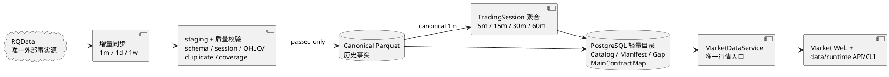
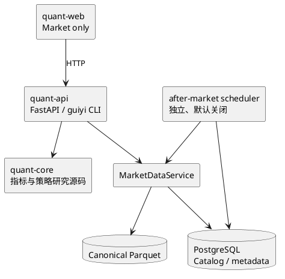

# 归一量化系统架构

更新时间：2026-08-08

## Current surface vs long-term boundary

- **Current surface**：Web 仅 Market（`/` → `/market`）；API 仅 `/api/v1/market`（含兼容 `/api/symbols`）与 `/api/runtime`；CLI `guiyi data *` / `guiyi runtime status`；Canonical 历史读。data_center HTTP 与 after-market 生产路径已卸。
- **Long-term boundary**：`packages/quant-core` 策略/指标研究源码可保留；Signal/Review/Strategy HTTP·worker·DB 表、旧语义合同与 strategy_knowledge/specs 已退役（见 Git history）。无盘中 Live 应用路径与相关生产表，无 backtest 子系统。生产 Alembic head（M3 G0）=`20260808_0035`。

## 1. 系统定位

归一量化是单用户、本地优先的国内期货研究工作站。当前可执行闭环是：可信 Canonical 历史行情、Market 工作台指标观察、数据/Runtime 只读治理。系统不实现自动交易；任何信号、通知或未来 Web 展示都是研究观察，不是交易指令，`auto_order=false` 始终成立。

旧 Web/后端回测子系统、`guiyi-backtests` 队列与 Worker、Runtime Scheduler，以及
S6-08/S6-09/S6-10 控制面已经从仓库 active implementation 中退役。旧合同、报告和证据只可从
Git history 追溯。未来如需回测，必须按新任务重新设计，不保留旧 API、页面、数据表或兼容入口。

## 2. 数据架构

RQData 是唯一外部行情事实源。正式历史数据只有七个周期：`1m`、`5m`、`15m`、`30m`、
`60m`、`1d`、`1w`。

- `1m`、`1d`、`1w` 由 RQData 直接提供；`5m`、`15m`、`30m`、`60m` 只从质量通过的
  Canonical `1m` 按 TradingSession 确定性聚合。
- staging 校验失败不发布；schema、交易时段、重复、OHLCV、coverage、identity、checksum、
  row count 或 manifest digest 异常时保留最后有效 Canonical，并显式记录 DataGap。
- 与 DataGap 相交的正式读取 fail-closed，不静默填充、缩窗、换源或跨频回退，也不回退 legacy。
- `continuous` 与 `actual_dominant` 显式且不可互换；actual dominant 只能在
  `MainContractMap rank=1` 的有效区间使用。
- `DatasetKey + Catalog/Manifest/Gap/MainContractMap` 定义 active identity；消费者不得自行
  glob、选择 active 文件、判断主力或绕过质量状态。
- historical canonical 与 live observation 在语义上分离；**当前无盘中 Live 应用路径**，盘中能力待后续重建。
- EOD 从 RQData 重新获取 provider-final 数据并校验 input digest、checksum 与 row count；
  repair、replay、backfill、migration 和 EOD recalculation 不补发历史通知。

## 3. 应用组件

- `quant-api` 当前挂载 Market Canonical 读、data 治理与只读 Runtime 状态；Signal/Review/Watchlist/Strategy/Dashboard HTTP 已卸载。
- `quant-web` 只从 Vite 环境变量或同源地址连接 API，不持久化浏览器连接配置或凭据；仅 Market 路由。
- PostgreSQL 承担轻量目录、质量、lineage 与（未 drop 的）历史 signal/review 表；不是重型行情仓库。
- Redis / signal RQ worker 入口已退役；不存在 `guiyi-backtests` 队列。
- after-market scheduler 是独立盘后编排器，不是旧 `runtime_scheduler` 的替代别名。

## 4. 公开接口现状

已删除且不得兼容恢复：

- `/api/backtests/**`、`/ws/backtests/**`；
- Web `/backtest`、`/backtest/batch`、`/settings`；
- `guiyi runtime plan`；
- `/api/runtime/health` 的 `components.scheduler`；
- 回测 report/trade marker 与旧 Dashboard/Strategy 回测入口。

当前挂载：

- `/api/v1/market`（Canonical bars / coverage / dominants / indicators）；
- `/api/v1/data` 与 `guiyi data *`；
- `/api/runtime` 与 `guiyi runtime status`；
- after-market scheduler（默认关闭）。

已从仓库删除（勿当 active surface；恢复仅用 Git history）：

- Signal/Review/Strategy/Dashboard/Watchlist/futures_research HTTP、WS、服务、ORM 与相关测试；
- signal/notification RQ worker 与队列入口；
- `docs/SIGNAL_EVENTS.md`、`docs/strategy_knowledge/`、`docs/strategy_specs/`；
- poll 盘中 Live / Task 06 observation 应用路径；生产表由 Alembic `20260808_0034` drop。

## 5. 信号与复盘（已退役）

旧 SignalEvent / 通知 / 复盘合同与表已删除。未来若重建，必须作为新任务定义新合同与新 schema，不得恢复旧兼容入口；`auto_order=false` 与无订单边界始终成立。

## 6. Runtime 与外部操作

- `guiyi runtime status` 是只读状态入口；旧 runtime plan 与 Runtime Scheduler 已删除。
- after-market scheduler、live、通知和交易保持默认关闭；配置缺失、异常、过期或不一致时 fail-closed。
- `develop` 是日常集成分支，`main` 是 release 分支，Runtime checkout 保持隔离并 detached 在精确
  tag/commit。
- 合入 `main`、创建 tag 与 Runtime promotion 是不同外部操作；生产数据库/正式数据删除、
  Runtime 切换、服务启停和真实行情更新也需要各自范围明确、单次使用的执行意图。
- 本文只描述仓库目标架构，不声明本次 release、Runtime promotion、生产迁移或生产删除已经完成。

## 7. 证据与恢复

- 旧指标合同、S6-07 EOD、Audit V2 等一次性报告已从工作树删除，只可通过 Git history 追溯。
- 旧回测、OOS、S6-08/S6-09/S6-10 packet、receipt 和验收证据同样只可通过 Git history 恢复。
- Canonical、Catalog 与 MainContractMap 不属于退役面清理范围；Signal/Review/Live 表由 `20260808_0034` 物理 drop。
