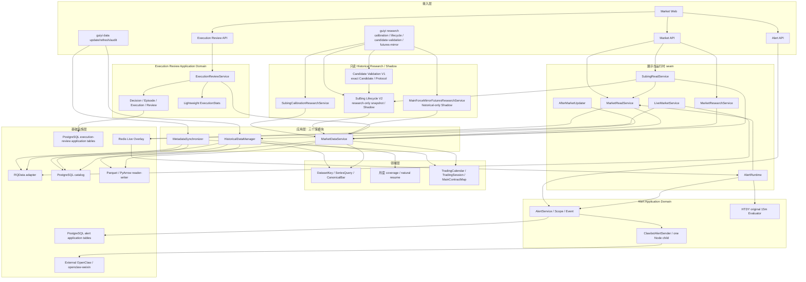
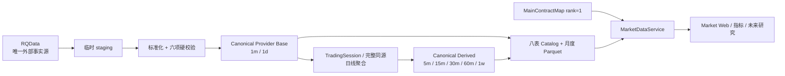
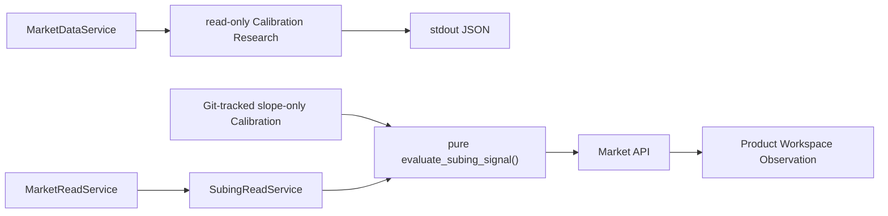
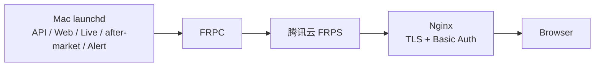

# 归一量化系统架构

更新时间：2026-08-20

## 系统定位

归一量化是本地优先、单用户的国内期货研究工作站。当前目标应用面为 Market Web、Market API、
数据 CLI、Canonical 历史读取、独立 Alert Application Domain 与独立 Execution Review Application Domain。Market Runtime V1 与 Alert Runtime V2
的代码/launchd 边界和授权相互独立；Alert 模板默认关闭。不实现自动交易，`auto_order=false` 始终成立。

## 分层设计



- 接入层只解析请求和输出结果；不实现下载、聚合、文件选择或主力判断。
- `HistoricalDataManager` 是唯一历史写应用服务；`MarketDataService` 是唯一历史读服务；
  `MarketReadService` 只在展示边界合并 Canonical 与 Redis Live，不创建第二条历史读链。
- `MarketReadService.display_snapshot()` 为 Market WebSocket 在一次读取中冻结 phase/state 与 overlay：
  `realtime` 继续服从既有 heartbeat 资格；`post_close` 只在 CLOSED phase 为 Web 展示 Redis 中尚未被
  Canonical edge 接管的当日完成 Bar。`post_close` 不写历史资产、不构成 Live，也不进入 SuBing、Alert
  或其他 consumer；Redis、subscription、交易日或合约身份异常时返回 `none`。
- `MarketResearchService` 仅组合 `MarketDataService` 的 Historical Canonical 结果，不读 Redis Live。
  `SubingCalibrationResearchService` 只通过 `MarketDataService` 读取 segment-local Historical，结果由
  CLI 以 stdout JSON 返回；不直连 provider，不写 DB/Canonical/Redis，也不自动晋升参数。
  薄 `SubingReadService` 复用 `MarketDataService` 的 current rank1 segment 身份和
  `MarketReadService` 的 Historical/completed Live seam；composition 只注入 Git-tracked slope-only
  Calibration，并对冻结 ID/timeframes/两个 exact Decimal 做整体身份校验，同 ID 内容漂移也 fail-closed；
  它再调用 pure `evaluate_subing_signal()`，并以 exact Git-tracked research Policy 附加投影 pure
  Lifecycle V2 snapshot。Historical 输入同时受 current rank1 segment 起止日约束。
  该服务不拥有或修改 Calibration/Signal 公式，
  不直连 provider/Redis，不持久化 Signal，不写 Canonical/DB，也不管理 Runtime。
  `SubingLifecycleResearchService` 只通过 `MarketDataService` 对 Historical Canonical 按 rank1
  segment 独立复算 Shadow，结果仅由 read-only CLI 输出 stdout JSON。Lifecycle 无独立
  DB/Redis persistence、worker/queue 或 notification path；`AlertRuntime` 仍只消费 V1
  `resolved_signal`，不依赖 Lifecycle evaluator 或 snapshot。
  Candidate Validation V1 以 exact Git-tracked Candidate/Protocol 编排该同一个 Lifecycle service，
  只投影 retrospective、rolling 与 prospective OOS 事实到 stdout JSON 或版本化 research report；
  不重算 lifecycle/outcome/rank1，不建立 order、position、cost、equity、DB/Redis persistence 或
  Alert consumer，也不产生自动 KEEP/DROP/PROMOTE 结论。
  `MainForceMirrorFuturesResearchService` 仅通过 `MarketDataService` 的
  `ActualDominantTradingDayQuery` / `ContractTradingDayQuery` 读取 60m Historical Canonical，
  把每根 Bar 绑定到唯一物理合约后调用 Python Indicator Kernel；结果只由只读 CLI
  输出 stdout JSON，不读 Redis/provider，不写 DB/Canonical，不进入 Alert、Runtime 或订单路径。
- 基础设施按外部责任分为 `DatabaseCoverageSource` 与 `RQDataMarketAdapter`，共用稳定的
  `InfrastructureError`；不再维护一个混合 DB coverage、provider 调用与数据标准化的巨型模块。
- active 60 的展示名称与一级研究板块由 `data/universe/product_sectors.csv` 统一提供，
  Market API 直接输出该 taxonomy；Web 不再保留第二套品种目录。
- PostgreSQL 的 Data Foundation / Market Catalog 精确保留八表，Parquet 保存 Bars；Alert 的
  `alert_rules` / `alert_events` 与 Execution Review 的四张 `trade_*` 表是独立 Application Domain 表，不进入且不改变八表 Market Catalog。不引入多
  provider、插件、任务中心或在线多版本选择器。

## 数据架构



每 Dataset 每自然月只发布一个 `part.parquet`。文件不存在、不可读、identity 不符或 coverage 不完整
时，查询 fail-closed，维护命令将该月作为待处理目标；不以第二套状态表保存这些事实。

## SuBing V1 研究与观察链



`primary_signal` 永远是 requested timeframe 自己的 evaluation；`resolved_signal` 只表示可选的实际
`MATCHED` opportunity。primary/companion 不在同一 READY boundary 时，只有 primary `MATCHED` 才产生
resolved；在同一 READY boundary 时必须反向评估完整 companion opportunity：reciprocal-only
`MATCHED` 必须被发现，双 `MATCHED` 同方向由既有 resolver 选择 15m 并标记 lower-timeframe
confirmation，反方向 fail-closed，普通 reciprocal `NOT_MATCHED` 不覆盖 requested primary。

该链没有 research DB 或 Signal persistence。`macd_zero_distance_abs/bps` 只保留为
Factor/Web/research observation，不是 executable Signal 条件；Alert V2 只调用该链已有
`SubingReadService` 读模型的 V1 `resolved_signal`，不复制 Factor、Calibration、FormalPolicy 或
same-boundary resolver，也不消费 additive research-only lifecycle。
scoped consumer policy 是 `subing_macd_sma_window_scale2_v1`，其 equivalence
tuple 固定为 `("sma_window", 2, "fast12_slow26_signal9", True)`；generic MACD 继续保持
`compatibility_validated`，backtest/live/alert capability 均未晋升。

## 运行与授权边界

`update` 计划缺失或不完整月并自然续传；`refresh` 只重建用户指定的品种/窗口；`audit` 只读。
代码、fixture、临时目录和隔离数据库验证是普通开发。真实 RQData、正式 Canonical、生产数据库
migration 与服务启停，必须分别获得范围明确的一次性执行意图。

Market Runtime V1 分为三条明确边界的平面：Historical 继续由 `HistoricalDataManager` 发布 Canonical；
LiveMarketService 只将 active 60 当日 rank1 completed 1m 与本地 Derived 写入 Redis；
AfterMarketUpdater 只在 launchd 的 18:05 触发（失败最多一小时后重试一次）调用既有历史写入口。Live
永不进入 Canonical、Parquet 或 PostgreSQL。代码与模板默认关闭；只有用户明确请求在该本地工作站启用
Market Runtime V1 后，这一有界自动化才可运行，且不扩展到 release、其他 DB、通知或订单。

Alert V2 不复活 Signal/Review/Strategy。单一 `AlertRuntime` 只调度 Code Registry 中的
`htdy_original_15m` 和 `subing_entry_signal_v1`；一条 Rule 失败不阻断另一条。HTDY 继续通过
`MarketReadService.bars_until()` 使用事件截止的 actual-dominant 15m 窗口。SuBing 只向
`SubingReadService.snapshot()` 请求 current snapshot；primary `bar_end + trading_day` 与 incoming completed
Bar 不同一即 fail-closed。final Session Bar 只在 Live 共享 arrival grace 内使用 phase
observation 可见，不新增 `snapshot_at`/cutoff/replay；5m 与 15m 落在同一 TradingSession bucket
boundary 时延后 5m，使用既有 resolver 唯一决议。

两条 Rule 都只在自身显式 `scope_products` 内创建幂等 `AlertEvent`，Event commit 先于
Clawbot single-shot：每个 Event 最多一个固定 Node child，并只经 `openclaw-weixin` private seam
调用一次 `sendMessageWeixin()`。停机期间不 replay/backfill，发送失败不 retry，不建 outbox/queue/
Signal Center/订单。SuBing migration seed Scope 为空集。当前交易日由
`MarketPhaseResolver + operational_products.txt` 唯一解析，缺失或不一致时 API 显式
`unavailable`。

AlertRuntime 是独立进程、独立 activation marker 与独立健康组件。其有界持续授权只限于：

```text
htdy_original_15m × 该 Rule 显式 scope_products × owner × clawbot-openclaw-weixin
+
subing_entry_signal_v1 × 该 Rule 显式 scope_products × owner × clawbot-openclaw-weixin
```

当前 exact instance 为两条 Rule 各自的 `scope_products=jm`。未来第三条 Rule 不继承授权；production
migration、release/tag、Runtime promotion/switch、Scope/owner/transport 变更、真实 canary/send、rollback
与 G9 cleanup 互不授权。每条 completed-bar 消息与 heartbeat 都使用独立短 Session/transaction；
Clawbot sender 与 structural health 共用 exact manifest/root/config/owner 校验。OpenClaw 是外部依赖，
不由归一量化安装、更新、登录、启动、停止或监督。当前 production 已运行该 Clawbot transport；旧
`v1.4.2` Runtime worktree 与 private WeCom credential 已完成最终清理，不再形成 rollback 或 fallback。
未来恢复 WeCom 必须重新设计、配置、发布并取得独立 Gate。

Execution Review 不反向依赖或修改 Alert Event：只从不可变 `subing_entry_signal_v1` Event 建立人工
Decision、固定合约/方向的 Episode、真实手工 Execution timeline 和结构化 Review。一个品种最多一个
OPEN Episode；不跨合约合并、不自动反手、不建账户/订单。post-hoc reconstruction 与 roll reference
只经 `MarketDataService`；业务语义见 `docs/EXECUTION_REVIEW.md`。

人民币估算使用 Git-tracked trusted-partial multiplier reference 与逐行官方 evidence。缺失值不阻断
工作流，Episode 创建时 snapshot，历史 NULL 不随 reference 扩张。ExecutionStats 只提供机会处理、
Episode 状态与复盘问题分布，不提供收益类排名或策略业绩指标。

开发期的本地 launchd 可临时直接绑定主 `develop` 工作区，当前根和运行状态由 `STATUS.md` 记录。这只是为了快速观察，不改变 Historical/Live 边界，也不构成稳定 Runtime 版本。功能收口后的最终拓扑仍为绑定精确提交的独立 Runtime worktree。

## 运维拓扑



API、Web、Live、after-market 和已获授权的 Alert launchd label 必须指向同一 supervised Runtime 根；安装器
将当次 checkout commit 冻结进每个 label 的 `GUIYI_RUNTIME_COMMIT`。状态脚本必须读取 launchd 已加载的
root/commit，并分别与 supervised checkout 对比，不能用之后移动过的 checkout HEAD 冒充在运行进程身份。
启用标记存在时 Live/after-market 均须加载，定时型 after-market 已加载但未运行属于正常状态。本地唯一状态
入口只读取 launchd、Git 身份和 HTTP/Runtime health，不执行服务 mutation。腾讯云只承担隧道与
HTTPS 反代，不保留第二套应用进程。完整三段只读检查见 `deploy/README.md`。
