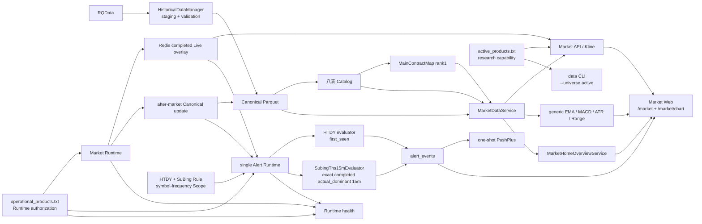

# 归一量化 Active Architecture

本文件只描述当前 active 模块和消费者依赖；产品边界见 `PROJECT_SOURCE.md`，当前部署与 Gate 见 `STATUS.md`。

## Dependency graph

## Consumer boundaries

- `MarketDataService` 是唯一 Historical Bar reader；`actual_dominant` 只通过 `MainContractMap rank=1` 解析，identity、coverage 或物理可读性异常 fail-closed。
- Web 只消费 typed Market/Alert API，不计算策略、建仓或清仓。
- `/market` 只读依赖 `MarketHomeOverviewService -> MarketDataService`、`GET /api/runtime/health` 与 current Alert Events read -> `alert_events`；页面首屏固定三项 bulk read，不存在 per-product HTTP、WebSocket 或写入。
- `active_products.txt` 是研究能力边界；`operational_products.txt` 是 Market/Alert Runtime 外层授权边界。
- Alert 独立于 Market Catalog。一个 `single Alert Runtime` 按 Rule dispatch 到 HTDY `first_seen` 与 `SubingThs15mEvaluator` `exact`，不新增进程。SuBing 只使用同物理 rank1 合约的 completed `actual_dominant` 15m；Event 持久化后最多尝试一次 transport。
- Web 的 SuBing `S↑/S↓` 只来自 immutable Event，`no SuBing overlay`；API、Web 与 formatter 不复制公式。
- 0044 只创建 disabled + empty-scope Rule；通用 Scope writer 拒绝 disabled Rule，首次 operational × 15m activation 使用专用锁定、单 commit、readback seam。
- EMA21 10K slope 是纯函数 primitive，不连接 Runtime、Alert 或周期级正式因子。

## Preserved seams

Canonical/Catalog、`DatasetKey`、Trading Calendar/Session、`MainContractMap`、Live/Historical isolation、Alert Application Domain 与 Runtime authorization 保持分离。Alembic migrations 是 schema lineage，不是已退役域的 active application dependency。
