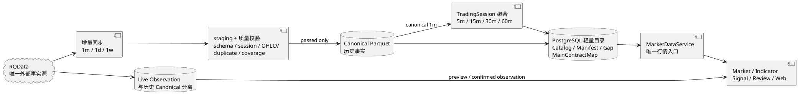
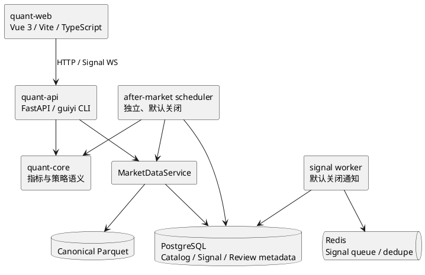
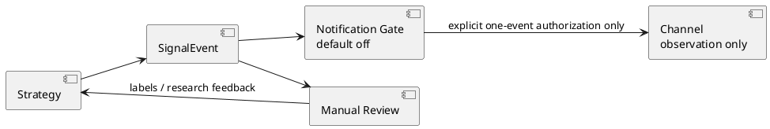

# 归一量化系统架构

更新时间：2026-08-06

## 1. 系统定位

归一量化是单用户、本地优先的国内期货研究工作站。当前闭环是：可信行情、指标与策略研究、
信号观察、人工判断、盘后复盘和研究统计。系统不实现自动交易，所有信号、Web 展示和通知都
是研究观察，不是交易指令，`auto_order=false` 始终成立。

旧 Web/后端回测子系统、`guiyi-backtests` 队列与 Worker、Runtime Scheduler，以及
S6-08/S6-09/S6-10 控制面已经从仓库 active implementation 中退役。旧合同、报告和证据只可从
Git history 追溯。未来如需回测，必须按新任务重新设计，不保留旧 API、页面、数据表或兼容入口。

## 2. 数据架构

RQData 是唯一外部行情事实源。正式历史数据只有七个周期：`1m`、`5m`、`15m`、`30m`、
`60m`、`1d`、`1w`。

- `1m`、`1d`、`1w` 由 RQData 直接提供；`5m`、`15m`、`30m`、`60m` 只从质量通过的
  Canonical `1m` 按 TradingSession 确定性聚合。
- staging 校验失败不发布；schema、交易时段、重复、OHLCV、coverage、identity、checksum、
  row count 或 manifest digest 异常时保留最后有效 Canonical，并显式记录 DataGap。
- 与 DataGap 相交的正式读取 fail-closed，不静默填充、缩窗、换源或跨频回退。
- `continuous` 与 `actual_dominant` 显式且不可互换；actual dominant 只能在
  `MainContractMap rank=1` 的有效区间使用。
- `DatasetKey + Catalog/Manifest/Gap/MainContractMap` 定义 active identity；消费者不得自行
  glob、选择 active 文件、判断主力或绕过质量状态。
- historical canonical 与 live observation 分离。未确认 bar 只能用于 preview，不能进入正式
  历史资产或正式信号。
- EOD 从 RQData 重新获取 provider-final 数据并校验 input digest、checksum 与 row count；
  repair、replay、backfill、migration 和 EOD recalculation 不补发历史通知。

## 3. 应用组件

- `quant-api` 提供统一数据、信号、复盘、Watchlist 和只读 Runtime 状态入口。
- `quant-web` 只从 Vite 环境变量或同源地址连接 API/WS，不持久化浏览器连接配置或凭据。
- PostgreSQL 只承担轻量目录、质量、lineage、信号和复盘元数据，不作为重型行情仓库。
- Redis 只服务保留的信号队列与去重；不存在 `guiyi-backtests` 队列或回测 Worker 类型。
- after-market scheduler 是独立盘后编排器，不是旧 `runtime_scheduler` 的替代别名。

## 4. 公开接口现状

已删除且不得兼容恢复：

- `/api/backtests/**`；
- `/ws/backtests/**`；
- Web `/backtest`、`/backtest/batch`、`/settings`；
- `guiyi runtime plan`；
- `/api/runtime/health` 的 `components.scheduler`；
- 回测 report/trade marker、Review 的 `backtest_trade` active source、Dashboard/Strategy 回测入口。

继续保留：

- `/api/watchlists`；
- `guiyi runtime status`；
- Market、Indicator、Signal、Review 的非回测能力；
- Task 06 的 confirmed observation、SignalDecision、EOD 与 ResearchSample 研究链；
- after-market scheduler health 与 live checkpoint 只读信息。

## 5. 信号与复盘边界

- 通知链固定为 `Strategy -> SignalEvent -> Notification Gate -> Channel`，默认关闭。
- Task 06 保留 JM、RQData rank=1 actual contract、confirmed `1m/15m`、first-seen 与重绘风险合同。
- centered/original 指标只允许 canonical 中明确列出的 realtime first-seen observation-only 白名单；
  禁止把未确认或重绘结果冒充历史信号。
- 正式边界固定 `observation_only=true`、`not_trading_instruction=true`、
  `historical_backtest_allowed=false`、`auto_order=false`。
- Review active source 仅允许 `strategy_signal`、`signal_event`、`signal_decision`、`manual_trade`。

## 6. Runtime 与外部操作

- `guiyi runtime status` 是只读状态入口；旧 runtime plan 与 Runtime Scheduler 已删除。
- after-market scheduler、live、通知和交易保持默认关闭；配置缺失、异常、过期或不一致时 fail-closed。
- `develop` 是日常集成分支，`main` 是 release 分支，Runtime checkout 保持隔离并 detached 在精确
  tag/commit。
- 合入 `main`、创建 tag 与 Runtime promotion 是不同外部操作；生产数据库/正式数据删除、
  Runtime 切换、服务启停和真实行情更新也需要各自范围明确、单次使用的执行意图。
- 本文只描述仓库目标架构，不声明本次 release、Runtime promotion、生产迁移或生产删除已经完成。

## 7. 证据与恢复

- 当前指标合同保存在 `data/reports/indicator_contract_v1/`。
- S6-07 EOD 数据证据保存在 `data/reports/jm_eod_incremental_automation_s6_07/`。
- 旧回测、OOS、S6-08/S6-09/S6-10 packet、receipt 和验收证据已从 active repository 删除，
  只可通过 Git history 恢复 tracked 内容。
- Canonical、Catalog、MainContractMap、MarketDataFile、Task 06 与非回测 Signal/Review 数据不属于
  本次仓库证据清理范围。
