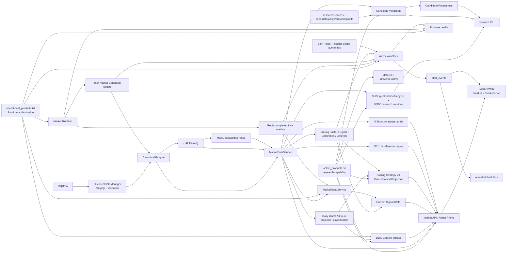

# 归一量化 Active Architecture

本文件只描述当前 active 模块和消费者依赖；产品边界见 `PROJECT_SOURCE.md`，业务公式见 deep canonical，当前部署与 Gate 见 `STATUS.md`。

## Dependency graph

## Consumer boundaries

- `MarketDataService` is the only Historical Bar reader for Market, SuBing, JDJ, N Structure and validation services. `actual_dominant` is resolved only through `MainContractMap rank=1`; incomplete identity, coverage or physical readability fails closed.
- Web consumes typed Market APIs. It may compose Daily Context, Current Signal State, Formal Event and Historical projections, but does not calculate strategy formulas or mutate Scope.
- SuBing Strategy V1 and JDJ replay are deterministic Historical read models. Their output has Web/test consumers only; no DB, Redis, Alert, Runtime or order consumer.
- `active_products.txt` is consumed by Market/research APIs, the six retained research CLI services, Daily Watch, SuBing Strategy and data CLI active-universe selection. It defines capability, not sustained Runtime authority.
- Candidate Validation feeds Candidate Robustness through source-specific contracts. Policy/protocol/profile files remain explicit inputs; neither service is a Runtime evaluator or automatic promotion path.
- `operational_products.txt` is consumed by Market Runtime, `MarketReadService`/Live, Daily Watch, Alert API/Runtime and Runtime health. Its outer Runtime-universe boundary is applied in addition to, not instead of, each Alert Rule Scope.
- Alert is independent from the Market Catalog. HTDY uses `scope_product_frequencies`; SuBing uses `scope_products`. Event persistence precedes at most one transport attempt.

## Preserved seams

Canonical/Catalog, `DatasetKey`, Trading Calendar/Session, `MainContractMap`, Live/Historical isolation, Alert Application Domain and Runtime authorization remain separate modules. Alembic migrations are schema lineage and are not active application dependencies once their domains retire.
