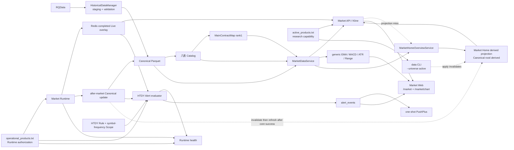

# 归一量化 Active Architecture

本文件只描述当前 active 模块和消费者依赖；产品边界见 `PROJECT_SOURCE.md`，当前部署与 Gate 见 `STATUS.md`。

## Dependency graph

## Consumer boundaries

- `MarketDataService` 是唯一 Historical Bar reader；`actual_dominant` 只通过 `MainContractMap rank=1` 解析，identity、coverage 或物理可读性异常 fail-closed。
- Web 只消费 typed Market/Alert API，不计算策略、建仓或清仓。
- `MarketHomeOverviewService` 是 completed D1/W1 首页事实的唯一计算 authority。Market Home projection 只是可删除、可重建的性能读模型，位于同一 Canonical root 下的 `.derived/market-home-overview.json`，不属于 Canonical Bar 或 Catalog authority。
- `/market` overview API 先校验 active/taxonomy/target identity 并尝试读取 projection；缺失、损坏或 identity 不匹配时回退 `MarketHomeOverviewService -> MarketDataService`，HTTP 请求本身不创建或更新 projection。
- 任何正式 `guiyi data update/refresh --apply` 与自然 after-market 在调用 authoritative manager apply 前必须先失效旧 projection；失效失败必须在数据 mutation 前 fail-closed。after-market 只有在既有 `canonical_updated`、rank1/Live reconciliation 与 cleanup 全部完成后才 best-effort 生成新 projection；生成失败只造成首页回退现场计算，不改变已成功的核心 maintenance 结论。
- `/market` 页面仍固定读取 overview、`GET /api/runtime/health` 与 current HTDY Event 三项 O(1) 资源；不存在 per-product HTTP、WebSocket 或写入。
- `active_products.txt` 是研究能力边界；`operational_products.txt` 是 Market/Alert Runtime 外层授权边界。
- Alert 独立于 Market Catalog。HTDY 使用 `scope_product_frequencies`；Event 持久化后最多尝试一次 transport。
- EMA21 10K slope 是纯函数 primitive，不连接 Runtime、Alert 或周期级正式因子。

## Preserved seams

Canonical/Catalog、`DatasetKey`、Trading Calendar/Session、`MainContractMap`、Live/Historical isolation、Alert Application Domain 与 Runtime authorization 保持分离。Market Home projection 不改变这些 authority；Alembic migrations 是 schema lineage，不是已退役域的 active application dependency。
