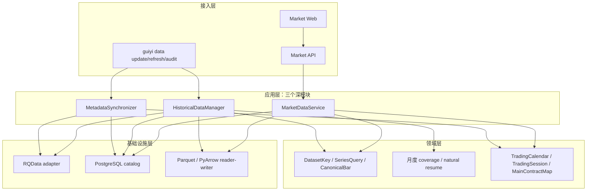

# 归一量化系统架构

更新时间：2026-08-09

## 系统定位

归一量化是本地优先、单用户的国内期货研究工作站。当前目标应用面为 Market Web、Market API、
三条数据 CLI 与 Canonical 历史读取；不实现自动交易，`auto_order=false` 始终成立。

## 分层设计

- 接入层只解析请求和输出结果；不实现下载、聚合、文件选择或主力判断。
- `HistoricalDataManager` 是唯一历史写应用服务；`MarketDataService` 是唯一历史读服务。
- PostgreSQL 保存八表 metadata/catalog，Parquet 保存 Bars；不引入多 provider、插件、任务中心或
  在线多版本选择器。

## 数据架构

每 Dataset 每自然月只发布一个 `part.parquet`。文件不存在、不可读、identity 不符或 coverage 不完整
时，查询 fail-closed，维护命令将该月作为待处理目标；不以第二套状态表保存这些事实。

## 运行与授权边界

`update` 计划缺失或不完整月并自然续传；`refresh` 只重建用户指定的品种/窗口；`audit` 只读。
代码、fixture、临时目录和隔离数据库验证是普通开发。真实 RQData、正式 Canonical、生产数据库
migration 与服务启停，必须分别获得范围明确的一次性执行意图。
