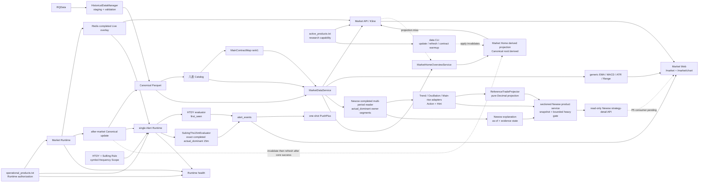

# 归一量化 Active Architecture

本文件只描述当前 active 模块和消费者依赖；产品边界见 `PROJECT_SOURCE.md`，当前部署与 Gate 见 `STATUS.md`。

## Dependency graph

## Consumer boundaries

- `MarketDataService` 是唯一 Historical Bar reader；`actual_dominant` 只通过 `MainContractMap rank=1` 解析，identity、coverage 或物理可读性异常 fail-closed。
- Web 只消费 typed Market/Alert API，不计算策略、建仓或清仓。
- Newow P1–P4 active 后端路径在图中以实线表示：`MarketDataService` 后的 completed `1w/1d/60m` reader 取得物理 owner 区段和同合约 warm-up，typed adapter 输出主状态、`BUILD/CLEAR` Action 与 `quantity_effect=none` Hint，sectioned product service 负责统计截止、来源事实、snapshot/cursor 验证、有限进程内复用和有界重型执行，`GET /api/v1/market/newow/strategy-detail` 只做 typed 序列化。到 Newow Web 的虚线仍表示 P5 消费尚未实现；这些代码事实不等于 Release、Runtime、OOS 或真实工作站验收。
- `ReferenceTradeProjector` 是无网络、无 DB、无 Redis 的纯 Decimal 投影，只按同策略、周期、物理合约、区段及版本精确配对主动作。它输出 OPEN/CLOSED/ROLLOVER_INTERRUPTED、明确统计窗口和乐观摘要，不创建或代表 Position、Order、Account、Execution、Fill、AlertEvent、PnL 或 Ledger。
- Newow 解释层显式携带各输入周期 `bar_end`、请求 `as_of`、规则身份和证据状态；解释与 Hint 不得反向改变主动作。照妖镜重绘图层、五窗口页面比较器及其样本末理论平仓与 ReferenceTrade authority 隔离。
- `/market/chart?view=newow` 提供趋势、震荡、主升浪 × `1w/1d/60m`；既有 `view=trend` 与 `GET /api/v1/market/newow/trend-detail` 保持固定 `actual_dominant + 1d` 兼容语义，并可经薄适配复用同一趋势公式，不保留第二套算法。HTDY、SuBing 与 Free 的读取和 Marker authority 不变。
- `MarketHomeOverviewService` 是 completed D1/W1 首页事实的唯一计算 authority。Market Home projection 只是可删除、可重建的性能读模型，位于同一 Canonical root 下的 `.derived/market-home-overview.json`，不属于 Canonical Bar 或 Catalog authority。
- `/market` overview API 先校验 active/taxonomy/target identity 并尝试读取 projection；缺失、损坏或 identity 不匹配时回退 `MarketHomeOverviewService -> MarketDataService`，HTTP 请求本身不创建或更新 projection。
- 任何正式 `guiyi data update/refresh/contract-warmup --apply` 与自然 after-market 都必须在 authoritative manager 已取得 maintenance lease 后、数据 mutation 前失效旧 projection；失效失败必须 fail-closed。after-market 只有在既有 `canonical_updated`、rank1/Live reconciliation 与 cleanup 全部完成后，且 owner-written Market Home projection activation marker 已启用时，才在 existing maintenance lease 内 best-effort 生成新 projection；生成失败或 lease unavailable 只造成首页回退现场计算，不改变已成功的核心 maintenance 结论。
- `/market` 页面仍固定读取 overview、`GET /api/runtime/health` 与 current Alert Events 三项 O(1) 资源；不存在 per-product HTTP、WebSocket 或写入。
- `active_products.txt` 是研究能力边界；`operational_products.txt` 是 Market/Alert Runtime 外层授权边界。
- Alert 独立于 Market Catalog。一个 `single Alert Runtime` 按 Rule dispatch 到 HTDY `first_seen` 与 `SubingThs15mEvaluator` `exact`，不新增进程。SuBing 只使用同物理 rank1 合约的 completed `actual_dominant` 15m；首次/换月重建经 `MarketReadService -> MarketDataService` 取得同合约 lifecycle Canonical prefix，再严格合并当日 completed Live，缺 history 即 fail-closed；Event 持久化后最多尝试一次 transport。
- Web 的 SuBing `S↑/S↓` 只来自 immutable Event，`no SuBing overlay`；API、Web 与 formatter 不复制公式。
- 0044 只创建 disabled + empty-scope Rule；0045 只把 RQData 1m 首根标签规范化为 `(start, end]` 排他 start。通用 Scope writer 拒绝 disabled Rule，首次 operational × 15m activation 只在精确 0045 使用专用锁定、单 commit、readback seam。
- EMA21 10K slope 是纯函数 primitive，不连接 Runtime、Alert 或周期级正式因子。

## Preserved seams

Canonical/Catalog、`DatasetKey`、Trading Calendar/Session、`MainContractMap`、Live/Historical isolation、Newow ReferenceTrade、Alert Application Domain 与 Runtime authorization 保持分离。Market Home projection 与 Newow ReferenceTrade 都不改变行情 authority；ReferenceTrade 是新只读产品身份，不恢复已退役 Historical Projection、账户或策略 Event。Alembic migrations 是 schema lineage，不是已退役域的 active application dependency。
