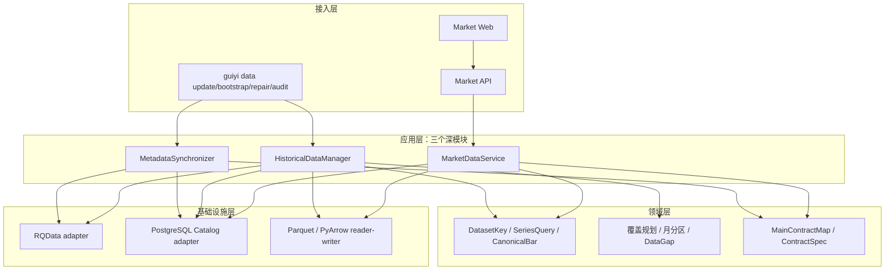
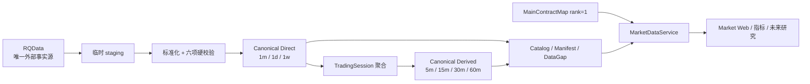

# 归一量化系统架构

更新时间：2026-08-08

## 系统定位

归一量化是本地优先、单用户的国内期货研究工作站。当前可执行面是 Market Web、Market API、
`guiyi data *`、`guiyi runtime status` 与 Canonical 历史读取。不实现自动交易，
`auto_order=false` 始终成立。

## 分层设计

- 接入层只解析请求、输出结构化结果，不实现下载、聚合、文件选择或主力判断。
- 应用层只保留三个深模块，共享规划、标准化、校验、发布和查询算法。
- 领域层只表达本项目真实变化维度，不引入多数据源、插件或通用任务中心。
- 基础设施层固定为 RQData、PostgreSQL 和 Parquet/PyArrow。

## 数据架构

- Canonical Parquet 是唯一 active 历史 Bar 存储；PostgreSQL 不保存 K 线。
- 物理 Dataset 只有 `continuous` 和 `contract`；`actual_dominant` 由查询时的
  `MainContractMap rank=1` 与真实合约 Dataset 拼接，不落重复 Parquet。
- `1m/1d/1w` 只来自 RQData；`5m/15m/30m/60m` 只从同一 Canonical `1m`
  按交易时段聚合，绝不调用 RQData。
- 每个 Dataset 每个自然月只有一个当前分区，更新或 repair 原子替换目标月。
- 与 DataGap 相交、映射缺失、分区缺失或完整性不一致时 fail-closed。
- historical canonical 与 live observation 分离；当前无盘中 Live 应用路径。

## 运行与授权边界

日常更新复用 `HistoricalDataManager.update`；bootstrap、repair 和 audit 不复制数据算法。
代码、fixture、临时目录和隔离数据库验证是普通开发。真实 RQData 下载、正式 Canonical
写入/切换、生产数据库 migration 与服务启停，必须分别获得范围明确的一次性执行意图。
