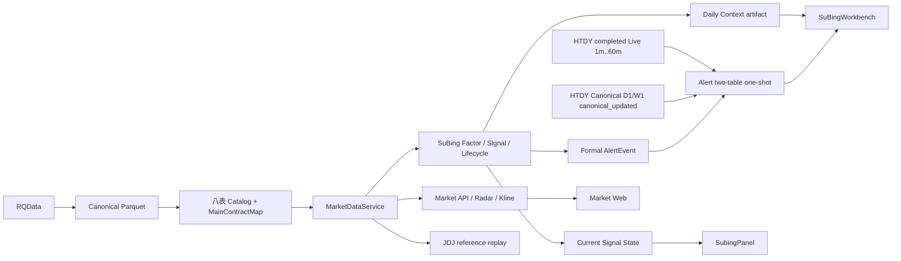

# 归一量化系统架构

## Active dependency graph

## Data and Market

`HistoricalDataManager` publishes Canonical only after validation. `MarketDataService` is the sole Historical reader. Canonical is the governed fact; Catalog carries dataset identity, quality, coverage and MainContractMap. Redis Live is an overlay only. All consumers resolve `actual_dominant` through rank1 mapping and fail closed on incomplete identity, coverage or physical readability.

Market API provides bars, dominants, product research, SuBing current state, Daily Context, Radar Summary/Scatter/Detail and four Historical overlays. The public overlay set is `none | subing | jdj_strategy | htdy`; N/raw JDJ remain internal research dependencies.

## Product boundaries

SuBing has one product workspace. Daily Context is an immutable post-close artifact; Current Signal State is a current Canonical/completed-Live read model; Formal Event is an immutable Alert Domain fact. The Web composes them client-side so unavailable one source does not hide the others; no cross-domain mega endpoint is introduced.

HTDY supports all operational products and seven frequencies. Its current event identity and authorization are frequency-aware. SuBing remains product-scoped. Alert is an independent Application Domain and does not alter the Market Catalog.

## Research and Runtime

JDJ reference replay is the only active product-facing strategy replay path. Candidate Validation/Robustness retain strict causal and prospective OOS boundaries. RQAlpha and Execution Review are retired; their history remains in Git/Alembic only.

Market Runtime, Alert Runtime and after-market are supervised processes with read-only health surfaces. They do not authorize release, Runtime promotion, Scope mutation, Canonical mutation, real notification or orders.
