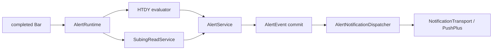
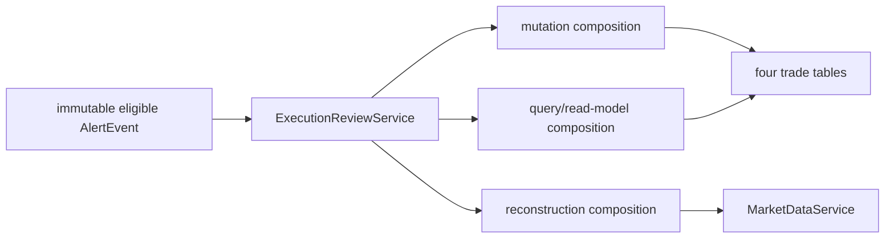
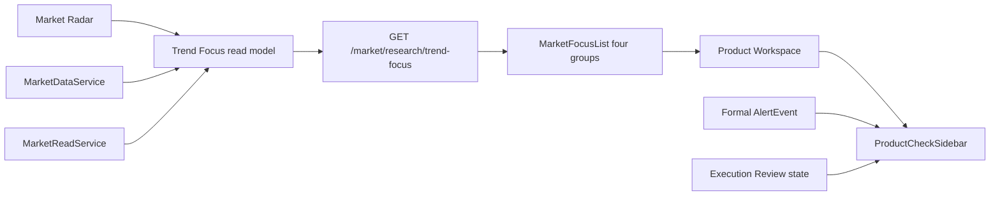

# 归一量化系统架构

更新时间：2026-08-23

本文只描述模块、职责与允许的依赖方向。产品边界见 `PROJECT_SOURCE.md`；当前 release、Runtime、
evidence 与 pending Gate 见 `STATUS.md`；exact protocol/window/hash/count 见 policy、report 与测试。

## 顶层依赖

```mermaid
flowchart TB
    subgraph Access[接入层]
      WEB[Market Web / Execution Review Web]
      API[Market / Alert / Execution Review / Runtime API]
      CLI[guiyi data / research / runtime]
      ENTRY[app.runtime_entry]
    end
    subgraph Application[应用层]
      HM[HistoricalDataManager]
      MDS[MarketDataService]
      MR[MarketReadService]
      MRS[MarketResearchService]
      MTF[MarketTrendFocus read model]
      SR[SubingReadService]
      LIVE[LiveMarketService]
      AM[AfterMarketUpdater]
      ALERT[AlertRuntime / AlertService]
      ER[ExecutionReviewService]
    end
    subgraph Research[离线只读 Research]
      ADR[ActualDominantResearchSegmentLoader]
      SUB[SuBing Research]
      NS[N Structure Research]
      JDJ[JDJ Research]
      CONV[Candidate Validation / Robustness / Dossier / Relationships]
      MFM[MainForceMirrorV2Service / ResearchService]
    end
    subgraph Domain[领域与内核]
      DK[DatasetKey / SeriesQuery / CanonicalBar]
      TS[TradingCalendar / TradingSession / MainContractMap]
      SK[Shared SuBing Kernel / Application Domain<br/>Factor / Signal / Lifecycle]
      IK[Indicator Kernel]
      AE[Alert Evaluators / Event]
      ERD[Decision / Episode / Execution / Review]
    end
    subgraph Infra[基础设施]
      RQ[RQData adapter]
      PG[PostgreSQL Catalog]
      APG[Alert tables]
      EPG[Execution Review tables]
      PQ[Canonical Parquet]
      RD[Redis Live Overlay]
      PP[PushPlus adapter]
    end

    WEB --> API
    API --> MR
    API --> MRS
    API --> MTF
    API --> SR
    API --> ALERT
    API --> ER
    CLI --> HM
    CLI --> MDS
    CLI --> ADR
    CLI --> CONV
    CLI --> MFM
    ENTRY --> LIVE
    ENTRY --> AM
    ENTRY --> ALERT

    HM --> DK
    HM --> TS
    HM --> RQ
    HM --> PG
    HM --> PQ
    MDS --> DK
    MDS --> TS
    MDS --> PG
    MDS --> PQ
    MR --> MDS
    MR --> RD
    MRS --> MDS
    MTF --> MDS
    MTF --> MR
    SR --> MDS
    SR --> MR
    SR --> SK
    LIVE --> RQ
    LIVE --> RD
    AM --> HM

    ADR --> MDS
    SUB --> ADR
    SUB --> SK
    NS --> ADR
    JDJ --> ADR
    JDJ --> NS
    CONV --> SUB
    CONV --> NS
    CONV --> JDJ
    MFM --> MDS
    MFM --> IK
    SK --> IK

    ALERT --> MR
    ALERT --> SR
    ALERT --> AE
    ALERT --> APG
    ALERT --> PP
    ER --> ERD
    ER --> EPG
    ER --> MDS
```

依赖只能从接入层指向应用层，再指向 domain/infra。Market、Runtime 与 Alert 不得导入离线
`app.research`；Research 可以依赖 Market Historical gateway，但不能成为 Runtime 组装依赖。

## Market Data 模块

- `HistoricalDataManager` 是唯一 Historical writer：从 RQData 进入 staging，完成硬校验后原子发布
  Canonical Parquet 与八表 Catalog 元数据。
- `MarketDataService` 是唯一 Historical reader：解析 `DatasetKey`、coverage 与 rank1 mapping，返回
  confirmed Canonical Bars。文件、identity、mapping、coverage 或物理读取异常一律 fail-closed。
- `MarketReadService` 只在展示边界组合 Historical 与 Redis Live Overlay，不选择 Canonical 文件，
  不修改 Historical facts。
- `MarketResearchService` 只从 `MarketDataService` 组装 Web research read model，不读 Redis。
- `MarketTrendFocus` 是按请求重算的 Market read model：复用 Radar、`MarketDataService`、
  `MarketReadService` 与当前 rank1 physical contract，输出四组首页观察事实；不依赖离线
  `app.research`，不持久化，也不进入 Alert/Runtime/订单。
- `LiveMarketService` 只写 Redis completed-bar observation；`AfterMarketUpdater` 只调用
  `HistoricalDataManager`。Live 永不写入 Parquet/PostgreSQL，也不提升为 Canonical。
- `app.runtime_entry` 只负责启动 `live | alert | after-market` 受监督进程；业务参数与用户操作仍通过
  `guiyi`，两者不形成两套实现。

## Research 模块

`app.research.composition` 只组装离线 read-only Research。CLI 的 parser、request、command、payload
分别拥有解析、合同、调度和 JSON 投影职责；它们不反向进入 Market/Runtime/Alert composition。

- Shared SuBing Kernel/Application Domain 位于 `app.market_data` 的 Factor、Signal、Lifecycle 与 Policy
  模块，不属于 offline `app.research`。Runtime `SubingReadService` 与 offline SuBing Research 都依赖该
  shared domain；两者互不依赖，Market/Runtime/Alert 因而不 import `app.research`。
- `ActualDominantResearchSegmentLoader` 通过 `MarketDataService` 读取 true rank1 physical-contract
  segment prefix，是 SuBing/N/JDJ Historical source 的共享入口。
- SuBing 与 N 保持独立 reducer；JDJ 只把 N 5m facts 以 strict-before 边界投影到 1m context。
  same-boundary、segment、contract 或 trading-day identity 不完整时 fail-closed。
- Candidate Validation 只共享 rolling/prospective schedule。每个 source 保留自己的 Policy、window、
  event unit 与 outcome；retrospective、embargo、prospective OOS 不得混用或回填。
- Robustness 与 relationship service 只在相同 symbol、physical contract、rank1 segment 和各自 protocol
  允许的 causal boundary 内组合事实。dependency 不代表确认，overlap 不代表 lead/lag 或 future outcome。
- dossier 只验证并投影钉住的 immutable artifacts，不连接 `MarketDataService`，不重算 Candidate。
- `MainForceMirrorV2Service` 读取 confirmed 60m Market facts；ResearchService 在 same-contract block 内
  生成 strict-prior、prefix-invariant sequence forensic。事件归属实际 evidence Bar，不回标 peak；
  accumulated 或时间身份不可用时重置/fail-closed，不跨换月传播 memory。
- Research 输出只到 stdout JSON 或显式 artifact seam；不写 DB/Canonical/Redis，不进入 Alert、Runtime、
  Execution Review 或订单。任何 retrospective/rolling/robustness evidence 都不能自动晋升 Candidate、
  选择 winner、形成盈利结论或消费 prospective OOS。

## Alert 模块

- HTDY 依赖 `MarketReadService.bars_until()` 的 event-cutoff；SuBing 依赖既有
  `SubingReadService.snapshot()`，不复制公式或 resolver。
- completed Bar 与 snapshot 的 `bar_end + trading_day` 必须相同；当前交易日、Live arrival 或
  TradingSession bucket 不能唯一解析时 fail-closed。
- Event commit 先于一次 notification attempt。transport 只负责 provider adapter；provider 接受不等于
  最终送达。无 replay/backfill/retry/outbox/queue/逐人状态或订单依赖。

## Execution Review 模块

- Mutation、query/read-model 与 reconstruction 分开组装；Execution Review 故障不反向影响 AlertEvent
  或 notification。
- Episode 固定 physical contract 与 direction；价格、成本、仓位、points 和 multiplier 使用 `Decimal`。
- HTTP request-scoped composition 每请求读取一次 roll Gate，再把 callback 注入 mutation service。
  missing/`disabled`/`invalid` 注入 fail-closed callback，返回 `ROLL_RECONCILIATION_REQUIRED` 且不调用
  reconciler、不创建 `DOMINANT_ROLL`；只有 `enabled` 注入真实 reconciler。`record_executed` 不重复读 marker。
- Reconstruction 只经 `MarketDataService`；unavailable 不阻断人工 Decision/Execution/Review。

## Web B1 模块

首页 `MarketFocusList` 只投影后端 Trend Focus 的多头/空头新机会与运行/转弱趋势，每组默认三项并可
展开到后端最多十项；Web 不再自行选品。后端 read model 使用 completed-bar、current physical-contract
边界，Radar `degraded` 时返回 HTTP 200 的 degraded 空四组；刷新失败只在明确标注“上一份”时保留上次
成功快照。详情页
`ProductCheckSidebar` 固定按“现在 → 市场背景 → 当前观察 → 位置/参与 → 提醒 → 更多研究”读取既有
API facts。正式 Event、研究观察与 Research-only facts 保持视觉/语义分层；Web 不计算核心指标、
不自判主力，也不建立 Opportunity score、winner 或交易建议。

## 基础设施与运维方向

- PostgreSQL 八表 Catalog、Alert 两表、Execution Review 四表是三个独立 persistence boundary。
- Parquet 只保存 Canonical Bars；Redis 只保存 Live observation；PushPlus 只在 notification adapter 后。
- Mac launchd 监督 API/Web/Live/after-market/Alert；FRPC/FRPS/Nginx 只做隧道与反代，不运行第二套应用。
- 任何 activation、migration、数据写入、通知、release/tag 或 Runtime switch 的当前状态与授权不属于
  本架构文档，只看 `STATUS.md` 与当次用户执行意图。
