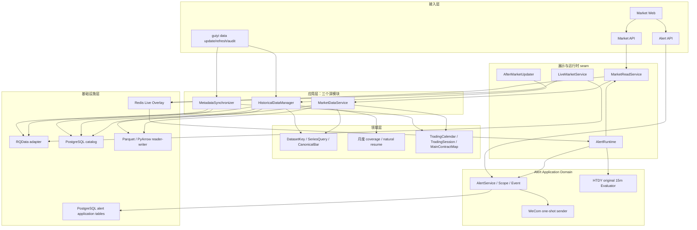
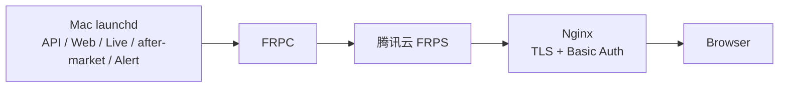

# 归一量化系统架构

更新时间：2026-08-13

## 系统定位

归一量化是本地优先、单用户的国内期货研究工作站。当前目标应用面为 Market Web、Market API、
数据 CLI、Canonical 历史读取与独立 Alert Application Domain。Market Runtime V1 与 Alert Runtime V1
的代码/launchd 边界和授权相互独立；Alert 模板默认关闭。不实现自动交易，`auto_order=false` 始终成立。

## 分层设计

- 接入层只解析请求和输出结果；不实现下载、聚合、文件选择或主力判断。
- `HistoricalDataManager` 是唯一历史写应用服务；`MarketDataService` 是唯一历史读服务；
  `MarketReadService` 只在展示边界合并 Canonical 与 Redis Live，不创建第二条历史读链。
- 基础设施按外部责任分为 `DatabaseCoverageSource` 与 `RQDataMarketAdapter`，共用稳定的
  `InfrastructureError`；不再维护一个混合 DB coverage、provider 调用与数据标准化的巨型模块。
- active 60 的展示名称与一级研究板块由 `data/universe/product_sectors.csv` 统一提供，
  Market API 直接输出该 taxonomy；Web 不再保留第二套品种目录。
- PostgreSQL 的 Data Foundation / Market Catalog 精确保留八表，Parquet 保存 Bars；Alert 的
  `alert_rules` / `alert_events` 是独立 Application Domain 表，不进入 Market Catalog。不引入多
  provider、插件、任务中心或在线多版本选择器。

## 数据架构

每 Dataset 每自然月只发布一个 `part.parquet`。文件不存在、不可读、identity 不符或 coverage 不完整
时，查询 fail-closed，维护命令将该月作为待处理目标；不以第二套状态表保存这些事实。

## 运行与授权边界

`update` 计划缺失或不完整月并自然续传；`refresh` 只重建用户指定的品种/窗口；`audit` 只读。
代码、fixture、临时目录和隔离数据库验证是普通开发。真实 RQData、正式 Canonical、生产数据库
migration 与服务启停，必须分别获得范围明确的一次性执行意图。

Market Runtime V1 分为三条明确边界的平面：Historical 继续由 `HistoricalDataManager` 发布 Canonical；
LiveMarketService 只将 active 60 当日 rank1 completed 1m 与本地 Derived 写入 Redis；
AfterMarketUpdater 只在 launchd 的 17:00 触发（失败最多一小时后重试一次）调用既有历史写入口。Live
永不进入 Canonical、Parquet 或 PostgreSQL。代码与模板默认关闭；只有用户明确请求在该本地工作站启用
Market Runtime V1 后，这一有界自动化才可运行，且不扩展到 release、其他 DB、通知或订单。

Alert V1 不复活 Signal/Review/Strategy。它只从 Live 15m completed-bar 事件触发，经
`MarketReadService.bars_until()` 获得硬截止的 actual-dominant 历史/Live 统一窗口与当日 rank1 contract，
由 Python Indicator Kernel 只检查当前最后一根 HTDY original 买/卖观察，再通过 `AlertService` 幂等落
`AlertEvent` 并进行一次简洁 WeCom 尝试。停机期间不 replay/backfill，发送失败不 retry；Web persistent
Marker 只读取已记录 Event，和当前会 repaint 的 HTDY overlay 独立。

AlertRuntime 是独立进程、独立 activation marker 与独立健康组件。只有用户明确启用后，才持续运行
`htdy_original_15m × enabled scope_products × WeCom`；该授权不覆盖 migration、真实 canary、Runtime
switch、release、Canonical 写入、新 Rule/渠道或订单。

开发期的本地 launchd 可临时直接绑定主 `develop` 工作区，当前根和运行状态由 `STATUS.md` 记录。这只是为了快速观察，不改变 Historical/Live 边界，也不构成稳定 Runtime 版本。功能收口后的最终拓扑仍为绑定精确提交的独立 Runtime worktree。

## 运维拓扑

API、Web、Live、after-market 和已获授权的 Alert launchd label 必须指向同一 supervised Runtime 根；启用标记
存在时 Live/after-market 均须加载，定时型 after-market 已加载但未运行属于正常状态。本地唯一状态
入口只读取 launchd、Git 身份和 HTTP/Runtime health，不执行服务 mutation。腾讯云只承担隧道与
HTTPS 反代，不保留第二套应用进程。完整三段只读检查见 `deploy/README.md`。
