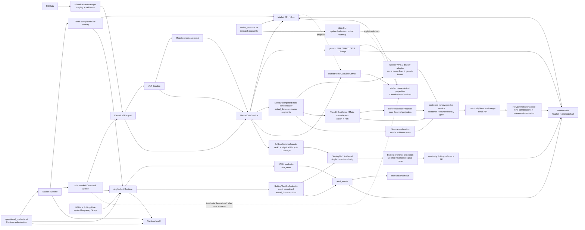

# 归一量化 Active Architecture

本文件只描述当前 active 模块和消费者依赖；产品边界见 `PROJECT_SOURCE.md`，当前部署与 Gate 见 `STATUS.md`。

## Dependency graph

## Consumer boundaries

- Canonical publication 先完成校验、不可变 hash 文件和 durability，再在既有 Catalog 事务 register/flush、真实 `MarketDataService` strict-read 后 commit 单月 active pointer；不引入全局 snapshot 或新表。reader 对精确 Catalog URI 的同一份 bytes 校验 hash 并解析，保留旧文件供已有 reader 使用。
- `MarketDataService` 是唯一 Historical Bar reader；`actual_dominant` 只通过 `MainContractMap rank=1` 解析，identity、coverage 或物理可读性异常 fail-closed。
- 默认关闭的 `app.preview` 只组合 Market/Newow routers 与共享 read-only transaction，固定 code SHA / cutoff；不导入正常 app 或创建 Live/Alert/EOD/provider。候选 Web 精确白名单代理到 8010，只有既有 health/current-events 两项 GET 到受监督的 8000，并显示独立来源与时间口径；启动入口与 fixture 验证见 `TESTING.md`。
- Web 只消费 typed Market/Alert API，不计算策略、建仓或清仓。
- Market WebSocket 先订阅再读快照；快照与 state 更新在同一有界后台读取入口执行，每次在 worker 内新建、使用并关闭 Session 与同步 Redis。每进程最多四项读取，满额立即失败，无无界队列；调用取消后仍待实际 worker 结束才释放额度。Pub/Sub 与发送继续在事件循环执行。
- `chart.vue` 只挂载 `MarketDetailPage`。无 `view` 旧链接按 overlay 明确迁移到 HTDY 或 Free，保留合法品种、序列、合约、周期与定位；参数缺省使用 actual_dominant/15m，非法组合拒绝并提供恢复入口。首页普通进入仍为 Newow 趋势日线，Event 经统一身份构造器精确定位。固定 D1 `view=trend` 兼容产品继续存在，旧页面及返回入口不再保留；工程与用户视觉验收状态见 `STATUS.md`。
- Newow P1–P6 active 代码路径在图中以实线表示：`MarketDataService` 后的 completed `1w/1d/60m` reader 取得物理 owner 区段和同合约 warm-up，typed adapter 输出主状态、`BUILD/CLEAR` Action 与 `quantity_effect=none` Hint；MACD display adapter 只把同一 owner Bar 送入通用 MACD kernel，并保留参数/hash/点级状态。sectioned product service 负责统计截止、来源事实、snapshot/cursor 验证、有限进程内复用和有界重型执行，`GET /api/v1/market/newow/strategy-detail` 只做 typed 序列化；Newow Web 逐 section 消费并显示九组合、参考历史、解释、独立比较器和单一辅助图层。这些 active 代码事实不等于 Release、Runtime、OOS、原站完整 parity 或真实工作站验收。
- Newow 的只读历史快照解析沿用同一 reader 与 MarketDataService：只有用户显式请求才检查最近完成交易日的有限候选，验证主图/照妖镜输入后返回截止时间；Web 全部面板随该截止时间切换，当前日期缺数不触发自动历史回退。
- Newow readiness CLI 经共享 reader/owner validator/MDS 枚举与逐合约读取依赖；纯 `ContractWarmupPlanner` 与维护器共用精确候选 scope/count/hash。matrix 复用实际 section service；只读事务使用 `app.db.readonly.readonly_transaction`，不组合 provider、metadata writer、maintenance apply 或 Redis。
- `au-calendar-correction` 只组合已捕获来源文件、共享 Session 规范化与 Catalog 事务；默认只读规划，显式 apply 仅更正一个已确认 Calendar 字段并独立读回。不依赖维护执行器、provider、Canonical writer 或 Runtime；固定身份与失败边界见 `DATA_CENTER.md`。
- `ReferenceTradeProjector` 是无网络、无 DB、无 Redis 的纯 Decimal 投影，只按同策略、周期、物理合约、区段及版本精确配对主动作。它输出 OPEN/CLOSED/ROLLOVER_INTERRUPTED、明确统计窗口和乐观摘要，不创建或代表 Position、Order、Account、Execution、Fill、AlertEvent、PnL 或 Ledger。
- Newow 解释层显式携带各输入周期 `bar_end`、请求 `as_of`、规则身份和证据状态；解释与 Hint 不得反向改变主动作。照妖镜重绘图层、五窗口页面比较器及其样本末理论平仓与 ReferenceTrade authority 隔离。
- `/market/chart?view=newow` 以单一 Newow 控制器消费趋势、震荡、主升浪 × `1w/1d/60m`；请求切换使用 generation/Abort 隔离，资源按 section 独立呈现，兼容事实不足时显式降级。既有 `view=trend` 与 `GET /api/v1/market/newow/trend-detail` 保持固定 `actual_dominant + 1d` 兼容语义，并经同一趋势公式路径提供结果，不保留第二套算法。HTDY、SuBing 与 Free 的读取和 Marker authority 不变。
- `MarketHomeOverviewService` 是 completed D1/W1 首页事实的唯一计算 authority。Market Home projection 只是可删除、可重建的性能读模型，位于同一 Canonical root 下的 `.derived/market-home-overview.json`，不属于 Canonical Bar 或 Catalog authority。
- `/market` overview API 先校验 active/taxonomy/target identity 并尝试读取 projection；缺失、损坏或 identity 不匹配时回退 `MarketHomeOverviewService -> MarketDataService`，HTTP 请求本身不创建或更新 projection。
- 任何正式 `guiyi data update/refresh/contract-warmup --apply` 与自然 after-market 都必须在 authoritative manager 已取得 maintenance lease 后、数据 mutation 前失效旧 projection；失效失败必须 fail-closed。after-market 只有在既有 `canonical_updated`、rank1/Live reconciliation 与 cleanup 全部完成后，且 owner-written Market Home projection activation marker 已启用时，才在 existing maintenance lease 内 best-effort 生成新 projection；生成失败或 lease unavailable 只造成首页回退现场计算，不改变已成功的核心 maintenance 结论。
- `/market` 页面仍固定读取 overview、`GET /api/runtime/health` 与 current Alert Events 三项 O(1) 资源；不存在 per-product HTTP、WebSocket 或写入。
- `active_products.txt` 是研究能力边界；`operational_products.txt` 是 Market/Alert Runtime 外层授权边界。
- Alert 独立于 Market Catalog。一个 `single Alert Runtime` 按 Rule dispatch 到 HTDY `first_seen` 与 `SubingThs15mEvaluator` `exact`，不新增进程。SuBing 只使用同物理 rank1 合约的 completed `actual_dominant` 15m；首次/换月重建经 `MarketReadService -> MarketDataService` 取得同合约 lifecycle Canonical prefix，再严格合并当日 completed Live，缺 history 即 fail-closed；Event 持久化后最多尝试一次 transport。
- Web 的正式 SuBing `S↑/S↓` 只来自 immutable Event，通用 Overlay 不增加 SuBing（`no SuBing overlay`）；API、Web 与 formatter 不复制公式。独立历史参考服务经现有 `ActualDominantResearchSegmentLoader` 和 `MarketDataService` 获取完整主力区段、物理生命周期 Bar 及 coverage，复用同一个 Kernel 后进入纯 Decimal 参考投影。`GET /api/v1/market/{symbol}/subing/reference` 提供单品种只读响应，进程内单并发、30 秒协作式预算；输入 hash 绑定游标、统计与信号，历史参考不依赖 Alert Rule/Scope、Redis 或 Event 写入。
- 默认关闭的 Live recovery worker 属于既有 Market Runtime；复用 RQData adapter、Session 与聚合器，
  只向 Redis Live 原子提交缺失 observation 和恢复水位。MarketReadService 将水位随 Alert window
  传递；同 Runtime root 的 Live 最终提交与 Alert Event/send 通过品种级 OS 锁串行化。只读 readiness
  CLI 复用这些读取与 coverage 入口，不组合 evaluator、downloader 或 transport。
- 0044 只创建 disabled + empty-scope Rule；0045 只把 RQData 1m 首根标签规范化为 `(start, end]` 排他 start。通用 Scope writer 拒绝 disabled Rule，首次 operational × 15m activation 只在精确 0045 使用专用锁定、单 commit、readback seam。
- EMA21 10K slope 是纯函数 primitive，不连接 Runtime、Alert 或周期级正式因子。

## Preserved seams

Canonical/Catalog、`DatasetKey`、Trading Calendar/Session、`MainContractMap`、Live/Historical isolation、Newow ReferenceTrade、Alert Application Domain 与 Runtime authorization 保持分离。Market Home projection 与 Newow ReferenceTrade 都不改变行情 authority；ReferenceTrade 是新只读产品身份，不恢复已退役 Historical Projection、账户或策略 Event。Alembic migrations 是 schema lineage，不是已退役域的 active application dependency。

### Market 详情入口迁移

`/market/chart` 统一挂载 `MarketDetailPage`。无 `view` 时：`overlay=htdy` 映射 HTDY，
`overlay` 缺省或 `none` 映射 Free；symbol、series_kind、contract、frequency 保留并校验。
缺省 series_kind 使用 actual_dominant，缺省 frequency 使用 15m，不依赖旧浏览器偏好或变为趋势日线。
指定合约必须匹配 symbol；非法、重复数组型字段、未知 overlay 和 view/overlay 冲突明确拒绝。
旧无 view 且 overlay 缺省/none 时，合法 actual_dominant + 15m 的 focus_bar_end 迁移为 Free 精确 Bar 定位，
不生成 Marker；HTDY actual_dominant 各正式周期保留 exact Bar focus。其他不支持的组合或非法时间明确拒绝。
有效迁移以 replace 规范化地址，不增加历史条目；导航取消、更新或销毁后的旧迁移不得激活旧行情身份。

显式 `view=trend` 继续保持固定 `actual_dominant + 1d` 产品兼容，它与已删除旧页面是独立概念。
首页普通品种仍进入 Newow 趋势日线；HTDY 与 SuBing Event 使用明确 view 和精确 focus。
品种选择位于统一导航，数据失败时仍可用；更换品种清除不兼容 contract 和 focus。
成功态保留 TopBar → Quote → ViewNav → workspace 顺序。盘后 last_failure 独立披露为最近盘后更新失败，
不隐藏最后有效 Canonical 报价，不将盘后失败误报为数据正常。
旧页、专用 toolbar/sidebar、旧路由构造器及其偏好读写已删除。统一详情偏好保留旧值迁移：
旧 chart v9 值迁移为 Free 周期与指标偏好；已有详情 v1 偏好按既有路径升级，
不选择旧页、不决定旧无 view URL 行情身份。
