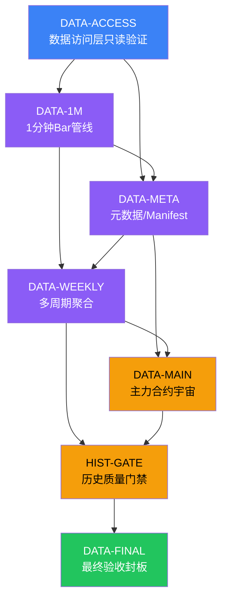

# EPIC-DATA-LAYER-FINAL-CLOSURE: 数据层最终封板

> **Epic ID:** DATA-LAYER-FINAL-CLOSURE
> **Worktree:** `/Volumes/扩展盘/guiyi-parallel/data-final-closure`
> **Branch:** `codex/data-layer-final-closure`
> **Base:** `main` @ `06528f0e`
> **Created:** 2026-07-13
> **Owner:** WorkBuddy

## 0. 目的

对归一量化数据层（RQData → raw/standard parquet → manifest → DuckDB/PostgreSQL）
执行最终封板审计和受控补齐，确保所有 1m/1d/1w 数据就绪、manifest 完整、
历史质量门禁通过，V1 数据层达到可复现回测和可信报告的条件。

## 1. 任务列表与依赖图

### 任务详情

| # | Task ID | 描述 | 风险 | 状态 | 前置 |
|---|---------|------|------|------|------|
| 1 | DATA-ACCESS | 数据访问层只读验证（RQData token、DuckDB、PostgreSQL、Parquet 可读性） | R1 | BLOCKED_BY_DEPENDENCY | — |
| 2 | DATA-1M | 1 分钟 Bar 管线（raw→standard→quality Gate） | R1 | BLOCKED_BY_DEPENDENCY | DATA-ACCESS |
| 3 | DATA-META | 元数据 / Manifest / 合约注册完整性 | R1 | BLOCKED_BY_DEPENDENCY | DATA-ACCESS, DATA-1M |
| 4 | DATA-WEEKLY | 多周期聚合（5m/15m/30m/60m/1d/1w） | R1 | BLOCKED_BY_DEPENDENCY | DATA-1M, DATA-META |
| 5 | DATA-MAIN | 主力合约宇宙（continuous + actual contract） | R1 | BLOCKED_BY_DEPENDENCY | DATA-META, DATA-WEEKLY |
| 6 | HIST-GATE | 历史质量门禁（quality_status=passed，无 failed/legacy 进入 active） | R1 | BLOCKED_BY_DEPENDENCY | DATA-WEEKLY, DATA-MAIN |
| 7 | DATA-FINAL | 数据层最终验收封板（综合报告 + 封板声明） | R1 | BLOCKED_BY_DEPENDENCY | HIST-GATE |

## 2. 准入条件

- [x] WS-V2-009 已合并 main（HEAD: `06528f0e`）
- [x] Worktree `/Volumes/扩展盘/guiyi-parallel/data-final-closure` 基于正确 main
- [x] 分支 `codex/data-layer-final-closure` 元数据一致
- [ ] 只读环境可用（RQData token / DuckDB / PostgreSQL read / Parquet read）
- [ ] 所有写入型 Task 初始均被阻断（BLOCKED_BY_DEPENDENCY）
- [ ] 数据盘挂载验证通过

## 3. 禁止范围

- 不修改业务代码（`apps/` / `services/quant-api/app/` / `packages/quant-core/`）
- 不写入 PostgreSQL / 不改 Alembic schema
- 不写入 raw / standard parquet / manifests
- 不调用 RQData 下载（审计阶段只读）
- 不删除任何数据
- 不修改 `.env` / token / webhook

## 4. 允许范围

- `scripts/rqdata_*_audit.py` — 只读审计脚本
- `data/reports/` — 审计报告输出
- `docs/epics/` — Epic 文档
- `.ai/state/epics/` — Epic 状态文件
- `.ai/results/` — 任务结果
- `docs/tasks/` — 任务单

## 5. Readiness Flags

| Flag | 含义 | 状态 |
|------|------|------|
| `access_readonly_verified` | 只读访问层验证通过 | false |
| `1m_pipeline_audited` | 1m 管线审计完成 | false |
| `meta_manifest_complete` | 元数据 / manifest 完整 | false |
| `weekly_aggregation_verified` | 多周期聚合验证通过 | false |
| `main_universe_complete` | 主力合约宇宙完整 | false |
| `history_gate_passed` | 历史质量门禁通过 | false |
| `final_closure_signed` | 最终封板声明签署 | false |

## 6. 输出产物

- `data/reports/data_layer_final_closure_20260713/` — 综合审计报告
- `docs/epics/EPIC-DATA-LAYER-FINAL-CLOSURE.md` — 本文件
- `.ai/state/epics/DATA-LAYER-FINAL-CLOSURE.json` — 状态文件
- 7 个 Task 状态均为 CLOSED 或 SKIPPED_WITH_REASON

---

*本 Epic 归属于 V1 数据层封板计划。合并到 main 后数据层进入只读维护模式。*
