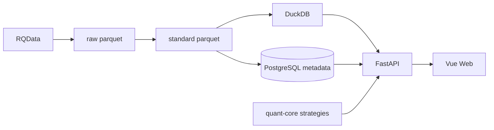

# 项目所有者渐进学习手册

更新时间：2026-07-21

面向：只懂一点 Python、主要靠 Codex 开发的项目所有者。  
目标：建立「地图 + 边界 + 验证」能力，降低乱改与 token 浪费。  
用法：每次约 30 分钟读一课；先复述过关再进入下一课。本手册为只读学习材料，不改变业务 Gate。

---

## 学习方式

| 环节 | 时长 | 做什么 |
|---|---|---|
| 回顾 | 5 分钟 | 用上一课学习卡复述 3 句话 |
| 概念 | 10 分钟 | 读本课「地图」与「关键文件」 |
| 看代码 | 10 分钟 | 打开本课列出的真实文件，对照数据流 |
| 练习 | 5 分钟 | 完成本课定位/影响分析题 |

每课产出一张学习卡，固定五栏：

1. 本节地图  
2. 关键文件  
3. 数据流  
4. 不可随意修改点  
5. 给 Codex 的任务约束  

过关标准：能回答「它做什么、入口在哪、依赖谁、改完怎么验」。

---

# 第 1 课：项目是什么、现在在哪里

## 学习卡

### 1. 本节地图

归一量化 = 本地单用户期货**研究**工作站，不是自动交易机器人。

三条必须分清的线：

| 概念 | 含义 | 例子 |
|---|---|---|
| 研究闭环 | 数据→K线→策略→回测→报告→复盘→信号提醒→人工观察 | 在 Web 上看 Dashboard / 回测报告 |
| 真实写入 | 会改本地 Parquet / live 表 / 归档 / 企业微信真实发送 | JM T3 live、T4 盘后归档 |
| 自动实盘 | 信号直接下单、无人值守交易 | **V1 明确不做** |

### 2. 关键文件

| 文件 | 一句话职责 |
|---|---|
| [`STATUS.md`](../../STATUS.md) | **现在**能做什么、哪个 Gate 过了、下一入口是什么 |
| [`AGENTS.md`](../../AGENTS.md) | 工程硬规则：禁止项、技术栈、工具模型 |
| [`PROJECT_SOURCE.md`](../../PROJECT_SOURCE.md) | **长期**定位、主链路、canonical 文件职责表 |

记忆口诀：

```text
STATUS = 今天到哪了
AGENTS = 做事规矩
PROJECT_SOURCE = 项目是谁、边界在哪
```

冲突时优先：`STATUS.md` + GitHub Issue/PR + `DECISIONS.md`。  
对话 memory、`.ai/results`、旧任务池 **不是** 事实源。

### 3. 数据流（产品视角）

```text
数据更新 → 质量检查 → K线 → 策略/信号 → 回测 → 报告 → 复盘 → 人工观察
```

当前业务阶段（以 STATUS 为准）：

```text
Stage 6 / JM 主线
T3_REAL_PASSED 已达成
JM_ARCHIVE_PASSED 已达成
下一入口：独立 EOD Automation Gate
不可扩写为：JM_RUNTIME_READY / LONG_RUNNING_READY / SignalEvent / 通知 Ready
```

两个数据状态必须**并列**理解，不能互相替代：

```text
CONSUMER_DATA_CONTRACT_READY          ← Market/Backtest/Signal 可用
DATA_LAYER_REAUDIT_REQUIRED           ← 全历史 residual 仍要治理（非阻塞）
```

### 4. 不可随意修改点

- 不写自动下单、订单草稿、无人值守交易。  
- 不改 `.env`、不提交凭据。  
- 不破坏 `data/raw/`。  
- 不把「trust audit passed」说成「策略可实盘」。  
- 不把「代码完成」说成「真实 Gate 通过」。

### 5. 给 Codex 的任务约束

```text
背景：先对照 STATUS.md，确认当前 Gate。
禁止：改 STATUS 数字、宣称未批准 Gate、真实写入、自动交易。
验收：说明本次任务属于研究 / 真实写入 / 文档 哪一类。
```

## 定位练习（第 1 课）

用自己的话回答（不必完美）：

1. 这个项目**做**什么？**不做**什么？  
2. `STATUS.md` 和 `PROJECT_SOURCE.md` 差在哪？  
3. 当前下一业务入口是什么？`JM_ARCHIVE_PASSED` 能说明哪些事实、不能说明哪些事实？

参考答案：

1. 做本地研究闭环（数据到复盘/信号提醒）；不做自动实盘、SaaS、多用户、信号直接下单。  
2. STATUS 是当前 Gate/进度；PROJECT_SOURCE 是长期定位与边界。  
3. 下一入口是独立 EOD Automation Gate；可以基于 S6-06 receipt 写 `JM_ARCHIVE_PASSED`，但不能据此宣称 Runtime 长稳、SignalEvent、通知或自动交易 Ready。

---

# 第 2 课：目录地图与技术分层

## 学习卡

### 1. 本节地图

三个**真正写业务逻辑**的代码根：

```text
apps/quant-web          前端界面（Vue 3）
services/quant-api      后端 API + 数据编排 + 回测/信号服务（FastAPI）
packages/quant-core     策略与指标内核（Python，供回测/信号复用）
```

主技术链路：

```text
RQData → Parquet → DuckDB 读行情
                → PostgreSQL 存元数据/任务/报告/信号
                → FastAPI
                → Vue Web
```

### 2. 关键文件 / 目录

| 路径 | 先读？ | 职责 |
|---|---|---|
| [`docs/ARCHITECTURE.md`](../ARCHITECTURE.md) | 高 | 系统架构总览 |
| `apps/quant-web/` | 高 | Web 页面 |
| `services/quant-api/app/` | 高 | API 与领域服务 |
| `packages/quant-core/guiyi_quant/` | 高 | 策略、指标 |
| `scripts/` | 中 | 开发启停、数据运维、工程 Gate |
| `configs/data_profiles/` | 中 | 数据 Profile JSON |
| `tests/` + `services/quant-api/tests/` | 中 | 工程与业务测试 |
| `data/raw|processed|parquet/` | 低（勿破坏） | 本地大数据，常 gitignore |
| `data/reports/` | 低 | Gate 证据快照，非入门源码 |
| `experiments/` | 低 | 实验沙盒 |
| `.agents/` `.cursor/` `.codex/` | 低 | AI 工具配置 |

### 3. 数据流



### 4. 不可随意修改点

- 不要从 `data/manifests` / `data/reports` 入门「学架构」。  
- 不要改 `services/quant-api/main.py` 占位 stub（真正入口是 `app/main.py`）。  
- 不要假设 `experiments/` 是正式 Web 路径。

### 5. 给 Codex 的任务约束

```text
先说明改动落在哪个代码根：apps / services / packages。
禁止跨三个根做「顺手重构」。
一次任务只碰一个功能域。
```

## 定位练习（第 2 课）

1. Dashboard 页面文件大概在哪？  
2. 策略 Python 代码在哪？  
3. 本地一键启动脚本是哪个？

参考答案：

1. `apps/quant-web/src/pages/dashboard/`  
2. `packages/quant-core/guiyi_quant/strategies/`  
3. `scripts/dev-up.sh`

---

# 第 3 课：从浏览器找到前端入口（Dashboard）

## 学习卡

### 1. 本节地图

浏览器打开首页 → 路由到 Dashboard → Vue 组件加载 → 调 API → 渲染卡片。

Vue 单文件四块（不必先学完整语法）：

| 块 | Dashboard 里是什么 |
|---|---|
| 状态 | `loading` / `error` / `summary` |
| 请求 | `load()` → `getDashboardSummary()` |
| 页面结构 | `<PageShell>` + 指标卡片 + 快捷入口 |
| 展示 | `MetricCard` / `StatusTag` / 最近任务 |

### 2. 关键文件

| 文件 | 职责 |
|---|---|
| [`apps/quant-web/src/main.ts`](../../apps/quant-web/src/main.ts) | 创建 Vue 应用，挂载 router |
| [`apps/quant-web/src/app/router.ts`](../../apps/quant-web/src/app/router.ts) | `/` 重定向到 `/dashboard` |
| [`apps/quant-web/src/pages/dashboard/index.vue`](../../apps/quant-web/src/pages/dashboard/index.vue) | 仪表盘页面 |
| [`apps/quant-web/src/api/dashboard.ts`](../../apps/quant-web/src/api/dashboard.ts) | `GET /api/dashboard/summary` |
| [`apps/quant-web/src/api/request.ts`](../../apps/quant-web/src/api/request.ts) | axios 基址与拦截 |
| [`apps/quant-web/src/types/dashboard.ts`](../../apps/quant-web/src/types/dashboard.ts) | 前后端字段类型契约 |
| `apps/quant-web/src/components/market/LiveTargetPanel.vue` | 额外请求 live targets |

### 3. 数据流

```text
main.ts
  → router.ts（path: dashboard）
  → pages/dashboard/index.vue
  → onMounted → load()
  → api/dashboard.ts getDashboardSummary()
  → GET /api/dashboard/summary
  → summary 写入 ref → 模板展示
```

页面上「仅供研究与复盘，不自动下单」不是装饰文案，是产品边界。

### 4. 不可随意修改点

- 不要在前端**重新计算**策略信号当真值（展示可算指标预览，正式结论以后端为准）。  
- 不要悄悄改掉「research_only / 不自动下单」边界提示的语义。  
- 改类型字段时必须与后端 schema 对齐。

### 5. 给 Codex 的任务约束

```text
In scope: apps/quant-web/src/pages/dashboard/** 与相关 components
Out of scope: services/**, packages/**, 数据契约
验收: pnpm --dir apps/quant-web test 与/或 build
```

## 定位练习（第 3 课）

打开 `dashboard/index.vue`，指出：

1. 哪个函数负责拉数据？  
2. 「今日信号」数字来自 `summary` 的哪个字段？  
3. 点「JM V1-B 回测」会跳到哪个路由 name？

参考答案：`load` / `signals_today` / `backtest`。

---

# 第 4 课：从 Dashboard 追到后端

## 学习卡

### 1. 本节地图

```text
页面 → API 客户端 → FastAPI 路由 → Service → PostgreSQL（+ 少量 registry）
```

Dashboard 是**聚合只读**接口：数信号、数回测、数 JM passed 资产、取最新任务，不写库、不下单。

### 2. 关键文件

| 文件 | 职责 |
|---|---|
| [`services/quant-api/app/main.py`](../../services/quant-api/app/main.py) | 注册全部 router；真正 API 入口 |
| [`services/quant-api/app/api/dashboard.py`](../../services/quant-api/app/api/dashboard.py) | `GET /api/dashboard/summary` |
| [`services/quant-api/app/services/dashboard_summary.py`](../../services/quant-api/app/services/dashboard_summary.py) | 聚合查询实现 |
| `services/quant-api/app/schemas/dashboard.py` | 响应模型 |
| `services/quant-api/app/models/backtest.py` 等 | ORM 表 |
| `services/quant-api/tests/test_dashboard_summary.py` | Dashboard 契约测试 |
| LiveTargetPanel → `apps/quant-web/src/api/market.ts` → market/runtime 相关 API | 第二路只读请求 |

### 3. 数据流（已核实）

```text
Vue: getDashboardSummary()
  → GET /api/dashboard/summary
  → app/api/dashboard.py::dashboard_summary
  → build_dashboard_summary(session)
       ├─ list_strategy_registry()          # 策略注册表（非 DB 行数）
       ├─ count StrategySignal（今日/近7日）
       ├─ count BacktestTask / BacktestReport
       ├─ count MarketDataFile（JM primary+passed）
       ├─ latest SignalScanTask
       ├─ latest JM BacktestReport
       └─ LiveTargetContractResolver.list_targets()
  → JSON → Vue summary
```

注意服务端硬编码语义：

```text
data_status = "live"           # 汇总接口状态标记，不是「全自动实盘」
risk_status = "research_only"  # 研究用途
```

JM passed 资产计数条件（与数据契约一致）：

```text
instrument_symbol == "jm"
data_role == "primary"
quality_status == "passed"
provider in ("rqdata", "local_parquet")
```

### 4. 不可随意修改点

- 放宽 `quality_status` 过滤会让仪表盘数字「变好看」但误导研究可信度。  
- 把聚合改成写库 / 触发扫描 / 触发回测，会越界到异步任务链。  
- 改字段名必须同步：`types/dashboard.ts` + `schemas/dashboard.py` + 测试。

### 5. 给 Codex 的任务约束

```text
允许：dashboard API / summary service / 对应测试 / 前端展示
禁止：profile_lineage、full_history_contract、ingest、alembic、策略公式
验收：pytest services/quant-api/tests/test_dashboard_summary.py
```

## 定位练习（第 4 课）

1. FastAPI 真正入口文件是哪个？  
2. `build_dashboard_summary` 里 JM 资产为何要求 `passed`？  
3. Dashboard 会不会创建回测任务？

参考答案：`app/main.py`；正式研究资产口径；不会，只读聚合。

---

# 第 5 课：Dashboard 改动影响分析（纸面练习）

## 学习卡

### 1. 本节地图

接到需求时先分类：

| 级别 | 例子 | 通常改哪里 |
|---|---|---|
| L1 纯展示 | 改文案、卡片布局、颜色 | 仅 `apps/quant-web/.../dashboard` |
| L2 契约联动 | 多返回一个汇总字段 | 前端类型 + API schema + service + 测试 |
| L3 高风险 | 「Dashboard 一键触发 live 写入」 | **应拒绝或单独高风险任务** |

### 2. 纸面练习题

需求：「在仪表盘增加『近 7 日成功回测报告数』。」

建议影响清单（练习答案）：

**允许修改**

- `services/quant-api/app/services/dashboard_summary.py`  
- `services/quant-api/app/schemas/dashboard.py`  
- `apps/quant-web/src/types/dashboard.ts`  
- `apps/quant-web/src/pages/dashboard/index.vue`  
- `services/quant-api/tests/test_dashboard_summary.py`  
- 可选前端测试

**禁止修改**

- `full_history_contract.py`、`profile_lineage.py`  
- `alembic/`、`data/raw/`、策略公式  
- report 14 相关 lineage

**验证**

```bash
PYTHONPATH=services/quant-api:packages/quant-core \
uv run --project services/quant-api pytest -q \
  services/quant-api/tests/test_dashboard_summary.py
pnpm --dir apps/quant-web test
```

### 3. 数据流影响

```text
DB 聚合字段 ↑ → API JSON ↑ → TS 类型 ↑ → MetricCard 展示
```

无队列、无 Parquet 写入、无 Gate 宣称变化。

### 4. 不可随意修改点

- 不要为了「数字好看」把 failed/warning 混进 JM passed 计数。  
- 不要在同一次 PR 里「顺便」改回测撮合或数据 Profile。

### 5. 给 Codex 的任务模板（可复制）

```markdown
## 目标
仪表盘增加近 7 日成功回测报告数（只读展示）。

## In scope
- services/quant-api/app/services/dashboard_summary.py
- services/quant-api/app/schemas/dashboard.py
- apps/quant-web/src/types/dashboard.ts
- apps/quant-web/src/pages/dashboard/index.vue
- services/quant-api/tests/test_dashboard_summary.py

## Out of scope
- 数据契约 / ingest / alembic / 策略 / live 写入
- 不得宣称任何业务 Gate

## 验收
1. bash scripts/engineering/preflight.sh
2. 定向 pytest test_dashboard_summary.py
3. 前端 test 或 build
4. 交付：变更文件 + 风险 + 未完成项

## 工作方式
feature 分支；先 Plan ≤20 行；确认后再改代码；不 push/merge。
```

---

# 第 6 课：数据中心与可信数据契约

## 学习卡

### 1. 本节地图

数据中心把 RQData 变成「可追溯、可复算」的本地资产。  
PostgreSQL **不存**全量分钟线，只存元数据与业务事实；K 线在 Parquet，用 DuckDB 读。

硬约束：

```text
provider in ("rqdata", "local_parquet")
data_role = "primary"
quality_status != "failed"     # 一般展示
quality_status = "passed"      # 严格研究 / formal 回测与信号
```

消费者差异：

| 消费者 | 质量策略 |
|---|---|
| Market | 可展示 warning，但必须显示质量字段 |
| Backtest | 默认 passed-only |
| Signal | warning/partial fail-closed |
| Review | 可展示 warning lineage，不得当信号证据 |

live 与 historical **分层**：live 不自动进入可信回测 canonical。

### 2. 关键文件

| 文件 | 职责 |
|---|---|
| [`docs/DATA_CENTER.md`](../DATA_CENTER.md) | 数据层 deep canonical |
| `services/quant-api/app/services/profile_lineage.py` | Profile 绑定解析；`PASSED_ONLY_POLICY` |
| `services/quant-api/app/services/rqdata_ingest/full_history_contract.py` | 全历史契约；`FROZEN_REPORT_IDS={14}` |
| `services/quant-api/app/services/market_data_reader.py` | DuckDB 读 Parquet |
| `services/quant-api/app/services/rqdata_ingest/` | 下载、质量、manifest |
| `configs/data_profiles/*.json` | Profile 配置 |

### 3. 数据流

```text
RQData 1m
  → raw parquet
  → standard + quality Gate
  → 聚合 5m/15m/30m/60m/1d
  → manifest/checksum + PG metadata
  → DuckDB / formal consumers
```

五层检查（formal 读取前）：

```text
physical coverage → registration → quality
→ reference metadata → Profile eligibility
```

### 4. 不可随意修改点（P0 红线）

- `full_history_contract.py` 常量与冻结 report。  
- `ProfileLineageResolver` / passed-only 策略。  
- 把 live 数据登记成 historical active。  
- 把 105 条 `quality_warning`「升级」为 passed。  
- 破坏 `data/raw/`。

### 5. 给 Codex 的任务约束

```text
任何涉及 quality / provider / data_role / Profile 的改动 = 高风险。
必须附 docs/DATA_CENTER.md + TESTING.md 定向命令。
禁止静默降级数据源。
```

## 定位练习（第 6 课）

1. 正式回测默认要不要 warning 资产？  
2. live 表能否直接当可信回测输入？  
3. report 14 能否被更新覆盖？

参考答案：不要（passed-only）；不能；不能（冻结只读）。

---

# 第 7 课：回测执行链

## 学习卡

### 1. 本节地图

回测 = 任务编排 + 可信数据绑定 + vn.py 撮合 + 结果入库 + trust audit。  
回测**不等于**实盘，也不生成交易指令。

成交口径硬规则：信号 bar 收盘后，仅允许 **`next_bar_open`** 成交。

### 2. 关键文件

| 文件 | 职责 |
|---|---|
| [`docs/BACKTEST_ENGINE.md`](../BACKTEST_ENGINE.md) | 回测口径 canonical |
| `services/quant-api/app/api/backtests.py` | REST 入口 |
| `services/quant-api/app/backtest/service.py` | 创建任务、Profile snapshot、入库 |
| `services/quant-api/app/backtest/runner.py` | 调用 vn.py |
| `services/quant-api/app/vnpy_integration/` | 适配层（不改 vn.py 源码） |
| `services/quant-api/app/worker.py` + `app/tasks/backtests.py` | RQ 异步执行 |
| `packages/quant-core/.../jm_v1b_*/vnpy_strategy.py` | JM V1-B 策略实现 |

### 3. 数据流

```text
POST /api/backtests/...
  → BacktestService
  → ProfileLineageResolver（passed_only）
  → immutable binding snapshot 写入任务
  → Redis RQ 队列
  → worker → vn.py BacktestingEngine
  → ResultConverter → Report/Trade/Order
  → trust audit / Web 展示
```

冻结基线：`report_id=14`（trust audit passed，收益为负；**不能**推导可实盘）。

### 4. 不可随意修改点

- 改成当前 bar 成交（未来函数风险）。  
- 客户端提交物理路径覆盖 Profile（formal API 禁止）。  
- 更新/回填 report 14 lineage。  
- 让 live DB 进入 formal 回测。

### 5. 给 Codex 的任务约束

```text
回测相关 = 高风险；先 Plan，用户批准后再改。
验收必须含 BACKTEST_ENGINE 相关定向 pytest。
不得改 report 14；不得放宽 passed_only。
```

---

# 第 8 课：策略、指标、信号与复盘

## 学习卡

### 1. 本节地图

| 概念 | 是什么 | 不是什么 |
|---|---|---|
| 指标 | EMA/MACD/ATR 等公共计算 | 不是买卖指令 |
| 策略 | vn.py `CtaTemplate` 规则 | 不是自动下单 |
| 信号 | 提醒/扫描结果 | 不是订单 |
| 复盘 | 对交易/信号的人工归因 | 不是改历史行情 |

HTDY original：观察向；strict：有限 formal 回测；研究终态 `REJECTED_RESEARCH_CANDIDATE`，不要「调参翻盘」。

### 2. 关键文件

| 路径 | 职责 |
|---|---|
| [`docs/INDICATOR_KERNEL.md`](../INDICATOR_KERNEL.md) | 指标内核 |
| [`docs/SIGNAL_EVENTS.md`](../SIGNAL_EVENTS.md) | 信号事件与企业微信边界 |
| `packages/quant-core/guiyi_quant/indicators/` | 指标实现 + registry |
| `packages/quant-core/guiyi_quant/strategies/` | 策略实现 |
| `packages/quant-core/guiyi_quant/strategies/indicator_policy.py` | 策略-指标 formal 绑定 |
| `services/quant-api/app/signal/` | 扫描与事件 |
| `apps/quant-web/src/pages/signal/` `review/` | 前端展示 |

### 3. 数据流

```text
策略/指标（quant-core）
  → 回测 runner / SignalScanner
  → strategy_signals（最新快照）
  → signal_events（append-only 账本）
  → Web / 可选企业微信观察提醒
  → 人工确认（不自动下单）
```

S6-04 live preview：**不写** `strategy_signals` / `signal_events`。

### 4. 不可随意修改点

- 前端重算正式信号当真值。  
- 把 preview 自动持久化为 formal event。  
- 企业微信 autosend 默认打开。  
- 重开已关闭的 HTDY XMA 公式审计（除非用户明示）。

### 5. 给 Codex 的任务约束

```text
策略公式 / 指标口径 / 信号持久化 = L3 高风险。
必须引用 INDICATOR_KERNEL 或 SIGNAL_EVENTS。
明确：observation_only vs formal_backtest consumer。
```

---

# 第 9 课：测试和工程 Gate

## 学习卡

### 1. 本节地图

三层防护：

```text
文档/状态 Gate（告诉你能不能做）
  → 工程 Gate（阻止错误工作方式）
  → 定向 pytest / 前端 test（证明没改坏）
```

重要：`engineering` profile **通过 ≠** 全部业务测试通过。  
CI 主要跑工程入口；业务回归要从 [`TESTING.md`](../../TESTING.md) 复制定向命令。

### 2. 关键文件

| 路径 | 职责 |
|---|---|
| [`docs/DEVELOPMENT.md`](../DEVELOPMENT.md) | 唯一开发流程 |
| [`TESTING.md`](../../TESTING.md) | 定向验证命令手册 |
| `scripts/engineering/preflight.sh` | 分支/脏树/环境检查 |
| `scripts/engineering/test.sh` | 固定 profile：`engineering` / `docs` / `backend-health` / `all-safe` |
| `scripts/engineering/check-secrets.sh` | 密钥扫描 fail-closed |
| `scripts/engineering/runtime-health.sh` | `/health` 只读探针 |
| `tests/engineering/` | 工程入口自测 |

### 3. 推荐最小验证节奏

每次改代码前后：

```bash
bash scripts/engineering/preflight.sh
bash scripts/engineering/check-secrets.sh
```

按改动域追加（示例）：

```bash
# Dashboard
uv run --project services/quant-api pytest -q \
  services/quant-api/tests/test_dashboard_summary.py

# 前端
pnpm --dir apps/quant-web test

# 工程套件
bash scripts/engineering/test.sh engineering
```

### 4. 不可随意修改点

- 不要为了过测试放宽 quality / Gate。  
- 不要用自由 shell 绕过 `test.sh` 白名单。  
- 不要把文档里的历史「1089 passed」当成本次已验证结果——要重跑。

### 5. 给 Codex 的任务约束

```text
验收命令必须从 TESTING.md / 本手册复制，禁止发明模糊「跑一下测试」。
交付必须贴命令与结果摘要。
```

---

# 第 10 课：任务描述、diff 审查与风险分级

## 学习卡

### 1. 本节地图 — 风险分级

| 级别 | 示例 | Codex 放权 |
|---|---|---|
| L0 只读 | 对照文档画地图、跑探针 | 高 |
| L1 普通 | Dashboard 文案/布局、测试补全 | 中（限定文件+测试） |
| L2 契约 | API 字段联动前后端 | 低（先 Plan） |
| L3 高风险 | 数据写入、策略公式、migration、live/T4、企微真实发送 | **仅用户批准后** |

### 2. 标准任务模板

```markdown
## 背景
- 当前 Gate：见 STATUS.md（引用具体条目）
- Issue：#NNN

## 目标（一句话）
...

## In scope
- 文件列表（3–8 个为佳）

## Out of scope / 禁止
- full_history_contract.py / profile_lineage.py / alembic / data/raw/
- 不得宣称：JM_RUNTIME_READY / LONG_RUNNING_READY 等未批准 Gate
- 不得：真实 RQData 写入、企微真实发送、改 report 14

## 验收
1. bash scripts/engineering/preflight.sh
2. bash scripts/engineering/check-secrets.sh
3. 定向 pytest / 前端 test（从 TESTING.md 粘贴）
4. 变更文件 + 风险 + 未完成项

## 工作方式
feature 分支；先 Plan≤20 行；确认后再改；不自动 push/merge。
```

### 3. 看 diff 的检查清单

对 Codex 每个改动文件问：

1. 这个文件属于哪个代码根？为什么必须改？  
2. 是否碰到 P0 红线（数据契约 / 回测口径 / live 分层 / 冻结基线）？  
3. 测试是否覆盖**本次行为**，还是只跑了 engineering？  
4. 交付说明有没有「顺手重构」？有则要求拆 PR。  
5. 有没有新增「已通过某某 Gate」的措辞？与 STATUS 不符则打回。

### 4. Token 节省原则

- 每次只附 1 个 deep canonical + `STATUS.md` 相关段落。  
- 用路径清单代替「理解整个 backend」。  
- 测试命令原样复制，避免来回澄清。  
- 前后端分 Issue；禁止「顺便清理风格」。

### 5. 安全练习任务（建议先做这些）

1. L0：对照 `router.ts` 与 `app/main.py` 列出页面↔API 表（零改动）。  
2. L1：Dashboard 纯展示优化（不动 API）。  
3. L1：跑通 `test_dashboard_summary.py` 并记录结果。  
4. **不要**作为首批任务：ingest 修复、Alembic、策略参数、T4 真实 apply。

---

## 总复习：两张调用图

### A. Dashboard 链路

```text
浏览器 /dashboard
  → apps/quant-web/.../dashboard/index.vue
  → api/dashboard.ts
  → GET /api/dashboard/summary
  → app/api/dashboard.py
  → app/services/dashboard_summary.py
  → PostgreSQL 聚合 + strategy registry + live target resolver
  → JSON 回填页面
```

### B. 研究闭环主链路

```text
RQData → Parquet(+quality) → PG metadata
  → DuckDB / ProfileLineage
  → Market 展示 | Backtest(vn.py) | Signal 提醒 | Review
  → 人工观察
（live 观察层独立；不自动进可信回测；不自动下单）
```

---

## 完成标准自检

- [ ] 2 分钟内能指出页面 / API / 服务 / 策略 / 测试大致目录  
- [ ] 能口述 Dashboard 与研究闭环两张图  
- [ ] 给 Codex 任务时能写 In/Out of scope 与验收命令  
- [ ] 看 diff 时能识别是否越界到数据契约、回测口径、策略公式、migration、live 写入、report 14  

全部勾选后，再逐步提高 Codex 放权级别；未勾选前，默认 L0–L1。

---

## 推荐复习节奏

| 天数 | 课程 |
|---|---|
| 第 1 天 | 第 1–2 课 |
| 第 2 天 | 第 3–4 课 |
| 第 3 天 | 第 5 课 + 自己写一份任务模板 |
| 第 4–5 天 | 第 6–7 课 |
| 第 6 天 | 第 8 课 |
| 第 7 天 | 第 9–10 课 |

事实冲突时仍以 `STATUS.md`、GitHub Issue/PR、`DECISIONS.md` 为准；本手册只是学习入口，不是新的 Gate 源。
