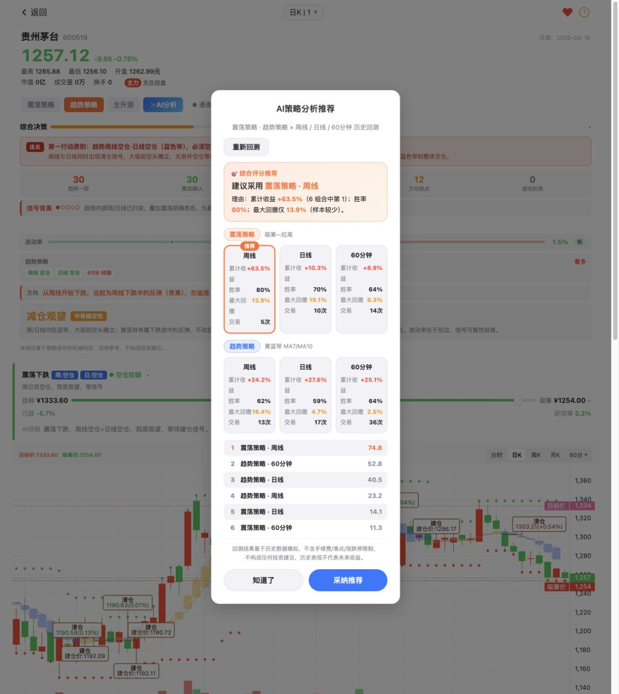
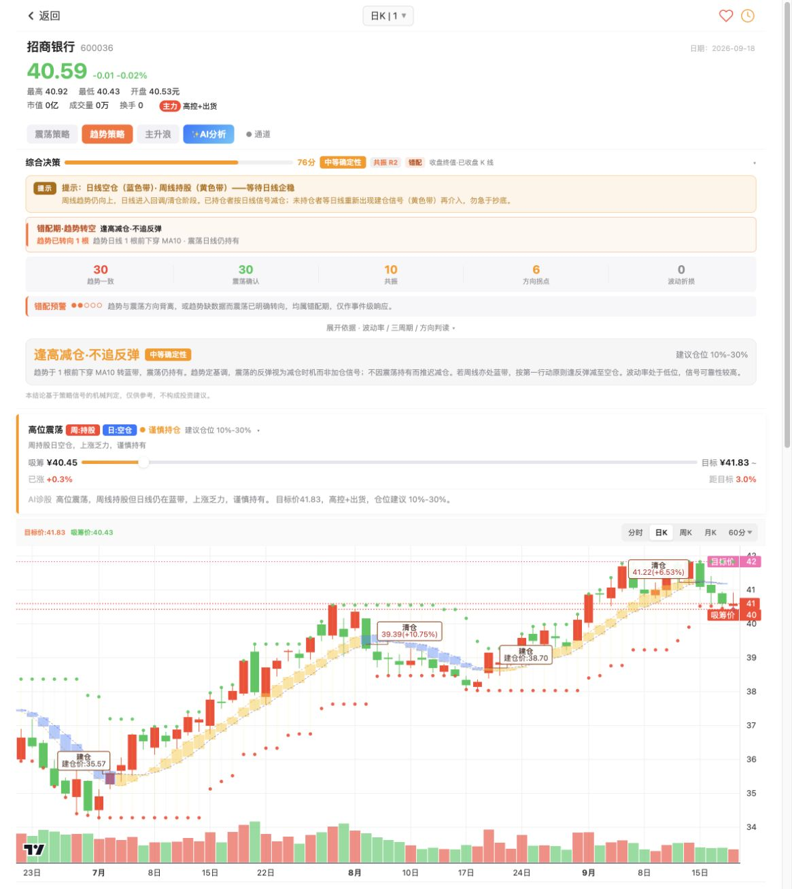
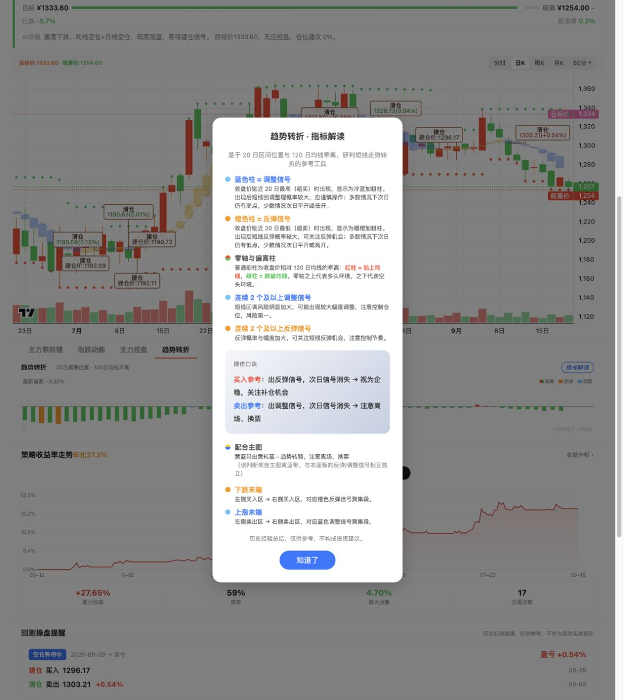

# 牛哇最新算法与 AI 分析审计

核对日期：2026-09-18（北京时间，收盘后）。归一代码基线：`4c01d2e551649a46cbbb0696218077b6686b23fd`。
本文件是资料包的**当前差异入口**；[复刻手册](REPLICATION_MANUAL.md)保留历史算法、截图和研究结果，
[9月9～10日逐值验证](../newow-current-review.md)保留其冻结证据。不是新公式批准、发布或 Runtime 验收。

## 1. 先回答：是否已经全部实现？

**没有。三大策略主骨架已有，旧版多数公开指标已有；新版详情页的推荐、综合解释及新增副图尚未完整实现。**
不能给一个“全部完成百分比”：代码存在、旧版逐值通过、新版页面一致、期货可用和收益有效是五个不同分母。

- 趋势／震荡／主升浪：3/3 有策略内核、产品适配和参考交易链；不等于最新版本全标的逐 Bar parity。
- 正式产品能力仍为 `1d`；`1w/60m` 有实现和部分候选证据，**未正式开放**。
- 旧综合解释纯函数和前端组件存在，但 explanation section 因跨周期输入未开放而关闭；最新 CDV2 规则未实现。
- 新发现的明确缺项：顶部六组合 AI 推荐、趋势转折副图；不是现有五窗口比较器和涨跌动能的改名。
- 杯柄原始私有筛选式未识别；现有 clean-room 候选不能算原式复刻。私有选股、股票财务平台仍退出主线。

以上产品边界直接核对 `product_release.py`：`OPEN_FREQUENCIES=(DAILY,)`，开放 chart、auxiliary、reference、comparator，
explanation 为 `NEWOW_CROSS_FREQUENCY_INPUTS_NOT_OPEN`。候选 capability 不是正式发布证据。
[STATUS](../../../STATUS.md)记录的60品种×3策略180/180是既定历史截点首次加载，不是本次重新生产审计。

## 2. 怎么采集、哪些结论可以相信

本轮在用户已打开的内部浏览器查看首页，随后打开公开详情，展开 AI 推荐、综合决策、依据、AI诊股、趋势转折说明。
首页标题 **v3.3.25**，详情标题和资源参数 **v3.3.46**；不能把首页版本当详情版本。
完成样本覆盖消费股贵州茅台、银行股招商银行；它们不是用户持仓证据。
随后打开上证指数，但等待最终结果时浏览器超时，工具读回电脑锁屏；指数不计入本次完成样本，也没有为继续采集绕过锁屏。

另用匿名 HTTPS GET 保存浏览器实际引用的公开 HTML/JS，做静态控制流检查；不读取 Cookie、凭据、localStorage、
私有服务端代码，不执行下载脚本，不抓取用户自选列表。没有点击“采纳推荐”、购买、订阅或发起真实交易。

| 证据 | 出处／采集动作 | 能证明什么 | 不能证明什么 |
|---|---|---|---|
| 最新页面 | [茅台](https://www.v8848.cn/stock_detail.html?code=600519.SH&period=day&strategy=huanglantai)、[招商](https://www.v8848.cn/stock_detail.html?code=600036.SH&period=day&strategy=huanglantai) | 收盘后实际可见推荐、分项、文案 | 请求原子性、全量K线输入、真实成交 |
| AI推荐源码 | 详情 `scoreCombos / fetchKlineForAI / computeAiRecommendation / runOscBacktest / runTrendBacktest` | 当前推荐调用链及完整评分式 | 服务端行情质量、各样本精确重放 |
| 综合内核 | [composite-decision-v2.js](https://www.v8848.cn/composite-decision-v2.js?v=3.3.46) | CDV2 1.2.0规则；哈希与9月10日冻结记录完全相同 | 新版适配器、异步时序也完全相同 |
| 新副图 | 点击趋势转折→指标解读；[公开内核](https://www.v8848.cn/js/trend-reversal-core.js?v=3.3.46) | WR20/MA120公式和可见说明对应 | “次日反弹概率大”等经验描述得到统计证实 |
| 项目核对 | Quant Core、API release capability、Web组件、定向测试 | 已有代码合同和明确缺口 | 已发布、实际可交易、OOS盈利 |

源码原件仅保留在本机 Git 外 `/private/tmp/newow-public-audit-20260918-Is7Ek2/`；临时目录可能被清理。
Git 保留本审计、采样截图和[哈希登记](evidence/latest-audit-20260918.json)，不打包第三方整页源码或行情数据库。
截图是公开个股页面，没有账户／资金信息。页面日期标为2026-09-18，不据此推定所有周期末根均已完成。

## 3. 策略和算法逐项对照

“已有”均指代码，不包含任意品种、任意周期、任意数据条件下都可用。下列代码文件位于
[`packages/quant-core/guiyi_quant/newow`](../../../packages/quant-core/guiyi_quant/newow)。
历史精确公式及参数详见手册；本表补齐身份、现状和最新差异，不覆盖历史版本。

| 项目 | 已确认原始算法／行为 | 归一实现与期货差异 | 当前结论 |
|---|---|---|---|
| 趋势黄蓝带 | `T=(H+L+C)/3`；部分窗口MA7、MA10；`C>=MA10(T)`黄；颜色切换产生Marker，参考价MA10(T) | `trend_band.py` page_v2、`product_adapters.py`；completed输入和物理owner隔离 | 已有；本轮公开源码主式仍一致，未重跑新版全量golden |
| 趋势初始清仓 | 黄→蓝即画CLEAR；缺历史BUY时利润、持有根数为空 | adapter已有`INITIAL_CLEAR_NO_ENTRY`；可画信号但不能虚构CLOSED交易 | 已有；旧手册“必须先有BUILD才能显示CLEAR”须分层理解 |
| S跑／D1–D3 | MA3(RSV10)、MA120、四位算术；D1下穿95且高价MA5偏离>0.3；D2下穿93、30根振幅>10%、MA120前今比>0.997；D3前值>90形成峰后回落且C低于下降的MA120 | `escape_d123.py` page_v2；风险标记不暗改主策略 | 已有旧版逐值证据；最新边界未重新穷举 |
| 4／7／11 | 60根极值结构建立最近高／低锚，按锚龄生成4、7、11提示；不是周期到时必涨必跌 | `magic11.py`；换owner／中断不借用旧锚 | 已有；精确初始化、平局规则以既有公式及测试为准 |
| 震荡主策略 | 当前根参与HHV10/LLV10，触下沿建、触上沿清，参考价LOW/HIGH | `oscillation_channel.py`；保留先CLEAR再BUILD同根重建 | 已有但与新版图表不同；owner已接受，非待修缺陷 |
| 震荡突破评分 | 量比、实体比、穿透比各0～2；总分≥4“真突破” | 同上；`confirm_score=0`不冒充后续确认逻辑 | 初始评分已有；后续突破线确认不算已完整复刻 |
| 主升浪 | MA35(T)≥MA45(T)为黄，否则蓝；参考价MA45(T) | `main_rise.py`；与趋势同样区分状态、信号、参考交易 | 已有；9月9日限定60m快照通过，不外推所有最新版输入 |
| 主升浪J风险 | RSV9；K、D各0.5递推；J=3K−2D；高位加速后回落给REDUCE提示 | `main_rise.py`；不生成真实减仓手数 | 已有；J提示不等于仓位模型 |
| D4–D6 | MA3(RSV20)与MA120偏离；D4前值<30后反弹且C>MA120；D5前值<7、偏离<−0.1；D6上穿5、偏离<−0.3；标记价L×0.99 | `main_rise.py`；低于当根低点的标记价不得成为Fill | 已有旧版证据 |
| 目标／吸筹 | HHV/LLV与日周状态选择；当前周线覆盖；可选昨收0.5～2倍guard | `target_absorb_display.py`、`trend_channel_display.py`已存在；同owner、明确输入，缺证据不激活 | 不是未实现；昨收来源和真实激活仍需分Gate |
| 五窗口比较器 | N=10/20/24/30/52；页面理论回测排序 | `page_comparator.py`已存在，owner分段适配；不改active参数 | 已有受控版本；不是下面六组合AI推荐 |
| 主力控盘 | EMA9(EMA9(C))相邻千分变化，结合EMA50和斜率映射状态 | `subplots.py`；价格代理，不是持仓席位或真实资金事实 | 已有；新版页面日/60m与周/月取源方式仍有差异待查 |
| 主力照妖镜 | 页面回看曲线含5%反转确认／Zig型重绘 | `subplots.py`，`repainting=true`，不进入正式信号 | 已有回看身份；禁入因果交易是必要适配 |
| 涨跌动能 | MA3(RSV10)、(MA5(C)−MA120(C))/MA120(C)等低位修复解释 | `subplots.py`；按有效物理序列计算 | 已有；不是WR20趋势转折 |
| 波动率 | 最近最多20个TR的**简单均值**除末收盘；不是Wilder ATR递推；百分数四舍五入1位后<2/<4分档 | `calculate_composite_volatility`已有同族公式及owner/前缀校验 | 算术已有；最新扣分用途尚未移植 |
| 旧综合／第一行动／周日矩阵 | 旧13格、四项评分、60/85封顶、周日4×4模板 | `composite_explanation.py`已有；缺跨频输入时unavailable | 历史实现存在，不能称新版CDV2已实现 |
| 新综合决策CDV2 | R0–R4、MM1–MM4、信号计龄、五项+额外扣分、双轴仓位 | 项目仍为旧规则，无上述新字段合同 | 明确未实现；见第5节 |
| 顶部AI分析 | 两策略×三周期历史回测排名，确定性公式 | 项目无`scoreCombos`等对应推荐链；五窗口比较器不能替代 | 明确未实现；见第4节 |
| 趋势转折副图 | WR20位置+MA120乖离，阈值3/97 | 当前Newow Core/API/Web无对应模块／面板 | 新增未实现；见第6节 |
| 杯柄 | 公开形态思想可见，原站私有筛选细则未知 | `cup_handle.py`有ATR确认pivot和witness的clean-room候选 | 自有候选已有；原公式`UNKNOWN / OUT_OF_SCOPE` |

原始算法可完整登记的仅限公开可核验部分；未知公式不为满足“完整”而补猜。
不把“期货适配可接受”扩大解释为可任意改原始公式、成本或仓位语义。

## 4. 顶部“✨AI分析”：其实是六组合历史排名

### 4.1 实际调用链

```text
点击AI分析
→ 周 / 日 / 60min K线（先读页面缓存，缺失再GET /api/kline）
→ 每周期计算震荡与趋势回测（不含主升浪）
→ summary：累计收益、胜率、最大回撤、交易数
→ scoreCombos 相对评分
→ 模板渲染推荐理由和六组合排名
→ “采纳推荐”仅切策略与周期（本轮未点击）
```

公开调用路径未出现LLM请求。不能据此断言牛哇其他服务从不用大模型；这里只确认该按钮的决策来自前端规则。
加载提示说“并行”，实际`computeAiRecommendation`按周期循环，缓存缺失时逐次`await`；文案不是执行证据。

缓存缺失时周／日／60m请求起点分别硬编码为`2024-06-01`、`2025-09-01`、`2026-04-01`，结束为当日UTC日期。
缓存命中则沿用已有数组，未强制同窗口／completed截止。少于11根跳过；超时／无效响应降为null。
这不是六条同长度、同截止、同执行条件的严谨实验设计。

### 4.2 原始评分式（v0.2）

先剔除交易数<3的组合；在剩余集合分别做min-max，最大值=最小值时分母取1（该列全得0）：

```text
u = cumReturn
q = log1p(max(0, maxDrawdown>0 ? cumReturn/maxDrawdown : (cumReturn>0 ? 999 : 0)))
w = accuracy
raw = 0.40*minmax(u) + 0.35*minmax(q) + 0.25*minmax(w)
penalty = 1.00 if trades>=10 else 0.85
score = round4(raw*penalty)          # 页面再乘100显示1位小数
best = score降序，再按交易数降序
```

胜率输入已取整；收益、回撤summary已保留2位。只有一个有效组合时三列min-max均0，仍可被选为best。
所有组合亏损时也没有“全部淘汰”硬门槛；分数仅是当次候选间排名，不是赚钱概率。
推荐理由把“6组合中第1”固定写在累计收益旁，但best按加权score选，**并不保证累计收益也是第一**。
best的同分规则用交易数，渲染rank列表只按score；极端平分场景须单独验证，不能从普通截图推断完全一致。

### 4.3 原始回测口径与期货需要修改的地方

- 从index=9开始。趋势在蓝黄翻转时按MA10(T)参考价；震荡按当根LOW/HIGH，先清后建，可同根重建。
- 单笔百分比简单相加；持有期曲线=已闭合收益和+相对入场的浮盈。回撤=该百分比曲线峰值−当前值（百分点），不是账户权益比例回撤。
- 末根仍持仓用末收盘价`forceClose=true`计入交易数、胜率、累计；不含手续费、滑点、涨跌停。
- 无OOS分割、无参数冻结和换月执行模型。所谓Calmar项实际用累计收益/上述回撤，不是标准年化Calmar。

期货若保留对照，应新建独立page-parity推荐身份，明确`executable=false`；不可覆写现有closed-only ReferenceStatistics。
可信研究另用同一比较区间、completed和strict-before、物理合约、下一可执行时刻、历史成本及涨跌停，
并在训练段选择、OOS段冻结。日周60m数据不同齐时明确缺项，不用默认0或另一周期补齐。
“采纳”只能改变研究视图，不自动改active策略或Runtime Scope。这里是后续设计建议，不是本轮已实现。

### 4.4 两只股票的实际结果

以下是不同请求时刻的页面显示值，均非同输入离线重放；不反推未舍入价，不作为期货收益证明。

| 样本／组合 | 累计% | 胜率% | 回撤显示% | 交易数 | 排名分 |
|---|---:|---:|---:|---:|---:|
| 茅台 震荡周 | 63.5 | 80 | 13.9 | 5 | 74.8（推荐） |
| 茅台 震荡日 | 10.3 | 70 | 19.1 | 10 | 14.1 |
| 茅台 震荡60m | 8.9 | 64 | 8.3 | 14 | 11.3 |
| 茅台 趋势周 | 24.2 | 62 | 16.4 | 13 | 23.2 |
| 茅台 趋势日 | 27.6 | 59 | 4.7 | 17 | 40.5 |
| 茅台 趋势60m | 25.1 | 64 | 2.5 | 36 | 52.8 |
| 招商 震荡周 | 45.0 | 100 | 10.0 | 4 | 63.7 |
| 招商 震荡日 | 15.7 | 80 | 9.5 | 10 | 23.2 |
| 招商 震荡60m | 10.0 | 80 | 9.5 | 15 | 13.4 |
| 招商 趋势周 | 52.4 | 80 | 7.7 | 10 | 76.3（推荐） |
| 招商 趋势日 | 32.1 | 74 | 3.3 | 19 | 59.4 |
| 招商 趋势60m | 27.0 | 57 | 1.8 | 35 | 51.1 |



[招商推荐截图](screenshots/20260918/600036-ai-recommendation.png)。两个样本推荐不同，表明不是每只股票同一固定答案；
但推荐历史表现好仍不证明未来有效。

## 5. “AI诊股”与综合决策：规则事实→模板，不是顶部推荐

### 5.1 诊股文本来源

详情源码存在三条可核对路径：

1. batch返回`analysisText/ai_text`时可优先采用；服务端如何生成这一字段仍未知。
2. 没有后端文本时，`buildStockData`由batch信号、周日4×4 `TREND_AI_MATRIX`、目标、控盘状态构造文本。
3. 震荡卡片使用`AI_ADVICE_MATRIX`：周／日／60m各`holding/cleared/idle`共27组合；
   `computeAiAdvice`查表并可追加末期回测持有成本／浮盈。它不等同于真实账户持仓。

`renderAI`还追加场景说明；`syncAiPositionText`把文本中的仓位建议替换为综合决策统一输出，
同步源文本与可见`cardAiText`，避免下一次渲染覆盖。综合结果未就绪时保留旧模板值；`posCap=0`的公共
`posText`为空也会no-op，不能笼统声称所有分支永远同步。切换周期时作废旧composite结果，随后重新渲染。
本轮确认代码路径，不宣称异步失败／全部策略切换已通过验收。

所以旧手册“AI文本均为私有、无法解释”过于笼统：**大量分支模板公开可读；后端文本来源和逐字等价仍未知。**
归一应保留确定性facts、规则token、版本、输入截止和来源；若日后加LLM，它只整理文字，不能改评分、仓位或交易事实。

### 5.2 新综合规则与当前项目差异

新版CDV2公开内核SHA与9月10日记录完全一致，本轮没有发现该内核新算法改版；变化包含外围诊股仓位同步和新副图。
其核心管线为6路状态归一化→趋势交叉计龄→错配MM→共振R→评分→仓位→动作模板。

| 新规则 | 公开算法 | 当前项目 |
|---|---|---|
| 趋势明确性 | 周／日／60m各12/12/6，向上或向下都算明确 | 旧版偏多贡献，不等价 |
| 震荡明确性 | 周／日／60m各10/12/8 | 旧版偏持有贡献，不等价 |
| 共振 | R4/R3/R2/R1/R0加20/14/10/4/0 | 旧alignment20/10/0，不等价 |
| 方向 | 三周期同向20；两明确同向12；分歧6；仅周明确8 | 旧3/5/10/20，不等价 |
| 波动折损 | 低/中/高为0/−3/−8 | 旧波动率仅解释，不等价 |
| 额外扣分 | J减仓−5；care/tent各−3，但当前页面后二者固定false | 新`certExtra`未实现；原站UI只显示前五项 |
| 计龄 | `barCount−1−lastSignal.index`，信号当根为0；未知不能当0 | 新MM计龄缺失 |
| 错配 | MM3/4：新鲜下/上穿≤2根优先；MM1/2：震荡先转向≥3根，另受方向约束 | MM1–4缺失 |
| 共振仓位上限 | R4/R3/R2/R1/R0为100/60/30/10/0 | 无这套新双轴模型 |
| 确定性仓位上限 | 分数≥80/60/40/其余为100/50/30/0；与共振轴取小 | 旧矩阵区间，非同合同 |

错配及neutral两项豁免可把确定性轴下限抬至30%；非豁免bearish归零；低分覆盖层另有例外。
这套百分比是股票解释建议，不是期货保证金占比、风险预算或下单手数，移植时必须标明`reference_exposure`含义。
总分=`clamp(五项+certExtra,0,100)`，不是上涨概率；高分也可能是明确空头。
期货新版必须公开额外扣分或显式禁用，不能留下“看见五项相加不等于总分”的隐藏因素。

### 5.3 可见实例及原站自身的表述风险

- 茅台：趋势周空／日空／60m持，震荡周已清／日持／60m持；30+30+4+12+0=76，R1。
  综合提示减仓防御，AI诊股仓位0%。R1固定文案却说“趋势内部周/日打架”；实际周日同空，
  此例来自趋势与震荡两轴反向分支。**固定说明不总能精确描述命中的分支**，不能照抄成facts。
- 招商：30+30+10+6+0=76，R2、趋势转空1根，符合MM3可见描述；综合、状态卡与AI诊股均显示10%–30%。
  这只证明该实例同步，不代表所有异步路径；未冻结其batch/K线，MM3为源码规则与可见描述的对应，不是原始输入逐值重放。



[茅台综合分项截图](screenshots/20260918/600519-composite.png)。

## 6. 新增“趋势转折”：可以公开复算的独立副图

当前公开内核`NW_TREND_REVERSAL.CORE_VERSION=1.0.0`：

```text
H20 = HHV(H,20); L20 = LLV(L,20)
WR1 = 100*(H20−C)/(H20−L20)
WR2 = 100*(H20−H)/(H20−L20)       # 返回序列，非主信号判据
Bias = (C / mean(C,120) − 1)*100
Rebound = Bias if WR1>97 else 0  # 橙柱
Adjust = Bias if WR1<3 else 0    # 蓝柱
```

等于3或97不触发。HHV=LLV分母退化时WR取50；当前close无效则本根主要输出null。
展示窗口不足120时按有效close数量均值仍画图，但`enough=(barCount>=120)`；这不是120根全有效质量证明。
源码跳过窗口坏值，期货正式链不能照搬为“缺Bar也可算”：应遵循项目缺价中断、重新warm-up及owner合同。
内核另有末尾连续信号计数（最多60），属于公开副图的连续性说明；本轮不扩建其股票选股服务。

弹层说“信号出现后次日消失”“连续两次更强”等是经验解释，不是已验证的新BUILD/CLEAR规则。
可作为独立auxiliary facts／面板候选，不应替换现有D1–D6、主升浪或趋势信号。



## 7. 其余功能缺口及建议先后

| 优先 | 差距 | 已有基础／最小下一步 | 不做的扩张 |
|---|---|---|---|
| 1 | 新综合决策、诊股解释和仓位同源 | 在已有context/facts上冻结新版本合同；明确certExtra、缺周期、计龄、方向和仓位语义，再实现 | 不让解释成为隐藏交易Gate |
| 2 | WR20趋势转折 | 增加独立纯函数、边界/prefix测试和副图；保留公开原式与期货质量适配对照 | 不把经验口诀直接变订单 |
| 3 | 六组合AI推荐 | 先固定6组同一截止的完整输入及summary，闭合评分golden；独立page身份与causal实验 | 不拿五窗口比较器冒充，不自动晋升策略 |
| 前置依赖 | 周线／60m与跨频解释正式可用性 | 继续既有逐品种数据→策略→页面→发布Gate；本轮不重新开数据修复主线 | 不以候选预览替代正式开放 |
| 后续 | 参考收益曲线、年化、回撤、快捷窗口／理论值 | 已有ReferenceTrade及closed-only摘要；新统计口径需单独冻结 | 不覆盖参考收益／因果收益／账户收益边界 |
| 后续 | 多周期嵌套路径、成本、目标及预测区 | 已有多周期上下文，没有该路径图；需要逐层来源与时间身份证据 | 不把预测线或止损图例当已成交／确定未来 |
| 后续 | 盘中预览、确认提示和Newow提醒 | 正式completed主链保留；preview独立身份；通知按新合同与授权 | 不硬编码股票14:30，不直接启用Alert/Runtime |
| 不纳入 | CANSLIM、私有选股／排名、股票基本面和全市场筛选、AI文本逐字复制 | 记录菜单与未知边界，参考其思想即可 | 不建设完整A股平台，不伪称私有公式还原 |

页面图形、公式代码、参考交易和期货执行适配应继续分开验收。最新公开算法能登记不意味着已经实现；
实现存在也不能替代股票golden、期货数据质量或OOS。现有`research_backtest.py`和`research_walk_forward.py`
已经有因果研究／固定公式Walk-forward能力，不能再写成“完全没有回测”；同样也不能写成所有策略已有效。
旧27组成本矩阵和较差结果保持原证据身份，本轮不重新运行、不改变结论。

## 8. 本次验证与限制

本轮只改文档及采样图片，不改公式、正式API、Canonical、生产配置、Scope、通知、main/tag或Runtime。
定向验证使用隔离工作树源码、已有Python环境；第一组 **247 passed、1 skipped**，覆盖趋势、主升浪、
D1–D3、magic11、副图、旧综合、窗口比较器、目标/吸筹及参考统计；第二组震荡、产品适配、参考交易 **101 passed**。
合计 **348 passed、1 skipped**（未重复计入为解释skip单独重跑的26项）。跳过项不算通过，详见哈希登记的测试记录。
源码4份和截图5张SHA-256回读一致；当前入口／手册／README共67个本地引用存在，secret scan无发现，`git diff --check`通过。
这些测试验证项目现有合同，不是v3.3.46新功能的实现验收。

明确未完成：最新版全输入逐值golden、全标的/全周期UI覆盖、AI六组合未舍入summary重放、后端文本来源、
最新异步切换全路径、趋势转折期货增量价值。原站说明中的盈利/概率断言仅作为页面内容，不背书。
下一项建议只做**新版综合解释合同设计**，同时明确它与诊股模板、顶部排名的三个身份；不直接改正式策略。
