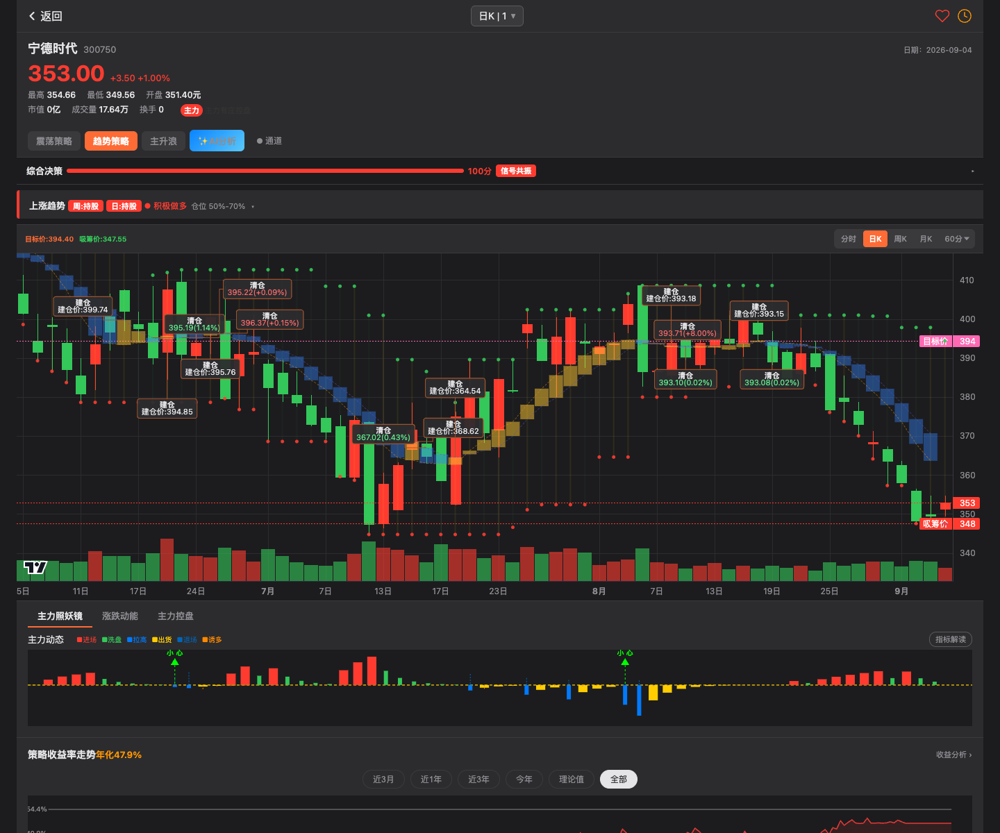
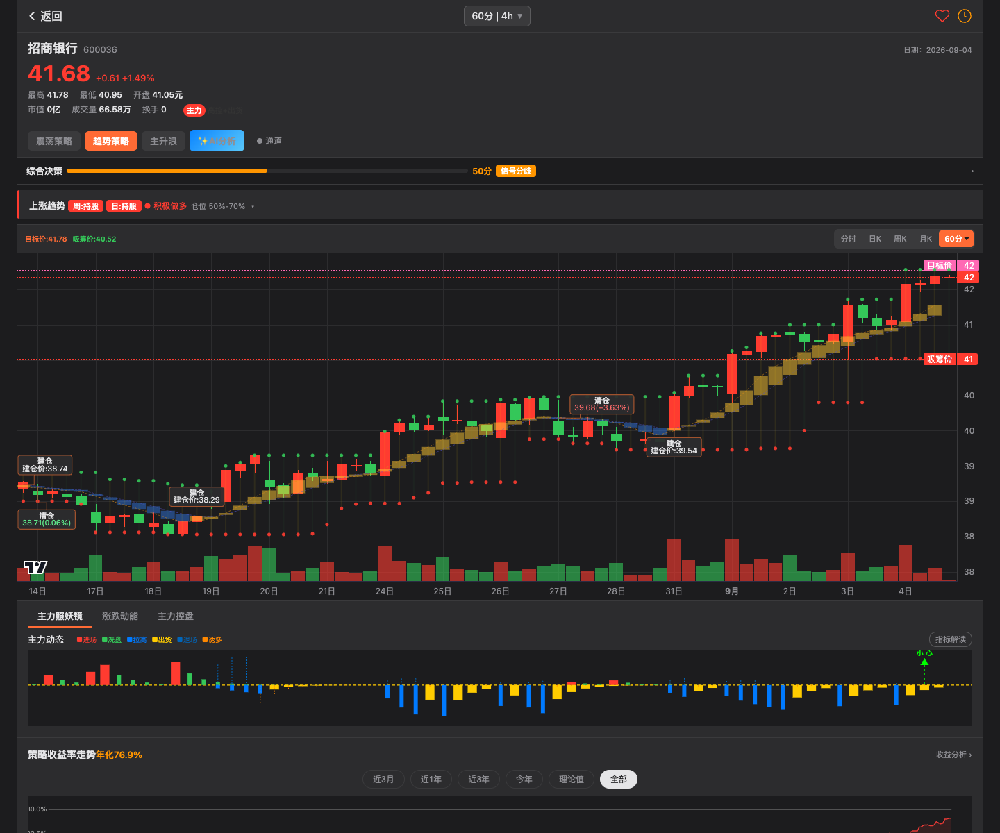
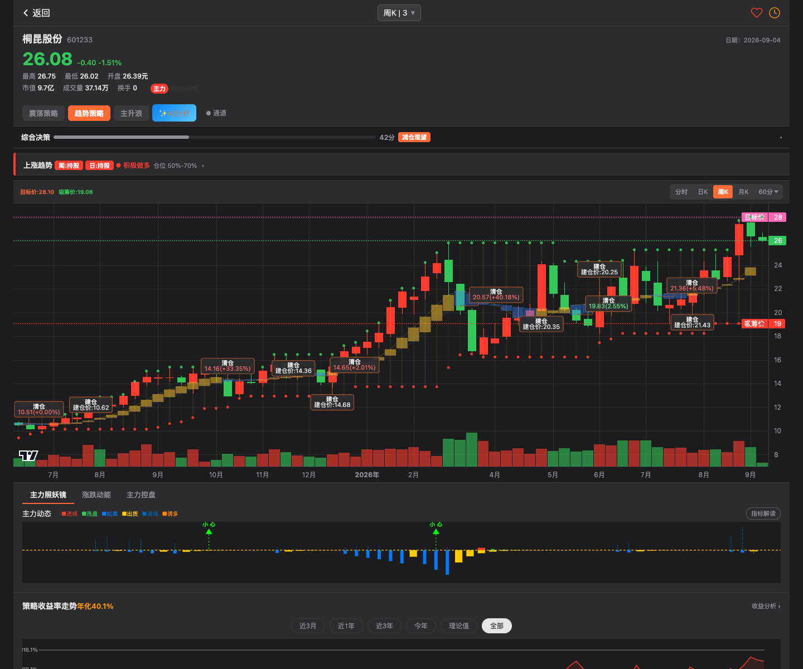
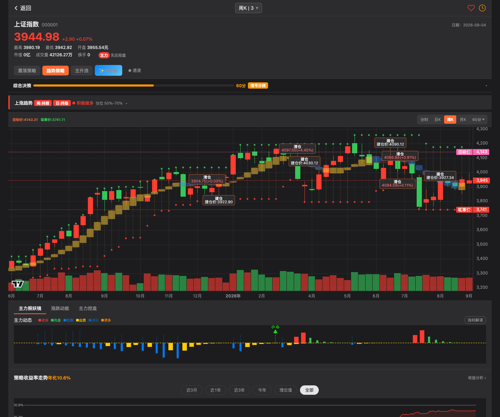

# 归一量化｜牛哇策略复刻手册

版本：Newow v3.2.82 研究基线 / 2026-09-05
定位：公开可验证策略的 clean-room 复刻、股票页面一致性证据与期货迁移说明
边界：研究观察；不是交易建议；不是模拟成交；不是实盘成交

> 这不是牛哇原手册的复制品，而是归一量化基于公开页面、页面响应、代码实现、测试与只读期货证据整理的复刻手册。原手册只作为方向性材料。精确公式以仓库保留代码为准；页面逐 Bar 与 OOS 的第三方独立复算仍需要未随 GitHub 包分发的本地完整证据。

<!-- PDF_PAGE -->

## 01｜先说结论：我们复刻的到底是什么

牛哇更像一套“分层读盘与行动解释系统”，不是一个能包打天下的神奇指标：

```text
趋势带定阶段
→ 震荡通道定节奏与位置
→ 周线定方向、日线定阶段、60 分定节奏
→ D1–D6、4/7/11、主升浪与副图解释机会和风险
→ 综合决策给出行动、确定性、仓位区间和第一原则
```

研究现场已经完成公开可证部分的公式复刻，并用 3 个指数、6 只股票、3 个周期完成页面逐值比对，再用 rb/sc/m 三类期货验证迁移合同。当前 `develop` 仍保留趋势、S/D、4/7/11、震荡、主升浪、杯柄、副图与因果回测内核；目标/吸筹显示选择、参数比较、综合决策等以冻结 parity 证据存在，尚未作为 active 产品重新接入。

尚未完成的是产品闭环：ReferenceTrade、详情页接入、完整可重放 OOS 冻结包和周线执行合同。六种私有服务端选股公式不再反推，永久保持 `UNKNOWN / OUT_OF_SCOPE`，除非未来出现新的公开、合法、可验证规格。

<!-- PDF_PAGE -->

## 02｜证据等级：一句话后面必须站着什么

| 标签 | 含义 | 可以声称 | 不可以声称 |
|---|---|---|---|
| OBSERVED | 页面直接看到 | UI 有该状态/字段 | 已知道精确算法 |
| MANUAL | 手册描述 | 产品思路与使用方法 | 当前 v3.2.82 精确实现 |
| PAGE-PARITY | 页面源码/响应可重放 | 给定输入可复现页面输出 | 可真实成交或可盈利 |
| CLEAN-ROOM | 我们透明设计 | 公式可解释、可测试 | 等同牛哇私有原公式 |
| CAUSAL | 严格时序研究 | 无同 Bar 偷看、含成本合同 | 已通过 OOS 或可实盘 |
| UNKNOWN | 证据不足 | 明确未知 | 用猜测补齐 |

采集来源包括匿名页面 GET、页面自身 K 线与批量接口的只读响应、股票截图矩阵、仓库实现与测试，以及经单次授权读取的期货 Catalog、MainContractMap 与 Canonical 摘要。每层证据单独登记，避免用手册文案覆盖页面事实，或用页面事实冒充因果研究。

<!-- PDF_PAGE -->

## 03｜采集方法：这个功能是怎么被看见和复算的

1. 先记录页面版本、URL、截图时间和页面结构。
2. 对每个功能保存观察对象：标的、周期、可见状态、marker、目标/吸筹价、综合决策字段。
3. 对页面自己的只读响应保存字节数与 SHA-256；不把 Cookie、Token、私有账号状态写入证据。
4. 在离线环境用候选公式逐 Bar 重算；只有输出逐值相等才提升为 page-parity。
5. 对控制流做可达性枚举，区分“表里写了”与“运行时真的能走到”。
6. 期货迁移不复用股票连续序列假设，而是逐 Bar 绑定物理合约与 `segment_id`。

浏览器标签可见不等于页面可交互。2026-09-04 的内置页与 Chrome 控制均发生 30 秒超时，因此后续结论使用已冻结响应和截图，不把超时会话补写成成功采集。

<!-- PDF_PAGE -->

## 04｜股票证据矩阵：不只看指数

页面一致性覆盖 9 个不同性质的标的：

| 类型 | 标的 |
|---|---|
| 指数 | 上证指数、深证成指、创业板指 |
| 制造/消费 | 格力电器、比亚迪、贵州茅台 |
| 成长/周期/金融 | 宁德时代、桐昆股份、招商银行 |

每个标的分别采集 `week / day / 60min`，形成 27 个独立页面点。这样可以同时观察大盘与个股、高波动与低波动、趋势段与震荡段，避免把指数上的偶然一致当成通用公式。

18 类 feature 进入比较；其中通道、显示选择、五窗口排名、综合决策、方向/仓位、确定性、波动率和第一行动等 16 类均为 `27/27 matched`，总 mismatch 为 0。AI 文案与诊断 token 没有稳定机器合同，各为 27 个 unavailable。

<!-- PDF_PAGE -->

## 05｜四层事实：最容易混淆，也最必须分开

```text
策略状态             BUILD / HOLD / REDUCE / CLEAR / FLAT
页面参考交易         Marker 配对、零费用、零滑点、乐观参考收益
模拟账户交易         PaperOrderIntent → PaperFill → PaperPosition → PaperPnL
真实账户交易         BrokerOrder → BrokerFill → BrokerPosition
```

本手册当前只覆盖前两层的设计与第三层之前的因果研究。策略看到 `BUILD`，不代表已经买入；页面出现“建仓价”，也不代表任何账户在该价格成交。

归一后续页面必须同时容纳四种独立口径：牛哇页面参考收益、归一因果研究收益、模型账户净收益、真实账户收益。任何两个口径都不能共用模糊的“收益率”字段。

<!-- PDF_PAGE -->

## 06｜双身份：page-parity 与 causal-research

| 项目 | page-parity | causal-research |
|---|---|---|
| 目的 | 复现页面公式与展示 | 判断期货可执行价值 |
| 信号输入 | 页面确认口径 | completed Bar、strict-before |
| 成交 | 页面参考价/同 Bar 逻辑可保留 | 下一可执行时点、物理合约 |
| 成本 | 可为 0 | 手续费、tick、滑点、涨跌停 |
| 换月 | 页面可不表达 | 显式处理或 fail-closed |
| 标识 | `page_parity=true` | `page_parity=false` |
| 可执行性 | `executable=false` | 仍需 OOS/Shadow Gate |

两个身份必须拥有不同的 `formula_version`、`reference_model_version` 与研究报告。可信研究不能偷偷修改页面一致性结果；页面好看的收益也不能替代成本后的因果结果。

<!-- PDF_PAGE -->

## 07｜趋势策略：黄蓝带的核心思想

观察上，黄色代表进入可参与阶段，蓝色代表退出或回避阶段。复刻身份为 `newow_trend_band_page_v2`。

页面版使用典型价：

```text
T[t] = (Close[t] + High[t] + Low[t]) / 3
A[t] = 最近最多 7 根 T 的均值
B[t] = 最近最多 10 根 T 的均值
Yellow 当 Close[t] >= B[t]，否则 Blue
```

`A` 用于快带展示，`B` 是慢带与参考 marker 价格。状态由 Blue 切到 Yellow 产生 BUILD；由 Yellow 切到 Blue 且存在同一段 BUILD 时产生 CLEAR。它是阶段切换器，不是预测下一根涨跌的分类器。

<!-- PDF_PAGE -->

## 08｜趋势策略：状态机与参考交易语义

```text
UNAVAILABLE ──warm-up──▶ YELLOW / BLUE
BLUE ──Close >= B──▶ YELLOW + BUILD
YELLOW ──Close < B──▶ BLUE + CLEAR
YELLOW ──继续满足──▶ HOLD
BLUE ──继续满足──▶ FLAT
```

实现保存 `previous_state`、最近 BUILD 的 marker 身份与参考价。CLEAR 必须关联稳定的 BUILD marker，不能用“往回找最近一次建仓”这种模糊逻辑。

期货中一旦 `physical_contract` 或 `segment_id` 改变，递归窗口与持有状态重置。原因很直接：新主力合约不是旧合约价格序列的无缝延续，不能把合成主连的跨合约跳跃当成策略波动，也不能把旧合约的 BUILD 与新合约的 CLEAR 配成一笔交易。

<!-- PDF_PAGE -->

## 09｜趋势截图：个股日线怎样作为证据



这张截图用于证明页面在一个具体个股与日线周期上的布局、趋势带、marker 和解释字段。公式结论不从“看起来像某均线”得出，而是把截图对应的页面输入交给候选公式逐 Bar 重算，再比较页面输出。

同一公式还在指数、银行、消费、周期制造等标的以及周线/60 分钟上重复验证。截图是采集现场证据；逐值结果才是公式一致性证据。

<!-- PDF_PAGE -->

## 10｜S 跑与 D1–D3：它们是风险分级，不是三个卖点

复刻身份为 `newow_escape_d123_page_v2`。核心变量是 10 周期 RSV 的短均值 `VAR4`、MA120 与近 30 根振幅。页面版保留四位显示算术。

| 标记 | 页面含义 | 主要触发结构 |
|---|---|---|
| D1 / ★S逃命 | 极端风险 | VAR4 下穿 95，且 `(MA(High,5)-MA120)/MA120 > 0.3` |
| D2 / ★S逃 | 高位转弱 | VAR4 下穿 93，30 根振幅 > 10%，`MA120_prev/MA120 > 0.997` |
| D3 / ★S跑 | 空头确认 | 前值 VAR4 > 90 且形成局部峰值后回落；Close < MA120 且 MA120 下降 |

三者输出 `severity`、触发阈值、MA120、斜率、振幅和公式身份。它们优先用于风险解释和减仓提示；未经独立验证，不应直接覆盖趋势主状态。

<!-- PDF_PAGE -->

## 11｜D4–D6：低位阶段的建仓观察标记

在主升浪组合中，D4–D6 使用 20 周期位置变量 `VAR41` 与 MA120 偏离 `VAR31`：

| 标记 | 透明触发摘要 | 页面参考价 |
|---|---|---|
| D4 | Close > MA120；前值低于 30；VAR41 掉头向上 | Low × 0.99 |
| D5 | 前值低于 7；VAR41 掉头向上；VAR31 < -0.1 | Low × 0.99 |
| D6 | 前值 ≤ 5，当前上穿 5；VAR31 < -0.3 | Low × 0.99 |

这些是“极弱后修复”的形态标签，不等于真实限价单。尤其在期货里，`Low × 0.99` 只是页面参考价；真实成交需要按 tick 对齐、检查下一时点价格、涨跌停、成交量与物理合约。

<!-- PDF_PAGE -->

## 12｜4、7、11 周期：从局部极值开始计龄

复刻身份为 `newow_magic11_page_v1`。算法在最长 60 根窗口中确认新的局部高/低点，并从最近锚点开始计龄：

| 锚点 | 第 4 根 | 第 7 根 | 第 11 根 |
|---|---|---|---|
| 低点锚 | 4高 | 7低 | 11变 |
| 高点锚 | 4低 | 7高 | 11变 |

当高低锚同时存在时使用年龄更小的最近锚。超过 12 根后周期失活。它更像“结构时间提示器”，提醒使用者检查第 4、7、11 根附近的节奏变化，而不是单独的 BUILD/CLEAR 引擎。

期货换月必须重新计龄，否则跨合约的极值会污染锚点。

<!-- PDF_PAGE -->

## 13｜震荡策略：HHV/LLV10 通道

复刻身份：`newow_hhv_llv_channel_page_v1` 与 `newow_oscillation_hhv_llv10_page_v1`。

```text
Upper[t] = HHV(High, 10)
Lower[t] = LLV(Low, 10)
Width[t] = Upper[t] - Lower[t]
Position[t] = (Close[t] - Lower[t]) / Width[t]
```

只有累计 10 根后才进入正式判断。未持有且当根 Low 触达 Lower，产生 BUILD；已持有且当根 High 触达 Upper，产生 CLEAR。

注意同 Bar 规则：代码先检查 CLEAR，再检查 BUILD。因此若一根 K 线同时触及上下沿且此前持有，它可以先清仓、再建仓，最终状态仍为 holding。这是页面一致性语义，因果执行必须另行判断同一根 Bar 内先后顺序不可知的问题。



<!-- PDF_PAGE -->

## 14｜震荡突破评分：量、实体与穿透

每次通道信号都计算三个 0–2 分项，总分 0–6：

| 分项 | 1 分 | 2 分 |
|---|---:|---:|
| 量比 `Volume / AvgVolume10` | ≥ 1.0 | ≥ 1.5 |
| 实体比 `abs(C-O)/(H-L)` | > 0.3 | > 0.6 |
| 穿透比 | > 1% | > 3% |

总分 ≥ 4 显示“真突破”，否则显示“假突破”。评分用于解释信号质量，当前实现中的 `confirm_score` 为 0，不能被误写成独立确认算法。

对于期货，高/低点触边信号必须先成为 completed-Bar intent，下一可执行 Bar 才能尝试成交。页面同 Bar 的 `High` 或 `Low` 是参考标记价格，不是可得成交价。

<!-- PDF_PAGE -->

## 15｜目标价与吸筹价：位置系统，而非预测系统

基础公式与震荡通道相同：

```text
target_N[t] = HHV(High, N)
absorb_N[t] = LLV(Low, N)
默认 N = 10
```

研究证据身份 `newow_target_absorb_display_selection_page_v2` 再依据当前视图和周/日趋势信号选择日通道或周通道，并相对昨收将显示值约束在 `[0.5, 2]` 倍。周线视图还有优先采用当前周线 HHV/LLV 的覆盖规则。该身份已完成冻结输入上的 parity，但当前 `develop` 没有把它保留为 active Quant Core 入口；产品化时需要依据证据重新落实现与测试。

正确理解：目标价是“当前公开窗口中的上沿参照”，吸筹价是“下沿参照”。它们会随新 Bar 滚动，不应被描述成基本面估值或保证到达的未来价格。

<!-- PDF_PAGE -->

## 16｜参数比较器：页面版为何看起来很聪明

页面比较固定窗口 `10 / 20 / 24 / 30 / 52`：对每个 N 生成通道信号，按页面口径配对，并比较收益、回撤、交易数、胜率与期末持仓，最后排序。

证据包中的页面身份 `newow_hhv_llv_window_optimizer_page_v1` 的关键假设是：

- 同 Bar close 作为参考成交；
- 手续费与滑点为 0；
- 单笔收益相加；
- 样本结束时强制平仓。

这适合复刻“页面为什么选了这个参数”，不适合证明参数未来有效。固定窗口本身也是候选集合的一部分，不能在 OOS 期回头选最赚钱窗口。

<!-- PDF_PAGE -->

## 17｜可信参数比较器：必须改掉什么

可信研究设计 `newow_hhv_llv_window_optimizer_causal_v1` 采用不同身份；它在当前 `develop` 不是 active 模块，重新实现时必须满足：

1. 仅 completed Bar 产生 intent；
2. 只能在下一根可执行 Bar 的 open 尝试成交；
3. 价格按 tick 对齐；
4. 加入历史手续费和滑点；
5. 检查涨跌停、零成交与物理合约；
6. 样本末不伪造平仓；
7. 参数只在训练段选，测试段冻结；
8. 换月中断要显式记录。

结果会比页面更差，但更可信。一个参数若只在零成本、同 Bar 成交和期末强平下领先，它是页面展示赢家，不是可晋升研究候选。

<!-- PDF_PAGE -->

## 18｜主升浪：MA35/MA45 才是主骨架

复刻身份 `newow_main_rise_ma35_ma45_page_v1`。先对 `JJ=(Close+High+Low)/3` 计算移动均值：

```text
MA35 = MA(JJ, 35)
MA45 = MA(JJ, 45)
Yellow / BUILD  当 MA35 >= MA45
Blue / CLEAR    当 MA35 < MA45
```

状态切换参考价使用 MA45。BUILD 后保存参考价和持有 Bars；CLEAR 时计算页面参考变化。主升浪不是只有这一条交叉：页面还叠加 J 风险、D1–D6 与 11 周期，让“趋势主状态”和“阶段风险”同时可见。

期货实现按物理合约 segment 重置 MA、J、D 与持有状态，避免用合成主连跨跳造成假交叉。



<!-- PDF_PAGE -->

## 19｜主升浪 J 风险：加速后的回落提示

先在 9 周期高低区间中计算位置值，再用 0.5 权重递推 K、D：

```text
RSV9 = (Close - LLV9) / (HHV9 - LLV9) × 100
K = 0.5 × RSV9 + 0.5 × K_prev
D = 0.5 × K + 0.5 × D_prev
J = 3K - 2D
```

当 J > 80 且高于最近最多 7 个 J，记作高位加速背景；随后 J 明确回落，且上一根处于该背景、不是刚刚 CLEAR，产生减仓风险信号，参考价为当根 High。

这不是完整的仓位模型。当前输出是 `reduce_signal`，未来若让它改变目标仓位，必须创建独立的 `decision_policy_version`，不能静默改变主升浪公式身份。

<!-- PDF_PAGE -->

## 20｜主升浪组合：一条主线，四组解释

| 层 | 作用 | 当前身份 |
|---|---|---|
| MA35/MA45 | 主趋势 BUILD/CLEAR | `newow_main_rise_ma35_ma45_page_v1` |
| J risk | 高位加速后的回落 | `newow_main_rise_j_reduce_page_v1` |
| D1–D3 | 逃顶/转弱分级 | `newow_escape_d123_page_v2` |
| D4–D6 | 低位修复提示 | `newow_buy_d456_page_v1` |
| 4/7/11 | 结构计龄 | `newow_magic11_page_v1` |

组合原则是“主状态负责持有方向，辅助指标负责解释阶段”。如果把每个辅助标记都变成独立买卖，会导致同一 Bar 出现互相冲突的订单语义。归一当前只在 Quant Core 输出可机器验证的 facts，不自动晋升为真实仓位。

<!-- PDF_PAGE -->

## 21｜杯柄：这是归一的 clean-room 候选

牛哇页面能证明杯柄概念和展示，但不能唯一确定私有筛选公式。归一实现 `newow_cup_handle_v1`，明确 `page_parity=false`。

它使用 completed D1 Bar、Wilder ATR14 和确认后的 pivot，识别左杯沿—杯底—右杯沿—柄部—突破。默认范围包括：杯体 25–90 根、深度 10%–50%、柄 5–15 根、柄深不超过 15%，并检查前趋势、U 形纯度、左右腿比例、成交量结构与突破缓冲。

状态包括 FORMING、READY、BREAKOUT、WEAKENED、INVALIDATED、EXPIRED。READY 会冻结 witness：pivot、确认时间、分数组成、成交量事实、profile identity 与 hash，保证之后可以重放“当时为什么认为它准备完成”。

<!-- PDF_PAGE -->

## 22｜杯柄为什么必须等待确认

局部高低点在当下并不天然确定；如果用未来几根 K 线回头标记拐点，就会重绘。归一采用 ATR 反转阈值确认 pivot，并把 `pivot_at` 与 `confirmed_at` 分开。

```text
形态发生时间 pivot_at
≠ 市场已经提供足够证据的 confirmed_at
≠ 可以尝试成交的 effective_after
```

正式 marker 只能在 `confirmed_at` 之后出现。期货中还必须检查确认发生时 owner 是否仍是同一物理合约；换月会终止候选，不允许把旧合约左杯沿与新合约右杯沿拼成一只“漂亮的杯子”。

该候选当前适合研究和可视化，不应冒充牛哇私有 `cup_handle` 服务端选股公式。

<!-- PDF_PAGE -->

## 23｜主力控盘：把价格平滑变化变成状态语言

复刻身份 `newow_main_force_control_page_v1`：对 Close 做两次 EMA9，计算相邻平滑值的千分变化 `kongpan`，再结合 EMA50 与变化方向映射状态：

- 无庄控盘；
- 开始控盘；
- 有庄控盘；
- 高度控盘；
- 主力出货；
- 高控 + 出货。

这是价格行为的解释性标签，并不证明真实机构持仓或资金流。期货迁移时应把“主力”理解为趋势强弱的页面术语，不应与期货主力合约、持仓排名或席位数据混为一谈。

它当前属于解释层；未经增量价值检验，不参与 BUILD/CLEAR 的隐藏 Gate。

<!-- PDF_PAGE -->

## 24｜主力照妖镜：复刻了页面，也明确禁止晋升

`newow_zhaoyao_mirror_repainting_page_v1` 复刻页面的进场、洗盘、出货、拉升、离场、诱多等曲线，并显式标记：

```text
repainting = true
formal_signal_eligible = false
```

其中峰值/警示依赖后续 5% 反转确认，历史图形会随未来数据变化。它可以帮助回看一段行情如何形成，但不能进入正式信号、OOS 交易或 Runtime Alert。

正确产品做法是：在页面上显示“回看解释/会重绘”徽标；如果未来要研究其前瞻价值，应只使用当时可见 prefix 产生的新身份，而不是拿最终回绘图做回测。

<!-- PDF_PAGE -->

## 25｜涨跌动能：超买超卖的解释层

复刻身份 `newow_up_down_energy_page_v1`。主要变量包括：

```text
VAR4 = 10 周期位置值的 3 根均值
VAR3 = (MA5 - MA120) / MA120
```

页面式标记关注 VAR4 从极低位置回升，并用价格相对 MA120、VAR3 偏离程度区分通道内反弹、深度超卖和趋势带进入。

它与 D4–D6 使用相似的“低位位置 + 趋势偏离”语言，所以更适合作为解释 facts，而不是再建立一套重复的买卖状态机。期货上应按 segment 重算，并对短 segment 返回 unavailable，而不是跨合约借 warm-up 后继续假装同一行情。

<!-- PDF_PAGE -->

## 26｜综合决策：把多周期翻译成人能执行的语言

综合决策输入包括周/日/60 分趋势状态、三周期震荡状态和风险解释。核心思想：

```text
周线：方向边界
日线：当前阶段
60 分：操作节奏
震荡：所处位置
```

输出不是一个裸分数，而是行动 token、方向、仓位区间、确定性拆分、风险 token 与第一行动原则。冻结研究身份为 `newow_composite_decision_page_v3_2_82`；当前 `develop` 未把它保留为 active 决策模块。

归一保留页面控制流原样以实现 parity；任何逻辑修正必须另建 `newow_composite_decision_cleanroom_v1`，不能在原身份上“顺手修好”。



<!-- PDF_PAGE -->

## 27｜13 格矩阵：其中 3 格在页面控制流中不可达

13 个键由趋势 bias 与震荡 bias 组合。可达的趋势类包括 bullish、bearish、cautious、neutral；页面还声明了 warning 三格。

枚举控制流发现：当输入是“周线空、日线多”时，页面先命中周线 bearish 分支，之后才检查 warning，所以：

```text
warning-bullish
warning-bearish
warning-neutral
```

三格均不可达，实际会落到对应的 bearish-*。

页面一致模式必须保留这个缺陷；clean-room 修正版可以改变分支顺序，但必须使用新公式身份并重新做回归、OOS 与解释一致性验证。

<!-- PDF_PAGE -->

## 28｜确定性评分：分数从哪里来

页面确定性由四块组成：

| 分项 | 上限 | 含义 |
|---|---:|---|
| 趋势 | 30 | 多周期趋势是否清楚 |
| 震荡 | 30 | 通道状态是否明确 |
| 一致性 | 20 | 大小周期是否共振 |
| 方向 | 20 | 最终方向是否明确 |

总分理论上 100。出现趋势/震荡冲突时总分 cap 为 60；中性状态 cap 为 85。分数表示“输入之间的一致程度”，不是胜率、上涨概率或模型置信区间。

27 个页面点的总分与各分项均在冻结证据中逐值匹配。重新产品化时要先恢复确定性规则和 golden tests；若改变权重或引入新 factor，必须创建新 `decision_policy_version`，不能继续使用页面身份。

<!-- PDF_PAGE -->

## 29｜波动率：ATR20 / Close 只改变解释

```text
volatility = ATR(20) / Close
```

页面将其分档，用于说明风险大小、止损空间和仓位谨慎程度。当前复刻中它不修改 13 格矩阵，也不偷偷提高或降低 BUILD/CLEAR 门槛。

这是一个很重要的产品边界：波动率可以解释“同样的方向为何需要不同风险预算”，但风险预算属于后续 Risk Domain。策略公式、解释层与风险模型必须各自版本化。

期货上 ATR 是点数波动，转换成资金风险还需要合约乘数、tick、保证金与止损距离；只用 ATR/Close 不能直接得出手数。

<!-- PDF_PAGE -->

## 30｜周日 4×4 矩阵：方向优先于节奏

| 周 \ 日 | buy | hold | sell | wait |
|---|---|---|---|---|
| buy | 上涨启动 70–100% | 震荡上涨 50–70% | 趋势回调 30–50% | 筑底反弹 10–20% |
| hold | 上涨中继 50–70% | 上涨趋势 50–70% | 高位震荡 30–50% | 高位震荡 30–50% |
| sell | 震荡反弹 10–20% | 震荡反弹 10–20% | 下跌趋势 0% | 震荡下跌 0% |
| wait | 筑底反转 0% | 筑底反弹 10–20% | 震荡下跌 0% | 震荡下跌 0% |

这些仓位百分比是页面决策解释，不是归一账户的目标手数。未来 `StrategyDecision → TargetPosition → RiskDecision` 会把它们转成透明、幂等、可审核的目标暴露；在那之前页面只能显示“参考仓位区间”。

<!-- PDF_PAGE -->

## 31｜第一行动原则：先处理最危险的矛盾

第一行动不是再算一个总分，而是从当前 facts 中挑出最应该先做的检查：例如大周期空头、小周期反弹、趋势与震荡冲突、波动率过高、已出现 S 跑等。

27 个页面点中的 `first_action_level` 与 `first_action_rule` 在冻结证据中均为 27/27 matched。产品化应输出稳定 token，而不是只输出自然语言，这让 Web、测试与后续通知能够复用同一事实。

AI 可以把 token 翻译成更自然的说明，但不能改变 token、策略状态或仓位。确定性链路应保持：

```text
固定 Bar → 固定公式 → 固定 facts/token → 可选 AI 文案
```

<!-- PDF_PAGE -->

## 32｜AI 诊股：复刻结构，不逐字复制

页面存在历史 A–E 月/周/日模板，也存在当前周日 4×4 输出。归一只保留可机器验证的输入分支与输出 token：趋势状态、震荡状态、目标/吸筹区间、确定性、波动率和第一行动。

AI 自然语言文案具有私有模板或服务端行为，当前 27 个案例均标记 `unavailable`。因此正确实现是：

1. Quant Core 生成 deterministic facts；
2. 规则层生成稳定 explanation token；
3. 可选 AI 只负责改写语气与串联上下文；
4. 保存 facts、token、模板版本与文本 hash；
5. AI 文本不得直接改变正式目标仓位。

<!-- PDF_PAGE -->

## 33｜六种私有选股：现在明确停止反推

以下 page-exact 服务端公式均保持 `UNKNOWN / OUT_OF_SCOPE`：

```text
trend_build
mainrise_build
cup_handle
daily_buy
weekly_buy
oscillation_build
```

公开页面只能证明策略 ID、请求结构、返回字段和当日集合，不能唯一证明服务端如何筛选。用一个 clean-room 条件得到相似股票，不等于复刻了原公式。

归一未来若要对 60 个期货品种排序，将建设自己的 `OpportunityRanker` 与 `PortfolioAllocator`：透明、版本化、可解释、可 OOS 验证。它们不是牛哇选股复刻，也不需要扩建 A 股全市场与基本面平台。

<!-- PDF_PAGE -->

## 34｜期货迁移：真正改变的是数据与执行合同

股票页面可在一个证券代码的连续价格序列上展示；期货必须处理主力变化：

```text
RQData
→ Canonical Parquet
→ Catalog + 全局 MainContractMap
→ MarketDataService actual_dominant 查询
→ 每根 Bar 审核 physical_contract / segment_id
→ Quant Core
```

`actual_dominant` 只是查询模式，不是可成交合约。信号可以在主力拼接视图上计算，但 Fill 必须绑定真实 `physical_contract`、合约乘数、tick、手续费、交易时段与涨跌停事实。

任何缺口、owner 冲突或换月歧义都应显式失败，不能静默换一份数据或跨频回退。

<!-- PDF_PAGE -->

## 35｜SC2302 反例：全局分段不等于每周期都有 Bar

SC2302 的权威主力段为 `2023-01-03…2023-01-04`：

| 周期 | SC2302 在该段实际拥有的 Bar |
|---|---:|
| 1d | 2 |
| 60m | 16 |
| 1w | 0 |

W1 第一根于 2023-01-06 结束，此时 owner 已经是 SC2303。因此必须区分：

```text
全局 MainContractMap：谁在何日是 rank-1 的权威分段
周期 owner 子集：该周期实际返回的 Bar 分别属于谁
```

正确合同逐 Bar 对照全局分段审核 owner，但不要求每个周期都拥有与全局分段完全相同的 segment 集合。这个真实反例已经变成回归合同。

<!-- PDF_PAGE -->

## 36｜期货覆盖：黑色、能化、农产品三类

| 品种 | 经济组 | 1d Bars | 1w Bars | 60m Bars | 分段 / 换月 |
|---|---|---:|---:|---:|---:|
| rb | 黑色 | 484 | 101 | 3,362 | 7 / 6 |
| sc | 能化 | 484 | 101 | 5,246 | 25 / 24 |
| m | 农产品 | 484 | 101 | 3,362 | 7 / 6 |

9 条序列均通过读取与 owner 合同验证。选择这三类不是为了证明策略在全市场有效，而是覆盖不同交易时段、波动结构、合约乘数和换月密度。

sc 的 25 段/24 次换月明显高于 rb/m，因此更容易暴露跨合约状态污染和周线 owner 子集错误。迁移验证的价值首先是找到错误合同，其次才是看收益。

<!-- PDF_PAGE -->

## 37｜27 组 OOS：矩阵怎样组成

```text
3 品种（rb / sc / m）
× 3 周期（1d / 1w / 60m）
× 3 策略（trend / oscillation / main_rise）
= 27 个独立单元
```

每个可运行单元再比较 baseline、双手续费、双滑点。公式参数冻结，没有在 OOS 结果出来后反向调参。

18 个日线/60 分单元 passed；9 个周线单元 fail-closed，原因统一为 `NEWOW_WEEKLY_EXECUTION_LIMIT_CONTRACT_INSUFFICIENT`。passed 表示合同运行完成，不表示赚钱、稳健或允许晋升。

<!-- PDF_PAGE -->

## 38｜OOS 基线结果：真实结论并不好看

| 品种/周期 | Trend | Oscillation | Main rise |
|---|---:|---:|---:|
| rb 1d | -16.59% | -4.24% | 0.00%* |
| rb 60m | -8.45% | -8.67% | -2.54% |
| sc 1d | -18.87% | +9.11% | 0.00%* |
| sc 60m | -20.65% | +2.24% | -13.59% |
| m 1d | -2.76% | -10.11% | 0.00%* |
| m 60m | -19.41% | -8.29% | +1.11% |

`*` 0.00% 来自没有闭合交易，并不等于无风险或稳定收益。大多数单元为负；少数为正也不足以证明可交易。尤其 sc 60m 震荡在双滑点下由 +2.24% 变成 -0.86%，说明结果对执行成本敏感。

<!-- PDF_PAGE -->

## 39｜为什么周线必须阻塞

周 K 的 High/Low 覆盖整周，但策略在周线完成后产生 intent，下一次执行发生在下一交易日开盘。判断这次开盘是否被涨跌停锁住，需要“下一执行日”的日级 limit 事实。

如果拿周首或周末某一天的 limit 去包住整周 OHLC，会把正常周内波动误判为越界；如果完全删除 limit 校验，又会把不可成交的开盘当成成交。两种都不可信。

因此 9 个周线单元保持：

```text
DATA_INSUFFICIENT / EXECUTION_FACTS_MISSING
NEWOW_WEEKLY_EXECUTION_LIMIT_CONTRACT_INSUFFICIENT
```

解决方向是建立周信号到下一执行日 limit 的权威关联合同，而不是放宽断言。

<!-- PDF_PAGE -->

## 40｜落地路线：从手册到个人期货闭环

当前完成：趋势/震荡/主升浪等研究内核、股票 27 点页面一致性证据、三类期货 owner/换月验证、18 个成本 OOS 运行结果、证据与版本身份。目标/综合决策等部分能力是“证据已冻结、active 实现待恢复”；稳定 Market Web 尚未展示 Newow。

下一阶段按顺序推进：

1. `Strategy Frame / Marker → ReferenceTradeProjector`，严格配对 BUILD/CLEAR；
2. 在 Newow 详情页同时展示 OPEN/CLOSED/ROLLOVER_INTERRUPTED；
3. 冻结完整 Canonical 输入与无数据库重放脚本；
4. 补齐周线 next-execution-day limit 合同，再跑 9 个 blocked 单元；
5. 独立 Review 后才评估 60 品种观察与推送；
6. 再进入 StrategyDecision、TargetPosition、风险与 Paper；
7. Shadow、Broker Read-only、人工确认与受控自动交易分别经过独立人工 Gate。

本阶段不新增 Alert、Runtime、Scope、通知、订单、Ledger 或生产数据写入。

<!-- PDF_PAGE -->

## 附录 A｜实现身份速查

| 模块 | 公式身份 | 类型 | 当前形态 |
|---|---|---|---|
| 趋势带 | `newow_trend_band_page_v2` | page-parity | source retained |
| S/D1–D3 | `newow_escape_d123_page_v2` | page-parity | source retained |
| D4–D6 | `newow_buy_d456_page_v1` | page-parity | source retained |
| 4/7/11 | `newow_magic11_page_v1` | page-parity | source retained |
| 震荡 | `newow_oscillation_hhv_llv10_page_v1` | page-parity | source retained |
| 主升浪 | `newow_main_rise_ma35_ma45_page_v1` | page-parity | source retained |
| J 风险 | `newow_main_rise_j_reduce_page_v1` | page-parity | source retained |
| 杯柄 | `newow_cup_handle_v1` | clean-room | source retained |
| 控盘 | `newow_main_force_control_page_v1` | explanation | source retained |
| 照妖镜 | `newow_zhaoyao_mirror_repainting_page_v1` | repainting only | source retained |
| 涨跌动能 | `newow_up_down_energy_page_v1` | explanation | source retained |
| 目标/综合决策 | v3.2.82 parity identities | evidence snapshot | active restore pending |
| 因果回测 | `newow_causal_next_open_costed_v1` | research | source retained |

<!-- PDF_PAGE -->

## 附录 B｜逐策略复刻卡：主策略

| 模块 | 怎么采集 | 当前实现入口 | 期货修改与效果 |
|---|---|---|---|
| 趋势带 | 27 个页面点逐 Bar 比对带状态与 marker | `step_trend_band` / `TrendBandStateValue` | segment 重置；OOS 多数为负 |
| S/D1–D3 | 页面 marker、说明与输入序列重算 | `step_escape_d123` / `EscapeState` | completed-only；当前只作风险解释 |
| D4–D6 | 主升浪页低位 marker 逐值核对 | `_buy_markers` / `MainRiseState` | Low×0.99 仅参考价；未独立做交易 OOS |
| 4/7/11 | 页面极值锚与第 4/7/11 根核对 | `step_magic11` / `Magic11State` | 换月重新计龄；当前是解释层 |
| 震荡 | HHV/LLV、同 Bar 状态与评分重放 | `step_oscillation` / `OscillationState` | 下一 Bar 执行；sc 正值对滑点敏感 |
| 主升浪/J | MA35/45、J、D 与周期标记组合核对 | `step_main_rise` / `MainRiseState` | 合约段重置；交易少且多数不佳 |
| 杯柄 | 页面概念 + 手册方向，无法取得私有筛选式 | `step_cup_handle` / `CupHandleStateValue` | clean-room、确认后可见；未冒充 page-exact |

<!-- PDF_PAGE -->

## 附录 C｜逐策略复刻卡：解释与决策

| 模块 | 怎么采集 | 当前实现/证据 | 期货修改与效果 |
|---|---|---|---|
| 目标/吸筹 | 27 点比较 HHV/LLV 与显示选择 | parity evidence；active restore pending | 位置参考；不预测未来价 |
| 参数比较 | 5 窗口排名、收益、回撤、胜率比对 | evidence snapshot；active restore pending | 必须 next-open + cost；尚待恢复 |
| 主力控盘 | 副图状态与页面脚本重算 | `calculate_main_force_control` | 只解释价格强弱，不代表席位资金 |
| 照妖镜 | 复刻峰值与警示控制流 | `calculate_zhaoyao_mirror` | repainting；禁止进入正式信号/OOS |
| 涨跌动能 | VAR4/VAR3 与低位标记比对 | `calculate_up_down_energy` | segment 重算；短段 unavailable |
| 综合决策 | 枚举 13 键并对 27 个页面点逐值比较 | parity evidence；3 warning 键不可达 | active restore pending；不是仓位事实 |
| AI 诊股 | 保存模板分支与文本 hash | facts/token 设计；自然语言 unavailable | AI 只改写，不改变状态或仓位 |
| 私有选股 | 只读请求与当日返回集合 | `UNKNOWN / OUT_OF_SCOPE` | 不迁移；自建透明 OpportunityRanker |

<!-- PDF_PAGE -->

## 附录 D｜验收、限制与证据入口

页面一致性：27 cases；16 个可比较 feature 全部 27/27 matched；0 mismatch。
期货迁移：rb/sc/m × 1d/1w/60m，9/9 series 通过。
OOS：18 passed，9 weekly blocked；不支持盈利或策略晋升结论。
完整本地证据 manifest SHA-256：

```text
279aa0c3a88b6e6c5413387a57085dfe4c4d23a34befa751d95ced4c03be962f
```

仓库入口：`REPORT.md`、`evidence/core-page-parity-results.json`、`evidence/composite-reachability.json`、`evidence/ai-template-evidence.json`、`evidence/futures-validation-summary.json`、`evidence/oos-cost-stress-matrix.json`。

GitHub 包不包含牛哇完整 HTML/JS/原始响应、股票逐 Bar 输入、RQData/Canonical 原始快照或原 PDF。第三方截图若公开分发，仍应由仓库所有者确认授权。
