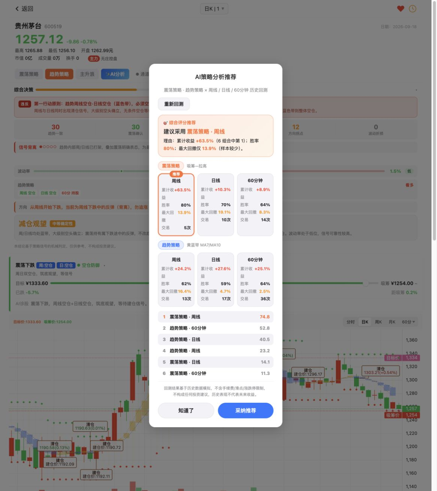
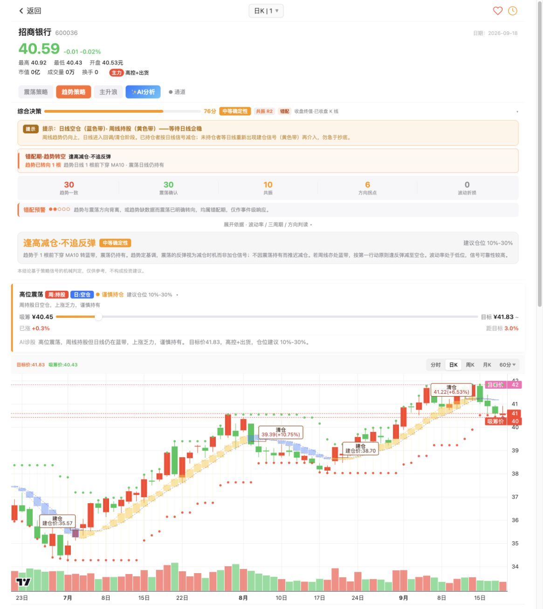

# 归一量化｜牛哇策略复刻手册

版本：2026-10-09 整合版；公开来源核对至详情 v3.3.79，首页 v3.3.72
定位：完整公开公式、页面展示规则、归一实现对照与期货研究边界
边界：研究观察；page-parity 不代表因果可执行、账户收益或策略晋升

本文件是唯一手册正文。目录名沿用历史资料位置，不代表当前原站版本。原式以冻结公开来源及哈希为依据；本次不重新访问原站。公式段内的 HTML/CDV2 行号依其标注的来源日期解释，不能跨快照混用。

## 阅读导航

- [实现与证据状态](#implementation)：最新 develop 已落地内容及尚缺证据。
- [公开来源身份](#sources)：版本、来源哈希、采样与复算边界。
- [完整公式与页面规则](#formulas)：三策略、S/D/J/4-7-11、融合、收益、四实验、CDV2/XP1/basis、副图、形态与路径。
- [视觉与交互](#presentation)：显示默认值、状态卡、进度和请求身份。
- [期货适配与历史研究](#futures)：四层事实、因果合同、历史 OOS 与执行不足。
- [固定样本与验证限制](#witnesses)：不同日期的原始见证，不将旧差异当作当前缺项。
- [证据与分发](#evidence)：原件、截图、机器证据与分发约束。

<a id="implementation"></a>

## 最新实现与证据状态

核对代码基线：develop `349837805fe9f610662dd9346b5738c174957dd9`。这是本次文档整理的代码对照，不是重新完成全市场或全像素验收。持续发布、Runtime 与待验收状态只在 [STATUS](../../../STATUS.md) 维护；文档中的历史运行身份不覆盖该入口。

| 主题 | develop 实现事实 | 验收限制与交付依据 |
|---|---|---|
| 三主策略、融合 Marker、普通/理论收益 | P0 主图与独立页面收益投影已修正；详情/reference 身份 v4、页面投影 v2 | [P0交付](../../tasks/newow-p0-current-20261009.md)；旧参考资产不证明新版本，60m 预览仍可 NOT_BUILT |
| XP1、周/日 basis | 独立冲突输出与统一动作/立场/进度来源已实现；旧评分及策略信号不变 | [P1交付](../../tasks/newow-p1-basis-20261009.md)；融合主导与cutoff不一致时不可用 |
| 七类公开回看形态 | 原式重实现、最佳候选、绘制/清除与Worker取消已实现 | [P2交付](../../tasks/newow-p2-20261009.md)；page-parity/repainting/non-executable；不改变正式信号 |
| W1/D1/60m路径 | 独立成本、目标与完成Bar现价来源已实现，版本v2 | 缺成本不连完整线；目标为期货HHV10适配，不冒充原站私有batch价格 |
| 震荡ZLGJ及独立J、默认照妖镜 | 已实现，与主升浪J分别管理身份 | 不替换震荡BUILD/CLEAR；完整同输入验收仍按具体来源与样本判断 |
| CDV2、六组合分析、普通/理论/持有曲线、目标/吸筹与状态摘要 | 已有产品入口与对应实现 | 不能沿用早期“尚未实现”；来源缺失、warm-up及逐值/视觉覆盖不足保持显式 |
| 四个震荡测试 | 完整公开规则已登记，归一尚未实现 | 不能用普通震荡、基础ideal曲线或跨周期震荡桶冒充四实验 |
| 私有选股、私有价格/排名与逐字AI诊股 | UNKNOWN / OUT_OF_SCOPE 或 EVIDENCE_REQUIRED | 不反推、不推测，不用自有候选冒充原式 |

P0/P1/P2 的代码完成与历史验证分别见交付记录；本次没有构建资产、发布或切换 Runtime。最新实现保留 `newow_period_conflict_v3379_v1`、`newow_basis_decision_v3379_v1`、`newow_public_patterns_v3379_v1`、`guiyi_daily_weekly_path_v2` 各自身份，不覆盖旧冻结验证。

<a id="sources"></a>

## 公开来源身份与证明范围
<a id="s-b2bb50cf2b"></a>

## 9月26日公式来源：详情v3.3.59

来源口径：9月26日详情v3.3.59；本节HTML行号绑定该日冻结快照。

主线程通过浏览器确认公开详情页，再匿名获取该页实际引用的资源。原件留在 Git 外
`/tmp/newow-public-audit-20260926/`；临时目录可能被系统清理。
下文 `HTML:Lx–Ly` 指该快照的 `stock_detail.html` 行号；其他文件同理。
远端 URL 是来源入口，不能保证将来仍返回相同字节，应同时核对 SHA-256。

| 来源 | 公开 URL | 当前 SHA-256 | 与 2026-09-18 冻结记录比较 |
|---|---|---|---|
| 详情 HTML | [stock_detail.html](https://www.v8848.cn/stock_detail.html?code=688702.SH) | `b12da74d89a7ac304d7479999d11f13ab53ced834a8472f937d78a0c1bd03709` | 不同；旧为 `4c44ae93ab5d66c361a787f94954ca170daa7e31ecb5e04a19400f51912fdf0f` |
| 目标／吸筹辅助 | [strategy-calc.js](https://www.v8848.cn/strategy-calc.js?v=3.3.59) | `a91f3a7685e0dadb95927229c45b7ecffeee052d1269b79207ccb9fa08612a9e` | 不同；旧为 `bb9e630aa322464a535ccf4951a9c4728bff40e101bdb2a35dddc5d602536fbd` |
| 综合决策 | [composite-decision-v2.js](https://www.v8848.cn/composite-decision-v2.js?v=3.3.59) | `68c634c05bddc7191de884a37ae5c8877dfd8416a43e53d93c66838ea8585fbb` | **字节相同**，内部版本仍 `1.2.0` |
| 建清仓内核 | [position_kernel.js](https://www.v8848.cn/position_kernel.js?v=1.0.0) | `31e133d5288ed2b9f89ec084384871e5907afb8cb30acc2cee6629ee882e754d` | 本轮新增登记；不能据此推定首次上线日期 |
| 趋势转折 | [trend-reversal-core.js](https://www.v8848.cn/js/trend-reversal-core.js?v=3.3.59) | `85a72b64ca9b9a84ee04338cfffeb28b67dfae923699498a80eb71a22faf6f80` | **字节相同**，内部版本仍 `1.0.0` |

HTML 第 1 行给出 `APP_VERSION=3.3.59`、`MESSAGE_TEMPLATE_VERSION=1.1.0`、`CONTRACT_VERSION=1.0.0`。
资源查询串、文件内部版本、首页标题、嵌入选股页版本必须分别记录。`strategy-calc.js` 内部仍打印
`v1.1.0`，但文件中已有 v3.3.59 的目标升级缓冲，不能仅凭内部版本判断是否变化。

本轮不执行下载的脚本，不读取凭据或浏览器存储。源码中的“与后端一致”“无未来函数”等注释是待核对声明，
以实际表达式、控制流和调用路径为准。静态确认不等于页面每个异步分支、异常分支和所有标的都已复现。

<a id="s-a961f6fa50"></a>

## 10月8～9日公式来源：详情v3.3.79

匿名读取网站公开文件，没有读取登录数据、浏览器存储或私有接口。详情页版本与首页版本分别记录，不能统称同一个版本。

| 来源 | URL | SHA-256 | 本次用途 |
|---|---|---|---|
| 详情 v3.3.79 | [stock_detail.html](https://www.v8848.cn/stock_detail.html?code=601958.SH&period=week&strategy=huanglantai) | `3c1d600a1bd59dc8d8edfe46dd0cdfa1b44dbd9e7124a20d509426eb1d66973d` | 策略、普通/理论收益、融合和窗口规则 |
| 首页 v3.3.72 | [index.html](https://www.v8848.cn/index.html) | `5c246d6250be3137176c17c9363cdbceb31237a527c83cb69821e5baeb49df64` | 版本与公开产品入口；不作为私有选股证明 |
| 通道辅助 | [strategy-calc.js](https://www.v8848.cn/strategy-calc.js?v=3.3.79) | `a91f3a7685e0dadb95927229c45b7ecffeee052d1269b79207ccb9fa08612a9e` | HHV/LLV；与9月26日字节相同 |
| CDV2 | [composite-decision-v2.js](https://www.v8848.cn/composite-decision-v2.js?v=3.3.79) | `522bb42dca07758741b0c9fb25f666c0ae5e79f070c25c32ecc1d08200ff06b2` | 与旧 `68c634c0…` 不同；内部 VERSION 仍为1.2.0，不能仅凭版本字符串判断未变 |
| 趋势转折 | [trend-reversal-core.js](https://www.v8848.cn/js/trend-reversal-core.js?v=3.3.79) | `85a72b64ca9b9a84ee04338cfffeb28b67dfae923699498a80eb71a22faf6f80` | 与9月26日字节相同；本轮未新增其逐值样本 |
| 建清仓内核（稍后重新获取） | [position_kernel.js](https://www.v8848.cn/position_kernel.js?v=1.0.0) | `31e133d5288ed2b9f89ec084384871e5907afb8cb30acc2cee6629ee882e754d` | 与9月26日字节相同；四实验仍走独立本地分支 |

原件保存在 Git 外 `outputs/newow-manual-v3379-20261008/public-source/`。仓库只保存自有输入、公开函数产出的最小数值 witness 与 SHA；不提交整页第三方源码。重新在线获取不保证相同字节，生成器先核对四份完整 SHA，身份不符即停止。

<a id="s-3dff98e007"></a>

## 10月9日来源续查

来源口径：10月8～9日详情v3.3.79；本节HTML/CDV2行号绑定该版冻结快照。

本次匿名重新读取 [详情页](https://www.v8848.cn/stock_detail.html?code=688702.SH)及其四个计算资源。详情版本仍为 **3.3.79**，并非 URL 的 `_v=2.9.280`。详情 SHA-256 `3c1d600a1bd59dc8d8edfe46dd0cdfa1b44dbd9e7124a20d509426eb1d66973d`，与10月8日审计相同；10月9日四计算资源SHA也一致，本轮未发现比该快照更新的公开详情公式。

下文 `HTML:L` 指此 SHA 的完整 HTML 行号；`CDV2:L` 指 SHA `522bb42dca07758741b0c9fb25f666c0ae5e79f070c25c32ecc1d08200ff06b2` 的 [CDV2 文件](https://www.v8848.cn/composite-decision-v2.js?v=3.3.79)。行号和函数名定位原式，数学式与伪代码为本手册重新表述。动态服务端及灰度输入不由公开文件哈希证明。

<a id="s-403e54229b"></a>

## 9月26日页面、源码与实现的身份边界

9月26日原站已观察到双策略融合参考回测、双轨标注、视窗统计、无入场清仓与目标同步变化。该日的本地缺项库存已被后续交付取代；当前实现只看本手册首表。

“新版优化”分成三类：显示一致性修正可以借鉴；算法规则变化可做独立候选；盈利能力提升尚无本轮证据。原站样本收益更高，不能证明对期货有效。本轮没有冻结全量行情并逐 Bar 重放全部策略，因此**完成的是公开功能与公式审计，不是最新版全站逐值复刻验收**。

<a id="s-d3f3a9c236"></a>

### 1.1 四种来源身份

| 身份 | 本轮做了什么 | 结论上限 |
|---|---|---|
| UI观察 | 在已打开的牛哇详情页实际切换策略/周期，展开决策、推荐、帮助和路径 | 证明当时页面有该功能及输出，不证明隐藏算法或完整输入 |
| 公开源码 | 匿名读取页面实际引用的 HTML/JS，静态检查函数、分支和哈希 | 证明公开客户端规则；源码存在不等于分支当时启用 |
| 官方说明 | 匿名首页 HTML 内嵌 `manualSource`，及公开指标帮助 | 证明厂商如何解释；预测概率和收益宣传不视为统计证据 |
| 归一实现 | 读取代码、canonical、测试，并查看本地 Market | 代码、能力配置、现场效果分别记录，不互相替代 |

原始公开源码在本机 `/private/tmp/newow-public-audit-20260926/`，不将第三方整页源码并入本项目。文件哈希、采集地址、时间与截图索引见[证据登记](evidence/latest-audit-20260926.json)。临时原件可能被系统清理；本手册保留可阅读公式及函数定位，未来声称重新复算时仍需原始输入/输出。

<a id="s-029f6a05e8"></a>

### 1.2 版本不是一个数字

| 对象 | 实际身份 | 相对9月18日 |
|---|---|---|
| 个股详情 | 标题/meta/资源参数 v3.3.59 | 原 v3.3.46；URL 中 `_v=2.9.280` 是旧参数 |
| 首页壳 | 标题 v3.3.65 | 不能用首页号替代详情号 |
| 选股嵌入页 | 标题 v3.2.103，嵌入URL仍带 `v=3.3.20` | 页面、容器与缓存参数各自记录 |
| 综合决策 | CDV2 1.2.0；SHA `68c634c05bddc7191de884a37ae5c8877dfd8416a43e53d93c66838ea8585fbb` | 与9月18日字节相同 |
| 趋势转折 | core 1.0.0；SHA `85a72b64ca9b9a84ee04338cfffeb28b67dfae923699498a80eb71a22faf6f80` | 与9月18日字节相同 |
| 共享策略计算 | `strategy-calc.js`，v3.3.59资源 | 哈希已变，目标升级加入1.005缓冲 |
| 持有状态内核 | `position_kernel.js` 1.0.0 | 本轮新登记；详情受灰度开关控制，未读取个人存储，实际启用未知 |

因此不能说“全部算法升级到了3.3.65”，也不能由两个内核哈希相同推断页面适配层不变。

<a id="s-c422c4785b"></a>

<a id="formulas"></a>

## 完整公式与页面规则

基础式来源为9月26日v3.3.59冻结代码；相对该快照的v3.3.79公开新增规则在相邻章节明确登记。不同主图、普通回测、理论回测分支分别保留，不制造一套原站不存在的统一规则。

<a id="s-59081115a6"></a>

## 统一记号与初始化差异

来源口径：9月26日详情v3.3.59；本节HTML行号绑定该日冻结快照。

`O/H/L/C/V` 分别表示每根输入的开、高、低、收、量；`i` 从 0 起。除另有说明，滚动区间含当前根。
`MAp(X,N)` 表示最近 `min(N,i+1)` 根的简单平均；`MAf` 表示满 N 根之前为空。
`HHV/LLV` 分别为窗口最大／最小值，`REF(X,k)=X[i-k]`。
`EMA(X,N)` 的递推系数为 `2/(N+1)`；通达信式 `SMA(X,N,M)` 系数为 `M/N`。

原站存在多套初始化，不应抽象成一个不加区分的“MA/HHV”：

| 函数／路径 | 实际规则 | 锚点 |
|---|---|---|
| `calcMAFrom` | 部分窗口简单均值；不主动过滤数组内 null/坏值 | HTML:5169–5181 |
| `calcMA` | 前 N−1 根为空；满窗口内只计 number 且非 NaN 的 close，分母为有效数量 | HTML:5140–5155 |
| `calcEMAFrom` | 跳过 null；首个有效位置取此前最多 N 个非 null 均值，随后 EMA 递推 | HTML:5184–5203 |
| `strategy-calc.calcHHV/calcLLV` | 部分窗口；跳过 null/NaN；无值为空 | strategy-calc.js:282–323 |
| 震荡图标注与 `NWPosition` | 前 N−1 根为空；满窗口后含当前根；无统一严格 OHLCV 校验层 | HTML:17755–17773；position_kernel.js:107–153 |
| `calcVolumeMA` | 前 N−1 根为空；以后固定 N 分母 | HTML:5157–5166 |

“公式相同”必须连同部分窗口、相等边界、舍入位置、信号顺序一起比较。函数中的 `isNaN` 检查也不等同于严格有限数验证。

<a id="s-ca2c3934d1"></a>

## 三个主策略与参考信号

来源口径：9月26日详情v3.3.59；本节HTML行号绑定该日冻结快照。

<a id="s-09c521a1a0"></a>

### 3.1 趋势黄蓝带

`calcYellowBlueBand`，HTML:5209–5295：

```text
T = (H + L + C) / 3
A = MAp(T, 7)
B = MAp(T, 10)
state = yellow if C >= B else blue
蓝→黄：BUY，reference_price = B
黄→蓝：SELL，reference_price = B
```

第 0 根只有状态，不自动补 BUY。相等归黄；A 参与带状展示，不是 `A>=B` 决定颜色。
SELL 即使没有此前 BUY 也输出，但 `profitPct/buyPrice/holdDays` 为空。
存在有效配对时 `profitPct=100×(Bexit/Bentry−1)`，`holdDays=exitIndex−entryIndex`，实际是根数。
当前黄色但没有历史 BUY 时，持有状态可为 true，当前浮盈和持有根数仍为空。
高周期状态字段不抑制 BUY，当前 `filtered=false`、`higherWarning=null`。

`mapHigherTfStates`（HTML:5301–5320）按最后一个 `higher.date<=current.date` 映射高周期状态，
没有在该函数中检查高周期是否已经结束。它不能单独证明严格“当时已知”语义。

<a id="s-27c0f5d0dd"></a>

### 3.2 主升浪

`calcMainRiseBand`，HTML:5323–5405：

```text
T = (H + L + C) / 3
fast = MAp(T, 35)
slow = MAp(T, 45)
state = yellow if fast >= slow else blue
蓝→黄 BUY；黄→蓝 SELL；正常参考价均为 slow
```

代码另有只有 MA35 时用 `C>=MA35`、无 MA 时蓝色的降级分支，但正常数值输入的 `MAp`
从首根即有值，不能把注释中的 35/45 根等待期当成实际初始化。
初始 SELL、OPEN 浮盈与持有根数处理同趋势。J 减仓与 D1–D6 是另列辅助信号，不直接改上述颜色。
主升浪普通回测从 index 34 开始，图上颜色和信号从更早历史计算，两者不是相同起点。

<a id="s-0da7166d94"></a>

### 3.3 震荡：图标注、内核、回测是三条路径

图标注 `_computeAllSignals`（HTML:17748–17868）和 `NWPosition.buildPositions`
（position_kernel.js:223–282）使用满 10 根 `U=HHV(H,10)`、`D=LLV(L,10)`：

```text
初始 holding=false
每根先清：holding 且 H>=U → SELL(price=H)，holding=false，soldThisBar=true
再建：非 holding 且 L<=D 且本根未清 → BUY(price=L)，holding=true
```

由于当前根参与窗口，触发等价于当前高／低达到窗口极值；不是突破“前 10 根、不含当前根”的通道。
已经持有且上下沿同触时清仓，本根不重建；空仓同触则只建仓，因为清仓分支已先经过。
未建立持有状态时不输出孤立 SELL。

公开内核默认 `llvPeriod=hhvPeriod=10`、`allowSameBarRebuild=false`、`withScore=true`，
周期转成至少 1 的整数。它允许调用者显式开启同根重建，但详情传入 false。
`calcReturnPairs` 使用 LIFO BUY 栈：SELL 写收益／成本／持有根数，BUY 写配对出口和配对收益；
BUY 自身 `returnPct` 保持 null。该内核是页面参考信号工具，名称 `Position` 不证明真实账户持仓。

**加载不等于启用。** HTML:1896–1937 的灰度顺序是 URL 参数 → `NW_APP_CONFIG`
→ localStorage → 默认关闭。HTML:17777 只有开关为真且内核存在才调用 `NWPosition`；异常回到内联旧逻辑。
本轮未读取/改动存储或服务端配置，实际灰度值未知。但两条已审到的详情图标注实现都禁止同根清后重建。
不能由内核文件注释推定后端、首页和筛选器已经使用同一字节。

`evalLatestBar`（position_kernel.js:332–390）另加满窗口、末根有日期、自然日新鲜度守卫；
默认最多 4 天，只有传入 `today` 且 `freshnessDays>0` 才检查；非法日期差返回 9999。
其 `hold` 出口也可能表示 no_data/insufficient/no_date/stale，不等于账户持有。

**另一条 `runOscBacktest` 仍先清后建且允许同根重建**（HTML:12399–12487），供普通收益卡和顶部 AI 使用。
它没有调用图标注内核。这是当前公开控制流差异，不能写成“新版全站已统一一个震荡状态机”。

<a id="s-ba0e83ead9"></a>

### 3.4 真／假突破分数

`_scoreBar`，position_kernel.js:165–198；内联相同逻辑在 HTML:17804–17867。
量比 `v=V/MAf(V,10)`；均量无效或非正时 v=1。
实体比 `b=abs(C−O)/max(H−L,0.001)`；穿透比 `p=abs(C−reference)/reference`，
SELL reference=U，BUY reference=D。

| 分项 | 2 分 | 1 分 | 0 分 |
|---|---|---|---|
| 量比 | v≥1.5 | 1≤v<1.5 | v<1 |
| 实体 | b>0.6 | 0.3<b≤0.6 | b≤0.3 |
| 穿透 | p>0.03 | 0.01<p≤0.03 | p≤0.01 |

总分≥4标“真突破”，否则“假突破”。`confirmScore=0`、`confirmed=false`；此函数没有后续确认状态机。
名称中的“真”不是统计上的有效性认证，评分不阻止建清仓事件。

**另有展示层第 7 分。** `_updateBreakoutLines`（HTML:15049–15130）挑选score≥4的SELL，
并从全局末50根反向找H触HHV10且原始score≥4的最新候选（这次不检查持有状态，候选价用close）；
与事件候选按日期取较新者，同日期保留事件价。事件价通常为high，因此突破线价不总是同一种参考。
后续第1或第2根任一满足 `close[next]>hhv10[next]` 即额外加1，并将显示总分标成 `/7`；
不是要求两根都确认。线价还须在末close的0.01～50倍之间才显示。
对**同索引、当前根包含于HHV10且有效OHLC满足C≤H**的输入，必有C≤H≤HHV10，
因此这个严格 `>` 后续确认条件不可达。这是静态条件推导，未将坏行情或索引错位当成正常可达证据。

<a id="s-05e08fdbb7"></a>

## 四个震荡测试：参数、参考价与止损

来源口径：10月8～9日详情v3.3.79；本节HTML/CDV2行号绑定该版冻结快照。

`O,H,L,C` 为当前根开高低收；`i` 从0起。图上信号使用含当前根的**满10根**通道，前9根为空：

```text
U[i] = max(H[i-9..i])
D[i] = min(L[i-9..i])
M[i] = mean(C[max(0,i-9)..i])    # calcMAFrom：部分窗口均值
基础建仓条件：空仓 && L[i] <= D[i]
建仓参考价 P = L[i]
```

| 页面名 / 原站身份 | 止损比例s | 建仓附加门 | 非止损清仓触发 | 清仓参考价 |
|---|---:|---|---|---|
| 震荡 / `xichou-lagao` | 不启用 | 无 | H≥当前U | 当前H |
| 测试 / `osc-test` | 0.07 | 无 | H≥当前U | 当前H |
| 测试2 / `osc-test2` | 0.07 | 无 | H≥建仓当根锁定的U* | max(U*, O) |
| 测试3 / `osc-test3` | 0.07 | M[i−1]>M[i−2]，两值有效 | H≥当前U | 当前H |
| 测试4 / `osc-test4` | 0.12 | 无 | 下节测试4的卖出参考价确认 | min(R, O) |

测试2的 `U*=U[entry]` 在该次持有期间不滚动，也不是 `min(U*,当前U)`。测试3使用过去两根均线，不能改成 `M[i]>M[i−1]`。测试3不继承测试2固定目标；测试4也不继承测试3均线门。

共同止损：已有持有状态，且 `L<=P×(1−s)` 时先离场，参考价 `min(P×(1−s),O)`；止损输出 `stopLoss=true, score=0, breakLabel=null`，清掉待确认参考价，本根不重新建仓。开高低收不能提供真实盘内先后，此处仅登记原站固定检查顺序。

来源：身份及比例 HTML:3488–3511；主图 HTML:18910–19070；普通回测 HTML:13430–13595。四个测试直接走本地主图实验分支，跳过不支持其止损的灰度建清仓内核。数据／多周期桶复用基础震荡桶，没有四份独立服务端策略注册；不能把跨周期卡片的基础震荡状态视为各测试策略状态已逐值对应。

<a id="s-374c1f0c4e"></a>

## 测试4、同根顺序与三条收益路径

来源口径：10月8～9日详情v3.3.79；本节HTML/CDV2行号绑定该版冻结快照。

卖出参考价 `R` 及设置根 `r` 初始为空。每根进入前的持有状态决定是否检查止损；建仓根不能在后续又回头执行同根止损。

主图重新表述为：

```text
sold = false
1. 已持有且触发止损：离场；sold=true；清空 R/r
2. 仍持有：
   若 H>=U：R=C，r=i；仅刷新参考价，本根不按R离场
   否则若 R有效、i>r、L<=R：以min(R,O)离场；sold=true；清空R/r
3. 空仓、sold=false、L<=D：以L建仓；清空R/r
```

**再次触及HHV优先于旧参考价确认。** 即使同根低点已跌破旧R，只要该根又触及U，先刷新R而不走确认离场。不可改成“先旧R清仓、再判断新高”。止损始终先于这两个分支。

测试4确认清仓的突破评分仍使用量比、实体占比、穿透比三项，各0～2，总分≥4才高亮真突破；此处穿透基准是R，而普通震荡卖出基准是U。止损不参加这套评分。量比阈值≥1/≥1.5，实体占比严格>0.3/>0.6，穿透率严格>0.01/>0.03；详见本手册突破评分，不能把分数变成原站不存在的建仓门。

<a id="s-1df34b8a26"></a>

### 原站三条收益路径并不统一

| 路径 | 同根处理 | 期末／统计 |
|---|---|---|
| 主图 `_computeAllSignals` | 基础震荡和全部测试：任意清仓设置sold，本根不重建 | 图上信号不因统计期末自动生成CLEAR |
| 普通 `runOscBacktest` | 止损、测试4确认清仓禁止回补；基础／测试1／测试2／测试3的普通HHV或固定目标退出**未设置sold**，随后可同根重新建仓 | 末根Close进行forceClose；曲线为闭合收益百分点+Close浮动；累计简单相加；回撤为曲线峰值减当前值 |
| `localXichouLagaoBacktestIdeal` | 先建仓、更新理想高点、再清仓；允许新建仓当根清仓 | 仅闭合；不forceClose；卖价为持有期间rolling HHV最高；最大亏损为已闭合单笔最大亏损 |

**四个测试点击“理论值”仍调用同一基础震荡ideal函数**，没有传入止损／固定目标／MA门／确认退出选项。因此其理论曲线不能解释为“同一测试信号只优化取价”。来源 HTML:13595–13677、14267–14274；普通分支在13430–13595。源码注释声称镜像一致，不足以消除上述实际控制流分歧。10月9日实际页面进一步支持此分支差异：测试4普通12笔，理论10笔；理论289.78百分点／100%／单笔最大亏损0，与基础震荡理论及可见配对相同（截图见本手册10月8～9日实际页面观察）。不声称真实市场逐笔穷举。

四个测试的普通收益可以展示为原站实验参考结果，不能凭原站注释中的“最优”“OOS”认定期货改进有效。

<a id="s-c40206bd79"></a>

## J、D1–D6 与 4/7/11

来源口径：9月26日详情v3.3.59；本节HTML行号绑定该日冻结快照。

<a id="s-d38ad5ad78"></a>

### 4.1 主升浪 J 减仓

HTML:5407–5451。RSV9 在 index≥8 才开始，区间为零时 50。
`K=EMA(RSV9,3)`、`D=EMA(K,3)`，系数均 0.5；`J=round4(3K−2D)`。
峰条件为 J>80 且严格大于此前最多 7 根所有非 null J（相等不算新高）。
当前 J 比前根至少下降超过 0.01、前根满足峰条件、前根不是 SELL，则输出 REDUCE，标记价 H。
代码没有要求当前必须持有，也没有将 REDUCE 接入上述普通主升浪回测的卖出或减仓比例。

<a id="s-4c9f9f1904"></a>

### 4.2 D1–D6 的原式

HTML:5453–5544。先计算：

```text
Z = MAp(C,120)
R10 = 100×(C−LLV(L,10))/(HHV(H,10)−LLV(L,10))
R20 = 100×(C−LLV(L,20))/(HHV(H,20)−LLV(L,20))
Q10 = round4(MAp(R10,3)); Q20 = round4(MAp(R20,3))
BH = round4((MAp(H,5)−Z)/Z)
BC = round4((MAp(C,5)−Z)/Z)
```

滚动极值也用可用部分窗口；分母为零的 RSV 取 50。阈值在四位舍入后比较。
下表所有条件用 AND，`[-k]` 表示前 k 根：

| 规则 | 条件 | 页面标记 |
|---|---|---|
| D1 | Q10[-1]≥95、Q10<95、BH>0.3 | 高点红色 S逃命 |
| D2 | Q10[-1]≥93、Q10<93、HHV(H,30)/LLV(L,30)>1.1、Z[-1]/Z>0.997 | 高点绿色 S逃 |
| D3 | C<Z、Z<Z[-1]、Q10[-1]>90、Q10<Q10[-1]、Q10[-1]>Q10[-2] | 高点蓝色 S跑 |
| D4 | C>Z、Q20[-1]<30、Q20>Q20[-1]、Q20[-1]<Q20[-2] | 低点红色 B |
| D5 | Q20[-1]<7、Q20>Q20[-1]、Q20[-1]<Q20[-2]、BC<−0.1 | 低点绿色 B |
| D6 | Q20[-1]≤5、Q20>5、BC<−0.3 | 低点蓝色 B |

六条件为独立 if，可同根多标；存入 `taTextSignals`，不进入主策略 BUY/SELL 数组。
数学含义是 RSV 平滑值，源码旧注释称 RSI 不会将其变成标准 RSI。
低侧文字绘制使用 `0.99×L` 的视觉位置，不能把它读成可成交入场价。

<a id="s-2405622dcd"></a>

### 4.3 magic11：锚点、平局、初始化

`computeMagic11`，HTML:5550–5608：

```text
lowPoint  = L == LLV(L,60) 且 REF(LLV(L,3),3)>L 且 REF(LLV(L,3),1)>L
highPoint = H == HHV(H,60) 且 REF(HHV(H,3),3)<H 且 REF(HHV(H,3),1)<H
dl/dh = 当前index − 最近对应锚点index
若 dl<=dh 选低点系统；若 dh<dl 选高点系统；只有一种锚时选已有锚
```

REF 不足历史时，低侧用 +∞、高侧用 −∞，所以首根可以同时成为高／低锚，平局选低。
距锚 4/7/11 根分别输出：低锚系统“4高/7低/11变”，高锚系统“4低/7高/11变”。
锚龄 0～11 含端点画计数线：低锚黄、高锚红。
**实际公式只读当前和此前数据**；注释的“前后 3 日确认”不能解释成未来 3 根。
周期数字是 K 线根数，在日、周、分钟视图不能一概叫自然日。它不包含未来方向正确率模型。

<a id="s-b7b9514d02"></a>

## 新双策略：三种不同的统计对象

来源口径：9月26日详情v3.3.59；本节HTML行号绑定该日冻结快照。

HTML:13–24 的版本说明及实际函数共同确认：v3.3.47 增加双轨展示，v3.3.49 增加融合回测。

<a id="s-415b9fc73d"></a>

### 5.1 图上双轨

HTML:18026–18139：震荡事件来自上述图标注路径，趋势来自 `ybBand.signals`。
趋势、震荡各用独立 BUY 栈，配对扫描完整历史，视图过滤只决定绘制；清仓无配对时收益为空。
趋势上轨、震荡下轨，详／简仅影响标签密度。

`_renderDualLegend`（HTML:3312–3334）的“本视图信号数”是**实际成功摆放并绘制的标签盒数量**。
碰撞无法摆放的盒会被跳过（HTML:18244–18272）；并非视图内所有数学信号数。
平均盈亏、胜率、最大值只计已绘制且有配对的 SELL；胜率严格 `pct>0`，最大为有符号最大收益，非绝对最大波动。
滚动、缩放、标签密度可改变这组样本，不能与完整融合回测统计对等。

“主导策略”按完整信号索引递增扫描：某根仅一方 BUY 则该方主导；两方 BUY 保持旧主导；
没有 BUY 时仅一方有信号则切该方，两方都有则保持。初始需要兜底时趋势优先。
切换图标距离上一已画图标不足 12 根会省略；这些主导和节流规则**不控制融合回测的建清仓**。

<a id="s-a4455e2ec6"></a>

### 5.2 普通融合回测（合仓）

`_dualFusionSignals/_groupFusionByBar/runDualFusionBacktest`，HTML:12939–13026：

```text
events = 震荡事件连接趋势事件
按 bar index 分桶；有效 index 还须日期匹配，否则用日期定位
只接受 number 且 price>0；同向多事件保持合并次序，所以震荡价优先
每根：已有仓且有任意 SELL → 用该桶首个 SELL 价平仓
然后：空仓且有任意 BUY → 用该桶首个 BUY 价开仓
末尾仍有仓 → 用末根 close 强制结算
```

这里只维护一份仓位。它可以用震荡 BUY 配趋势 SELL，也可以同根先清再建；并非两份资金收益相加。
主升浪不参加。盈亏／浮盈／回撤遵循第 6 节普通模式。所需最少 2 根且有信号。

<a id="s-92e3ad0cf2"></a>

### 5.3 理论融合

`runDualFusionBacktestIdeal`，HTML:13029–13066：BUY 仍为事件价，建仓时最高价初始化为当前 H；
每个持有期更新 H 的最大值，SELL 时以保存的最高价作为理想退出价。
**本根先处理 SELL，后更新最高价，故退出根 H 不进入已退出那笔的最高价。**
不强制结算末尾 OPEN；曲线只有已闭合收益；“回撤”变量存已闭合单笔最大亏损。
双轨标签的独立配对收益、融合普通收益、融合理论收益必须分开。

<a id="s-28564582f4"></a>

## 收益、胜率、回撤、理论值和年化

来源口径：9月26日详情v3.3.59；本节HTML行号绑定该日冻结快照。

<a id="s-a86ba948ec"></a>

### 6.1 普通模式共同算术

`runOscBacktest/runTrendBacktest/localZhushenglangBacktest/runDualFusionBacktest`，
HTML:12399–12487、12581–12668、12754–12846、12975–13026：

```text
单笔 r = 100×(exit/entry−1)
累计 U = Σ 已闭合 r                 # 简单相加，不做本金再投资
曲线 E[i] = U + 持有时100×(C[i]/entry−1)
peak 初始为0；MDD = max(peak−E[i])  # 百分点差，非账户权益比例回撤
胜率 = round(100×盈利笔数/全部笔数)  # r=0 归非赢
```

逐笔价格和收益输出两位；summary 收益／回撤两位；曲线四位；内部累计先用未舍入值。
页面MDD可以大于100，例如曲线由420降到298就是122个百分点；其式中没有账户净值分母。
末根 OPEN 以末收盘强制加入 trades、胜率和 summary，`forceClose=true`，不表示当时发生了真实 SELL。
震荡、融合还可携 `buyBarIsLive=(entryIndex==lastIndex)`，这只是末根位置标记，不是 authoritative completed 状态。

趋势/震荡最少 11 根，从 index 9 开始；主升浪最少 36 根，从 index 34 开始。
趋势参考价 B，震荡 LOW/HIGH，主升浪正常价 MA45(T)。没有成交量撮合、手续费或滑点。

<a id="s-67131aed38"></a>

### 6.2 “理论值”不是普通模式的同一结果展示

| 模式 | 入场价 | 理想退出价 | 是否含退出根价格 | 锚点 |
|---|---|---|---|---|
| 震荡 | LOW | 持有期间 HHV10 的最大值 | 先更新再退出，包含；HHV10 还可能包含建仓前窗口高点 | HTML:12492–12572 |
| 趋势 | MA10(T) | 持有期间最高 close | 先更新再退出，包含 | HTML:12672–12751 |
| 主升浪 | **建仓根 close** | 持有期间最高 close | 先退出再更新，不含退出根 | HTML:12849–12928 |
| 融合 | 触发 BUY 事件价 | 持有期间最高 high | 先退出再更新，不含退出根 | HTML:13029–13066 |

所有理论模式不强制关闭末尾 OPEN，曲线只记录已平仓累计；指标改标“单笔最大亏损”。
震荡理论模式还改变同根顺序为**先建、更新最高、再清**，因此空仓上下沿同触可以同根开平。
主升浪理论值连入场价都不同于普通模式，不能称为仅取消持仓浮动。
这些是事后最大价口径，不能从“理论”二字推定可按历史时间成交。

<a id="s-e805cff652"></a>

### 6.3 时间范围与年化

`filterBacktestByDate`（HTML:13072–13105）先完成全历史回测，再裁切曲线并减去首个截取点；
trade 以**卖出日**是否落在区间决定，跨区间入场的整笔收益仍计入 summary。
所以截取后末点 E 与 summary U 不一定相等；不是在选定起点重新空仓运行。
过滤后的summary相加的是已保留两位的 `trade.pct`；全样本普通回测内部则先累计未舍入值。
若起始日晚于所有曲线点，循环找不到满足日期的点，`startIdx` 仍为初始值0，函数返回原全样本，不是空区间；这是当前实现边界，不是推荐的筛选语义。

`updateStratMetrics`（HTML:13529–13540）使用曲线端点与自然日差：

```text
ratio = (1 + E_last/100) / (1 + E_first/100)
annual = 100×(ratio^(365 / calendar_days) − 1)
```

这是把简单累加百分比曲线映射为倍数后外推的页面年化。不是逐笔复利净值，也不使用交易日数。
代码只显式检查日期差>0，没有为 ratio 非正提供专门数学有效性保护。

<a id="s-f77db834f3"></a>

## 顶部 AI 六组合与五窗口比较器

来源口径：9月26日详情v3.3.59；本节HTML行号绑定该日冻结快照。

<a id="s-4b8ec963f3"></a>

### 7.1 AI 六组合（评分 v0.2）

HTML:18377–18515。策略只有震荡与趋势；周期周、日、60 分；没有主升浪、双融合。
先读页面周期缓存，缺失才请求 `/api/kline`；默认起点周 `2024-06-01`、日 `2025-09-01`、
60 分 `2026-04-01`，终点用 UTC 日期。每周期至少 11 根，失败／超时跳过。
缓存路径没有强制统一起点、完成截止或长度；缺失周期请求在周期循环中逐次 await。

取第 6 节普通回测 summary；只让交易数≥3的组合参加归一化：

```text
cal = log1p(max(0, MDD>0 ? U/MDD : (U>0 ? 999 : 0)))
mm(x) = (x−候选最小值) / (候选最大值−最小值；相等时分母1)
raw = 0.40×mm(U) + 0.35×mm(cal) + 0.25×mm(胜率)
score = round4(raw × (交易数≥10 ? 1 : 0.85))
best：score降序，然后交易数降序
```

summary 已舍入才进入评分；仅一个有效候选时各项为 0 仍能获选。全亏损没有额外淘汰门槛。
这不是收益概率、标准年化 Calmar 或样本外选择。推荐理由固定写“累计收益六组合第 1”，
但 best 按混合 score 排，不能据该文案证明累计收益最大。
渲染排名仅按 score，未复用 best 的交易数平分规则。

`computeAiRecommendation` 的可见调用链为确定性前端计算，没有在这条路径调用 LLM。
“AI诊股”另可采用后端 `analysisText/ai_text` 或公开模板，不应由六组合路径外推后端从不用模型。

<a id="s-10ca07b3eb"></a>

### 7.2 五窗口比较器

`analyzeBestHhvLlv`，HTML:5711–5780。测试 N=10/20/24/30/52，各自从 N−1 开始。
触 LLV/HHV 仍先清后建，但**买、卖均用当根 close**，与主震荡 LOW/HIGH 不同。
末尾强平；收益简单和、回撤百分点。设候选收益最大/最小为 Rmax/Rmin、最小回撤 Dmin：

```text
score = (U−min(0,Rmax)) / max(1,Rmax−Rmin+1)
        + Dmin / max(1,MDD 或 1)
```

按 score 降序；没有六组合的交易数门槛或 0.85 惩罚。入口仅要求总根数≥20，较长窗口
仍可能无足够数据、交易数为零。它不是顶部 AI 的同一算法，也不自动改变主策略的 10 根参数。

<a id="s-040426d4df"></a>

## 目标价、吸筹价与通道

来源口径：9月26日详情v3.3.59；本节HTML行号绑定该日冻结快照。

<a id="s-f828ef1147"></a>

### 8.1 价格护栏

`clampPriceGuard`，strategy-calc.js:48–60。缺失/非有限数返回 0；若昨收有效，
结果夹在 `[0.5×prevClose, 2×prevClose]` 再保留两位。昨收无效时仅保留正值并四舍五入两位。
有昨收时负原始值也会被抬到下界，不能把该 guard 误写成一律拒绝非正值。
昨收优先显式参数，后读 `prev_close/pre_close/yesterday_close/preclose/prevClose`。

<a id="s-6f36e7c82b"></a>

### 8.2 目标升级

`calcTargetPrice`，strategy-calc.js:62–197。本节只登记此共享辅助函数及详情调用，不等于首页卡片
和列表的所有覆盖分支；首页还存在现价倍率目标/吸筹兜底，见当前审计的首页规则。
日信号不是 wait/sell 即视为日看多；周同理，且 `cross_weekly='buy'` 也可认定周看多。
未提供信号默认 wait；未知但非 wait/sell 字符串也会进看多分支，这是表达式原样语义。
正的 `target_daily/weekly/monthly` 为可用档。

双看多时的优先级：

1. 当前周视图且周目标可用 → 周档。
2. 日 buy 且日目标可用 → 日档；现价≥日目标×1.005且周目标存在时升周档。
3. 周 buy 且周目标可用 → 周档。
4. 双 hold：日视图优先日目标，缺日可周；非日视图优先周目标，缺周时允许较大的通用 target，再日，再通用。

双看多的“周档”会继续检查 `price≥target_weekly×1.005` 且月目标可用，成立升月，否则周。
月为终点；吸筹没有对应月档。
仅日看多时也可在价格≥日目标×1.005时升周，但此分支直接返回周，不再升月；
仅周看多直接周目标。都空时优先日，非严格日模式才允许周降级；没有周期目标时
先尝试大于现价的当日 high，再通用 target。

**v3.3.59 变化**是四处日→周／周→月升级加入 0.5% 缓冲。
日视图双 hold 且日目标存在的直接返回分支仍不自动升级；不能概括成“价格碰目标后统一逐级上调”。
月目标字段是已接收的输入；本文件不证明服务端生成月目标的全部规则。

<a id="s-3f291a2759"></a>

### 8.3 吸筹

`calcAbsorbPrice`，strategy-calc.js:216–273。日／周看多只按 signal，不额外读取 cross_weekly。
双看多：周视图先周；否则日 buy 先日，周 buy 先周，之后日优先，非日模式可周降级。
仅日看多：先日，非日模式可周。仅周看多：先日，再周（即使日视图也允许）。
双空：非日模式先周，再日；严格日模式只日。仅周看多分支在日/周cost均不可用时，才尝试通用cost；其他分支缺少可用周期价时直接返回0，不继续落到通用cost。
参数 `currentPrice` 在当前函数体中未使用，不能据参数注释宣称存在现价跌破保护。

<a id="s-daaabc2f62"></a>

### 8.4 通道与高低点

`drawDonchianOverlay`，HTML:15250–15368：上／下沿为当前周期含当前根的 HHV(H,N)/LLV(L,N)。
趋势模式强制 N=10，圆点展示；其他模式读取 `donchianWindow`（默认20）并画虚线。
另有主策略 HHV10/LLV10 圆点层，双策略 v3.3.52 也调用它（HTML:17709–17711）。
显示用通道窗口不自动改主震荡信号的固定 N=10。

`drawSwingHighLowOverlay`（HTML:15372–15425）在 `[i−L,i+R]` 比较高低：
只要无更高 H 即高点、无更低 L 即低点，相等允许多个；右侧 R 根存在后才画，位置仍在 i。
这是右侧确认的回看标记，与 magic11 的历史引用不是同一算法。

<a id="s-4e9df33bc9"></a>

## 综合决策 CDV2 1.2.0

来源口径：9月26日详情v3.3.59；本节HTML行号绑定该日冻结快照。

该文件本轮与 9/18 字节一致。以下登记现行规则，不称其为 v3.3.59 新算法。

<a id="s-9cb2920eaa"></a>

### 9.1 输入与归一化

composite-decision-v2.js:236–393：buy/hold/yellow/holding → 趋势 up／震荡 holding；
sell/wait/blue/cleared → down／cleared；缺失或 idle/pending/empty/none/unknown 等 → unknown／idle。
未知枚举告警并降为缺失。趋势周/日取 batch signal，趋势60分取 trendTf；震荡三周期取 oscTf。
不能将展示中的 six states 假定为同一份前端函数同时重算。

信号计龄 `barCount−1−lastSignal.index`，缺 index 可用 signalIndex，无法定位为 −1。
趋势新鲜穿越优先 batch 日 cross，其次 batch 周 cross，年龄均强置 0；再用日线 lastSignal
且年龄 0～2。batch 来源不是凭本次页面独立回放验证过的“真实 0 根”。

<a id="s-95c5d190f2"></a>

### 9.2 趋势基调与震荡节奏

composite-decision-v2.js:409–425，按序：

| 趋势条件 | 基调 |
|---|---|
| 周 down、日 up | warning |
| 周 down，其余日状态 | bearish |
| 周 up、日 down | cautious |
| 周日 up、60分 down | cautious |
| 周日 up、60分其余 | bullish |
| 其余 | neutral |

震荡三周期全 holding→bullish，全 cleared→bearish；否则日 holding且60分非cleared→bullish；
日 cleared→bearish；再看60分 holding/cleared→bullish/bearish；其余 neutral。
未知值不统一阻止一切输出，例如周日 up、60分 unknown 仍可 bullish。

<a id="s-2e0a4ed057"></a>

### 9.3 MM 与 R

`judgeMismatch`，composite-decision-v2.js:436–471，依次首个命中：

| 规则 | 条件 |
|---|---|
| MM3 | 新鲜 SELL 穿越，震荡日仍 holding |
| MM4 | 新鲜 BUY 穿越，震荡日仍 cleared |
| MM1 | 趋势日 up，震荡日 cleared 已≥3根，无新鲜 SELL |
| MM2 | 趋势日 down，震荡日 holding 已≥3根，无新鲜 BUY，且基调不是 bearish |

MM2 不等价于强制周 up；周 unknown 时基调 neutral，也可能满足实际表达式。
有 MM 时 actionCode 取 MM，否则取 `trendBias-oscBias`。

`judgeResonance`，composite-decision-v2.js:474–525，按序：

1. 两轴均 bullish 或均 bearish：每轴内部至少两个明确周期、且无反向混杂 → R4；否则 R3。
2. 其余命中 MM，或 neutral-bullish/neutral-bearish → R2。
3. cautious/warning 配明确震荡，或 bullish/bearish 与明确震荡反向 → R1。
4. 其余 R0。

**R4 实际只要求每轴至少两周期明确并无冲突，未强制三周期齐全。**
“三周期同向”的展示说明不能代替这个布尔条件。

<a id="s-a099a60493"></a>

### 9.4 确定性分与仓位

`calcCert/mapPosition/compute`，composite-decision-v2.js:532–664、769–854：

```text
趋势明确性 = 周12 + 日12 + 60分6（每个非unknown即得分，空头同样得分）
震荡明确性 = 周10 + 日12 + 60分8（每个非idle即得分）
共振分 = R4/R3/R2/R1/R0 → 20/14/10/4/0
方向分 = 三个都同向20；三者明确且周日同向12；三者明确但周日反向6；
         两者明确同向12、反向6；仅周明确8、仅日或60分明确6；全缺0
波动扣分 = low/mid/high → 0/−3/−8
额外扣分 = J减仓−5、care−3、tent−3
total = clamp(上述总和, 0, 100)
```

主页面 `readMainForceInputs`（HTML:7029–7051）读取最近三根主升浪 REDUCE 作为 jReduce；
care/tent 明写 false，内核支持扣分不等于页面实际启用了这两项。

`calcCompositeVolatility`（HTML:6992–7020）优先日K缓存，再 stockData.day.kline，最后仅当当前
为日线才用当前klineData。至少6根，最近 `min(20,n−1)` 根计算
`TR=max(H−L,abs(H−前C),abs(L−前C))`；丢弃无效H/L/前C或前C≤0的项，至少5个有效TR。
取**简单均值**除末C×100，先四舍五入1位，才按<2、<4、其余划低/中/高。
这不是Wilder ATR递推，也不是未舍入值直接分档。

确定性档≥80/≥60/≥40/<40给 cap=100/50/30/0；共振 cap=100/60/30/10/0。
通常 `posCap=min(certCap,resCap)`；豁免集合 MM1–MM4、neutral-bullish、neutral-bearish
用 `min(max(certCap,30),resCap)`。
非豁免且趋势基调 bearish 强制 posCap=0；非豁免且 total<40 还将标签/方向覆盖为等待。
posCap 100/60/50/30/10 显示50–100/30–60/20–50/10–30/0–10%；0的公共文本为空。
分数高表示该规则的明确性，不是长期胜率；空头也能高分但不给普通多头仓位。

actionCode 到动作的 15 格映射（文件:131–154）为：

| 趋势基调 | 震荡 bullish | 震荡 bearish | 震荡 neutral |
|---|---|---|---|
| bullish | 建/加仓 | 持仓观望 | 建/加仓 |
| bearish | 减仓观望 | 清/空仓 | 清/空仓 |
| cautious | 谨慎持仓 | 减仓观望 | 谨慎持仓 |
| warning | 减仓观望 | 减仓观望 | 减仓观望 |
| neutral | 小仓试探 | 逢高减仓 | 等待 |

MM1为逢高减仓保留底仓，MM2为小仓等待确认，MM3为趋势转空减仓，MM4为分批回补。
这是动作模板；源码没有实际资金、手数或成交执行。

<a id="s-c337b3e38f"></a>

### 9.5 时间标签与第一行动原则

`resolveBasis`（文件:281–318）仅检查日末根日期等于浏览器本地今天、非周末、时刻在
09:30–11:30或13:00–15:00（边界包含），满足标 intraday，否则 closed。
未读取法定节假日表，不逐周期验证 completed；缺日期反而返回 closed。

第一行动原则是 HTML:6919–6988 的另一组展示分支：周日双空→硬空；周空日多→风险提示；
周多日空→等日企稳；单侧空且另一侧缺失→硬空；再依次提示震荡60分、日、周清仓。
最后兜底为允许操作文字；此函数并没有在该兜底前显式确认周日一定都多。

`syncAiPositionText`（HTML:7119–7135）只在综合 posText 非空时替换 AI 文本中的仓位建议；
posCap=0 的 posText 为空，会 no-op。不能写成“所有 AI 文字永远与综合仓位同步”。

<a id="s-99097c862a"></a>

### 9.6 AI诊股：三类文本来源及两张模板表

HTML:4271–4286、4330–4345、4989–5056：batch有 `analysisText/ai_text` 时优先采用；
没有后端文本时由 `buildStockData` 重建；震荡卡另由 `computeAiAdvice` 查三态表。
后端文本的生成方法未公开，前端大量分支则是确定性模板，不能统一归为LLM或统一归为未知。

`TREND_AI_MATRIX`（HTML:4581–4603）的周×日16格静态仓位如下；列/行信号保持buy与hold区分：

| 周\日 | buy | hold | sell | wait |
|---|---:|---:|---:|---:|
| buy | 70–100% | 50–70% | 30–50% | 10–20% |
| hold | 50–70% | 50–70% | 30–50% | 30–50% |
| sell | 10–20% | 10–20% | 0% | 0% |
| wait | 0% | 10–20% | 0% | 0% |

这张表当前只应理解为初始/缺综合结果时的文本值，后续可能被9.5节替换；并非CDV2双轴仓位本身。
wait/wait且服务端 `osc_bottom_confirm=true` 会走独立探底确认文本，个股、板块与宽基指数不同。
该字段判定源码未由详情函数展开，不能仅从文案反推完整服务端确认规则。

`computeTfStatus/preloadStrategyTfSignals`（HTML:6068–6128）读取服务端 `/api/kline?strategy=...`
返回的**末条**信号：buy→holding，sell→cleared，其余/无信号→idle；不在此处重演状态机。
周/日/60分三请求并发；它与顶部AI缓存K线再本地回测的输入链不同。

`AI_ADVICE_MATRIX`（HTML:6146–6177）有27种组合，没有统计学习权重。下表登记其risk映射；
每行内按60分 holding/cleared/idle排序，B/C/W/E分别为bullish/cautious/warning/bearish：

| 周状态 | 日 holding | 日 cleared | 日 idle |
|---|---|---|---|
| holding | B/B/B | C/C/C | C/C/C |
| cleared | C/W/W | E/E/E | E/E/E |
| idle | C/W/C | W/E/E | W/E/E |

risk用于该卡的表述，不应与CDV2最终基调或仓位混用。`computeAiAdvice`（HTML:6184–6200）
还可将 `forceClose=true` 的回测记录作为“仍持有”说明，追加成本和浮盈；没有账户持仓查询。

<a id="s-c2ec370a8b"></a>

## v3.3.79 XP1与页面basis决策表

来源口径：10月8～9日详情v3.3.79；本节HTML/CDV2行号绑定该版冻结快照。

<a id="s-99a1834658"></a>

### 4.1 XP1是独立输出，不替代旧评分

`judgePeriodConflict(ctx)`（CDV2:544–554）：

```text
hit = trend.week == up && trend.day == down
code = XP1 if hit else null
weekState = trend.week or unknown
dayState  = trend.day  or unknown
```

只检查趋势侧周多／日空；双空、周空／日多不触发。返回独立 `periodConflict`（CDV2:863），既有R、MM、确定性和仓位数值规则没有因新增该出口被替代。XP1与下面动作表的 `UD.conflict` 不是同一字段：后者跟随选择的桶及basis。

<a id="s-d264e9613e"></a>

### 4.2 周／日口径动作表

`cdtBucket3` 只把 `holding→up`、`cleared→down`，其他值均为neutral。`cdtDecide(D,X)` 是页面动作、强度、理由与冲突的共同来源；不是账户订单。

| basis | 方向D | 执行X |
|---|---|---|
| week | 周线 | 日线 |
| day | 日线 | 60分 |

| D | X | 行 | 动作 | strength | conflict | 状态卡立场 |
|---|---|---|---|---|---|---|
| neutral | 任意 | N | 等待 | tip | false | 谨慎持仓（灰） |
| down | down | DD | 空仓 | violate | false | 空仓防御（绿） |
| down | up | DU | 减仓 | tip | false | 谨慎观望（橙） |
| down | neutral | DN | 空仓 | tip | false | 空仓防御（绿） |
| up | down | UD | 等待 | tip | true | 谨慎持仓（橙黄） |
| up | neutral | UN | 等待 | tip | false | 谨慎持仓（橙黄） |
| up | up | UU | 建仓 | ok | false | 积极做多（红） |

单趋势／单震荡取相应多周期桶，dual跟随顶部主导策略；四测试复用震荡桶。主升浪、场景、形态无此口径桶时返回null并回退原显示，不应补造三周期状态。basis影响综合动作、状态卡立场、目标／吸筹进度方向与相关文案；不修改基础策略信号。来源 HTML:7515–7658及其调用链。

错配期的原 `mmAction` 在展示层改为状态描述，避免重复动作指令；R1短标改成背离。不要用新文案替代原数值合同，也不要用旧CDV2 action冒充新cdtDecide动作。

<a id="s-166e544002"></a>

## 四类副图及震荡辅助攻击线

来源口径：9月26日详情v3.3.59；本节HTML行号绑定该日冻结快照。

<a id="s-4fe390ac81"></a>

### 10.1 主力控盘

`calcMainForceControl`，HTML:2827–2898。至少10根；`X=EMA(EMA(C,9),9)`，
`KP=1000×(X/X[-1]−1)`，首根/前X为0时KP=0；另算 EMA(C,50)。
按优先级：KP由≤0到>0→开始控盘；KP>0且上升→有庄；KP>0且C>EMA50且下降→高控+出货；
KP>0且C>EMA50→高控；KP>0且下降→出货；KP<0→无庄；其余继承前态。
这些是 OHLC 价格代理标签，不读取股东持仓或主力成交账户。
标签取源也分路径：HTML:4319–4345优先写入后端主力状态；`renderAI`（HTML:7621–7634）
日/60分沿用后端日线状态，周/月在有≥10根相应缓存时以前端本周期重新算。
所以同名标签与当前主图逐根副图不能只按名字认作同一输入窗口。

<a id="s-cda616fae3"></a>

### 10.2 主力照妖镜

`calcZhaoyaoMirror`，HTML:2902–3068。至少20根，SMA/EMA均首值初始化：

```text
P = 前根(O+H+L+C)/4（首根用自身）
A = EMA(SMA(abs(L−P),13,1) / (SMA(max(L−P,0),10,1) 或1),10)
B = EMA(SMA(abs(H−P),13,1) / (SMA(abs(min(H−P,0)),10,1) 或1),10)
I = EMA(L<=LLV(L,10) ? A : 0,3)
E = EMA(H>=HHV(H,10) ? B : 0,3)
T = EMA(H>=HHV(H,10) ? A : 0,3)
```

I 上升/下降分配“进场/洗盘”，E上升/下降分配“出货/拉高”，T上升/下降分配“退场/诱多”；相等归0。
注意 T 使用 A，不能按变量名直觉改成 B。`VAR52` 被计算但不参与这六输出。

“小心”用 close 序列5% ZigZag：上行追最高收盘，跌至峰×0.95确认峰；下行追最低收盘，
涨至谷×1.05转上行。尾部仍上行时也加入暂定峰。峰被回填到其历史位置，在峰后0～9根令顶=2，
其余0；顶从0到2那根输出50，最后一根强置0。临近峰窗口相连时没有新的0→2。
**这是明确重绘路径**；不能把确认后的峰位置当成当时已知信号。

<a id="s-1d6646fdde"></a>

### 10.3 涨跌动能

`calcUpDownEnergy`，HTML:3089–3159。至少15根。MA120/MA5/MA10为部分窗口，
`B=(MA5(C)−MA120(C))/MA120(C)`；RSV10必须满10根，再满3个非空值简单平均得到Q，最早index11。

| 输出 | 条件（否则基线50，命中80） |
|---|---|
| 波段进场 | C>MA120，Q[-1]<30，Q>Q[-1]<Q[-2] |
| 反弹进场 | Q[-1]<5，Q>Q[-1]<Q[-2]，B<−0.3 |
| 超跌进场 | Q[-1]≤5<Q，B<−0.4 |

柱体连接 Q[-1] 与 Q；C≥MA10红，否则绿（HTML:11332–11345）。
它不是 D4–D6：RSV窗口、阈值及初始化不同，也不是 WR20 趋势转折。

<a id="s-d56ca3f0d7"></a>

### 10.4 趋势转折

`trend-reversal-core.calcFull`，文件:65–148；HTML:3085绑定共享函数：

```text
U=HHV(H,20); D=LLV(L,20)
WR1=100×(U−C)/(U−D); WR2=100×(U−H)/(U−D)
bias=100×(C/MA(C,120)−1)
rebound = bias if WR1>97 else0
adjust  = bias if WR1<3 else0
```

MA按窗口内有效 close 数量做平均，不足120根仍可画；`enough=(总根数≥120)`不是有效根数≥120。
null/undefined/空串转 NaN，当前 close 无效时该根输出为空；MA非正亦为空。
极值分母不正/非有限时WR取50，HHV/LLV没有有效极值时回退当前有效H/L或0。
WR2保留输出但页面主要用WR1与bias。3和97为严格不等号。
`evalTail`（文件:158–205）另要求≥120根，按同阈值逆数连续根，默认上限60；
可用 today/日期时检查默认4自然日新鲜度。首根命中 active，连续≥2 continued。
此处只有规则输出，没有反弹／调整成功概率估计。

<a id="s-f0ccab93af"></a>

## 震荡ZLGJ与独立J完整式

来源口径：10月8～9日详情v3.3.79；本节HTML/CDV2行号绑定该版冻结快照。

这套辅助信号与主升浪J分开。HTML:6960–7065，`calcZlgjIndicator`：

```text
MTM[0]=0；MTM[i]=C[i]−C[i−1]
Z = 100×EMA6(EMA6(MTM))/EMA6(EMA6(abs(MTM)))
分母绝对值<=1e−9时Z=0；EMA首值取输入首值
Q = 最近最多2根Z的简单均值
rawBuy  = abs(LLV2(Z)−LLV7(Z))<1e−9 && 最近2根Z均<0 && CROSS(Z,Q)
rawSell = abs(HHV2(Z)−HHV7(Z))<1e−9 && 最近2根Z均>50 && CROSS(Q,Z)
buy  = FILTER(rawBuy,5)；sell = FILTER(rawSell,1)
```

原始买卖从i≥6才判断。`CROSS(A,B)` 使用前根A≤B、当前A>B；FILTER在已接受信号后的N根抑制重复，下一次需根距>N，分别为>5和>1。

```text
RSV9 = 100×(C−LLV9(L))/(HHV9(H)−LLV9(L))
极差绝对值<=1e−9时RSV=50；HHV/LLV为部分窗口
K = SMA(RSV,3,1)；D = SMA(K,3,1)；J=3K−2D
SMA首值为输入首值，其后系数1/3
BDGD = abs(HHV2(J)−HHV8(J))<1e−9 && J>80
注意[i] = J[i−2]−0.01<J[i−1] && J[i−1]−0.01>J[i] && BDGD[i−1]
J提示 = 注意 && !rawSell，文字锚点H×1.01
```

最后一步排除的是**未FILTER的rawSell**。辅助买卖锚点Close，均不替换震荡主策略BUILD/CLEAR。归一当前公式身份 `newow_oscillation_zlgj_sma_j_v1` 已存在；是否逐值与当前源一致依赖同输入证据，而非公式名称。

<a id="s-8de14d2a2a"></a>

## 多周期路径、盘中输入与前视边界

来源口径：9月26日详情v3.3.59；本节HTML行号绑定该日冻结快照。

`nwPathBuildSeries/nwPathRenderChart/nwPathRender`，HTML:13729–13933。
日／周成本和目标取 batch；目标缺失允许通用 target；60分只取自身字段不跨周期回退。
现价优先batch price，再日K缓存末close，再当前K序列末close。需要正成本、正目标、正现价才成线。
坐标固定成本x=0、现在x=62、目标x=100，以两条直线连起来；**并非历史价格轨迹或概率预测模型**。
buy/hold实线，sell/clear细虚线，其余点线；有有效 stop 且buy/hold才画防守线。
stop字段上游计算未在该画图函数中重算，不能从图上“止损”标签推定存在自动平仓。

`loadStockData` 实时合并（HTML:3934–4078）可用 quote 更新／追加日、周、月末根；
周按同ISO周、月按同自然月防重复，尚未结束周期仍可参与主式。
早盘陈旧OHLC分支甚至会更新此前末根close；高周期映射按日期，不作统一completed裁决。
AI复用缓存、收益模式的末根强平、CDV2盘中/收盘标签是不同逻辑，不能合成“全站completed-only”的保证。

可静态分类的前视／回看边界：

| 项目 | 本轮可证 |
|---|---|
| 黄蓝带、MA35/45、D1–D6、magic11、WR20 | 数组计算只读当前与历史；当前输入仍可能未收盘 |
| 高周期日期映射 | 不验证高周期结束；不能据此证明当时可知 |
| 照妖镜峰、左右高低点 | 事后确认并标历史位置，有回看属性 |
| 理论收益 | 使用持有期事后最大价，不能视为历史可执行出口 |
| 多周期路径 | 固定几何示意，不是未来时点模型 |
| 分时1 | 全段末阈值用于此前信号，历史信号可随新极值变化 |
| 分时2 | 逐根阈值但使用全段平均价及尾部5根过滤，仍非前缀不变 |

<a id="s-c3b25bfd00"></a>

## 其他公开指标与形态边界

来源口径：9月26日详情v3.3.59；本节HTML行号绑定该日冻结快照。

<a id="s-2abe3de363"></a>

### 12.1 场景信号

`computeScenarioSignals`（HTML:7921–7986）至少15根，从index11起；参考上下沿为当前根前10根，
本节特意与主震荡“包含当前根”区分。前根低≤下沿×1.005且当前高>前高×1.005时BUY，参考前高；
前根高≥上沿×0.995且当前低<前低×0.995时SELL，参考前低。信号至少相隔3根。
neutral可先BUY或SELL，BUY优先；此后强制交替。不是主震荡LOW/HIGH同根触沿模型。

<a id="s-0676f2bf10"></a>

### 12.2 两版分时

HTML:8098–8177、8214–8322。共同计算当日运行高低与昨收形成区间，
`upper=low+0.875×range`、`lower=low+0.0625×range`；还有30根极值前移后2根均线、33根上下沿。

- 分时1用high/low序列，最少2根；取**完整当前输入末根**upper/lower作为全段固定阈值。
  前两根price都>lower而当前≤lower给BUY（价=lower）；前两根都<upper而当前≥upper给SELL（价=upper）。
- 分时2用price序列，最少10根；比较每根自己的运行阈值；只保留index5至n−6；
  当前量低于此前最多20根均量的30%则跳过；BUY还要求price<**全段**平均price，SELL反之；
  同向间隔至少8根，参考价当前price。两版都不是完整成交状态机。

分时 NEWOW1（HTML:9916–10034）另以240根极值和滞后240根价构区间，支撑0.0625、阻力0.875，取两者中线；
以近邻price合成H/L算RSV55，`T=EMA(3×SMA(RSV55,5,1)−2×SMA(SMA(RSV55,5,1),3,1),3)`。
此局部SMA从前态0启动。T从<11到≥11且price<中线给买；T<11配15根间隔FILTER给抄底；
T从>89到≤89且price>中线给卖，T>89配同间隔FILTER给逃顶。它与主图三策略独立。

<a id="s-ffbbb71d79"></a>

### 12.3 详情公开形态并非服务端私有筛选式

`drawCupHandleOverlay` 当前调用 `detectAllPatternsMS`（HTML:15710–15784、19060–19106），
实际收集**七种**：杯柄、浅碟、双底、平台、递升、盘整、窄幅；按score降序，保留≥30并默认绘最佳。
旧 `detectAllPatterns` 还含箱体、高紧旗、一底更高，但不能把旧函数中出现的八种都当成本入口当前执行集合。
`calcCupHandleScoreForDisplay` 又是独立简化评分，不能与几何检测混成一套权威。

**公开杯柄**，HTML:15845–15947：至少35根；前80%中找最高H为旧高，
向前最多60根找低点，旧高位置>20且前涨≥30%；旧高后最低L为杯底，深度8%～50%；
下降段长度>10时，其前/后四分之一平均low相对差不得>15%；再在杯底后找最高H为右沿。
右沿后最多 `floor(0.4×(右沿index−杯底index))` 根搜柄；先寻找右沿下5%～12%的low，
再回退找至少3%下探。若找到柄，累计柄深必须8%～15%；无柄也可返回候选。
评分≥35才保留。

`calcOniellScore`（HTML:15808–15834）：前涨≥30%得25，20～30%得floor(25−缺口百分点)；
杯深12～18/8～25/5～35%依次25/20/15；基底4～20周得20、2～30周15、其余≥3根10；
有柄且长度>0再15，有柄完整度再15；封顶100。
这里基底长度实际用旧高到杯底，周期读 `window.currentPeriod || 'week'`，日根数round除5。
代码的“U形”是上述均值比较，不是完整数学曲率拟合，也不等于被引用书籍的全部标准。

其余当前七种的关键筛选和评分：

| 形态／函数 | 公开筛选与评分摘要 | 锚点 |
|---|---|---|
| 浅碟 `detectSaucerWithHandlePattern` | ≥30根；旧高前涨≥30%；深5～30%；右沿≥旧高85%；柄搜右升长度20%，下探5～10%。前涨项最多25、深5～10得25否则有效较浅档20、柄≤10根20/≤20根15、有柄30无柄15；≥30分 | HTML:15951–16023 |
| 双底 `detectDoubleBottomPattern` | ≥35根；从后60%搜索；两底相差≤8%，间隔实际≥20且≤60根；中间反弹/深度10～50%；突破点为后来high≥颈线99%，但未突破也可候选。基础35，间隔20～50加20否则15，底差≤3/5/8%加15/10/5，反弹≥20/15/10%加15/10/5 | HTML:16028–16077 |
| 平台 `detectFlatBasePattern` | 扫描结束index≥40的窗口（外层≥25根不代表25根就有候选）；窗口实际16～40根；高/低≤1.10。基础40，幅度≤1.05/1.08/1.10加25/20/15；20～35根加20否则15 | HTML:16081–16114 |
| 递升 `detectAscendingBasesPattern` | 三段基底各搜索起止间隔15～60、段间至少10；三个最低low严格递增。基础50，两次升幅各2～15%各15；三段长度均15～60再20；保留最高分 | HTML:16264–16320 |
| 盘整 `detectConsolidationPattern` | 窗口20～60根，(最高H−最低L)/最低L≤15%；幅≤8/12/15加30/20/10，长度≥40/30/20加30/20/10，后半段总量<前半加20；至少30、上限80 | HTML:19109–19166 |
| 窄幅 `detectTightArea` | 窗口15～30根，(最大C−最小C)/平均C≤3%；幅≤1.5/2.5/3加50/40/30，长度≥25/20/15加30/20/10；至少40、上限80 | HTML:19169–19216 |

这些是全输入回看搜索，既不限制只找末根刚完成形态，也不是逐 Bar 不重绘信号。
窗口变量名中的 days/weeks不能覆盖实际“根数”循环。盘整/窄幅入口的最少根数与严格 `<n−窗口`
搜索边界也不同；恰好20/15根可能没有候选。

简化杯柄评分（HTML:16414–16497）用**close**找旧高/杯底/右沿，旧高区间index10到前85%；
基底长≥30根起50否则30；深12～33%加15、8～12%加5，深出8～55%即提前返回≤35；
右沿/旧高≥85/70%加10/5，否则压≤55；柄长5～25加20、≤40加10，否则压≤65；
柄高≥旧高85%加10否则压≤55；末价≥柄高97/90%加10/5；前最多52根上涨≥30/20%加10/5；
最终夹0～99。volume参数未使用。它不能证明服务端六类选股或私有推荐的原式。

<a id="s-93f533a4ae"></a>

## 首页、公开选股模板与官方说明（股票范围外资料）

来源口径：9月26日详情v3.3.59；本节HTML行号绑定该日冻结快照。

本节补齐详情之外的产品面；是原版配置/显示规则，不是期货迁移建议。
`H` 指匿名 [首页壳](https://www.v8848.cn/strategy_analysis.html?code=688702.SH) 的 `home-route.html`，title v3.3.65，SHA-256 `88c03a238bae0041a4ad2180ef9d33b31933017d18b4eb201f8eeb4d07374bdb`；
`S` 指 [选股页](https://www.v8848.cn/screener.html?embed=1&v=3.3.20) 的 `screener.html`，title v3.2.103，SHA-256 `eb20cec126e94c583d1432c8e245e76f8591bd01ec6436921f7442653edb5319`。
官方说明嵌入H的 `manualSource`，仅自称v3.x。没有进入个人中心、消息或账户；公开源中的这些界面定义只作功能库存。

<a id="s-654b9a925a"></a>

### 14.1 五个基本面模板：公开默认阈值

来源：S:4535–4613 `FUNDAMENTAL_STRATEGIES`。以下是**可读UI配置**，不是已核验的财务因子计算式、行业百分位算法或服务端执行结果。数值 operator 严格按源码保留；不凭投资常识改成“更合理”的条件。

| 模板 | 因子数 | 配置标为可调/固定 |
|---|---:|---:|
| `oneil` 威廉·欧奈尔 | 8 | 8 / 0 |
| `buffett` 沃伦·巴菲特 | 15 | 11 / 4 |
| `lynch` 彼得·林奇 | 7 | 2 / 5 |
| `minervini` 马克·米内尔维尼 | 8 | 7 / 1 |
| `cup_handle_buy` 杯柄买点 | 9 | 7 / 2 |

合计47项配置（跨模板同名因子会重复），不能声称47个独立因子。静态初始说明卡曾写“8项、6可调、2固定”，动态配置实际为8/0。另 `fixed:true` 的 bool仍由通用渲染器生成可点toggle，故这里的“固定”只指配置标识，未证明UI强制不可修改。

<a id="s-46bdd8b7c8"></a>

#### 欧奈尔 `oneil`

| 字段 | 默认条件 |
|---|---|
| `epsScore` 每股盈利评分 | >=80（0–99标度） |
| `rsScore` 相对强度评分 | >=80（0–99） |
| `epsGrowthQoY` 当季EPS同比 | >=20% |
| `revenueGrowthQoY` 当季营收同比 | >=20% |
| `latestPrice` 最新价 | >=5元 |
| `dropFrom52wHigh` 较52周高点涨跌 | >=−25% |
| `volAvg50d` 50日均量 | >=500,000股 |
| `roe` ROE | >=17% |

<a id="s-b156a4599f"></a>

#### 巴菲特 `buffett`

| 字段 | 默认条件 |
|---|---|
| `opProfitGrowthGeMedian` | 营业利润增速>=行业中值，true（固定标识） |
| `marginGeMedian` | 利润率>=行业中值，true（固定标识） |
| `debtAssetLtMedian` | 资产负债比<中值，true（固定标识） |
| `profitGrowth5yRank` | 5年盈利增长排名>75 |
| `epsGrowth3yGe5y` | 盈利增速3年>=5年，true（固定标识） |
| `epsTtm,epsLatest,eps1yAgo,eps2yAgo,eps3yAgo,eps4yAgo,eps5yAgo` | 每项EPS>=0元（7项，含零；不能写“均为正”） |
| `roeBuffett` | 当前ROE>=12% |
| `roe5yAvg` | 5年平均ROE>=12% |
| `sustainableGrowth` | 可持续增长率>=15% |

<a id="s-70b8c298f1"></a>

#### 林奇 `lynch`

| 字段 | 默认条件 |
|---|---|
| `gicsExclude` | type=exclude、字符串 `非金融,房地产`（固定标识）；分词/排除语义由服务端解释，本轮不补猜 |
| `peRank` | 行业内市盈率排名>50 |
| `peLt5yAvg` | PE低于5年均值，true（固定标识） |
| `pegLynch` | range 0～0.5；端点是否包含未在前端筛选执行式中证明 |
| `opProfitGrowthGeMedianLynch` | 营业利润增长率>=行业中值，true（固定标识） |
| `instHoldingLtMedianLynch` | 机构持有比例<中值，true（固定标识） |
| `debtAssetLtMedianLynch` | 资产负债比<中值，true（固定标识） |

<a id="s-bd85b21b9c"></a>

#### 米内尔维尼 `minervini`

| 字段 | 默认条件 |
|---|---|
| `priceGtMa50,priceGtMa150,priceGtMa200` | 现价较对应MA涨跌幅每项>0% |
| `ma200UpDays` | MA200上升天数>=120 |
| `maArrangement` | MA50>MA150>MA200，true（固定标识） |
| `from52low` | 较52周低点>=30% |
| `from52highMinervini` | 较52周高点>=−25% |
| `rsScoreMinervini` | RS>=70 |

<a id="s-4571f7e021"></a>

#### 杯柄买点 `cup_handle_buy`

| 字段 | 默认条件 |
|---|---|
| `cupHandleScore` | 形态评分>=70（UI标0–100） |
| `epsScore,rsScore` | 各>=70（0–99） |
| `priceNearHigh` | 距52周高点>=−15% |
| `volumeBreakout` | 突破放量=true（固定标识，无倍数公开在此配置） |
| `ma50GtMa200` | MA50>MA200=true（固定标识） |
| `recentBaseLen` | 整理>=7周 |
| `handleDepth` | 柄回撤>=−12% |
| `epsGrowthQoY` | 当季EPS同比>=15% |

S:4210–4265 把用户输入打包为 `filters[field]={value,operator,type}`（range为min/max，bool另带fixed），再以 `type:'fundamental',strategy:key` 请求后端。前端配置不足以证明行业比较、RS/EPS score、PEG、缺财报行为与AND/OR完整规则。

<a id="s-a3b0f46425"></a>

### 14.2 综合评分 40 / 30 / 30

- S:2277 说明为技术40%、基本面30%、趋势30%。S:2282最低分默认60。
- S:4335 `doCompositeScreen` 实际发送 `type:'technical',strategies:[],scoreMin`，由后端给 items与score；没有前端可执行的三个子分计算式。
- 不能把 `score=.4*technical+.3*fundamental+.3*trend` 当完整已知算法：子分定义、量纲、缺项归一、满分、tie、排名都未公开于这两个文件。
- 该评分属于选股横截面，不是详情CDV2确定性评分，也不是六组合 `scoreCombos`，更不是五窗口比较器。
- UI会兼容 `compositeScore/score/totalScore` 等字段；字段回退只证明显示兼容，不证明同一业务口径。

<a id="s-4caf481de0"></a>

### 14.3 覆盖度、时效与降级合同

精确锚点：S:3109 `_applyScreenerMeta`、:3164 `_renderScreenerFreshnessTip`、:3220 `_screenerPostJson`、:4487 `renderCoverageBadge`。

| 状态 | 公开前端行为 |
|---|---|
| 未收到响应/失败/从导航快照恢复、meta=null | 隐藏时效条，不假称新鲜或“服务端字段缺失” |
| `computing=true` | 计算中，自动有限重试；耗尽后提示稍后重试，不当作真实0命中 |
| 有 `dataDate` | 显示数据截止；若 `degraded`则说明回退该日，若仅`stale`则提示可能非最新 |
| 有响应、无date且非computing | 中性“暂无数据时间信息” |
| `coverageSource='fallback'` 或 coverage缺失 | 不显示百分比，灰色说明覆盖率不可用/未评估 |
| 有coverage | `pct=round(evaluated/total*100)`（total<=0则0）；K线不足、未评估/noEntry、财报缺失分别列数 |
| 缺项合计>0 | 黄色 |
| 无缺项且source=real且evaluated>0 | 绿色；**绿色条件没有要求pct=100** |
| 其他来源/无评估基数 | 灰色，来源未知的100%不给绿 |

覆盖度数值仅做 finite归零，前端没有把比例限制到0～100；不能说它已经验证了后端total/evaluated一致性。三类missingReason是否互斥，也没有在前端证明。

综合评分的“数据可用率”另以**当前页** items 为分母：存在 dataAvailability字段才计算，只要 fundamental或technical任一 truthy则计可用；全批无此字段则隐藏。这不同于全候选池覆盖率，不能合并成一条质量分数。

自动请求是初次+最多3次重试，共最多4次；单次15秒；默认等待3/6/12秒，服务端retryAfterMs钳制到1～12秒。失败也复用“计算中重试”的文案路径，不能仅从字面推断服务端确实正在计算。本附录静态审阅未发起请求；主审计另在浏览器查看了主升浪筛选的公开结果。

`priceRealtime` 文案还会被策略ID命中 `trend_reversal_adjust/rebound` 直接置实时（S:3194–3198），即便后端flag不是true。因此该两类策略页面写“实时”不能单独证明真实价格新鲜。

`expanded` 来源按钮在HTML中 `display:none`；其概念是自选与板块成分并集，依赖服务端开关。响应 `expandedDisabled` 提示回退全盘，`expandedNotReady`提示预热；不能把官方手册“扩容验证”写作当前始终可见/已启用能力。

趋势转折系有 `active/continued/cleared` 状态、streak、消失名单和今日/消失数；这是后端state的展示。`continued`但streak坏值时UI直接显示2日，属于显示兜底，不能拿该数字当精确历史计龄证据。`signalUnavailable`以破折号表示，零/坏价以`--`，避免混成空仓或0元。

<a id="s-f8dd46d8a7"></a>

### 14.4 首页是否有详情之外的算法

结论：**有独立显示决策与数据路由；没有从这两个文件证明一个新的完整可执行交易策略或已知私有选股引擎。**

<a id="s-95a4092844"></a>

#### 首页状态 首页状态卡不是直接显示详情CDV2

H:17934 `buildCard(stock)`：先根据日/周阶段计算（sell优先；否则周buy/hold优先，再日buy/hold）。有效日cross优先覆盖，否则才取周cross，两者是if/else-if。日cross有price相对ma10的合理性守卫；之后若日阶段hold、日cross为buy但该守卫失败，则强制sig=hold，甚至会覆盖刚取到的周sell。pending最后覆盖；`isWeeklyLead=(周buy/hold && 最终非sell)`。这是卡片决策顺序，与官方“周线优先”一句话不完全等价。

卡片还依赖后端 `strategyReady/cost_position/osc_bottom_confirm` 决定计算中、试盘、反弹等说明；这些后端字段的生产算法未在H公开。

公开显示分支包括：

- H:18166，日周双wait、有效cost_daily、`price>cost_daily*1.03`且当日涨幅>0，出现“日线反抽”分支。
- H:18203等，当前price、当日low或prev_close任一<=吸筹价可显示已/近期触及；并不是另一个BUILD信号。
- H:18285附近，持股达到/超过目标后，局部显示参考 `price*1.1`；不应概括为“牛哇全站所有目标都严格是HHV10”。
- 日sell+周hold或日wait+周hold缺日吸筹字段时有 `price*.93` 回退；周线支持价还有`price*.9`等局部文案fallback。H:18920 `_listRowTargetInfo` 同样保留*.93。
- v3.3.63卡片“距目标价空间”的分母是当前price；相对周期成本百分比另放tooltip。源码注释称v3.3.59曾改用成本分母，此处应作为具体首页版本差异，不外推详情所有收益式。
- H:17841 `renderAccuracyTag` 展示 `/api/accuracy`返回的best，区分计算中/样本不足/异常，尽量带tradeCount；服务端如何选best本轮未知，静态示例不是样本结果。

这些应单独登记为“首页卡片显示合同”。不能把fallback参考价直接并入策略核心公式，更不能作为期货实现建议。

<a id="s-52cc3ac3e6"></a>

#### 板块显示 板块双策略与主导算法

H:20810 `_sectorKlineRender` 从 `/api/sector-kline`消费bars、signalsTrend、signalsOsc、memberCount、usedCount；宣告等权合成/非官方指数。公开前端没有合成bars的完整计算式；注释说后端复用同一computeStrategySignals也只是来源声明。

H:20248 `_drawSectorSignals`有可独立记录的标注算法：

1. 选择trend/osc/both/none；按signal.index排序，同index趋势优先。
2. 某index只有一套策略有buy→该策略主导；两套都有buy→保持旧主导；没有buy但只有一套有信号→它主导；双方都有信号→保持；首次无旧主导时按trend在前兜底。
3. 主导变化记switch；显示切换标记与上一个已画切换点间隔不足12根则跳过，内部主导状态不因此不变。
4. 买卖按trend/osc独立stack配对（LIFO），不跨策略；清仓有合法买价才算`round2((sell-buy)/buy*100)`，无配对只展示清仓价。
5. 当前代码双轨放标签：趋势上方、震荡下方；详/简密度影响标签空间，排不下仅留形状。
6. `_setSectorStratBadge`只统计实际可见标签盒：信号数、配对清仓平均收益、严格>0胜率、**最大有符号收益**；没有样本为`--`。它不是全区间最大回撤，也不是统一账户收益。

旧changelog v3.3.36说同根只突出一套主信号；当前v3.3.40后是双轨呈现，不能照抄旧changelog当现逻辑。“主导”决定展示状态/换向标记，不自动选择正式策略、下单或计合并组合收益。

<a id="s-afe6a5e727"></a>

#### 遗留分支 旧本地选股定义不能代替当前选股页

H:13496仍有旧 `STRATEGY_TAGS`，含“杯柄=日buy且周hold”“开始控盘=trend bull且日hold”“趋势大师=trend bull或bear”等简化filter函数。当前H用iframe承载S，H中对应 `strategyGrid/selectResults` DOM不存在，`renderStrategyGrid/doTechSearch`先查元素为空就return；`doTechSearch`本来也发API而非调用这些filter。故这些遗留函数不能当当前可见14项的服务端私有公式。

<a id="s-aa96bc673c"></a>

### 14.5 消息与工具：能确认和不能确认的东西

- H:5734消息壳：清空、搜索、分类栏、统计、设备引导、列表。官方手册分类为全部/震荡/趋势/小心/减仓/系统，另述价格/板块/分组/盯盘/主力消息；本轮未加载任何用户消息。
- 设置公开趋势和震荡各日/周/60m开关、附吸筹参考价、避免跨周期矛盾提醒、板块异动、照妖镜小心、主升浪J减仓、浏览器通知；多周期提醒设置不证明该用户订阅或实际发送状态。
- H:11651 `checkSignalAlerts` 默认早退：`niuwa_backend_alert_engine !== 'off'` 即return。本地趋势/震荡/小心/J计算留作off逃生分支；默认路径转服务端。不能把前端旧互斥/去重阈值宣称为当前后端完整推送合同。
- 特别是首页 `calcMainRiseJ`以“上一根reduce”去重，历史详情主升浪是“上一根CLEAR”条件；同名J副指标也要分调用上下文，别跨页面合并公式。
- 本地旧互斥为同code/period/date先占先得，趋势块先运行；短周期holding可抑制长周期清仓。消息生成、消息入列、APNs/浏览器发送、设备到达是不同事实。
- H存在后端消息hydrate/poll、服务端已push/skip时本地静默、初始回填静默与新消息年龄判断、按本条消息deeplink路由等公开代码；本轮只确认静态分支，不声称后端版本/线上一次性发送与用户收件已通过。
- “使用说明”有`openManual`与内嵌srcdoc来源；AI选股有切换入口；资讯搜索和热门板块的工具行本身没有onclick，可能另有其他导航，不计已验证交互。

<a id="s-6594bc02fb"></a>

### 14.6 官方使用说明与当前实现的差异

官方手册在H:6619–7576，四部分：首页、详情、消息、选股。它是产品说明与示意图，不是精确版本化算法手册。

| 官方说明或旧内容 | 当前源码/证据 | 新手册应如何记录 |
|---|---|---|
| 选股总览未列热门强龙、底部转折、三剑合一 | S有14项，6项精选；名称与ID并不相同 | 用当前可见名单，说明旧名映射 |
| 扩容验证作为一般源入口 | S中入口隐藏，依赖后端feature flag | 标隐藏/条件启用，不能列普遍可用 |
| 任意列头排序 | S旧表头保持隐藏，toolbar是可见排序入口 | 保留当前工具栏行为，不抄旧说明 |
| 官方杯柄0–99分、通过70；UI杯柄模板写0–100 | 不同公开口径 | 分别登记，未知评分式不裁定哪一处正确 |
| 杯柄形态门槛：>=60天数据、>=30天基线、前涨>=20%、杯深12%～33%、柄5～25天、柄底>=旧高85%、突破放量>=40%；相对强度弱于约一半被淘汰 | 是官方说明，不是公开检测/评分代码；另一杯柄买点模板又有>=7周、柄回撤>=−12%、RS>=70等 | 作为“官方披露阈值”，不要合成为一套自称原版的精确公式 |
| 官方CANSLIM需M且C/A/N/L至少3项；C盈利>=18%，A半年涨幅>0且趋势上，N距52周高点<=−5%，S日均额>=5000万，L RS>=70，I有控盘，M多头 | `oneil` UI默认是EPS/RS>=80、EPS/营收>=20%、价>=5、距高>=−25%、均量>=50万股、ROE>=17% | 是不同说明/模板，不能把二者静默合并。N的负号与不等号按原文登记为待核，不凭常识翻转 |
| 大盘/个股黄蓝共振给固定50%/80%建议；盘中亏3%或跌破前低建议离场 | 手册文字建议，未证明三主策略或CDV2内核有对应强制规则 | 作为官方操盘建议，与确定性公式/实际参考交易分离 |
| 目标称未来出货价、吸筹称未来建仓价并含概率话术 | 公开代码是窗口/字段选择与多处fallback；无概率校准证据 | 改成中性的压力/支撑参考，并保留原话性质说明 |
| 仅三个副图：照妖镜/动能/控盘 | 当前详情另有趋势转折（主任务另核） | 官方说明未覆盖当前全功能，不用它否定页面 |
| 使用说明只标v3.x | 当前首页v3.3.65、详情v3.3.59、选股v3.2.103各自版本线 | 显式注明各版本，保留源码hash |

<a id="s-574dcd9fcd"></a>

#### 本地融合参考 v1（2026-09-26）

参考交易面板新增「双策略融合参考 → 查看三组结果」。趋势、震荡、融合以同一完整输入和统计窗口独立计算；融合按上述公开 sell→buy 与震荡优先规则配对。期货版本末根保持 OPEN，换月和数据中断单列，绝不跨物理合约清算；不采用原站末根强制清仓。已完成收益简单相加为百分点，浮动与中断前变化不加入累计。记录展示入场/退出来源，期初已有不计统计；最多显示最近 200 条，三组统计仍覆盖完整窗口。模型身份 `newow_dual_fusion_reference_zero_cost_v1`；详细合同见 `openspec/specs/newow-product-reference-trading/spec.md`。这仍是页面参考，不代表因果回测或账户交易。

<a id="s-d7030ed7df"></a>

#### 2026-09-26 本地 CDV2 与跨周期价格实现

详情页新增「综合决策 CDV2 → 读取综合决策与跨周期价格」，展示 R0–R4、MM1–MM4、六个周期状态及年龄、五项评分、J/care/tent 额外扣分和双轴参考强度。仅解释，不修改主策略或参考交易。日周按各自正式质量政策读取，未开放的 60 分明确缺失；计龄来自同计算段的完整回放，不假定 batch 穿越年龄为 0。

2026-09-27 展示完善：日线趋势、日线震荡、周线趋势、周线震荡四组状态与年龄直接可见；年龄分别使用根日K／根周K，0根有效，无法定位保留未知。卡片加载前后均标注「60分钟未参与」，不代表完整三周期信息。R0–R4 与 MM1–MM4 的原因解释直接使用后端结果，不在前端重算；R4 仅代表本卡参与的日周确认。MM1／MM2 计龄来自日线震荡最近动作，MM3／MM4 来自日线趋势新鲜穿越。展开依据保留来源时间、物理合约与60分钟未参与行；评分及参考强度公式不变。

价格纯规则使用新身份 `newow_target_absorb_selection_v3_3_59_v1`，保留旧 v2 历史规则。状态卡分别显示共享选择与周线 HHV10/LLV10 覆盖；期货候选价格明确来自 Canonical 通道，不冒充牛哇私有 batch 字段。月线无输入即不升级月档。昨收为同物理 owner、同计算段的前一有效 completed 日线 Close，缺失时不拿结算价补齐。状态卡与主图图例不混用价格来源。CDV2 是明确性评分，仓位百分比只是参考强度，不是胜率、保证金比例或手数。

<a id="presentation"></a>

## 视觉、状态卡与交互

本节分别登记原站观察和归一适配。9月27日日周设计是冻结历史范围；今天basis联动的实际来源和支持周期以当前实现表及P1交付为准。

<a id="s-8c5b4ad16c"></a>

## v3.3.79显示规则与原站矛盾

来源口径：10月8～9日详情v3.3.79；本节HTML/CDV2行号绑定该版冻结快照。

- v3.3.74：四测试收进T下拉，T按钮自身无策略身份，选中测试时T高亮。
- v3.3.64：综合卡每次进入／切换重新折叠，折叠仅表头；正文和依据是两级独立展开。v3.3.79最终默认综合卡关、AI状态整卡开。关闭只隐藏，不停算，不改变同步解释。勿把v3.3.75旧“默认都开”写成当前默认。
- 止损参考线当前是蓝色水平虚线，锚定已知建仓信号参考价；测试4数值为P×0.88，其余为P×0.93。默认关闭，切股／周期／策略清理，平移可保持已知锚点。MS三色竖带及5%～8%横带已被替代，不作为最新版缺功能。
- **线标签矛盾**：`syncMSStopPriceLine` 在20766附近创建时标题仍固定“−7%”，测试4数值却按12%计算。本轮未打开设置实测此隐藏分支，只确认源码。复刻时分别登记原数值与原文字，勿据标题改成7%算法。
- **照妖镜图例矛盾**：绘制分支黄色宽柱=拉高、蓝色窄柱=出货；HTML静态图例却反向。归一图例和帮助已按绘制语义对应，不应把原站错标列为归一待改。
- v3.3.78加入“quote OHLC与末历史根全等”的全天陈旧快照保护，避免休市日复制幽灵K线。这是输入装配修正，不是新策略参数；与归一completed行情合同分开，不能用它取消期货交易日／Session校验。

本节保存公开原式增量登记；原站私有输出、灰度最终输入、实际成交顺序与全标的逐值一致仍没有因此得到证明。

<a id="s-85bf3b3b37"></a>

## 9月27日状态卡观察与适配：现场及来源

- 在 Google Chrome 原生电脑操控中实际切换趋势／震荡，展开状态卡和诊股详情，再切换周K／日K；未操作60分钟。
- [牛哇详情页](https://www.v8848.cn/stock_detail.html?code=688702.SH)窗口版本为 v3.3.59。现场震荡卡为周持有、日已清仓，展开显示周信号09-11、日信号09-18；本次只研究这两周期。
- 页内实际现价为328.50，URL参数315.15不是该次卡片计算使用的价格。
- 公开详情 HTML 保存于临时研究文件 `/tmp/newow-detail-state-card-20260927.html`，SHA256：`b12da74d89a7ac304d7479999d11f13ab53ced834a8472f937d78a0c1bd03709`。未将供应方整页源码复制进仓库。
- 原生界面截图：`/tmp/newow-status-card-live-20260927.png`。这些临时文件不是持久交付依赖；下面记录了可复查函数、规则和差距。
- 本次整理将原式、状态摘要与来源统一收入本手册；9月27日观察不作为当前实现缺项清单。

公开源码定位（该次文件行号）：`computeTfStatus` 6068；独立多周期信号预取6110附近；`AI_ADVICE_MATRIX` 6146；`renderPriceProgress` 6491；`renderOscillatingStatusCard` 6789；`compositePositionText` 7102；`renderStatusCard` 7422；状态卡 CSS 1367。

<a id="s-a2a32b22a3"></a>

## 9月27日状态卡观察与适配：日周状态与日期合同

牛哇震荡快照把最近建仓视为持有，最近清仓视为已清仓，没有信号视为待信号。趋势16格则保留 buy、hold、sell、wait 的区别。两者不能共用含糊的字符串转换。

本地应从同物理合约、同计算段、同公式版本且不晚于快照截点的已完成回放取值：

1. 当前状态来自 Frame；最近动作来自该合法前缀的 Action／Marker。
2. 最近动作日期不是当前 `bar_end`；信号年龄使用各自日K／周K的根数，不能当作自然日倒推日期。
3. 建议补充 `last_action_kind`、`last_action_at` 和可追溯的动作身份；无动作时为 null，不伪造日期。
4. READY 且尚无信号、READY 且已清仓、WARMING、数据不可用、换月中断必须分别表示。不能把 unavailable/null 当 idle/空仓。
5. 主行显示周、日；范围说明保留“仅日周，60分钟未参与”。不保留“60:--”或60分钟明细行。

<a id="s-bf7d486635"></a>

## 9月27日状态卡观察与适配：震荡日周解释：如何排除60分钟

原版27格不能通过把 H 固定为 idle 缩成9格。同一个周／日组合在 H 不同的情况下，标题、风险等级、操作建议和操作粒度可能改变。例如周持有、日已清仓，若60分钟回补则标题可变为震荡上涨；若60分钟离场则为高位震荡。

建议建立独立日周解释版本。下表是适配设计，不是已经实现或验证的牛哇公式；它只改变页面解释，不增加策略 BUILD/CLEAR Gate。

| 周状态 | 日状态 | 建议阶段标题 | 日周解释方向 |
|---|---|---|---|
| 持有 | 持有 | 震荡上涨 | 日周一致；说明持有参考 |
| 持有 | 已清仓 | 高位震荡 | 周仍持有、日已离场；提示防守及周线转弱风险 |
| 持有 | 待信号 | 震荡整理 | 等待日线确认 |
| 已清仓 | 持有 | 震荡反弹 | 日线持有但周已离场；明确错配，不写日周共振 |
| 已清仓 | 已清仓 | 震荡下跌 | 日周均离场 |
| 已清仓 | 待信号 | 震荡观望 | 周离场、日未确认 |
| 待信号 | 持有 | 震荡试盘 | 日线持有、周未确认 |
| 待信号 | 已清仓 | 震荡离场 | 日线已离场、周未确认 |
| 待信号 | 待信号 | 震荡观望 | 两周期均尚无有效动作 |

建议措辞只解释事实；不含“60分钟回补、日内滚动、短周期已离场”等被排除的信息。操作粒度只出现日线或观望。行动和参考强度仍以日周 CDV2 为准，风险标签与具体建议需作为此适配版本一起测试，不机械继承27格某一行。

趋势16格可以继续复用已经识别的周日分支，但最新仓位必须同步 CDV2，不能复用旧16格静态10–20%、30–50%作为最终仓位。

<a id="s-95ed0f7104"></a>

## 9月27日状态卡观察与适配：价格位置与百分比

令 C 为已完成快照的当前参考价，A 为吸筹，T 为目标。价格使用 Decimal，并随数值保留频率、时间、物理合约、段、来源分支。

| 展示方向 | 左侧／右侧 | 左百分比 | 右百分比 | 点位置 |
|---|---|---|---|---|
| 上行／谨慎持有 | 吸筹A／目标T | 已涨 `(C-A)/A×100` | 距目标 `(T-C)/T×100` | clamp `(C-A)/(T-A)` |
| 防守／减仓观察 | 目标T／吸筹A | 已跌 `(C-T)/T×100` | 距吸筹 `(C-A)/A×100` | clamp `(T-C)/(T-A)` |

价格两位小数、百分比一位。仅进度位置截断到0–100%，实际百分比保留负号或超出区间的数值；相等、缺失、非正端点或身份冲突时隐藏进度，显示明确不可用，不制造0%。正常区间要求 T>A。

截图示例 C=328.50、A=290、T=349：已涨13.3%，距目标5.9%，点位置约65.3%。距目标的分母是349，不是328.50。

最新公开代码的周视图目标选择优先已有周目标，缺失后才回退周 HHV10；周吸筹存在周 LLV10 覆盖。旧手册的无条件周HHV10目标覆盖不能继续当作最新 page-exact 规则。本地目前仅有 Canonical 通道价格，并不拥有牛哇私有 batch 价格；因此相同数值来源下看不出差别，也不能据此证明私有价格逐值一致。现有选择版本及其旧冻结证据不能静默改写；若后续调整分支，应新增版本与对应回归。

<a id="s-f1664e796c"></a>

## 9月27日状态卡观察与适配：UI 与交互

两层独立展开：第一层显示建议、价格、百分比和解读入口；第二层显示日周最近信号、角色、组合理由、参考强度和粒度。展开／收起不能重新请求行情，不能移动主图或切换收益时间范围。

参考公开CSS的实际尺寸，而非截图放大像素：主标题13px/600，状态标签11px/600、圆角4px，行动12px，仓位和建议11px；价格数字13px/600，百分比12px。左色条4px，轨道5px，圆点16px，内边距12/14/10px、行间距6px。白底、浅灰分隔与明细底色；持有红、清仓绿、待信号蓝、不可用灰。风险色与原始状态色分开。

请求继续绑定 product、strategy、frequency、as_of、snapshot token。切换策略时保留页面与图表实例，清理旧策略卡片文案；只接受当前代际响应。不能复用另一个策略的日期、阶段或AI模板。

现场发现原站震荡卡标题和日周明细正确时，诊股摘要仍出现周空仓的旧趋势内容；周K主图目标458.88而状态卡仍349。该现象证明不同展示面和异步更新可能不一致，不应把旧文案或跨面数值强制混用。归一需显示各面的来源，且同一面旧请求不得覆盖新身份。

<a id="s-cce97e9075"></a>

## 9月27日状态摘要实现：矩阵、价格面与适配身份（历史版本）

以公开详情页 v3.3.59 的 `renderStatusCard`、`RESONANCE_MAP`、`renderPriceProgress` 和 `renderOscillatingStatusCard` 为对照。归一使用已有 CDV2 已完成日线／周线 facts、参考仓位和跨周期参考价格，摘要只解释，不改变策略动作、交易配对或收益。原站观察、归一适配及现场验证见[状态摘要任务记录](../../tasks/newow-status-card-20260927.md)。

趋势名称与风险按周状态×日状态确定：

| 周＼日 | 建仓 | 持有 | 清仓 | 空仓 |
| --- | --- | --- | --- | --- |
| 建仓 | 上涨启动／积极做多 | 震荡上涨／积极做多 | 趋势回调／谨慎持有 | 筑底反弹／减仓观望 |
| 持有 | 上涨中继／积极做多 | 上涨趋势／积极做多 | 高位震荡／谨慎持有 | 高位震荡／谨慎持有 |
| 清仓 | 震荡反弹／减仓观望 | 震荡反弹／减仓观望 | 下跌趋势／空仓防御 | 震荡下跌／空仓防御 |
| 空仓 | 筑底反转／空仓防御 | 筑底反弹／减仓观望 | 震荡下跌／空仓防御 | 震荡下跌／空仓防御 |

价格展示公式：令 C 为当前参考价、A 为吸筹价、T 为目标价，R=abs(T−A)，相等时 R=1。积极做多／谨慎持有显示“吸筹→目标”，进度=clamp((C−A)/R,0,1)，已涨=(C−A)/A×100%，距目标=(T−C)/T×100%。减仓观望／空仓防御显示“目标→吸筹”，进度=clamp((T−C)/R,0,1)，已跌=(C−T)/T×100%，距吸筹=(C−A)/A×100%；保留原站“已跌”的负号语义。百分比保留超出区间的正负值，只有进度轨道截断到0～100%。归一用十进制字符串与整数比例运算、显示一位小数；缺价、非正值或价格身份冲突时不画进度。

归一适配边界：

- 周日状态均须 ready，且物理合约与 owner Segment 一致；缺失状态不当作空仓。参考仓位直接读取 CDV2，表示解释强度，不能换算为账户仓位、保证金或手数。
- 震荡原站包含周／日／60m 的27格建议矩阵。当前归一只显示周／日9种组合，建仓／持有归为“持有”、清仓归为“已清仓”、空仓归为“待信号”；这是明确的日周适配，不把缺失60m当作待信号。主升浪缺少独立日周摘要 facts 时显示不足。
- 原站还会依据价格将部分 wait 改为 hold，并有私有 `osc_bottom_confirm` 与主力文字输入。归一不在 UI 重写已有策略状态，不推测私有确认或主力诊断；解释文字由实际 facts、建议、价格和参考仓位组成。
- 摘要默认展开，标题行折叠并记住偏好；趋势“AI解读”独立展开文字，震荡“多周期感知”展开两周期状态与时间。价格滑块仅为位置指示，不能拖动。显示合约报价单位，不套用股票的人民币符号。

此功能为 page-parity 展示及日周适配，`executable=false`。测试与独立复审通过不代表原站全部状态的视觉一致性，也不代表 Release 或 Runtime 已更新。

<a id="historical-identities"></a>

## 历史公式身份登记（原研究基线）

| 模块 | 公式身份 | 类型 | 当时登记形态（不代表当前） |
|---|---|---|---|
| 趋势带 | `newow_trend_band_page_v2` | page-parity | source retained |
| S/D1–D3 | `newow_escape_d123_page_v2` | page-parity | source retained |
| D4–D6 | `newow_buy_d456_page_v1` | page-parity | source retained |
| 4/7/11 | `newow_magic11_page_v1` | page-parity | source retained |
| 震荡 | `newow_oscillation_hhv_llv10_page_v1` | page-parity | source retained |
| 主升浪 | `newow_main_rise_ma35_ma45_page_v1` | page-parity | source retained |
| J 风险 | `newow_main_rise_j_reduce_page_v1` | page-parity | source retained |
| 杯柄 | `newow_cup_handle_v1` | clean-room | source retained |
| 控盘 | `newow_main_force_control_page_v1` | explanation | source retained |
| 照妖镜 | `newow_zhaoyao_mirror_repainting_page_v1` | repainting only | source retained |
| 涨跌动能 | `newow_up_down_energy_page_v1` | explanation | source retained |
| 目标/吸筹 | `newow_target_absorb_display_selection_page_v2` | 受控页面解释 | 实现存在；部分来源Gate未关闭 |
| 旧综合决策 | `newow_composite_decision_page_v3_2_82_reachable_v1` | 旧版解释 | 实现存在；正式跨频section未开放 |
| 新CDV2 / 六组合AI / 趋势转折 | 原站公开新合同，见当前审计 | 当时待设计／实现 | 当前实现见本手册首表 |
| 因果回测 | `newow_causal_next_open_costed_v1` | research | source retained |

### 副图的使用限制

`newow_main_force_control_page_v1` 与 `newow_up_down_energy_page_v1` 是价格行为解释，不证明真实机构持仓、席位资金或期货主力合约；未经增量价值检验，不能作为BUILD/CLEAR的隐藏Gate。动能按同合约segment重算，短段 unavailable，不跨合约借warm-up。

`newow_zhaoyao_mirror_repainting_page_v1` 明确保留：

```text
repainting = true
formal_signal_eligible = false
```

峰值/警示依赖后续5%反转确认，最终历史图会随新数据变化，只能用于回看解释，不能进入正式信号、OOS交易或Runtime Alert。页面应说明“回看解释/会重绘”；若研究前瞻价值，使用当时可见prefix产生的新身份，不能拿最终回绘图做回测。

<a id="futures"></a>

## 期货适配与历史研究

以下OOS与股票结果属于2026-09-04/05冻结研究，不覆盖最新公式或现役资产，不作为当前收益、盈利认证或晋升结论。

<a id="s-9dbd0785b1"></a>

## 证据等级：一句话后面必须站着什么

| 标签 | 含义 | 可以声称 | 不可以声称 |
|---|---|---|---|
| OBSERVED | 页面直接看到 | UI 有该状态/字段 | 已知道精确算法 |
| MANUAL | 手册描述 | 产品思路与使用方法 | 当前 v3.2.82 精确实现 |
| PAGE-PARITY | 页面源码/响应可重放 | 给定输入可复现页面输出 | 可真实成交或可盈利 |
| CLEAN-ROOM | 我们透明设计 | 公式可解释、可测试 | 等同牛哇私有原公式 |
| CAUSAL | 严格时序研究 | 无同 Bar 偷看、含成本合同 | 已通过 OOS 或可实盘 |
| UNKNOWN | 证据不足 | 明确未知 | 用猜测补齐 |

采集来源包括匿名页面 GET、页面自身 K 线与批量接口的只读响应、股票截图矩阵、仓库实现与测试，以及经单次授权读取的期货 Catalog、MainContractMap 与 Canonical 摘要。每层证据单独登记，避免用手册文案覆盖页面事实，或用页面事实冒充因果研究。

<a id="s-2143bf18cf"></a>

## 四层事实：最容易混淆，也最必须分开

```text
策略状态             BUILD / HOLD / REDUCE / CLEAR / FLAT
页面参考交易         Marker 配对、零费用、零滑点、乐观参考收益
模拟账户交易         PaperOrderIntent → PaperFill → PaperPosition → PaperPnL
真实账户交易         BrokerOrder → BrokerFill → BrokerPosition
```

本手册当前只覆盖前两层的设计与第三层之前的因果研究。策略看到 `BUILD`，不代表已经买入；页面出现“建仓价”，也不代表任何账户在该价格成交。

归一后续页面必须同时容纳四种独立口径：牛哇页面参考收益、归一因果研究收益、模型账户净收益、真实账户收益。任何两个口径都不能共用模糊的“收益率”字段。

<a id="s-d9cf91930e"></a>

## 双身份：page-parity 与 causal-research

| 项目 | page-parity | causal-research |
|---|---|---|
| 目的 | 复现页面公式与展示 | 判断期货可执行价值 |
| 信号输入 | 页面确认口径 | completed Bar、strict-before |
| 成交 | 页面参考价/同 Bar 逻辑可保留 | 下一可执行时点、物理合约 |
| 成本 | 可为 0 | 手续费、tick、滑点、涨跌停 |
| 换月 | 页面可不表达 | 显式处理或 fail-closed |
| 标识 | `page_parity=true` | `page_parity=false` |
| 可执行性 | `executable=false` | 仍需 OOS/Shadow Gate |

两个身份必须拥有不同的 `formula_version`、`reference_model_version` 与研究报告。可信研究不能偷偷修改页面一致性结果；页面好看的收益也不能替代成本后的因果结果。

<a id="s-c419cb28f5"></a>

## 可信参数比较器：必须改掉什么

可信研究设计 `newow_hhv_llv_window_optimizer_causal_v1` 采用不同身份；它在当前 `develop` 不是 active 模块，重新实现时必须满足：

1. 仅 completed Bar 产生 intent；
2. 只能在下一根可执行 Bar 的 open 尝试成交；
3. 价格按 tick 对齐；
4. 加入历史手续费和滑点；
5. 检查涨跌停、零成交与物理合约；
6. 样本末不伪造平仓；
7. 参数只在训练段选，测试段冻结；
8. 换月中断要显式记录。

结果会比页面更差，但更可信。一个参数若只在零成本、同 Bar 成交和期末强平下领先，它是页面展示赢家，不是可晋升研究候选。

<a id="s-a66d26008e"></a>

## 杯柄：这是归一的 clean-room 候选

牛哇页面能证明杯柄概念和展示，但不能唯一确定私有筛选公式。归一实现 `newow_cup_handle_v1`，明确 `page_parity=false`。

它使用 completed D1 Bar、Wilder ATR14 和确认后的 pivot，识别左杯沿—杯底—右杯沿—柄部—突破。默认范围包括：杯体 25–90 根、深度 10%–50%、柄 5–15 根、柄深不超过 15%，并检查前趋势、U 形纯度、左右腿比例、成交量结构与突破缓冲。

状态包括 FORMING、READY、BREAKOUT、WEAKENED、INVALIDATED、EXPIRED。READY 会冻结 witness：pivot、确认时间、分数组成、成交量事实、profile identity 与 hash，保证之后可以重放“当时为什么认为它准备完成”。

<a id="s-aa0180f00f"></a>

## 杯柄为什么必须等待确认

局部高低点在当下并不天然确定；如果用未来几根 K 线回头标记拐点，就会重绘。归一采用 ATR 反转阈值确认 pivot，并把 `pivot_at` 与 `confirmed_at` 分开。

```text
形态发生时间 pivot_at
≠ 市场已经提供足够证据的 confirmed_at
≠ 可以尝试成交的 effective_after
```

正式 marker 只能在 `confirmed_at` 之后出现。期货中还必须检查确认发生时 owner 是否仍是同一物理合约；换月会终止候选，不允许把旧合约左杯沿与新合约右杯沿拼成一只“漂亮的杯子”。

该候选当前适合研究和可视化，不应冒充牛哇私有 `cup_handle` 服务端选股公式。

<a id="s-cde35741b7"></a>

## 13 格矩阵：其中 3 格在页面控制流中不可达（v3.2.82历史口径）

13 个键由趋势 bias 与震荡 bias 组合。可达的趋势类包括 bullish、bearish、cautious、neutral；页面还声明了 warning 三格。

枚举控制流发现：当输入是“周线空、日线多”时，页面先命中周线 bearish 分支，之后才检查 warning，所以：

```text
warning-bullish
warning-bearish
warning-neutral
```

三格均不可达，实际会落到对应的 bearish-*。

旧身份重放保留该行为。最新版公开CDV2已调整warning分支顺序，应新建版本合同与回归，不应把修正继续标成旧公式或一概视作归一clean-room。是否用于研究交易另需增量价值证据。

<a id="s-28eddfce92"></a>

## 确定性评分：分数从哪里来（v3.2.82历史口径）

页面确定性由四块组成：

| 分项 | 上限 | 含义 |
|---|---:|---|
| 趋势 | 30 | 多周期趋势是否清楚 |
| 震荡 | 30 | 通道状态是否明确 |
| 一致性 | 20 | 大小周期是否共振 |
| 方向 | 20 | 最终方向是否明确 |

总分理论上 100。出现趋势/震荡冲突时总分 cap 为 60；中性状态 cap 为 85。分数表示“输入之间的一致程度”，不是胜率、上涨概率或模型置信区间。

27个页面点的总分与各分项均为旧冻结证据。旧规则和测试当前已有；新版CDV2使用五项加`certExtra`、R0–R4和双轴仓位，不再采用旧60/85封顶，尚未迁移，详见[最新审计](#formulas)。新规则需独立版本，不能覆盖历史parity结果。

<a id="s-12f43de26a"></a>

## 周日 4×4 矩阵：方向优先于节奏（v3.2.82历史口径）

| 周 \ 日 | buy | hold | sell | wait |
|---|---|---|---|---|
| buy | 上涨启动 70–100% | 震荡上涨 50–70% | 趋势回调 30–50% | 筑底反弹 10–20% |
| hold | 上涨中继 50–70% | 上涨趋势 50–70% | 高位震荡 30–50% | 高位震荡 30–50% |
| sell | 震荡反弹 10–20% | 震荡反弹 10–20% | 下跌趋势 0% | 震荡下跌 0% |
| wait | 筑底反转 0% | 筑底反弹 10–20% | 震荡下跌 0% | 震荡下跌 0% |

这些仓位百分比是页面决策解释，不是归一账户的目标手数。未来 `StrategyDecision → TargetPosition → RiskDecision` 会把它们转成透明、幂等、可审核的目标暴露；在那之前页面只能显示“参考仓位区间”。

<a id="s-02363e77db"></a>

## 期货迁移：真正改变的是数据与执行合同

股票页面可在一个证券代码的连续价格序列上展示；期货必须处理主力变化：

```text
RQData
→ Canonical Parquet
→ Catalog + 全局 MainContractMap
→ MarketDataService actual_dominant 查询
→ 每根 Bar 审核 physical_contract / segment_id
→ Quant Core
```

`actual_dominant` 只是查询模式，不是可成交合约。信号可以在主力拼接视图上计算，但 Fill 必须绑定真实 `physical_contract`、合约乘数、tick、手续费、交易时段与涨跌停事实。

任何缺口、owner 冲突或换月歧义都应显式失败，不能静默换一份数据或跨频回退。

<a id="s-ae50716370"></a>

## SC2302 反例：全局分段不等于每周期都有 Bar

SC2302 的权威主力段为 `2023-01-03…2023-01-04`：

| 周期 | SC2302 在该段实际拥有的 Bar |
|---|---:|
| 1d | 2 |
| 60m | 16 |
| 1w | 0 |

W1 第一根于 2023-01-06 结束，此时 owner 已经是 SC2303。因此必须区分：

```text
全局 MainContractMap：谁在何日是 rank-1 的权威分段
周期 owner 子集：该周期实际返回的 Bar 分别属于谁
```

正确合同逐 Bar 对照全局分段审核 owner，但不要求每个周期都拥有与全局分段完全相同的 segment 集合。这个真实反例已经变成回归合同。

<a id="s-efc17e512e"></a>

## 期货覆盖：黑色、能化、农产品三类

| 品种 | 经济组 | 1d Bars | 1w Bars | 60m Bars | 分段 / 换月 |
|---|---|---:|---:|---:|---:|
| rb | 黑色 | 484 | 101 | 3,362 | 7 / 6 |
| sc | 能化 | 484 | 101 | 5,246 | 25 / 24 |
| m | 农产品 | 484 | 101 | 3,362 | 7 / 6 |

9 条序列均通过读取与 owner 合同验证。选择这三类不是为了证明策略在全市场有效，而是覆盖不同交易时段、波动结构、合约乘数和换月密度。

sc 的 25 段/24 次换月明显高于 rb/m，因此更容易暴露跨合约状态污染和周线 owner 子集错误。迁移验证的价值首先是找到错误合同，其次才是看收益。

<a id="s-f951710de2"></a>

## 27 组 OOS：矩阵怎样组成

```text
3 品种（rb / sc / m）
× 3 周期（1d / 1w / 60m）
× 3 策略（trend / oscillation / main_rise）
= 27 个独立单元
```

每个可运行单元再比较 baseline、双手续费、双滑点。公式参数冻结，没有在 OOS 结果出来后反向调参。

18 个日线/60 分单元 passed；9 个周线单元 fail-closed，原因统一为 `NEWOW_WEEKLY_EXECUTION_LIMIT_CONTRACT_INSUFFICIENT`。passed 表示合同运行完成，不表示赚钱、稳健或允许晋升。

<a id="s-5cc9e35559"></a>

## OOS 基线结果：真实结论并不好看

| 品种/周期 | Trend | Oscillation | Main rise |
|---|---:|---:|---:|
| rb 1d | -16.59% | -4.24% | 0.00%* |
| rb 60m | -8.45% | -8.67% | -2.54% |
| sc 1d | -18.87% | +9.11% | 0.00%* |
| sc 60m | -20.65% | +2.24% | -13.59% |
| m 1d | -2.76% | -10.11% | 0.00%* |
| m 60m | -19.41% | -8.29% | +1.11% |

`*` 0.00% 来自没有闭合交易，并不等于无风险或稳定收益。大多数单元为负；少数为正也不足以证明可交易。尤其 sc 60m 震荡在双滑点下由 +2.24% 变成 -0.86%，说明结果对执行成本敏感。

<a id="s-3d5816ec15"></a>

## 为什么周线必须阻塞

周 K 的 High/Low 覆盖整周，但策略在周线完成后产生 intent，下一次执行发生在下一交易日开盘。判断这次开盘是否被涨跌停锁住，需要“下一执行日”的日级 limit 事实。

如果拿周首或周末某一天的 limit 去包住整周 OHLC，会把正常周内波动误判为越界；如果完全删除 limit 校验，又会把不可成交的开盘当成成交。两种都不可信。

因此 9 个周线单元保持：

```text
DATA_INSUFFICIENT / EXECUTION_FACTS_MISSING
NEWOW_WEEKLY_EXECUTION_LIMIT_CONTRACT_INSUFFICIENT
```

解决方向是建立周信号到下一执行日 limit 的权威关联合同，而不是放宽断言。

<a id="s-c0ac48c0f9"></a>

## OOS独立复算限制（9月4日冻结结果）

当前 18 个 passed 结果的数值可读，但冻结包还缺完整 Canonical Bar 输入和无数据库重放脚本，因此只能说“运行结果存在”，不能说“第三方可从冻结包独立复算”。这一点在新的只读 Canonical 快照未获授权前保持 Gate。

已完成单元的基准收益中既有正值也有明显负值；例如 sc 1d 震荡为正，而多数 trend 与多个震荡单元为负。本结果用于验证因果、成本和换月合同，不支持“盈利策略”或“可晋升候选”结论。

### 9月4日怎么采集的

| 证据 | 采集方法 | 完整性校验 | 用于反推 |
|---|---|---|---|
| 首页、详情页、共享策略 JS、选股页 | 公开匿名 GET，不带 Cookie/Token | URL、字节数、SHA-256 | 版本、指标说明、参数窗口、决策控制流 |
| 3 指数 + 6 股票的 week/day/60min | 页面自身发起的匿名 `GET /api/kline` | 27 个独立响应文件和唯一 hash，离线逐值重算 | HHV10/LLV10、趋势/主升浪状态、综合决策输入输出 |
| 6 股当日多周期信号 | 公开匿名 `GET /api/batch` | 原始响应 SHA-256 | `signal_weekly/daily/60min` 到综合决策的桥接 |
| 6 个技术选股策略 | 复刻前端请求体，只读分页 POST 拉完当日截面 | 每页原始响应、行数、代码集和 hash | 证伪“策略名等于当根信号”，但不猜私有公式 |
| rb/sc/m 期货 | 先前授权的只读 Catalog/MainContractMap/Canonical 运行，未调 RQData 下载 | 原始、归一、OOS 三层快照及 SHA-256 manifest | actual-dominant owner、换月、成本、tick、limit、OOS |

2026-09-04 再次检查浏览器控制时，tab inventory 能看到 v3.2.82，但内置页与 Chrome 页的读取都在 30 秒超时。所以本报告只使用已冻结的原始响应、页源码和截图，不把“能看到标签页”写成“可交互采集”。

### 9月4日Parity results

- 标的：上证、深证、创业板 3 指数；格力电器、比亚迪、宁德时代、招商银行、贵州茅台、桐昆股份 6 只不同风格股票。
- 周期：week/day/60min，共 27 个精确页面点。
- 结果：通道目标/吸筹、多周期展示选择、五窗口排名、综合决策/仓位/方向、确定度四项、波动率/分档、第一行动 level/rule 共 16 个可比子项全部 27/27，`mismatch=0`。
- 参数比较器：不再只使用单一 601 根日线样本；现在对 27 个页面响应分别重放 10/20/24/30/52 五窗口，逐单元比较排名、收益、回撤、交易数、胜率和期末持仓状态。
- AI 自然语言文案和 diagnostic token 在页面没有稳定的 machine-readable 对照合同，各记 `unavailable=27`；前者只保存 hash，后者明确是 clean-room，不写成精确页面公式。

### 成交量黄色柱（2026-09-26 补充）

公开 `https://www.v8848.cn/stock_detail.html` 的 `drawSignalAnnotations`（当前源码 17978–17997 行）确认：仅震荡策略 `xichou-lagao` 将 `score >= 4` 的建仓／清仓信号对应成交量柱改为 `rgba(255,215,0,0.7)`，并非成交量超过某个倍数就单独变黄，也不是黄色成交量均线。普通柱收盘价 ≥ 开盘价为红色，否则绿色。

评分来自公开 `position_kernel.js` 的 `_scoreBar`，三个分项相加：

- 量比 = 当前成交量 / 包含当前 Bar 的最近 10 根成交量均值：≥1.5 为 2 分，≥1 为 1 分，其余 0 分。
- 实体占比 = abs(Close − Open) / max(High − Low, 0.001)：>0.6 为 2 分，>0.3 为 1 分，其余 0 分。
- 穿透率 = abs(Close − 边界) / 边界：>3% 为 2 分，>1% 为 1 分，其余 0 分；建仓边界为 LLV10，清仓边界为 HHV10，均包含当前 Bar。

合计 ≥4 分即黄色；确认项在此页面评分中固定 0 分。归一仅为已有有效震荡动作增加此页面着色，不新增动作、不改变 ReferenceTrade 或研究结果。窗口不足 10 根、跨物理合约／质量计算段时保留普通红绿，不推测缺少的历史评分。此实现身份为 `newow_volume_breakout_color_page_v1`，用途仅为 page-parity 展示，executable=false。

### 历史展示合同：2026-09-26｜已完成参考收益曲线

参考交易区新增 closed-only 累计曲线：沿用 `entry_in_window_v1` 服务端统计归属，按清仓时间及稳定交易 ID 排序，对 API 未舍入的 `reference_return_pct` 作精确十进制简单相加，单位为百分点。只有分页完整、笔数和末点与服务端摘要一致时绘图；否则显示未完整或事实冲突提示，不用局部结果冒充全窗口。记录筛选与主图缩放不改变曲线。点选曲线定位并高亮记录，记录可反向定位曲线；主图定位仍使用原有信号身份。

未清仓浮动和换月／数据中断浮动分别展示，不加入累计。该功能不含原站持有浮动曲线、强制末根平仓、理论模式、年化或账户净值，不改变参考交易公式与统计合同。样式参考原站浅灰指标块、橙色强调和红盈绿亏。

### 历史展示合同：2026-09-26｜黄色量柱评分解释

震荡成交量区支持点击量柱查看该根有效动作的量比、实体占比、穿透率及各项分数；同 Bar 多动作分别列出，任一总分达到4分即黄色。着色与说明共用 `newowVolumeScores`，保持 `newow_volume_breakout_color_page_v1` 规则不变。量比使用同物理／质量计算段近10根（含本根）均量；阈值见上文。窗口不足或动作不符合资格时不补造评分。另设“黄色柱说明”按钮，可打开最近黄色柱的解释；图表刷新或分页后关闭旧说明，避免索引指向另一根。仅页面解释，不改变信号、收益或因果研究。

### 历史展示合同：2026-09-26｜黄色量柱跨策略展示

按 owner 产品要求，归一黄色量柱展示扩展为 `newow_volume_breakout_color_page_v2`：
趋势、震荡、主升浪均对当前策略的有效 BUILD / CLEAR 使用上述三项评分，总分 ≥4 显示黄色。
评分阈值、同物理合约与质量计算段的近10根窗口、缺窗口时不评分的规则保持不变。
这项跨策略扩展属于归一展示规则，不宣称为牛哇原站的跨策略行为；仅影响量柱颜色和评分解释，
不改变策略动作、参考价、交易配对或收益。

<a id="witnesses"></a>

## 固定样本与历史验证限制

每个小节的“当前”“差异”“缺项”只指原采样日期及冻结代码。已修正的同根/收益/窗口问题须依今天实现表核对；这些见证不能直接当作本版仍存在的缺陷，也不把历史测试数当成本次新测试。

<a id="s-a10c66d133"></a>

## 版本与采集出处

| 编号 | 来源与操作路径 | 本次实际可见内容 | 限制 |
|---|---|---|---|
| O01 | 用户附件“照片 1.jpg”，App 更新说明 | App 3.8.3；参考卡片、60 分钟、推送和个股修复公告 | 公告声称不证明 Web 已部署，也不证明修复正确；“6h ago”不转换成精确发布日期 |
| O02 | 旧资料 source-registry 的详情入口，经 Chrome 跳转至 [详情页](https://www.v8848.cn/stock_detail.html?code=600036.SH&period=day&strategy=huanglantai) | 详情页标题 v3.3.05 | 标题版本只代表该页面；首次内部浏览器访问与后续新域名访问均超时 |
| O03 | 招商银行详情：默认趋势日线，再点震荡；周期菜单选择 60 分，等待加载完成 | 趋势日线持有及历史记录；震荡日线等待卡片；震荡 60 分钟持有及历史记录、时分标签 | UI 切换后 URL 参数可能仍保留 day/huanglantai；必须记录当前选项与已加载内容，不能仅据 URL 判断案例身份 |
| O04 | 点击“收益分析” | 导航至 strategy_analysis.html?code=600036.SH，但实际呈现首页样式 | 只证明入口和导航，未证明完整分析报告可用；不绕过登录或付费限制 |
| O05 | 详情下滚，点击多周期路径右侧展开控件 | 周/日/60 分层、成本/目标、已走部分与预测部分区分、止损图例；60 分层仍在计算 | 不证明成本、目标、止损算法或完整加载结果 |
| O06 | 点击主升浪、周K；展开综合决策及其依据 | 周线无参考记录样本；确定性拆分、共振、错配、已清 Bars、多周期方向说明 | 原站无交易时显示零，不采用该习惯覆盖归一的 unavailable 统计；本次未验证图上全部 Marker |
| O07 | 返回 [首页](https://www.v8848.cn/index.html)，点击选股、更多 | 首页 v3.3.04；嵌入选股页标题 v3.2.83，URL 带 v3.3.02；趋势/震荡日周分类和杯柄入口 | 仅记录公开菜单；未启动筛选、未读取或反推私有公式 |
| O08 | 详情下滚到 CANSLIM | 多类基本面评分，页面自述部分 EPS 使用量价代理 | 不作为期货事实或真实财务数据，不纳入复刻 |

最初实施阶段因 Mac 锁屏暂停；owner 解锁后于 2026-09-09 14:16–14:32 CST 恢复实查。内部浏览器连接仍超时，Chrome 扩展定位失败，最终使用 Chrome 原生 accessibility 与截图完成下述观察。锁屏阻塞已经解除。页面截图留在会话工具结果中，本次提交只保存人工摘要，不保存原始网页、脚本、响应或逐 Bar 数据；因此这是可见行为采样，不是可重放 golden 或新公式证明。

<a id="s-499f875f35"></a>

### 解锁后九组合与个股实查

样本为招商银行 `600036.SH`，详情标题仍 v3.3.05。逐次点击三策略和日/周/60 分并等加载完成；URL 仍可能保留 day/huanglantai。以下为 14:16–14:21 的顺序采样，行情会变化，既非同时快照，也非固定统计窗口。表内日期原站有时省略年份，不自行补出历史年份。主升浪周线无交易只代表该样本。

| 策略 | 周期 | 可见当前参考状态 | 可见闭合样本（entry → exit，价格、单笔收益） | 页面交易次数 |
|---|---|---|---|---|
| 趋势 | 日 | 08-19 起持有，38.70；浮动 +6.27% | 07-03 → 08-04，35.57 → 39.39，+10.75% | 19 |
| 趋势 | 周 | 07-10 起持有，36.66；浮动 +12.17% | 06-12 → 06-18，37.53 → 37.40，-0.35% | 10 |
| 趋势 | 60分 | 09-09 11:30 起持有，41.08；浮动 +0.07% | 08-31 10:30 → 09-07 10:30，39.54 → 41.28，+4.40% | 32 |
| 震荡 | 日 | 08-24 起空仓等待，卡片保留闭合收益 +3.20% | 08-06 → 08-24，38.47 → 39.70，+3.20% | 9 |
| 震荡 | 周 | 07-24 起空仓等待，卡片保留闭合收益 +4.66% | 01-16 → 07-24，37.65 → 39.40，+4.66% | 4 |
| 震荡 | 60分 | 09-08 10:30 起持有，40.82；浮动 +0.71% | 08-27 11:30 → 08-31 10:30，39.32 → 40.04，+1.83% | 14 |
| 主升浪 | 日 | 08-10 起持有，37.57；浮动 +9.36% | 07-13 → 07-30，36.61 → 37.23，+1.69% | 4 |
| 主升浪 | 周 | 暂无回测交易记录；页面统计显示 0 | 无 | 0 |
| 主升浪 | 60分 | 08-25 15:00 起持有，38.82；浮动 +5.87% | 07-21 15:00 → 08-11 11:30，37.64 → 39.36，+4.56% | 5 |

九组合**单标的可见行为覆盖已完成**，不等于九组合公式、Marker 逐 Bar 或归一期货 parity 通过。上轮未展开时历史列表显示最近三笔；当时未点击“查看全部”。本轮金钼周线已直接展开全部8笔（见后文），不能把“解锁”文案本身当成付费访问阻塞。其他组合尚无完整记录；未取得未配对 CLEAR、同 Bar CLEAR→BUILD 或换月样本。显示价格只有两位小数，不用它反证底层精度或收益公式。

- **顺灏股份**：经首页搜索实际打开 [002565.SZ](https://www.v8848.cn/stock_detail.html?code=002565.SZ&_v=2.9.279)，截图确认选中趋势。14:23–14:24 日线目标/吸筹为 8.85/8.33，周线为 11.21/7.75；日线等待卡显示 09-04 建仓 8.54、09-09 清仓 8.57、+0.43%，并有“清仓盘中，待14:30确认”。显示价格直接重算未必等于原收益，缺底层未舍入输入。当前值可见且有限，不足以证明旧异常已修复，亦不能关闭 previous-close clamp 来源 Gate。
- **金钼股份**：经首页搜索实际打开 [601958.SH](https://www.v8848.cn/stock_detail.html?code=601958.SH&_v=2.9.279)，趋势周线 14:25–14:26 显示目标/吸筹 24.96/18.68；等待卡最新闭合样本 08-28 建仓 22.90 → 09-04 清仓 22.26、-2.77%。截图看到周线蓝/黄带及对应清仓文字标记，未出现该样本标记完全缺失；未取得旧版同输入截图或像素/Bar 身份导出，公告 bug 的因果修复仍未证明。板块 baseCode 修复未取得专项映射样本。
- **综合解释**：招商银行出现 R2、错配、已清 6 根，分项 30+30+10+12+0=82；顺灏 R2、已清 3 根，30+30+10+6-3=73；金钼 R3，30+30+14+12-8=78。这些是显示分项核对，不是规则拟合。招商银行展开依据的趋势周/日持股、60分空仓，与较早趋势60分参考持仓不同；解释标注“收盘终值”，其他个股出现“盘中快照”。应先确认数据截止和快照身份，不能判定同输入算法冲突或据此改正式规则。
- **已确认的代码合同差异**：`composite_explanation.py::_certainty` 当前仍是 v3.2.59 的趋势贡献、震荡贡献、alignment、direction 四项与上限处理；`_direction` 分值为 3/5/10/20。本轮页面出现独立负值波动折损、方向拐点 6/12 及共振 10/14，已有字段不能直接表达新版五项拆分。因此综合解释应升级为 P1 独立版本设计与证据任务，不能只替换 R2/R3 文案，也不能凭三个样本推导新算法或覆盖旧版。
- **嵌套路径**：14:21–14:22 再展开招商银行，周线成本34.28、日线成本37.63、共同目标40.55，现价41.10；60分仍显示引擎计算中。过去/预测区域及止损图例可见；路径数值与上方策略目标并非同一数值，必须取得各自模型与信号来源，不能共用字段。60分完整路径仍未验证。

<a id="s-cace6764e4"></a>

### 真实 14:30 边界观察

同一顺灏趋势日线页面，14:27 已加载清仓等待卡和“清仓盘中，待14:30确认”；14:30:47 的时钟读数紧接未刷新截图，截图仍有该文字。14:30:47 后手动刷新，14:31 加载完成，卡片变为 09-04 起持仓、建仓8.54、浮动+0.52%，当天清仓项与待确认文字均不再显示；上方综合解释仍标“盘中快照”。前后价格/页面数据也变化，不能将状态变化单独归因于14:30时钟，更不能声称自动隐藏已验证。

结论：已获得截止边界前后真实观察，但**无刷新自动隐藏未证实，当时15:00收盘后行为尚未观察（后续见下节）**。同一在途 Bar 的清仓可以在刷新后消失；归一 completed-only 主链必须保持，后续若做预览应使用独立 preview 状态、明确 observed_at/as_of，不能覆盖 CLOSED ReferenceTrade 或补写 Event。没有修改系统时钟、页面脚本或生产状态。

<a id="s-05465e9e02"></a>

## 15:10 后专项验证结果

本轮只读代码基线 `04227285281c04e6efc04859b94d8261d4c9b507`，原站继续为详情 v3.3.05。本节补充上一轮未验证项，不覆盖早先采集时刻的事实。

| 验证项 | 本轮实际验证 | 可关闭的范围 | 仍不能关闭的范围 |
|---|---|---|---|
| 三策略九组合 | 三策略 primitive 定向测试39项；adapter、参考交易、目标/吸筹合计135项；已有单标的九格原站显示样本 | 当前代码九组合隔离、前缀输出、同Bar清仓再建仓、显式配对及缺失/跨owner拒绝等被测合同 | 未取得新版同输入完整 OHLCV、warm-up、未舍入策略值与逐Bar Marker；不能宣称与v3.3.05算法一致 |
| 单笔收益 | 对此前8个非空组合各一笔闭合样本，加顺灏日线、金钼周线共10笔做Decimal区间复算；代码参考交易测试通过 | 5笔显示价格直接重算一致；另5笔与两位小数舍入可能性相容，10笔未发现超出该假设范围的算术矛盾 | 10笔相容不证明实际使用未舍入价，也不证明原站精确公式、单笔身份与代码逐值一致 |
| 目标/吸筹 | 日周切换的原站选择值已记录；收盘后顺灏日8.85/8.33、金钼日23.48/20.85和周24.96/18.68仍可见；选择/guard/owner/前缀等定向测试通过 | 原站样本显示有效数值、不同周期选择不同值；归一现有被测选择及fail-closed合同 | 原站完整周期输入、参考昨收来源及旧异常前后输入缺失；previous-close activation与新版精确计算仍证据不足 |
| 清仓标记与时间 | 15:10后 金钼趋势周线截图及十字线依次定位最新清仓、前一根建仓，日期为09-04/08-28；图文价格22.26/22.90及-2.77%与同页卡片一致；Web显示/loader69项，图形/类型37项通过 | 此笔周线建仓清仓的可见日期、价格和收益一致；日内时分、跨年、夜盘及精确定位的代码被测合同 | 无旧版同输入样本，不能证明公告bug根因或所有Marker正确；原站图轴时分不作为归一期货bar_end权威 |
| 收盘标签 | 15:11 顺灏旧页仍是先前持仓投影；刷新后等待卡恢复09-09清仓8.57、+0.43%，无待14:30确认文字；加载完成后综合解释为收盘终值 | 已确认本样本收盘后刷新完成的清仓/等待卡及标签状态；此前“收盘后未观察”已补齐 | 无刷新自动更新仍未证实；旧页与刷新后不同，不把旧页实时价当成所有卡片同步更新的证明 |

<a id="s-165b709127"></a>

### 收益舍入核查的具体结果

假设显示价格按最近0.01舍入，真实入/出价分别位于显示值上下0.005的区间内。对于正入价，单笔简单收益百分数下界为 `100 × ((exit−0.005)/(entry+0.005)−1)`，上界为 `100 × ((exit+0.005)/(entry−0.005)−1)`；再与显示收益上下0.005个百分点区间求交。这里是**相容性假设检验**，不是原站取价规则认证。

| 显示价格直接重算不一致的样本 | 页面收益 | 显示价重算 | 未舍入价格可能收益区间（约，%） |
|---|---|---|---|
| 招商趋势日35.57→39.39 | 10.75% | 10.74% | 10.709768～10.769015 |
| 招商震荡周37.65→39.40 | 4.66% | 4.65% | 4.620900～4.675256 |
| 招商主升60分37.64→39.36 | 4.56% | 4.57% | 4.542435～4.596785 |
| 顺灏日8.54→8.57 | 0.43% | 0.35% | 0.234055～0.468659 |
| 金钼周22.90→22.26 | -2.77% | -2.79% | -2.837809～-2.751692 |

另外5笔（招商趋势周/60分、震荡日/60分、主升日）显示价重算与页面显示收益一致。不能因这5笔一致，就将已舍入展示价格用作归一正式参考价；也不能为追平另外5笔直接加修正系数。

<a id="s-f8d4e388e2"></a>

### 完整记录入口与金钼周线汇总核查

本轮继续点击“查看全部”，页面直接展开金钼趋势周线全部8笔并出现“已展示全部回测记录”和“收起”，没有订阅、付款或权限提示。这纠正了此前未点击时基于“解锁”文案的过度判断；没有执行购买或开通。

| 页面日期（不补猜年份） | 建仓价 | 清仓价 | 页面单笔收益 |
|---|---|---|---|
| 08-28 → 09-04 | 22.90 | 22.26 | -2.77% |
| 08-07 → 08-14 | 23.40 | 23.47 | +0.29% |
| 05-08 → 07-10 | 19.92 | 23.65 | +18.71% |
| 12-19 → 03-20 | 14.08 | 20.49 | +45.56% |
| 05-30 → 10-17 | 9.33 | 14.68 | +57.29% |
| 03-07 → 04-03 | 9.54 | 9.72 | +1.93% |
| 01-17 → 02-21 | 9.72 | 9.60 | -1.27% |
| 09-27 → 11-15 | 9.17 | 10.13 | +10.45% |

这8笔全部为闭合记录，正收益6笔，`6/8=75%`；显示收益简单相加为`130.19`个百分点，与同页75%胜率、+130.19%累计收益及8笔计数一致。仅确认本样本汇总相容于简单相加，不据此证明所有策略窗口、OPEN、年化或回撤口径。

除去此前已核查的最新一笔，新增7笔也全部通过上述舍入区间相容性检查，显示价直接重算分别为0.30%、18.72%、45.53%、57.34%、1.89%、-1.23%、10.47%，均不等于对应页面百分数。合计去重**17笔区间相容、5笔显示价直接一致**；更多显示记录仍不能代替未舍入输入。

<a id="s-5ce5826a1a"></a>

### 15:11复核时尚缺的输入（后续单样本进展见下节）

截至15:11的浏览器可见内容没有提供可导出的完整策略输入及未舍入参考价；本轮未读取私有服务端公式、仅展开已有可访问记录，未购买报告、未下载RQData或连接生产DB。要关闭新版逐值parity，需要至少固定一个标的/策略/周期的同一截止快照：完整warm-up和OHLCV、复权/价格口径、精确BUILD/CLEAR及关联身份、未舍入entry/exit和目标/吸筹输入。取得后才能让现有纯函数消费同一输入比较；不同日期的截图或期货fixture无法替代。

本轮没有发现足以支持修改现有交易配对、收益计算或目标选择公式的证据；已确认的新综合解释合同差异仍按前节单独处理。所有命令集中在 [TESTING](../../../TESTING.md)，当前验证不授予生产或发布权限。

<a id="s-36bc2c8b9f"></a>

## 固定快照同输入逐值比较（2026-09-09 19:58–19:59 CST）

**金钼股份 `601958.SH` × 趋势 `huanglantai` × 周线：页面黄蓝带、状态、Marker 及配对未舍入收益比较通过。** 比较代码为 `b96694a7cb53eaaae6ecf7a08810f0fa0d4ee6fd` 的 `NEWOW_TREND_D1_PAGE_V2` kernel 与 `reference_return_pct`。未修改策略代码或收益口径。此前“未取得原始输入”的限制在此单样本、此范围内关闭，不能外推到其余八组合或目标/吸筹、综合解释。

<a id="s-00f2a5207d"></a>

### 输入、出处与重放边界

- 公开[详情页](https://www.v8848.cn/stock_detail.html?code=601958.SH&period=week&strategy=huanglantai)标题为 v3.3.05；先保存页面原始 HTML，再按其实际参数读取同源 `/api/kline` 和 `/api/quotes`。只使用匿名 HTTPS，未读取 Cookie、账号凭据或私有服务端代码。页面 `api-config.js`/`api-shim.js` 确认同源路由。
- 请求区间 `2024-06-01..2026-09-09`、`period=week`。K线响应捕获于 `11:59:52.249236Z`，报价响应于 `11:59:52.487396Z`。这是两个响应被冻结后的离线输入集合，不是服务端原子快照，也不是浏览器内存/网络导出。
- 原始行情 **118 根**，`2024-06-07..2026-09-08`；OHLC、volume、amount 各118个有限数值，无空值，日期唯一。保留页面请求的完整初始化区间，不截取最近几根，也不补造更早行情。
- 用原始 HTML 中精确提取的解析、报价叠加和日期去重语句处理；固定时钟 `2026-09-09T11:59:52.249Z`、时区 `Asia/Shanghai`。原118行完全保留，页面另追加 `2026-09-09` 一行，最终 **119 根**；该行 close=21.46、volume=0、amount=0，后两者是页面解析/叠加结果，不能当作权威成交量事实。源响应标记 K线来自 cache、报价来自 sina。
- 原站周线代码没有阻止上述当日报价追加，本样本同时存在9月8日与9月9日两行。完整性仅指本次页面响应和规范化输入完整保存；未确认复权权威或 completed 周线事实，不能导入归一 Canonical 或冒充期货周线。
- 只离线执行已检查的 `parseKLineData`、`parseRealTimeQuote`、`calcMAFrom`、`calcYellowBlueBand`、`runTrendBacktest` 和两段处理语句；没有执行完整站点、DOM、网络、存储或账号逻辑。未舍入参考价取原函数输出的数值，不从两位小数反推。
- 归一侧直接调用已有 kernel；用显式 `external_page`、`completed=false` 的最小算术输入对象，不构造正式 `NewowDailyBar`。其 UTC 日期仅是比较键，`observation_eligible=true` 仅用于输出待比较 Marker；不是期货确认时刻或正式 observation 权限。未经过 product DTO、MDS、API 或 `ReferenceTradeProjector`，因此不宣称产品全链路通过。

原始文件、完整119行对照、18个精确 Marker 和9笔配对都保存在本机目录：
`/private/tmp/newow-same-input-20260909-pjncal43/`。原始网页/第三方行情不进 Git；该临时目录可能被系统清理，重放依赖其仍存在。`manifest.json` 记录请求、原始字节数、输入/脚本/输出及被比较源码的 SHA-256。

| 文件 | SHA-256 |
|---|---|
| stock-detail.html | `e15b06ec970c85e20fbb37fafd3b426b3a61895ae9fbfc867b4c5618fb9e8ee7` |
| kline.json | `0eae0b4ee3cc3886ed8f89fec8d9a1f77780bc0270c7da574370726c83d2ab9d` |
| quote.json | `01a7b32b6ddf9075d122557d56e936dbec2379a5dd09d39cf5932755da26cd0a` |
| page-input.json | `37f0f878e8787c269f4cff899cf63c4b1c7ef2a7ebb14a7081868df41919ebbe` |
| comparison.json | `5fae55d98ceb77a5d0b45758d7752815e27c4f154a648beda04f29cdc577aff5` |
| manifest.json | `c45bff72ad3d6d47816c302a3d4673132455e0931633c1342e8ed96978662efc` |

<a id="s-bed3d04edc"></a>

### 逐值结果

比较前固定绝对容差：价格 `1e-12`，收益 `1e-10` 个百分点；日期、方向、数量及关联关系不使用模糊容差。页面 `a/b` 分别对应归一 `b_value/c_value`（MA7/MA10），状态枚举仅规范大小写。原站 Marker 只给出 index/type，不给 UUID；比较键为固定快照下的日期、index、方向，归一 CLEAR 必须通过 `related_marker_ids` 精确指向对应 BUILD，不把生成的 ID 声称为原站 ID。

| 检查 | 实测 |
|---|---|
| MA7 / MA10 | 各119/119在容差内；浮点值完全相等分别87/119、78/119；最大差 `7.105427357601002e-15` / `3.552713678800501e-15` |
| 黄/蓝状态 | 119/119完全一致 |
| Marker | 两侧各18个；日期、index、方向18/18完全一致；参考价最大差 `3.552713678800501e-15` |
| CLEAR的未舍入变化率 | 9/9在容差内；最大差 `3.597122599785507e-14` 个百分点 |
| 精确配对后的 Decimal 收益 | 9/9在容差内；最大差 `3.1308289294429414e-14` 个百分点 |
| 对齐原站历史窗口 | 8笔，6笔正收益；合计 `130.1935794421658073013280152` 个百分点，显示130.19%、胜率75%，与原站重放及早前可见页面一致 |
| 归一逐前缀重放 | 119个前缀输出与完整输入对应前缀完全一致；只证明该固定输入算术核，不证明正式数据因果可执行性 |
| 固定输入重复重放 | 提取子集、页面输出、规范化输入、比较结果4个文件的哈希全部不变 |

最新一笔精确对照为 `2026-08-28 BUILD → 2026-09-04 CLEAR`：原站未舍入价 `22.89666666666667 → 22.261333333333337`，收益 `-2.774785267142226%`；显示为 `22.90 → 22.26 / -2.77%`。这解释了此前直接用显示价计算会得到不同结果；现已由真实页面函数输出验证，而非舍入区间猜测。

<a id="s-74ef139bd3"></a>

### 新确认的差异与剩余项

1. **图表与历史回测窗口不同。** 18个图表 Marker 配成9笔；页面回测从 index=9 开始，排除了 `2024-07-05 → 2024-07-26` 的初始化阶段一笔（+1.020900876…%），只计8笔。这里显式选择相同窗口比较，没有把归一统计入口改成“固定跳过9根”，也没有证明其默认产品窗口与原站相同。
2. **接口 signals 不是本页 Marker 的权威。** API另附16个信号，其日期、价格与页面算出的18个不同，已随原始响应保留。此次以页面实际使用的 `calcYellowBlueBand` 为基准；不得直接拿API signals替换已确认的页面信号。
3. **差异属于浮点求和顺序与表达式尾差。** 此样本无需修改已有趋势公式、未舍入参考价或单笔收益计算。比较没有覆盖目标/吸筹、震荡/主升浪、五项综合解释、OPEN强制结束或归一回撤；原站回撤26.19仅是原函数重放结果，未作归一对照。

实际命令见 [TESTING](../../../TESTING.md)。定向趋势 page-v2 与参考交易测试 **32 passed**；此记录不替代其他组合逐值证据、完整产品接口验收、旧版bug因果验证、期货OOS/Walk-forward、发布或Runtime Gate。当时下一步为震荡60分钟；其后验证结果见下节，不能因本周线趋势样本通过而关闭其Gate。

<a id="s-413b4d6e88"></a>

## 震荡60分钟固定快照验证（2026-09-09 20:22–20:24 CST）

**验证工作完成，页面 Marker 一致性未通过：已有震荡内核允许同根 `CLEAR → BUILD`，本次公开页面图表已经禁止清仓当根重建。** 区间、共同信号参考价和初始评分一致；原站历史回测函数仍允许重建，不能用其汇总一致掩盖图表差异。归一代码基线 `9c447e433ceca1d7efb6c927ec00f9cc7a00457d`；本轮仅记录证据，没有修改 `newow_oscillation_hhv_llv10_page_v1`。

<a id="s-426376668f"></a>

### 固定输入与原函数

样本为金钼股份 `601958.SH × xichou-lagao × 60min`。匿名读取[公开详情](https://www.v8848.cn/stock_detail.html?code=601958.SH&period=60min&strategy=xichou-lagao)，按首次加载参数请求 `2026-04-01..2026-09-09` 行情；K线响应捕获 `12:23:15.501741Z`，报价响应捕获 `12:23:15.726744Z`。冻结时钟为 `2026-09-09T12:23:15.501Z`，时区 `Asia/Shanghai`。这是固定公开响应集合，非服务端原子快照或浏览器内存导出。

- 原始响应444根，时间 `2026-04-01 10:30:00..2026-09-09 15:00:00`；OHLC、volume、amount各444项，有限、非空，时间唯一且有序，OHLC关系有效。保留页面请求的完整初始化区间；不声称另有Calendar层全交易时段覆盖证明或复权权威。
- 精确重放原页解析、报价叠加、日期去重与 `convertToLWCFormat` 的 indexMap 过滤。本样本444根全部保留，报价叠加未改变任何行；主图时间保留时分，未降成日线。没有上一周线样本的额外报价行。
- 直接提取 `_computeAllSignals`、`calcVolumeMA`、`_calcHHV/_calcLLV`、`runOscBacktest` 等原函数，在隔离离线环境运行。详情的 `kernel_detail=false/true` 两条路径分别执行；后者使用页面实际引用的 `position_kernel.js?v=1.0.0`。两条路径26个信号及444个前缀状态完全相同，因此结论不依赖用户灰度设置；未读取其localStorage或凭据。
- 未舍入价格取原始Marker的HIGH/LOW数值，未从显示文本反推。收益使用图表配对处提取的原始算术表达式，在 `toFixed(2)` 前取得数值，再对照归一 `reference_return_pct` 的Decimal结果。全范围配对要求任意时刻最多一个OPEN，CLEAR显式关联其BUILD；生成的 `entry_comparison_id/exit_comparison_id` 仅属比较器，不是原站或产品的正式Marker ID。
- 归一直接调用 `step_oscillation`，输入明确标记 `external_page / completed=false`，仅打开算术Marker输出；不构造期货DTO、不经MDS/API/ReferenceTradeProjector，不连接RQData、生产DB、Redis或Runtime。只比较初始突破评分；后续突破线确认、视觉布局和可见区间收益文本未验收。未调用选股函数。

原页标题仍为v3.3.05，HTML哈希与前一趋势快照一致；其中同根限制的源码注释写v3.3.27，独立内核标记1.0.0。此处以冻结字节及行为为准，不能根据注释推定App 3.8.3的发布时间或旧版bug因果关系。

原始文件、完整444行对照、两侧全部Marker及配对保存在本机Git外：
`/private/tmp/newow-osc60-snapshot-20260909-x56a03g5/`。`manifest.json`记录全部文件和被比较源码哈希；临时目录可能被系统清理，重放依赖其仍存在。

| 文件 | SHA-256 |
|---|---|
| stock-detail.html | `e15b06ec970c85e20fbb37fafd3b426b3a61895ae9fbfc867b4c5618fb9e8ee7` |
| kline.json | `1299040548bea0469dd1e9a822657a456a47bfa7d12861846028e4cdc8b51a4a` |
| quote.json | `01a7b32b6ddf9075d122557d56e936dbec2379a5dd09d39cf5932755da26cd0a` |
| position_kernel.js | `31e133d5288ed2b9f89ec084384871e5907afb8cb30acc2cee6629ee882e754d` |
| page-input.json | `9f861e4005f164c28644fbf9464588a0b42d511b22fcdfcdfd82e7d9090c3bf3` |
| comparison.json | `ea7f2e49b56d1e0b1a247d71607480c993be4121254791a743a89088c400d5d7` |
| manifest.json | `5f8976b7dd793d803576b1cd6d0367cc8e46217822300c296625b7ef068a5110` |

<a id="s-f6743d691f"></a>

### 逐值结果与实际影响

比较前固定绝对容差：价格/评分比例 `1e-12`，收益 `1e-10` 个百分点；日期、方向、数量、整数评分与配对身份不容许模糊匹配。

| 检查 | 牛哇图表原函数 vs 归一现有内核 |
|---|---|
| 满10根后的HHV10、LLV10 | 各435/435一致 |
| 前9根初始化 | 原站通道为null；归一primitive返回部分窗口极值，product adapter另标WARMING；表示不同，未计为435项通过，也未验证其实际页面显示 |
| 每根持有/空仓状态 | 439/444一致，5根不同 |
| Marker数量 | 原站26；归一30；原站全部26个都有对应项，归一额外4个 |
| 共同26个Marker | 精确时分、方向、参考价、初始总分/分项、真假突破标签及3个评分比例全部一致，比例最大差0 |
| 精确配对 | 原站图表13笔、归一15笔；共同13笔入出时间和价格一致，收益最大差 `9.769962616701378e-15` 个百分点 |
| 归一逐前缀重放 | 444个前缀全部稳定；只证明固定输入内核前缀，不证明真实交易可执行性 |
| 固定输入重放 | 提取子集、页面输出、共享输入及比较输出4个文件哈希全部不变 |

两笔额外参考交易如下；其BUILD发生在同根已有CLEAR之后，牛哇图表原函数只保留CLEAR：

| 归一额外BUILD → 后续CLEAR（CST页面时间） | 参考价 | 未舍入参考收益 |
|---|---|---|
| 2026-05-26 10:30 → 2026-05-26 11:30 | 20.58 → 23.23 | +12.8765792031…% |
| 2026-06-26 10:30 → 2026-06-29 10:30 | 26.10 → 28.93 | +10.8429118774…% |

5根状态差异分别为5月26日10:30、6月26日10:30/11:30/14:00/15:00：归一为持有，原站图表为空仓。两条路径最终均无OPEN。按完整图表Marker派生的13笔参考收益合计约 **33.1418787846** 个百分点；归一15笔约 **56.8613698651** 个百分点，额外两笔造成约 **23.7194910805** 个百分点差额。33.14是本次从图表Marker派生的合计，**不是声称原站页面显示了33.14%**，这些值也都不是期货实盘或因果研究收益。

<a id="s-f3b4e23474"></a>

### 根因定位与修正边界

- 详情原函数使用 `_soldThisBar`，新公共内核调用固定 `allowSameBarRebuild:false`；归一当前 `step_oscillation` 是两个连续判断，清仓后同根仍可建仓。这是实际语义差异，不能靠舍入、日期格式或评分容差解释。
- 用**原站公开内核已有参数** `allowSameBarRebuild:true` 做隔离对照后，全部30个Marker及评分与归一逐值相等；该参数实验未改原站默认行为或归一代码，支持上述根因。
- 原站 `runOscBacktest` 仍允许同根重建。本快照重放得到15笔、12胜、胜率80%、累计56.86%，与归一同输入15笔配对逐笔相容。它与图表采用不同规则，因此“回测汇总相同”不能证明新版图表parity。回撤24.92仅为原站函数输出，未作归一回撤验收。
- 当前canonical明确规定同根 `CLEAR → BUILD`，所以不能直接覆盖现有v1或删除其测试。后续应先冻结“清仓当根禁止重建”的**新版本合同与影响范围**，再更新主状态、Marker配对、历史参考收益及相应验收；图表与原站旧回测冲突必须显式取舍，不能同时声称完全一致。

现有震荡primitive、product adapter、参考交易定向测试 **73 passed**，验证的是现有合同，不能把测试绿等同于新版parity通过。全部命令见 [TESTING](../../../TESTING.md)。Owner 已决定忽略该图表差异；它记为 `KNOWN_DIFFERENCE_ACCEPTED`，不再生成修正方案、公式版本或当前待办，除非以后明确重开。

<a id="s-a80bc68f75"></a>

## 主升浪与目标/吸筹固定同输入验证（2026-09-09 23:23–23:32 CST）

**两项均在本次固定公开输入范围内通过，现有主升浪、HHV/LLV及页面选择纯函数无需修改。** 代码基线为 `1fef0554ada4ddeecb2a603fc8832f07410f41f5`。验证只比较匿名公开股票页面算术，未经过正式期货 DTO、MDS、API 或 `ReferenceTradeProjector`；没有改变公式版本、生产数据或 Runtime。

<a id="s-e0a38b0d7a"></a>

### 固定输入与重放边界

- 样本为金钼股份 `601958.SH`。主升浪使用 `zhushenglang × 60min`，目标/吸筹使用同一详情页的完整日线、周线缓存及 `/api/batch`。HTML 捕获于23:23:09，批量响应捕获于23:31:58；各响应被冻结后离线重放，因此是可复算响应集合，不是服务端原子快照。
- 公开HTML的 metadata 与静态资源查询参数为v3.2.64，早前可见页标题为v3.3.05；这是原站两个版本表面的实际不一致。本节以文件哈希和函数行为为身份，不把任一字符串推定为全站或App版本。
- 主升浪60分响应444根，`2026-04-01 10:30:00..2026-09-09 15:00:00`；页面解析、报价叠加、日期去重及图表过滤后仍为444根。目标/吸筹日线响应600根，规范化后600根；周线响应118根，页面按冻结时钟追加9月9日报价后为119根。
- 只执行从HTML精确提取的主升浪、解析、报价叠加、去重、图表过滤函数，以及公开 `strategy-calc.js` 的目标、吸筹、guard、HHV和LLV函数。隔离环境禁用动态代码生成，不执行DOM、存储、账号或新的网络请求。
- 归一侧使用显式 `external_page / completed=false` 算术对象调用现有纯函数。日周通道比较也只绑定虚构的比较 owner，不能把股票响应导入 Canonical、声明期货 completed-only 或关闭 futures segment Gate。

完整响应、提取函数、逐项结果和重放脚本保存在Git外目录：
`/private/tmp/newow-mainrise-target-snapshot-20260909-rz7ib4a6/`。临时目录可能被系统清理；`manifest.json`记录22个文件及3个被比较源码的SHA-256。

| 文件 | SHA-256 |
|---|---|
| stock-detail.html | `3804114d2c1655dc943253c644667d7e66c280243c7c27a45a754a7e4a5cb6d6` |
| mainrise-60m.json | `c5ca3eedc8e3a244ae41d0b5df68d243cb906d513b52855c787f38ec994cb3f5` |
| day.json | `b5868f72e9c1e40f045865a3c5ae165436289e3dc2c41d7b0c89eead5bf2b722` |
| week.json | `6782450060b7ba2d1bd80c8de8c177b0f5c6d30d636bf0bbe4e9841a2ffc6b8c` |
| batch.json | `348e4556c23f6b63c8f06d365434aef020b67669e30ce36d1f7a6fb671435720` |
| strategy-calc.js | `80dcfa39afe5511b073ec66858e697243a3e4e994cd610a00568e602610a6192` |
| mainrise-comparison.json | `3bd48714ca52d3bb6a7270a4afb3e730535bea2da86520acab5698149819da87` |
| target-comparison.json | `5ddfa9c0f6adaaa28daf4943a06dc99e7a3320551c0f332278c12e5eb7e481be` |
| manifest.json | `62b7b02cd6f053b91746404936e8155dcefc7a9c579e676441d12e2fc2ed78f8` |

<a id="s-6805523ef3"></a>

### 主升浪逐值结果

价格绝对容差为`1e-12`，指标比例/收益为`1e-10`个百分点；index、日期、状态、类型、颜色和位置完全匹配。

| 检查 | 实测 |
|---|---|
| MA35 / MA45 / 黄蓝状态 | 各444/444一致 |
| J / Z / VAR4 / VAR41 | J可计算436根；含预热空值在内四组均444/444一致 |
| 建仓/清仓 Marker | 两侧各13个，index、时分、方向、MA45未舍入参考价、持有Bars及CLEAR收益13/13一致；其中首个CLEAR没有前序BUILD |
| 减仓 Marker | 26/26，参考价与J值一致 |
| D1–D6 | 27/27，index、时分、标签、颜色、位置与价格一致 |
| 11周期 | 41个文字Marker及238根计数线全部一致 |
| 历史配对 | 6笔全部匹配；未舍入单笔收益合计`38.02063906047012`个百分点，页面显示累计38.02%、6笔、胜率83% |
| 前缀与确定性 | 444个前缀与完整输出对应前缀一致；主升浪及目标/吸筹合计7个输出文件连续两轮SHA-256不变 |

原站回测的最大回撤27.9只记录为原函数输出，本次没有用另一套归一回撤定义强行对齐。6笔配对验证的是页面乐观参考交易；不代表手续费、滑点、下一可交易时点、换月或OOS结果。

<a id="s-ffca6f70c9"></a>

### 目标/吸筹逐值结果

| 检查 | 实测 |
|---|---|
| 日线HHV10 / LLV10 | 600/600、600/600完全一致；末值23.48 / 20.85 |
| 周线HHV10 / LLV10 | 119/119、119/119完全一致；末值24.96 / 18.68 |
| 共享函数日线 | 归一选择`target_daily_flat / absorb_daily_flat`，23.48 / 20.85，与原函数一致 |
| 共享函数周线 | 归一选择`target_daily_flat / absorb_weekly_flat`，23.48 / 18.68，与原函数一致 |
| 最佳可用模式 | 23.48 / 18.68，与原函数一致 |
| 详情状态卡日/周 | 日23.48 / 20.85；周线状态卡用本地通道覆盖为24.96 / 18.68，均一致 |
| 趋势图例与价格线 | 日23.48 / 20.85、周24.96 / 18.68，均来自相同完整周期HHV10/LLV10并一致 |

`/api/batch`实际返回`prev_close=21.5`，但详情页复制到`window.batchSignals`的字段列表不含`prev_close`和`cross_weekly`；本次共享函数因此没有激活昨收guard。即使用21.5单独计算，本样本六个候选值均落在护栏内，结果不变。现有 `target_absorb_display` 对 `previous_close_activation` 保持 `EVIDENCE_REQUIRED` 是正确边界：这次关闭HHV/LLV、三态选择和日周显示面的单样本parity，仍不能证明越界clamp的实际来源、原页面时序、期货owner/segment适配或旧异常的跨版本因果修复。

结论是**无需更新现有主升浪或目标/吸筹公式代码**。两项本样本算术差异清零；综合解释五项拆分的同输入取证随后已完成，结论见下一节。震荡60分钟保持已接受差异，不并入后续修正清单。

<a id="s-5a13a477cc"></a>

## 综合解释 v2 固定同输入验证（2026-09-10 08:11–08:23 CST）

**牛哇新版规则已能由公开页面输入、公开内核和实际 DOM 互相闭合；归一当前实现与新版不一致，3个真实输入样本均未达到精确 parity。** 本节只确认页面解释合同，不把解释分数变成策略 Gate，也不修改正式公式。

<a id="s-e0c52df516"></a>

### 证据身份与边界

- 归一对照基线为 `65d774f81256d0ea24c6902acb5ec7c2d07cfdf8`。牛哇详情页标题为v3.3.05，保存的HTML metadata及资源参数为v3.2.64，公开内核自报`CDV2.VERSION=1.2.0`；继续以文件哈希和函数行为作为精确身份。
- 冻结招商银行`600036.SH`、顺灏股份`002565.SZ`、金钼股份`601958.SH`各自的`batch`、`quote`，以及趋势`huanglantai`和震荡`xichou-lagao`的周/日/60分共18份K线响应。各请求不是服务端原子快照，但随后离线重放；招商和顺灏的真实 DOM 显示与对应冻结结果完全一致。
- 页面日期为9月10日，三个样本末根K线均为9月9日，综合卡明确显示“收盘终值·已收盘 K 线”。只使用匿名公开HTTPS，未读取Cookie、账号或私有服务端代码。
- Git外证据目录为`/private/tmp/newow-composite-v2-snapshot-20260910-m7q4p9x2/`；临时目录可能被系统清理。`manifest.json` SHA-256为`6c4370142580e9b367c11d0a7980f407bff98d3ced827822cacd220a214215ff`，其中固定HTML、内核、检查脚本、重放和比较结果哈希如下。

| 文件 | SHA-256 |
|---|---|
| stock-detail.html | `3aa8ce00ea7d0a798fdcd2464ac7f76d219ce41a274f77bad06ce0a0356ea338` |
| composite-decision-v2.js | `68c634c05bddc7191de884a37ae5c8877dfd8416a43e53d93c66838ea8585fbb` |
| captured input hash list | `fef5084fe739a2495b81ffc96612509c216d2ea93b12cbf6321815803a26e42b` |
| replay_composite.mjs | `b04d4bcd466080bb2e361c1e204cbb59977a5c9066a12ff3219037c9e12e4a91` |
| verify_and_compare.py | `d5c9f588ddd00534fa41a1b94d6a21910cc0f9429e5f2fc42d00962eade5a4bc` |
| page-replay.json | `958b22a27c62920e4184fca14cde046cfdb3bda3e2378b6d589e6b80c0e58a80` |
| comparison.json | `7966d69046fc453ea4c7aa7ec2d7b1e45071440a678aa7ef16945508cfd1d49e` |
| 招商展开态 DOM | `7bc539cec8cd827856bdd848a1da6320f174b20f058a93b23272b171f58e066d` |
| 顺灏展开态 DOM | `0b3d5ab35db45b0a0a3dac127591fdcae043d5164aab492f89284fddbe4b3848` |

<a id="s-7e854bbb8b"></a>

### 真实样本逐值结果

五项显示顺序固定为`趋势一致 + 震荡确认 + 共振 + 方向拐点 + 波动折损`。三个样本的内核输出、独立算术检查及可见 DOM 如下；`certExtra`均为0，因此五项显示值与总分闭合。

| 样本 | 规范化趋势 周/日/60分 | 规范化震荡 周/日/60分 | 动作 / 共振 / 错配 | 五项与总分 | 归一当前结果 |
|---|---|---|---|---|---|
| 招商银行 | up/up/down | cleared/cleared/holding | MM1 / R2 / 已清7根 | `30+30+10+12+0=82` | cautious-bearish、42分；不一致 |
| 顺灏股份 | down/down/up | holding/cleared/holding | bearish-bearish / R3 / 无错配 | `30+30+14+12-3=83` | bearish-bearish、49分；动作同名但分数合同不一致 |
| 金钼股份 | down/down/up | holding/holding/cleared | bearish-bearish / R3 / 无错配 | `30+30+14+12-8=78` | bearish-bearish、53分；动作同名但分数合同不一致 |

招商日线震荡响应有249根，最后一个SELL的`index=241`，所以`249-1-241=7`；页面与内核都显示“震荡已清 7 根”。这也纠正了早先非同时截图中的“已清6根”：计龄会随末根K线前进，必须绑定同一响应，不能把不同采集时刻混成算法差异。

顺灏虽然同样可算出`mismatchBars=3`，但趋势日线与震荡日线都向下，不满足错配方向条件，因此仍是R3而非R2。这确认“达到3根”只是一项门槛，不能单独触发错配。

<a id="s-5421e01877"></a>

### 规则核验

1. **五项评分**：`certTrend`按周/日/60分数据明确性计`12/12/6`，不因向下而少计；`certOsc`按`10/12/8`计明确性；`certResonance`为R4/R3/R2/R1/R0对应`20/14/10/4/0`；`certDir`按三周期同向程度取`20/12/6`，仅周线明确时取8；`certVolatility`按低/中/高取`0/-3/-8`。总分删除旧版60/85封顶并钳制在0～100。
2. **R2**：命中MM1-MM4，或动作是`neutral-bullish`/`neutral-bearish`时为“错配预警”，共振分10、仓位上限30%。招商真实输入命中MM1/R2；四类MM均另用冻结输入派生的单变量分支见证执行通过。
3. **R3**：趋势与震荡的最终bias同为明确多头或明确空头，但任一侧内部三周期不齐时为“基调共振”，共振分14、仓位上限60%。顺灏和金钼真实输入均为同向空头且内部不齐，命中R3。
4. **错配优先级**：先判新鲜趋势下穿MM3、上穿MM4；再判震荡先转空MM1、先转多MM2。MM3/MM4接受`barsAgo<=2`；MM1/MM2要求震荡日线计龄至少3根。MM2还要求趋势bias不是bearish；周线向上、日线回调时可命中，周线未知且日线向下时也可命中。冻结输入派生见证确认后者输出MM2/R2、64分、仓位上限30%。
5. **“已清N根”**：`N = barCount - 1 - lastSignal.index`；信号Bar本身计0，只统计信号后到最新Bar的间隔。`lastSignal.index`缺失时使用页面预先计算的`signalIndex`，固定样本降级仍得到7。边界见证为2根不命中MM1、3根命中MM1/R2。

<a id="s-edec80bfe1"></a>

### 五项展示的隐藏加减分边界

内核总分实际为`五项 + certExtra`，但页面明细只渲染五项。`certExtra`目前可由最近3根内的主升浪J减仓扣5分；照妖镜`care/tent`各扣3分的内核路径存在，但页面适配器固定传false。用招商冻结输入只把`jReduce`从false改为true，五项仍为82，总分从82变为77，证明非零时页面五项无法解释总分。

因此新版的可实现合同不能把“页面五项”直接宣称为完整加总。归一后续必须二选一并新建版本：公开显示`certExtra`，或在产品范围内禁用它并确保总分严格等于五项；不得保留隐藏扣分。

<a id="s-f4d4bf0d7d"></a>

### 与归一当前实现的确认差异

`composite_explanation.py`仍是v3.2.59族合同：13项决策表；趋势/震荡只对多头状态加分；`alignment`只有20/10/0；方向分为3/5/10/20；并保留60/85封顶。它没有R0-R4、MM1-MM4、`mismatchBars`、五项负波动折损或双轴仓位上限。最新`fe986e8cd`只修复跨策略共享解释事实的前端保留，不改变上述公式。

本次3个真实输入逐值对照为`0/3`精确一致，已经足以判定**规则变化且尚未实现**，不再保持“规则证据不足”。它仍只是公开股票页面解释合同证据，不证明期货completed-only输入装配、owner/segment、OOS、Runtime或解释分数具有策略增量价值。

<a id="s-07d40b58c1"></a>

## 9月18日六组合实测

以下是不同请求时刻的页面显示值，均非同输入离线重放；不反推未舍入价，不作为期货收益证明。

| 样本／组合 | 累计% | 胜率% | 回撤显示% | 交易数 | 排名分 |
|---|---:|---:|---:|---:|---:|
| 茅台 震荡周 | 63.5 | 80 | 13.9 | 5 | 74.8（推荐） |
| 茅台 震荡日 | 10.3 | 70 | 19.1 | 10 | 14.1 |
| 茅台 震荡60m | 8.9 | 64 | 8.3 | 14 | 11.3 |
| 茅台 趋势周 | 24.2 | 62 | 16.4 | 13 | 23.2 |
| 茅台 趋势日 | 27.6 | 59 | 4.7 | 17 | 40.5 |
| 茅台 趋势60m | 25.1 | 64 | 2.5 | 36 | 52.8 |
| 招商 震荡周 | 45.0 | 100 | 10.0 | 4 | 63.7 |
| 招商 震荡日 | 15.7 | 80 | 9.5 | 10 | 23.2 |
| 招商 震荡60m | 10.0 | 80 | 9.5 | 15 | 13.4 |
| 招商 趋势周 | 52.4 | 80 | 7.7 | 10 | 76.3（推荐） |
| 招商 趋势日 | 32.1 | 74 | 3.3 | 19 | 59.4 |
| 招商 趋势60m | 27.0 | 57 | 1.8 | 35 | 51.1 |



[招商推荐截图](screenshots/20260918/600036-ai-recommendation.png)。两个样本推荐不同，表明不是每只股票同一固定答案；
但推荐历史表现好仍不证明未来有效。

<a id="s-64743743ce"></a>

## 9月18日诊股实例与表述风险

- 茅台：趋势周空／日空／60m持，震荡周已清／日持／60m持；30+30+4+12+0=76，R1。
  综合提示减仓防御，AI诊股仓位0%。R1固定文案却说“趋势内部周/日打架”；实际周日同空，
  此例来自趋势与震荡两轴反向分支。**固定说明不总能精确描述命中的分支**，不能照抄成facts。
- 招商：30+30+10+6+0=76，R2、趋势转空1根，符合MM3可见描述；综合、状态卡与AI诊股均显示10%–30%。
  这只证明该实例同步，不代表所有异步路径；未冻结其batch/K线，MM3为源码规则与可见描述的对应，不是原始输入逐值重放。



[茅台综合分项截图](screenshots/20260918/600519-composite.png)。

<a id="s-bee86b1b3d"></a>

## 9月18日实际验证与限制

本轮只改文档及采样图片，不改公式、正式API、Canonical、生产配置、Scope、通知、main/tag或Runtime。
定向验证使用隔离工作树源码、已有Python环境；第一组 **247 passed、1 skipped**，覆盖趋势、主升浪、
D1–D3、magic11、副图、旧综合、窗口比较器、目标/吸筹及参考统计；第二组震荡、产品适配、参考交易 **101 passed**。
合计 **348 passed、1 skipped**（未重复计入为解释skip单独重跑的26项）。跳过项不算通过，详见哈希登记的测试记录。
源码4份和截图5张SHA-256回读一致；当前入口／手册／README共67个本地引用存在，secret scan无发现，`git diff --check`通过。
这些测试验证项目现有合同，不是v3.3.46新功能的实现验收。

<a id="s-39adca66a9"></a>

## 10月8日限定同输入见证

新 fixture：[v3379-manual-oracle.json](../../../services/quant-api/tests/newow/fixtures/v3379-manual-oracle.json)。输入为6组既有OHLC fixture（日期重新构造、volume固定100），加2组自有边界输入；不是本轮新采股票/期货行情。729组CDV2三状态六角色笛卡尔积无真实市场身份。

生成器仅在隔离 VM 内运行经核对的纯函数声明及纯CDV2导出；无DOM、网络、存储、定时器或整页执行。输出expected只来自冻结的原站函数，不来自归一计算。价格与信号比较保留底层精度；普通摘要按原站已舍入结果比较。

| 路径 | 同输入结果 | 结论上限 |
|---|---|---|
| 趋势带/状态、已配对标记 | 8组逐根一致；另复现初始无entry CLEAR缺失 | 不宣布完整趋势Marker一致 |
| 主升浪带/状态、主信号与J | 8组逐根一致 | 不覆盖D4–D6、11和所有warm-up边界 |
| 趋势理论峰值及单笔收益 | 4组12笔既有ideal配对退出价/单笔收益一致，峰值都含清仓Close | 固定配对估值，不是完整ReferenceProjector验收 |
| 普通AI trend/osc摘要 | 8×2组累计/回撤/次数/胜率一致 | 不等于图表Marker、正式ReferenceTrade或账户收益一致 |
| 震荡图表同根 | 同一触两沿输入第11根：原站SELL；归一SELL、BUY | 主图差异，不是普通AI回测差异 |
| CDV2 | 729组原数值字段一致；XP1出口缺失 | 无cross/年龄/扣分扩展，也不证明新版卡动作一致 |
| 震荡理论高点 | 同一固定entry/exit：原站200；归一199 | 峰值估值反例，不是完整配对端到端parity |
| 主升浪理论入场 | 同一固定entry/exit：原站Close；归一MA45，收益不同 | 固定配对估值反例，不证明原站所有配对一致 |
| 融合普通/理想/期末 | 固定BUY100、SELL110：普通10%一致；理想峰值原站110/归一121；仅BUY时原站forceClose/归一OPEN | 仅固定信号估值/期末合同，未覆盖所有双策略信号输入 |
| 统计窗口 | 同一100→110交易，entry1月1日/exit1月3日，窗口从1月2日：原站1笔10%，归一closed0/initial1 | 不把不同统计成员误报为行情缺失 |

新验证69项通过，其中一项循环729组；**测试通过包括“差异如预期存在”，不等于69项全部原式一致**。完整配对/窗口、所有副图/目标/形态、新卡异步路径、真实灰度内核、精确服务端字段与全市场行情尚未在本轮完成最新版同输入验收。

实际验证入口见 [TESTING](../../../TESTING.md#牛哇-v3379-手册同输入验证)。定向回归、工具重复生成一致性、格式/引用检查及独立复核结果在任务提交前补记于下节，不借用历史测试数。

<a id="s-9cfe34a2ce"></a>

## 10月8～9日解锁续查的实际页面观察

原站通过原生Chrome实际打开用户给定的盛科通信公开详情页。已保存趋势日线、T菜单、测试1日线、测试2日线的原始截图与可访问性文本；没有改账户或图表偏好。震荡、趋势、双策略及T入口可见，详情页版本读为3.3.79，当前默认未显示综合卡。截图中的股票数值只说明该页当时展示，不是同输入期货对照。

| 已保存页面 | 当时可见摘要（简单收益百分点／胜率／回撤／次数） | 用途 |
|---|---|---|
| 趋势日线（Git外观察：`/Volumes/扩展盘/guiyi-quant-evidence/newow-manual-observations-20261009/20261008-refresh/trend-day.png`） | 186.56 / 63% / 19.07 / 24 | 默认布局、状态卡、收益卡、照妖镜 |
| T菜单（Git外观察：`/Volumes/扩展盘/guiyi-quant-evidence/newow-manual-observations-20261009/20261008-refresh/test-menu.png`） | 测试／测试2／测试3／测试4 | 新实验入口和菜单形态 |
| 测试1日线（Git外观察：`/Volumes/扩展盘/guiyi-quant-evidence/newow-manual-observations-20261009/20261008-refresh/test1-day.png`） | 190.27 / 67% / 20.00 / 15 | 实验选择与参考记录；非盈利有效性证据 |
| 测试2日线（Git外观察：`/Volumes/扩展盘/guiyi-quant-evidence/newow-manual-observations-20261009/20261008-refresh/test2-day.png`） | 132.48 / 56% / 53.71 / 9 | 实验选择与参考记录；非同输入parity |

10月9日owner解锁后补齐测试3／4、基础震荡、理论值、六组合分析、双策略详／简、周线／60分、通道配置、路径及公开主升浪地址与11周期帮助。截图与原始可访问性文本成对保存，URL保留旧策略参数时以实际选中项为准。没有点击采纳、应用通道参数或改变隐藏卡／止损线偏好。隐藏分支仍标CODE_ONLY，不强行改设置取得截图。

| 续查原站页面 | 可见摘要／观察 | 能证明的范围 |
|---|---|---|
| 测试3日线（Git外观察：`/Volumes/扩展盘/guiyi-quant-evidence/newow-manual-observations-20261009/20261009-resume/test3-day.png`） | 48.84 / 50% / 15.39 / 6 | 7%止损记录可见；不是MA门全边界验收 |
| 测试4普通（Git外观察：`/Volumes/扩展盘/guiyi-quant-evidence/newow-manual-observations-20261009/20261009-resume/test4-day.png`） | 140.07 / 75% / 23.49 / 12；8月20日364.93→9月4日321.14，−12% | 测试4入口及12%参考止损可见 |
| 测试4理论（Git外观察：`/Volumes/扩展盘/guiyi-quant-evidence/newow-manual-observations-20261009/20261009-resume/test4-ideal-day.png`）、基础震荡理论（Git外观察：`/Volumes/扩展盘/guiyi-quant-evidence/newow-manual-observations-20261009/20261009-resume/oscillation-ideal-day.png`） | 两者均289.78 / 100% / 单笔最大亏损0 / 10，显示配对日期相同；测试4普通为12笔 | 实际支持四实验ideal复用基础分支；不证明所有输入都相同 |
| 六组合分析（Git外观察：`/Volumes/扩展盘/guiyi-quant-evidence/newow-manual-observations-20261009/20261009-resume/ai-six-combos.png`） | 测试4页面打开，仍是趋势／基础震荡×周／日／60分；推荐趋势周线 | 四实验不在六组合中的现场证据 |
| 状态展开（Git外观察：`/Volumes/扩展盘/guiyi-quant-evidence/newow-manual-observations-20261009/20261009-resume/oscillation-state-details.png`）、双策略简档（Git外观察：`/Volumes/扩展盘/guiyi-quant-evidence/newow-manual-observations-20261009/20261009-resume/dual-day-simple.png`） | 三周期状态、价格进度；简档单行建／清＋价格，保留蓝／橙策略边框 | 展开层次及标记文字；不以股票数值比较期货公式 |
| 双策略周线（Git外观察：`/Volumes/扩展盘/guiyi-quant-evidence/newow-manual-observations-20261009/20261009-resume/dual-week.png`）、60分（Git外观察：`/Volumes/扩展盘/guiyi-quant-evidence/newow-manual-observations-20261009/20261009-resume/dual-60m.png`） | 193.18 / 82% / 39.60 / 11；247.61 / 82% / 27.61 / 34 | 周／小时实际加载；不是跨周期因果证明 |
| 通道配置（Git外观察：`/Volumes/扩展盘/guiyi-quant-evidence/newow-manual-observations-20261009/20261009-resume/channel-config.png`）、路径（Git外观察：`/Volumes/扩展盘/guiyi-quant-evidence/newow-manual-observations-20261009/20261009-resume/dual-path.png`） | 默认窗口20；路径周／日已画，60分仍“引擎计算中” | 配置入口存在；5～120范围来自源码；不证明60分路径成功 |
| 主升浪（Git外观察：`/Volumes/扩展盘/guiyi-quant-evidence/newow-manual-observations-20261009/20261009-resume/mainrise-day.png`）、11帮助（Git外观察：`/Volumes/扩展盘/guiyi-quant-evidence/newow-manual-observations-20261009/20261009-resume/mainrise-magic11-help.png`）、全部记录（Git外观察：`/Volumes/扩展盘/guiyi-quant-evidence/newow-manual-observations-20261009/20261009-resume/mainrise-records-all.png`） | 167.47 / 75% / 62.78 / 4；公开URL仍工作，全部4笔可展开 | 隐藏按钮未删除策略；记录不因“解锁”文案被判成付费阻断 |

**develop实际预览**：独立Vite `5187`代理本工作区API `8037`，API运行前设置 `PGOPTIONS=-c default_transaction_read_only=on`，health读回readonly=true；不使用已有5173／8000发布服务替代develop，不启动worker、维护或数据下载。两页在同一Chrome窗口（原始截图4990×2820）检查；这是结构和交互采样，不是统一CSS缩放下的逐像素回归。

| develop续查页面 | 实际读回 |
|---|---|
| RB趋势日线顶部（Git外观察：`/Volumes/扩展盘/guiyi-quant-evidence/newow-manual-observations-20261009/20261009-resume/develop-trend-day-top.png`）、决策与路径（Git外观察：`/Volumes/扩展盘/guiyi-quant-evidence/newow-manual-observations-20261009/20261009-resume/develop-decision-path.png`）、二级依据（Git外观察：`/Volumes/扩展盘/guiyi-quant-evidence/newow-manual-observations-20261009/20261009-resume/develop-decision-evidence.png`） | 综合卡可展开、再展开依据；日周路径实线／虚线可见，60分明确无路径事实 |
| 六组合分析（Git外观察：`/Volumes/扩展盘/guiyi-quant-evidence/newow-manual-observations-20261009/20261009-resume/develop-ai-six-combos.png`） | 六卡和排名完整返回；有推荐及采纳按钮，本轮未采纳 |
| 趋势理论（Git外观察：`/Volumes/扩展盘/guiyi-quant-evidence/newow-manual-observations-20261009/20261009-resume/develop-trend-theory.png`）、曲线定位（Git外观察：`/Volumes/扩展盘/guiyi-quant-evidence/newow-manual-observations-20261009/20261009-resume/develop-reference-locate.png`） | 理论曲线可切换；点击9月28日点后显示该交易记录。未据此声明所有离屏／跨窗口K线定位通过 |
| 双策略日线（Git外观察：`/Volumes/扩展盘/guiyi-quant-evidence/newow-manual-observations-20261009/20261009-resume/develop-dual-day.png`）、简档（Git外观察：`/Volumes/扩展盘/guiyi-quant-evidence/newow-manual-observations-20261009/20261009-resume/develop-dual-simple.png`） | 两轨、主导切换、背景及融合曲线完整返回；简档为“趋建／震建”等，删去价格，与原站不同 |
| 震荡60m（Git外观察：`/Volumes/扩展盘/guiyi-quant-evidence/newow-manual-observations-20261009/20261009-resume/develop-oscillation-60m.png`）、趋势转折60m（Git外观察：`/Volumes/扩展盘/guiyi-quant-evidence/newow-manual-observations-20261009/20261009-resume/develop-reversal-60m.png`） | 攻击线独立J提示、参考记录和WR20/MA120副图加载；该次顶部日线报价不可用，未判为全链路通过或生产故障 |
| 主升浪周线就绪（Git外观察：`/Volumes/扩展盘/guiyi-quant-evidence/newow-manual-observations-20261009/20261009-resume/develop-mainrise-week-ready.png`）、主图图例弹层（Git外观察：`/Volumes/扩展盘/guiyi-quant-evidence/newow-manual-observations-20261009/20261009-resume/develop-mainrise-help.png`） | MA35/45及参考链返回；状态摘要明确“尚无独立日周摘要输入”，价格进度不可用；图例ⓘ弹层仍称跨周期解释未开放 |

原站同样有内部不一致：周线双策略页面的AI诊股文案提到空仓，上方三周期标签却均持股；路径目标标签观望也不等价于状态卡持股。各表面与模型必须保留身份，不把这些文案直接作为事实权威。

本轮新读四资源：[strategy-calc](https://www.v8848.cn/strategy-calc.js?v=3.3.79)、[CDV2](https://www.v8848.cn/composite-decision-v2.js?v=3.3.79)、[position kernel](https://www.v8848.cn/position_kernel.js?v=1.0.0)、[trend reversal](https://www.v8848.cn/js/trend-reversal-core.js?v=3.3.79)。SHA登记见10月8日审计来源表；position kernel SHA `31e133d5288ed2b9f89ec084384871e5907afb8cb30acc2cee6629ee882e754d`。源原件只留Git外，不提交第三方整页源码。

<a id="s-28e518421f"></a>

## 10月8～9日旧基线验证记录

本轮待补的数值证据是：全策略同输入逐根Marker／参考交易／窗口回放、四测试边界、CDV2 cross／计龄／扣分分支、公开七形态回看、灰度最终分支、目标／成本来源、全标的／全部离屏交互及逐像素回归。这些是证据不足，不统一写成未实现策略。私有来源精确验收继续EVIDENCE_REQUIRED，不靠显示价格补猜。

owner再次确认范围后，10月9日终检：develop仍为`0ad089471`，匿名重新获取的详情与四计算资源SHA仍与冻结来源一致；下列同一测试命令再次运行，**267 passed，2.36s**。因此本次未发现10月8日冻结版本之后的公开策略增量，新增／修改是相对旧手册的差异。

10月9日在续查develop基线重新运行同一相关集合：**267 passed，3.22s**；10月8日同集合为267 passed，2.83s，覆盖本日手册oracle、趋势、震荡、主升浪、AI、综合解释、参考统计、融合、D与11、fixture合同以及新增攻击线。69项手册检查包含“已知差异确实存在”的断言，不等于全部原式匹配；10月8日攻击线单独复核 **3 passed，0.71s**，包括180根golden、prefix、平价边界与owner隔离，不覆盖全市场。未改产品算法，也未运行无关全项目套件。

以上为旧基线实跑记录，不是本次文档整合的新验证或当前待办。

<a id="evidence"></a>

## 证据、复算与分发

原始 HTML、JavaScript、接口响应、逐 Bar 股票数据，以及 RQData / Canonical 原始材料不进入Git分发；本手册只保存自有表述、来源身份与已有授权的观察证据。

10月8～9日续查的截图与可访问性文本仅保留在Git外 `/Volumes/扩展盘/guiyi-quant-evidence/newow-manual-observations-20261009/`，没有复制上传。原始证据保留一份；截图的图像和可访问性文本为不同证据，不能只因同名而删除。来源原件位于Git外时明确标注，禁止用重新获取的字节替代旧快照。

<a id="s-a6d5d7e930"></a>

## 冻结来源与复算索引

长期产品合同见[Newow OpenSpec](../../../openspec/specs/newow-product-reference-trading/spec.md)，阶段与待验收只见
[STATUS](../../../STATUS.md)。旧设计/实施过程从Git history追溯，不再作为公式或发布授权源。

初始owner材料包括真实详情页/指标弹层、D1–D3说明、v3.6杯柄说明截图、录屏和原始指南；
[外部素材索引](evidence/external-reference-index.json)只保留类型、哈希、用途和来源说明，二进制原件不进入 Git。
这些截图可以支持视觉观察，但未公开的数学公式必须维持clean-room身份；个股与指数证据均保留。

以下相对路径属于[完整本地manifest](evidence/full-local-evidence-manifest.json)登记的逻辑根
`newow-strategy-detail-research/v3.2.82-gap-closure`，不是本仓库缺失文件的下载入口：

| 证据组 | manifest原件/重放入口 | 权限边界 |
|---|---|---|
| M-SOURCE | `sources/stock-detail-v3.2.82.html`、`sources/strategy-calc-v3.2.82.js` | 公开页面控制流/计算源码 |
| M-CORE | `analysis/core-parity-inputs.json`、`analysis/core-page-parity-results.json`、`analysis/multi-period-page-facts.json` | 27点冻结输入/结果/多周期事实 |
| M-REPLAY | `analysis/collect_exact_page_cases.mjs`、`analysis/verify_exact_page_cases.py`、`analysis/verify_core_page_parity.py`、`analysis/kline-source-index.json` | 逐点采集和重放链 |
| M-COMPOSITE | `analysis/composite-reachability.json`、`analysis/verify_composite_reachability.py` | 13格可达性与不可达分支 |
| M-AI | `analysis/ai-template-evidence.json`、`analysis/extract_ai_template_evidence.py` | 周日16组合与历史模板来源，不证明AI逐字复刻 |
| M-OPTIMIZER | `analysis/page-optimizer-oracle.json`、`analysis/build_page_optimizer_oracle.mjs`、`sources/page-cases/600519-SH/day.json` | 五窗口oracle，不代替browser-final/tie golden |
| M-FUTURES | `futures/newow-futures-evidence-20260904.json`、`futures/normalized-research-snapshot.json`、`futures/oos-cost-stress-matrix.json` | 期货研究，不证明页面乐观参考交易或账户收益 |

2026-09-05历史登记核验为133项（captured96、derived37），missing/mismatch/unsafe均0；
source registry为96项（86 GET、10 POST），SHA-256为
`0b9e841c9d6af50acfc9adb924f90d4eb161e127db641198301b74a45c1e7dab`。
本次文档迁移没有重新读取完整本地原件或执行重放；133项字节核验不能冒充新的27/27公式测试。
原页面目标/吸筹昨收和owner语义、浏览器最终K线/DOM/tie、六组合oracle、诊断token及AI copy仍须各自原件支持；
现有受控wrapper和测试只证明如实降级，不补齐这些缺口。

<a id="s-18295d1042"></a>

## 截图矩阵

截图按 3 个指数、6 只个股和 week/day/60min 三个周期采集，共 27 张。

| 标的 | 周线 | 日线 | 60 分钟 |
|---|---|---|---|
| 上证指数 | [week](screenshots/000001-SH-week-trend.png) | [day](screenshots/000001-SH-day-trend.png) | [60min](screenshots/000001-SH-60min-trend.png) |
| 深证成指 | [week](screenshots/399001-SZ-week-trend.png) | [day](screenshots/399001-SZ-day-trend.png) | [60min](screenshots/399001-SZ-60min-trend.png) |
| 创业板指 | [week](screenshots/399006-SZ-week-trend.png) | [day](screenshots/399006-SZ-day-trend.png) | [60min](screenshots/399006-SZ-60min-trend.png) |
| 格力电器 | [week](screenshots/000651-SZ-week-trend.png) | [day](screenshots/000651-SZ-day-trend.png) | [60min](screenshots/000651-SZ-60min-trend.png) |
| 比亚迪 | [week](screenshots/002594-SZ-week-trend.png) | [day](screenshots/002594-SZ-day-trend.png) | [60min](screenshots/002594-SZ-60min-trend.png) |
| 宁德时代 | [week](screenshots/300750-SZ-week-trend.png) | [day](screenshots/300750-SZ-day-trend.png) | [60min](screenshots/300750-SZ-60min-trend.png) |
| 招商银行 | [week](screenshots/600036-SH-week-trend.png) | [day](screenshots/600036-SH-day-trend.png) | [60min](screenshots/600036-SH-60min-trend.png) |
| 贵州茅台 | [week](screenshots/600519-SH-week-trend.png) | [day](screenshots/600519-SH-day-trend.png) | [60min](screenshots/600519-SH-60min-trend.png) |
| 桐昆股份 | [week](screenshots/601233-SH-week-trend.png) | [day](screenshots/601233-SH-day-trend.png) | [60min](screenshots/601233-SH-60min-trend.png) |

另有 [匿名首页](screenshots/context/home-anonymous.png) 和 [桐昆股份日线采集现场](screenshots/context/stock-601233-trend-day.png) 两张上下文截图。

<a id="s-982184423a"></a>

## GitHub 分发边界

本目录是从完整本地证据包整理出的 GitHub 安全版。为避免重新分发第三方完整网页/脚本以及 RQData/Canonical 行情原文，以下内容没有进入仓库：

- 牛哇完整 HTML、JavaScript 和原始接口响应；
- 股票/指数逐 Bar 原始输入；
- RQData 原始手续费、tick、涨跌停和 Canonical Bar 快照；
- 原始牛哇 PDF 手册。

`full-local-evidence-manifest.json` 保留这些本地原件的相对路径、字节数和 SHA-256，但不能在本仓库内执行完整 manifest verify。完整 manifest 文件自身的 SHA-256 为：

```text
279aa0c3a88b6e6c5413387a57085dfe4c4d23a34befa751d95ced4c03be962f
```

<a id="s-fc4807ccb7"></a>

## Owner 截图分发决定

2026-09-04，仓库 Owner 明确选择方案 A，批准
`docs/research/newow-v3.2.82/screenshots/**` 中现有截图继续保留在当前公开 GitHub
仓库：

```text
DISTRIBUTION_STATUS = DISTRIBUTION_APPROVED_BY_OWNER
NEWOW_SCREENSHOT_POLICY = RETAIN
```

该状态只记录 Owner 的仓库分发选择，不构成法律意见，也不扩大对第三方内容的
权利声明。它不覆盖牛哇完整 HTML、JavaScript、原始接口响应、股票/指数逐 Bar
输入或 RQData/Canonical 原始事实；这些内容仍不得进入 GitHub-safe dossier。

<a id="s-b66fdec07e"></a>

## 证据入口

- [页面一致性结果](evidence/core-page-parity-results.json)、[决策可达性](evidence/composite-reachability.json)、[AI模板证据](evidence/ai-template-evidence.json)。
- [期货验证摘要](evidence/futures-validation-summary.json)、[OOS成本矩阵](evidence/oos-cost-stress-matrix.json)。
- [来源登记](evidence/source-registry.json)、[本地证据manifest](evidence/full-local-evidence-manifest.json)、[外部素材索引](evidence/external-reference-index.json)。
- [9月18日来源](evidence/latest-audit-20260918.json)、[9月26日来源](evidence/latest-audit-20260926.json)、[隔离UI证据](implementation-ui/20260919/README.md)。
- 可重复的本机冻结来源验证命令统一见 [TESTING](../../../TESTING.md#牛哇-v3379-手册同输入验证)。

没有完整原始输入和无数据库重放包时，只能声称对应运行结果存在；不声称任何读者已可从Git独立复算全部历史研究。未知或生产结果不明的恢复边界继续依对应原始journal与任务记录，不因本次文档去重被取消。
