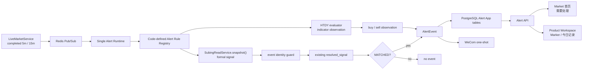

# v1.3 Decision Compression / Alert V2 设计规格

> 状态：Design Review
>
> 日期：2026-08-14
>
> 基线：`v1.2.0` 已发布；本文以当前 `develop` 的 `STATUS.md`、`AGENTS.md`、`docs/DEVELOPMENT.md`、`PROJECT_SOURCE.md`、`DECISIONS.md`、`docs/ARCHITECTURE.md` 以及现有 Alert V1 / SuBing 实现为事实源。

## 1. 背景与目标

`v1.2.0` 已经完成两条关键能力：

1. 火天大有 Alert V1 已形成自然 `confirmed 15m -> AlertEvent -> WeCom -> Web persistent marker` 闭环；
2. SuBing 已完成 current-rank1 segment-local Factor、slope-only accepted Calibration、scoped MACD FormalPolicy 和 5m/15m Formal Entry Signal，Web 已能读取 `primary_signal` / `resolved_signal`，但 Signal 仍只用于只读观察，不持久化、不接 Alert。

因此 v1.3 不再扩展“更多研究信息”，而是进入 **Decision Compression（决策压缩）**：

```text
可信数据
-> Market Research
-> SuBing Formal Signal
-> 只把真正需要处理的结果送到用户面前
-> 用户打开 K 线人工确认
```

产品目标不是增加一个 Signal Center，而是把已有可信结果接到现有 Alert Application Domain：

```text
SuBing resolved MATCHED
-> Alert Scope
-> immutable AlertEvent
-> WeCom one-shot
-> Market 首页「需要处理」
-> Product Workspace persistent marker / 今日记录
```

项目边界保持不变：所有信号、通知和 Web 均为研究观察，`auto_order=false`，不存在自动下单或订单创建路径。

---

## 2. 设计原则

### 2.1 减少选择

盘中用户不选择 SuBing 的 5m/15m 周期，也不调整 Calibration、MACD policy 或阈值。一个“苏冰入场信号”开关同时覆盖 5m + 15m。

### 2.2 先给结论，再给细节

信息优先级固定为：

```text
Formal Signal = 需要处理
Radar Attention = 值得看
HTDY = 观察提醒
Research Facts = 需要时再展开
```

### 2.3 Rule 只定义一次

- SuBing 自己拥有 Factor / Calibration / FormalPolicy / multi-timeframe resolver；
- Alert 不复制 SuBing 条件，不重新实现 5m/15m 优先规则；
- Alert 只负责 `Rule Scope -> result -> Event -> notification/marker`。

### 2.4 只持久化有业务价值的应用事实

- 不保存每根 Factor；
- 不保存 `NOT_MATCHED` / `RESEARCH_PENDING` / `INSUFFICIENT_DATA`；
- 只在最终值得提醒时创建 AlertEvent；
- 不增加 Signal DB、delivery queue、retry worker、已读/未读或处理状态。

### 2.5 本地单用户优先于理论完备

SuBing Alert V2 采用本地实时消费模型，不建设 event-time reconstruction、replay 或 backfill。

实时路径选择：

```text
Pub/Sub event
-> immediate current Subing snapshot
-> stale-event identity guard
-> existing resolved_signal
```

Alert 不为 SuBing 新增 `snapshot_at()`。但也不允许旧消息把“更晚 snapshot”的结果错误写到较早 `bar_end`：只有 current snapshot 的 primary `bar_end` 与 `trading_day` 都和 incoming completed Bar 一致时才允许继续；不一致说明消息已 stale，直接 fail-closed 丢弃，不 replay、不补算、不通知。

这项取舍只适用于 SuBing V2 实时 Alert；现有 HTDY Alert V1 的 event cutoff 行为不因本设计而回退。

---

## 3. 明确非目标

v1.3 不实现：

- Signal Center / Signal DB / Signal worker；
- Strategy / Backtest / Orders / Positions / Risk；
- Outcome Review、3K/5K/8K 统计、MFE/MAE 页面；
- 通用 Rule DSL、Rule Builder 或通知平台；
- WeCom delivery queue、retry、outbox、dead-letter；
- Alert replay/backfill；
- 已读/未读、已处理/未处理、任务工作流；
- SuBing 独立 Runtime、第二个 launchd、第二套 heartbeat；
- 自选列表自动成为 Alert Scope；
- SuBing 自动扩大到 operational 60；
- AI 自动选参数或自动晋升 Rule；
- 新 Market Catalog 表或 Canonical 语义修改；
- 新的 Web 模块/路由（“品种”“研究”“设置”等概念稿导航不得据此创建新应用面）；
- 全局搜索平台；
- signal score、星级、confidence、“信号质量高”等评分语义；
- 为 v1.3 建设零停机双 schema / 双写兼容层。

视觉概念稿中的额外导航、全局搜索和“信号质量/趋势强度”等块只用于表达视觉层级，不属于 v1.3 功能合同。

---

## 4. 总体架构



### 4.1 责任边界

**SuBing**：

- current rank1 segment identity；
- Historical/completed Live seam；
- EMA/MACD/Slope Factor；
- accepted Calibration；
- scoped FormalPolicy；
- 5m/15m companion relationship；
- same-boundary resolver；
- `resolved_signal`。

**Alert**：

- code-defined Rule 静态定义；
- server-side Scope；
- Runtime dispatch；
- incoming event 与 current snapshot identity guard；
- immutable Event；
- one-shot WeCom；
- Web persistent facts。

Alert 不读取 SuBing threshold，不判断 slope/MACD/volume，不重建 multi-timeframe Signal。

---

## 5. Code-defined Alert Rule Registry

### 5.1 为什么需要 Registry

Alert V1 当前数据库把 `indicator_code`、单一 `frequency` 存在 `AlertRule` 中，这只适合固定 15m 的 HTDY。SuBing 是 Formal Signal，并且一个 Rule 同时覆盖 5m + 15m；继续扩 DB metadata 会产生代码与数据库的双重事实源。

v1.3 将 Rule 的静态定义收回代码。

### 5.2 Registry 最小合同

逻辑上每个 RuleDefinition 只需要：

```text
rule_code
- stable code identity

display_name
- Web / WeCom 可读名称

kind
- indicator_observation
- formal_signal

input_frequencies
- HTDY: [15m]
- SuBing: [5m, 15m]

series_kind
- current V2 固定 actual_dominant

dispatch binding
- 对应既有 evaluator / read service 入口
```

第一版精确存在两条代码定义 Rule：

```text
htdy_original_15m
  kind = indicator_observation
  display_name = 火天大有
  input_frequencies = [15m]

subing_entry_signal_v1
  kind = formal_signal
  display_name = 苏冰入场信号
  input_frequencies = [5m, 15m]
```

不得把 SuBing 伪装成 `indicator_code="subing"`。

未来新增第三条 Rule 不自动获得 Runtime/WeCom 授权；必须单独设计、批准并更新对应 canonical。

---

## 6. AlertRule 数据模型

v1.3 后 `alert_rules` 只保存真正可变的配置事实，不保存计算定义，也不保留当前没有业务作用的 `scope_mode`。

```text
AlertRule
- id
- rule_code
- enabled
- scope_products
- created_at
- updated_at
```

### 6.1 Scope 语义

两个 Rule Scope 完全独立：

```text
火天大有 · 15m      [开 / 关]
苏冰入场信号        [开 / 关]
```

禁止隐式联动：

- 开启 HTDY 不得自动开启 SuBing；
- 加入自选不得自动开启 SuBing；
- operational 60 不得自动扩大 SuBing Scope。

### 6.2 SuBing seed

migration 创建：

```text
rule_code = subing_entry_signal_v1
enabled = true
scope_products = []
```

空 Scope 是正式默认状态。因此：

```text
migration != SuBing notification activation
```

生产 migration 与首次给某个品种开启 SuBing Scope 是两个独立外部操作 Gate。

---

## 7. AlertEvent 数据模型

### 7.1 V2 字段

```text
AlertEvent
- id
- rule_id
- symbol
- contract
- trading_day
- frequency
- bar_end
- result_codes
- lower_tf_confirmation
- detected_at
- notification_attempted_at
- created_at
```

### 7.2 `trading_day`

新 Event 直接保存触发 completed Bar 自带的 `trading_day`，不根据 `bar_end` 重新推导。

原因：国内期货夜盘的自然日期和交易日并不等价，Event 发生上下文属于 Alert Application Domain 的明确业务事实。

为了不伪造历史事实，migration 不要求根据旧 `bar_end` 猜测 legacy V1 Event 的 `trading_day`：

- DB 列可为 legacy compatibility 保持 nullable；
- v1.3 `AlertService.create_event()` 创建的新 Event 必须提供非空 `trading_day`；
- current views 只读取具有明确 `trading_day` 的 V2 Event。

### 7.3 `result_codes`

统一允许：

```text
buy
sell
```

HTDY 可能是：

```text
["buy"]
["sell"]
["buy", "sell"]
```

SuBing Formal Signal 精确为：

```text
MATCHED LONG  -> ["buy"]
MATCHED SHORT -> ["sell"]
```

Event 字段不决定业务语义；Rule Registry 决定：

```text
HTDY buy   -> 买入观察
SuBing buy -> 买入信号
```

### 7.4 `lower_tf_confirmation`

- SuBing `resolved_signal.lower_tf_confirmation` 原样持久化；
- HTDY 固定为 `false`；
- 不保存 companion Factor、阈值或条件明细。

### 7.5 `notification_attempted_at`

现有 `notified_at` 的真实语义是 Event commit 后进入一次 WeCom 请求阶段，并不能证明对端成功送达。

v1.3 将字段语义校正为：

```text
notification_attempted_at
= Runtime 已进入该 Event 的一次通知尝试阶段
```

不新增：

```text
delivered
failed
retry_count
provider_response
```

### 7.6 幂等身份

V2 唯一约束：

```text
UNIQUE(rule_id, symbol, bar_end)
```

`frequency` 是 resolved Event 的结果属性，不再参与 identity。

该约束保证：

> 同一个 Rule、同一个品种、同一个时间边界，最多存在一个需要处理的业务事实。

保留现有 `(symbol, bar_end)` 查询索引。v1.3 暂不为首页额外增加 `(trading_day, bar_end)` 索引；本地单用户、极低 Event 量下先直接查询，只有真实性能证据出现后再增加索引。

---

## 8. Migration 与版本兼容

下一条 production migration 基于当前 `20260813_0037` 演进，不修改 Market Catalog 八表。

逻辑变更：

1. `alert_rules` 删除静态计算 metadata：`indicator_code`、单一 `frequency`；
2. 删除无实际业务作用的 `scope_mode`；
3. `alert_events.observation_types` 收敛为 `result_codes`，历史值原样保留；
4. `notified_at` 重命名/迁移为 `notification_attempted_at`，历史值原样保留；
5. 新增 `trading_day`；legacy Event 不猜测、不强行回填；
6. 新增 `lower_tf_confirmation`，legacy 默认为 `false`；
7. 将唯一约束从 `(rule_id, symbol, frequency, bar_end)` 改为 `(rule_id, symbol, bar_end)`；
8. 在替换唯一约束前先检查既有数据是否存在新 identity 冲突；存在冲突则 migration fail-closed，不静默删除/合并；
9. seed `subing_entry_signal_v1`，Scope 为空；
10. 保持已有 HTDY Rule 的 `enabled` / `scope_products` 原值，不从 HTDY Scope 复制到 SuBing。

### 8.1 不建设零停机双 schema

当前 `v1.2.0` 运行代码仍依赖旧 `AlertRule.indicator_code/frequency`、`AlertEvent.observation_types/notified_at`。因此 production migration 后，旧 V1 API / Alert Runtime 不能继续运行。

本项目是本地单用户工作站，v1.3 明确选择**短维护窗口**，不为零停机建设双字段、双写或长期兼容层。

生产切换顺序必须满足：

```text
v1.3 代码完成 + 全量受影响验证
-> release main/tag（独立人工 Gate）
-> 明确进入短维护窗口，先停止旧 API / Alert 对旧 schema 的访问（Runtime 操作 Gate）
-> production PostgreSQL migration（独立 DB Gate）
-> Runtime promotion 到同一个已批准 v1.3 exact tag，五个应用 label 重新统一到同一 supervised root（独立 Runtime Gate）
-> health + business readback
-> SuBing Scope 仍为空
```

不得出现：

```text
V2 DB schema
+
running v1.2 API / Alert code
```

migration 文件进入仓库、release 完成或 migration 成功，都不自动授权 Runtime promotion 或 SuBing Scope activation。

---

## 9. Alert Runtime V2

### 9.1 单 Runtime

继续只有现有 Alert Runtime：

```text
single process
single activation marker
single heartbeat
single WeCom sender
```

不得新增 SuBingRuntime 或第二套 launchd。

### 9.2 输入

Runtime 只消费 completed：

```text
5m
15m
```

未知 frequency、非法 channel、非法 payload、非 operational symbol 均在业务计算前拒绝。

### 9.3 Rule dispatch

```text
5m event
  -> eligible SuBing Rule

15m event
  -> eligible HTDY Rule
  -> eligible SuBing Rule
```

每条 Rule 单独检查：

```text
registry definition exists
AND DB rule.enabled = true
AND symbol in rule.scope_products
```

Rule 之间共享 Runtime，但故障隔离：一个 Rule 失败不得阻止同一 completed Bar 上另一个 Rule 正常处理。

### 9.4 HTDY 路径

HTDY 保持 v1.2 已验收语义：

```text
15m completed event
-> MarketReadService.bars_until(event cutoff)
-> HtdyOriginal15mEvaluator
-> result_codes
-> Event
```

不因为 Alert V2 改成“最新 snapshot”。

### 9.5 SuBing 路径

SuBing Alert 不读取任何具体 Factor 条件，只调用现有 read model：

```text
snapshot = SubingReadService.snapshot(
  SubingReadRequest(symbol, event_frequency),
  now,
)
```

随后先做最小 stale-event guard：

```text
snapshot.primary must be READY
snapshot.primary.snapshot.bar_end == incoming_event.bar_end
snapshot.primary.snapshot.trading_day == incoming_event.trading_day
```

任一不满足：

```text
stale / unavailable
-> drop
-> no Event
-> no WeCom
```

identity 一致后，Runtime 才解释现有 `snapshot.resolved_signal`：

```text
resolved_signal is None
-> no event

status != MATCHED
-> no event

MATCHED LONG
-> result_codes=["buy"]

MATCHED SHORT
-> result_codes=["sell"]
```

并原样使用：

```text
trigger_timeframe -> AlertEvent.frequency
lower_tf_confirmation -> AlertEvent.lower_tf_confirmation
incoming_event.trading_day -> AlertEvent.trading_day
```

### 9.6 不新增 5m/15m Signal 优先规则

现有 SuBing resolver 已定义：

- same READY boundary 双 MATCHED 同方向：15m wins；
- 反方向：fail-closed；
- reciprocal-only MATCHED：不能遗漏；
- 非 same boundary：正常保留 primary MATCHED。

Alert V2 不重复实现上述规则，只消费 `resolved_signal`。

### 9.7 同 boundary 防双触发

Live 在同一个 15m boundary 会先发布 completed 5m，再发布 completed 15m。为了避免 Alert 在 5m 消息上先发一次、随后 15m 再发一次：

```text
普通 5m boundary
-> 立即做 SuBing notification evaluation

同时也是 15m close 的 5m boundary
-> 该 5m 消息不做最终 SuBing notification evaluation
-> 等紧接着的 15m completed event
-> 由现有 SuBing resolved_signal 给出唯一结果
```

“是否为 15m close boundary”必须复用现有 TradingSession / aggregation bucket 口径（例如现有 resolved session + `bucket_window_for_bar()` 语义），禁止使用 `minute % 15` 等另一套时间判断。

这只是触发去重，不是新的 Signal 业务规则。

### 9.8 实时取舍

v1.3 不实现：

- `snapshot_at()`；
- SuBing event-time cutoff reconstruction；
- Signal replay/backfill；
- Pub/Sub backlog 恢复。

因此“实时”定义为：**消息仍对应当前最新 completed boundary 才处理；消息一旦 stale 就丢弃。**

---

## 10. Event 与 WeCom 顺序

固定顺序：

```text
Rule result
-> create unique AlertEvent
-> commit succeeds
-> WeCom attempt once
```

### 10.1 DB 创建失败

```text
no Event -> no WeCom
```

### 10.2 duplicate Event

相同 `(rule_id, symbol, bar_end)` 已存在：

```text
no second Event
-> no second WeCom
```

### 10.3 WeCom 失败

```text
Event stays committed
-> warning only
-> no retry
```

### 10.4 接受的极小崩溃窗口

Event commit 与实际 HTTP request 之间如果进程崩溃，可能出现 Event 已存在但消息没有真正发送。v1.3 接受此极小窗口，不为此建设 outbox/delivery state machine。

---

## 11. WeCom 文案

### 11.1 HTDY

已自然验收的火天大有文案尽量保持不变，不为“统一模板”做无关改写。

### 11.2 SuBing

Formal Signal 通知只负责把结论送到用户面前，不输出研究过程。

建议精确短格式：

```text
【苏冰】焦煤 · JM2609

5m 买入信号 · 10:25
```

如果 higher timeframe wins 且有低周期确认：

```text
【苏冰】焦煤 · JM2609

15m 买入信号 · 10:30
5m 同向确认
```

卖出镜像。

禁止在 WeCom 中发送：

- slope 数值；
- MACD DIF/DEA/histogram；
- EMA21 数值；
- volume ratio；
- Calibration ID；
- condition PASS/FAIL；
- score/confidence；
- 仓位、止盈止损或下单建议。

### 11.3 Renderer 边界

不建设 MessageTemplate 表或模板 DSL。

采用 code-defined renderer：

```text
HTDY Rule -> HTDY renderer
SuBing Rule -> SuBing renderer
renderer -> plain text -> shared WeCom transport
```

---

## 12. Current Trading Day Resolver

Market 首页和 Product Workspace“今日记录”都需要同一个当前交易日事实。不得由前端根据自然日期拼接，也不得从 AlertEvent `bar_end` 重新推导。

只复用现有 `MarketPhaseResolver` 与 `operational_products`，不新增状态表。

解析规则：

```text
phases = MarketPhaseResolver.resolve(symbol, now)
         for operational products

active_days = non-null trading_day
              where phase in {TRADING, BREAK}

if active_days has exactly one unique value:
    status = ready
    trading_day = that value
else if active_days has more than one value:
    status = unavailable
else:
    closed_days = non-null trading_day
                  where phase == CLOSED

    if closed_days has exactly one unique value:
        status = ready
        trading_day = that value
    else:
        status = unavailable
        trading_day = null
```

`UNKNOWN` 不参与选择；如果没有唯一可靠值则 fail-closed 为 `unavailable`。

该规则的目标语义：

- 日盘 / 午间 BREAK：当前交易日；
- 夜盘开始后：使用夜盘对应的下一交易日；
- 正常交易日收盘后：仍可读取该交易日 Event；
- 周末、日历缺失或跨品种结果无法唯一时：`unavailable`，不猜测“最近交易日”。

首页进入下一交易日后旧 Event 自然退出“需要处理”。

---

## 13. Alert API V2

### 13.1 Product Rule State

保留现有产品级 Scope API 语义：

```text
GET /api/alerts/products/{symbol}
PUT /api/alerts/rules/{rule_code}/scope/{symbol}
```

返回静态 metadata 必须来自 Code Rule Registry，而不是 DB 副本。

最小 DTO：

```text
rule_code
display_name
kind
input_frequencies
enabled_for_product
```

不再把 DB `indicator_code` / 单 `frequency` 暴露为规则事实。

### 13.2 Persistent Event API

现有 `/api/alerts/events` 继续负责：

```text
one symbol
+ one rule
+ explicit time range
```

主要 consumer 是 Product Workspace K 线历史 Marker。

V2 Event DTO：

```text
id
rule_code
symbol
contract
trading_day
frequency
bar_end
result_codes
lower_tf_confirmation
detected_at
notification_attempted_at
```

### 13.3 Market 首页专用 Formal Signal API

新增专用只读 endpoint：

```text
GET /api/alerts/formal-signals/current
```

响应：

```text
status = ready | unavailable
trading_day = YYYY-MM-DD | null
items = [...]
```

每个 item：

```text
id
rule_code
display_name
symbol
product_name
contract
trading_day
frequency
bar_end
result_codes
lower_tf_confirmation
```

查询规则：

```text
current trading day resolver == ready
AND Code Rule Registry.kind == formal_signal
AND AlertEvent.trading_day == current trading day
ORDER BY bar_end DESC
```

如果 current trading day 不能唯一、可靠解析，则 `status=unavailable` 且 items 为空；前端必须展示“正式信号暂不可用”，不能误报“当前无正式信号”。

该 endpoint 不支持任意日期、任意 Rule、symbol filter、分页中心、已读状态或全文检索。

### 13.4 Product Workspace 当前交易日 Event API

为避免前端自己推交易日、分别请求两个 Rule 再合并，新增第二个专用薄接口：

```text
GET /api/alerts/products/{symbol}/current-events
```

响应：

```text
status = ready | unavailable
trading_day = YYYY-MM-DD | null
items = [...]
```

查询语义：

```text
current trading day resolver == ready
AND AlertEvent.symbol == requested symbol
AND AlertEvent.trading_day == current trading day
AND rule_code exists in Code Rule Registry
ORDER BY bar_end DESC
```

它可以同时返回 HTDY Observation Event 与 SuBing Formal Signal Event，供 Product Workspace“今日记录”使用。

它不是通用 Event 搜索 API，不提供任意日期、Rule、分页或已读/处理状态。

---

## 14. Web 信息架构

### 14.1 设计目标

本轮 Web 改造不是增加更多信息，而是重新排列优先级：

```text
1. 用户现在要不要看一个正式信号？
2. 市场还有哪些值得看？
3. 需要时再看研究细节和运行上下文。
```

### 14.2 视觉概念稿与真实产品合同

已确认的视觉概念稿作为信息层级、亮色主题方向、卡片密度、对比度、组件形态和 Product Workspace 布局的视觉参考。

以下概念稿内容不得照搬：

- 不新增不存在的“品种 / 研究 / 设置”等路由；
- 不新增全局“搜索品种/合约/指标”平台；
- 不展示“信号质量高”“趋势强度较强”等 score/confidence；
- 不改变已有 SuBing Formal Signal 数学语义；
- 不根据概念图改变 K 线涨跌颜色合同。

---

## 15. Web 视觉系统升级

当前 Web 使用暗色 token。v1.3 将 active Market Web 统一切到高可读亮色体系；不增加亮/暗模式切换。

### 15.1 Surface / Type

目标 token：

```text
page background      #F8FAFC
panel/card            #FFFFFF
primary text          #111827
secondary text        #374151
muted text            #667085
subtle border         #E4E7EC
strong border         #D0D5DD
neutral accent        #2563EB
observation orange    #F79009
```

字号目标：

```text
页面标题      26~28 / Bold
区块标题      18 / Semibold
正文          14 / Regular
辅助说明      12~13 / Regular
```

不再依赖低对比灰字和纯色差表达状态。

### 15.2 中国期货方向颜色必须保留

仓库现有方向合同：

```text
上涨 / LONG / 买入方向 -> red
下跌 / SHORT / 卖出方向 -> green
```

概念稿中的“买绿卖红”只作为视觉占位，实际实现必须继续遵守现有 `--gy-up` / `--gy-down` 方向合同，并始终搭配文字。

```text
buy / LONG badge       -> red directional accent + "买入信号"
sell / SHORT badge     -> green directional accent + "卖出信号"
HTDY observation       -> orange category surface + 明确买入/卖出文字
neutral CTA/navigation -> blue/charcoal neutral accent
```

品牌/操作色不和交易方向混淆。

### 15.3 卡片与按钮

卡片统一：white surface、明确 1px 边框、8~12px radius、very subtle shadow；hover 只用于可点击卡片。Formal Signal 可用方向色边线/chip 强化，但正文仍以深色文字为主。

中性导航和“查看 K 线”使用 neutral primary；不用按钮底色承担交易方向含义。次按钮使用清晰边框，不使用低对比 ghost；disabled 必须有明显 disabled 对比。

---

## 16. Market 首页设计

### 16.1 页面顺序

```text
页面标题 / freshness

需要处理              <- highest priority

Radar Attention       <- secondary priority

Market Summary / Scatter / Sector / Detail
                       <- existing research capabilities preserved
```

现有 Market Radar P0 的 scatter、sector summary、detail table 不删除，只降低视觉优先级；不得为了套概念图回退 v1.1 已封板功能。

### 16.2 「需要处理」

标题：

```text
需要处理
只显示当前交易日的正式信号
```

只消费 `/api/alerts/formal-signals/current`。

卡片最小内容：

```text
苏冰
JM 焦煤 · JM2609
5m 买入信号
10:25
[查看 K 线]
```

当 `lower_tf_confirmation=true` 时可追加：

```text
5m 同向确认
```

禁止显示 Factor 数值、信号质量、score/confidence、Radar reasons 或 slope/MACD/volume 条件。

### 16.3 空状态与不可用状态

`status=ready, items=[]`：

```text
当前没有需要处理的正式信号
```

`status=unavailable` / API error：

```text
正式信号暂不可用
```

不得把依赖故障渲染成“没有信号”。

### 16.4 Radar Attention

继续明确标注：

```text
值得关注，但尚未形成正式信号
```

Attention 不是 Formal Signal，也不进入“需要处理”。

---

## 17. Product Workspace 设计

K 线仍是页面绝对主视觉，不缩小成普通卡片。

推荐结构：

```text
Left / Center
- 品种 + 当前主力
- 主力 / 主连
- 1m / 5m / 15m / 30m / 60m / 1d / 1w
- Kline + EMA overlay
- Volume
- MACD

Right
1. 正式信号
2. 提醒开关
3. 火天大有观察
4. 今日记录
5. 研究明细（existing data, secondary/collapsible）
6. Contract / Runtime context
7. 边界说明
```

### 17.1 正式信号卡

只展示当前 `resolved_signal`：

```text
苏冰
5m 买入信号 · 10:25
```

如果无 MATCHED：

```text
当前无正式入场信号
```

`NOT_MATCHED / RESEARCH_PENDING / INSUFFICIENT_DATA` 的技术状态可以在研究明细中解释，不占主卡片视觉焦点。

### 17.2 两个独立开关

精确为：

```text
火天大有 · 15m      [switch]
苏冰入场信号        [switch]
```

一个 SuBing switch 同时覆盖 5m + 15m，用户不选择周期。

### 17.3 火天大有观察卡

HTDY 明确属于 observation category：

```text
火天大有
卖出观察 · 14:45
```

使用 observation orange surface/border，与 Formal Signal 方向卡视觉区分。

HTDY current overlay 可能 repaint；persistent Marker 仍只代表真实 AlertEvent，两者不得混为一类事实。

### 17.4 今日记录

只消费：

```text
GET /api/alerts/products/{symbol}/current-events
```

可以同时展示本品种当前交易日的 SuBing Formal Signal Event 与 HTDY Observation Event：

```text
10:25  苏冰      买入信号
14:45  火天大有  卖出观察
```

前端不自己推交易日、不分别查询两个 Rule 再合并。

### 17.5 研究明细

现有 SuBing Factor、Trend/Position、Volume/OI、Contract/Runtime context 不删除，但从第一视觉层移到次级区域，可采用折叠/下移方式实现“先结论，再细节”。

不得新增 score、星级或自动建议。

---

## 18. K 线 Marker

Persistent AlertEvent Marker 按 Rule 和 Event frequency 精确显示，不做跨周期投影。

精确合同：

```text
HTDY 15m Event
-> 只显示在 actual_dominant + 15m

SuBing 5m Event
-> 只显示在 actual_dominant + 5m

SuBing 15m Event
-> 只显示在 actual_dominant + 15m
```

明确不做：

```text
5m Event 投影到 15m
15m Event 投影到 5m
30m / 60m / 1d 跨周期 Marker 映射
continuous / contract series 的 AlertEvent 投影
```

原则：

- Marker 必须包含文字/形状，不能只靠颜色；
- SuBing 与 HTDY 的 category 视觉不同；
- 同一个 `(rule, symbol, bar_end)` 不会出现两个 Event marker；
- 历史 Marker 只来自持久 Event，不从当前 repaint overlay 反推历史 Alert。

---

## 19. Layout 与响应式

当前系统仍是桌面 Web，不新增手机 App。

推荐断点行为：

- >= 1200：K 线主区 + 右侧固定研究栏；
- 980~1199：侧栏保持已有折叠策略，右侧面板可收紧；
- < 980：Product Workspace 右侧信息堆叠到 K 线下方；Market Formal Signal 卡单列；
- 不要求为极窄手机屏提供全功能交易终端式布局。

当前 active Web 只有 Market 工作台路由；视觉稿中的多模块侧边栏不得引入不存在的产品模块。

---

## 20. Error Handling

### 20.1 Runtime

```text
invalid Pub/Sub payload
-> drop

unsupported frequency
-> drop

non-operational symbol
-> drop

Rule disabled / out of scope
-> skip

SuBing snapshot unavailable
-> no event

SuBing snapshot identity != incoming event identity
-> stale event drop

SuBing resolved_signal None / non-MATCHED
-> no event

one Rule evaluator exception
-> stable warning
-> continue other Rules

Event DB create failure
-> no WeCom

duplicate Event
-> no second WeCom

message render/taxonomy failure
-> Event remains
-> no WeCom

WeCom failure
-> Event remains
-> no retry
```

### 20.2 Web

- Formal Signal API unavailable 与“没有信号”必须分开；
- Product current-events unavailable 与“今日没有记录”必须分开；
- Rule Scope 保存失败必须恢复 switch UI 并给出明确失败提示；
- Radar 故障不影响 Formal Signal 区；Formal Signal 故障不影响 Radar；
- Product Workspace SuBing read error 不得伪装为 `NOT_MATCHED`。

---

## 21. 测试合同

### 21.1 Migration / Models

必须覆盖：

- AlertRule V2 schema 不再含 `indicator_code` / `frequency` / `scope_mode`；
- Event `result_codes` contract；
- `trading_day` new-event required；
- legacy nullable trading_day compatibility；
- `lower_tf_confirmation`；
- `(rule_id, symbol, bar_end)` uniqueness；
- migration collision precheck；
- legacy HTDY Event 字段值保持；
- SuBing seed Scope 精确为空；
- migration 后旧 V1 model contract 不再被误认为兼容。

### 21.2 Rule Registry

必须证明：

- HTDY 为 `indicator_observation`；
- SuBing 为 `formal_signal`；
- metadata 与 handler binding 都来自代码；
- 未知 DB `rule_code` fail-closed；
- DB 不复制 indicator/frequency 计算 metadata。

### 21.3 Current Trading Day Resolver

覆盖：

- 日盘 TRADING；
- 午间 BREAK；
- 夜盘 next trading day；
- 正常交易日 CLOSED；
- UNKNOWN / 周末 / 缺失 calendar -> unavailable；
- 多个冲突 trading_day -> unavailable。

### 21.4 Alert Service / API

覆盖：

- HTDY / SuBing Scope 相互独立；
- Product Rule State metadata 来自 Registry；
- legacy Event query；
- current formal-signals 只返回 Formal Signal；
- 只返回 current trading_day；
- HTDY 不进入首页 endpoint；
- current trading_day 无法可靠解析时返回 unavailable；
- current formal-signals 不提供通用查询参数；
- product current-events 同时返回当前交易日 HTDY / SuBing；
- product current-events 不要求前端提供日期或 rule list。

### 21.5 Runtime

覆盖：

- 普通 5m SuBing MATCHED -> one Event；
- 普通 5m NOT_MATCHED -> no Event；
- current snapshot bar_end / trading_day 与 incoming event 不一致 -> stale drop；
- 15m boundary 的 5m dispatch 被抑制，随后 15m event 产生至多一个 resolved Event；
- same-boundary 双 MATCHED 同方向仍由现有 resolver 选择 15m；
- direction conflict -> no matched Event；
- reciprocal-only MATCHED 不遗漏；
- duplicate Pub/Sub -> no duplicate Event / no duplicate WeCom；
- SuBing Rule failure 不阻塞 HTDY；
- HTDY failure 不阻塞 SuBing；
- scope 为空时 SuBing 不执行通知；
- WeCom failure 保留 Event 且不 retry；
- HTDY V1 原 cutoff/evaluator 行为完整回归。

### 21.6 Web

覆盖：

- 首页 Formal Signal 区视觉优先；
- current empty 与 unavailable 两种状态；
- HTDY 不进入“需要处理”；
- 两个独立 Rule switch；
- 一个 SuBing switch 不暴露 5m/15m 子开关；
- Product “今日记录”使用 current-events，可同时显示 SuBing / HTDY 且文案不同；
- Marker exact-frequency contract；
- 5m SuBing Marker 不出现在 15m，15m Event 不出现在 5m；
- 现有 Radar scatter/attention/sector/detail 不回归；
- 不出现 signal score/confidence；
- build / existing E2E / Alert V1 regression 全通过。

测试入口仍以仓库当前 `TESTING.md` 为准。

---

## 22. Canonical 与持续授权更新

当前 active canonical 只授权 Alert Runtime 持续处理：

```text
htdy_original_15m × enabled scope_products × WeCom
```

因此 v1.3 实现完成后、任何 SuBing Scope activation 之前，必须同步更新 active canonical，至少包括：

```text
AGENTS.md
PROJECT_SOURCE.md
DECISIONS.md
docs/DEVELOPMENT.md
docs/ARCHITECTURE.md
```

`STATUS.md` 只在实际代码完成、外部 Gate 真正执行后记录事实，不提前宣告。

### 22.1 Alert Runtime V2 有界持续授权

canonical 应明确列举，而不是泛化为“所有 enabled rules”：

```text
htdy_original_15m
× 该 Rule 显式 scope_products
× WeCom

+

subing_entry_signal_v1
× 该 Rule 显式 scope_products
× WeCom
```

未来第三条 Rule 不自动继承该授权。

### 22.2 Scope 开关就是精确业务授权

用户在 Web/API 上明确开启：

```text
subing_entry_signal_v1 × exact product
```

该 scope write 本身就是对精确 Rule + Product 的显式真实写入意图。开启成功后，只允许 Alert Runtime 对该精确范围内**后续自然到达**的 Formal Signal 持续创建 Event 并执行 one-shot WeCom。

关闭 Scope 后立即停止后续该范围处理；不 replay、不补发。

一次 migration、一次 Runtime promotion、HTDY 的既有 Scope、Market Runtime V1 授权都不能推导出 SuBing Scope 授权。

---

## 23. 发布与人工 Gate

代码完成不等于真实启用。最终生产顺序受第 8 节 schema compatibility 约束。

推荐外部操作顺序：

```text
A. 代码 / migration / Web / tests 在 develop 完成并独立 Review

B. release main/tag
   -> 独立 release 批准

C. 进入短维护窗口，停止旧 API / Alert 对 V1 Alert schema 的访问
   -> Runtime 外部操作批准

D. production PostgreSQL migration
   -> 独立真实 DB 写入批准

E. Runtime promotion 到同一个已批准 v1.3 exact tag
   -> 五个应用 label 恢复统一 supervised root
   -> 独立 Runtime promotion 批准

F. health / business readback
   -> DB schema / HTDY scope / Alert health / Market / SuBing readonly
   -> 此时 subing_entry_signal_v1 Scope 必须仍为空

G. 对一个精确品种开启 subing_entry_signal_v1 Scope
   -> 独立精确 Scope 写入

H. 等待自然 SuBing MATCHED
   -> 验收 Event + WeCom + 首页 + Product 今日记录 + exact-frequency Marker
```

每一步只接受当次范围明确的执行意图；前一步成功不授权后一步，失败后的重试也需要新的明确意图。

既有 HTDY Alert Runtime 的持续授权不能自动扩展为 SuBing；只有第 22 节 canonical 更新和精确 Scope activation 后，SuBing 才拥有有界持续通知范围。

首次 SuBing Scope 从一个人工明确选择的品种开始；本设计不预设必须是 `jm`，也不复制 HTDY 当前 Scope。自然验收后是否扩大 Scope 仍由用户逐品种决定。

---

## 24. 验收标准

v1.3 只有在以下条件全部满足时，代码层面才可认为完成：

```text
AlertRule static calculation metadata 已收回 Code Registry
AlertRule DB 只保存 rule_code / enabled / scope_products / timestamps
scope_mode 已删除
AlertEvent V2 字段和 unique identity 正确
legacy HTDY Event 不被伪造或破坏
subing_entry_signal_v1 seed Scope 为空
HTDY 与 SuBing Scope 完全独立
single Alert Runtime 支持 5m/15m code-defined dispatch
SuBing Alert 只消费 existing SubingReadService / resolved_signal
Alert 没有复制 SuBing 公式或 resolver
stale SuBing Pub/Sub 不会把更晚 snapshot 结果写到旧 event bar_end
15m boundary 不产生 5m + 15m 双通知
Event commit 先于 one-shot WeCom
WeCom failure 不 retry、不删除 Event
current trading day 由既有 MarketPhaseResolver facts 唯一解析，无法唯一时 unavailable
Market 首页只显示 current trading day Formal Signal
HTDY 不进入「需要处理」
Product current-events 不要求前端推交易日或合并 Rule 查询
Product Workspace 两个独立开关可用
Product Workspace 正式信号 / 观察提醒 / 今日记录层级清晰
Kline Marker 只在 actual_dominant + exact Event frequency 展示
现有 Radar 与 Kline 功能无回归
Web 采用高对比亮色视觉体系
交易方向仍遵循中国期货红涨绿跌合同
active canonical 已明确 Alert Runtime V2 两条 Rule 的有界授权，未来 Rule 不继承
不存在 score/confidence/Signal Center/replay/retry queue
不存在订单或 auto trading 路径
```

生产上线额外要求：

```text
不得让 V2 Alert DB schema 与 running v1.2 API/Alert 共存
release / migration / Runtime promotion / Scope activation 分属独立 Gate
Runtime promotion 后五个应用 label 重新指向同一 exact supervised root
SuBing Scope 初始为空，只有显式品种开关后才持续通知
```

---

## 25. v1.3 之后

v1.3 自然产生一段真实 SuBing AlertEvent 后，下一项优先候选是 **Outcome Review**：

```text
AlertEvent
+ MarketDataService
-> post-hoc 3K / 5K / 8K
-> MFE / MAE / EMA21 failure
-> 判断真实提醒是否值得继续扩大
```

该能力属于后续独立设计；v1.3 不提前增加 Outcome 表或 Backtest。

长期仍遵循：

> 先让一个真实闭环产生问题，再抽象下一层能力；不因为“以后可能用”提前建设平台。
