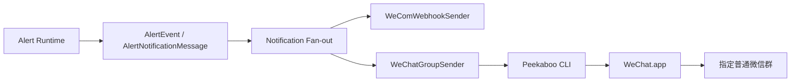

# 微信普通群通知设计规格

> 状态：Design Approved
>
> 日期：2026-08-15
>
> 基线：`develop` 当前 Alert Runtime V2；现有通知出口为 `WeComWebhookSender`，真实通知仍遵守仓库受控外部操作 Gate。

## 1. 背景与目标

当前归一量化已经具备稳定的 Alert Runtime 与企业微信通知出口。新的需求是：

> 当 Alert 形成后，除现有企业微信外，可选择把同一条文本通知发送到 **macOS 微信客户端中的指定普通微信群**。

目标不是建设通用聊天机器人，也不是接管微信协议，而是增加一个本地、确定性的通知执行器：

```text
AlertEvent
-> notification sender
-> local WeChatGroupSender
-> Peekaboo CLI
-> WeChat.app
-> 指定普通微信群
```

该能力只负责研究观察提醒，项目边界仍保持 `auto_order=false`，不产生订单、不执行交易。

---

## 2. 设计结论

第一版采用：

**Peekaboo CLI + 本地 WeChatGroupSender + WeChat.app**。

不采用：

- 腾讯 `openclaw-weixin`：当前正式能力以 direct chat 为主，不能把普通微信群作为可靠合同；
- 完整 OpenClaw Gateway：本需求是确定性通知，不需要 Agent/LLM 进入关键路径；
- 微信 Hook / Frida / 私有协议逆向：维护和账号风险与通知价值不匹配；
- 纯坐标型 PyAutoGUI：对窗口尺寸、布局和缩放过于敏感；
- 直接照搬第三方 `wechat-macos-proxy`：其第一搜索结果 + 固定坐标 + 无发送结果验证不满足 fail-closed 要求。

OpenClaw 可作为未来独立扩展，但不属于本次实现依赖。

---

## 3. 核心设计原则

### 3.1 通知与信号计算彻底隔离

Alert evaluator / Rule / Event 不感知微信客户端、Accessibility、Peekaboo 或 macOS UI。

微信发送失败不得：

- 回滚 AlertEvent；
- 阻塞后续 Bar；
- 影响 evaluator；
- 影响现有企业微信发送。

### 3.2 Fail-closed：宁可不发，绝不能发错群

群定位必须使用**精确目标名称**并验证当前打开的聊天标题。

以下任一情况必须停止本次微信发送：

- 目标群搜索不到；
- 搜索结果存在歧义；
- 无法确认搜索结果属于目标会话；
- 打开后聊天标题与目标群名不一致；
- 无法定位消息输入控件；
- 无法执行发送动作；
- 无法获得足够的发送完成证据。

不得降级为“选择第一条结果”。

### 3.3 Accessibility 优先，前台切换只是 fallback

优先通过 Peekaboo 对指定 `WeChat.app` 执行：

- UI tree 读取；
- target-specific input；
- `set-value`；
- `perform-action`；
- `press` / `hotkey` / `paste`。

如果当前微信版本无法完成后台操作，允许：

```text
记录当前 frontmost app
-> 临时 activate WeChat
-> 完成单次发送
-> 恢复原 frontmost app
```

目标是把前台抢占限制到必要的最小窗口；不承诺绝对零抢焦点。

### 3.4 不把 LLM 放进发送路径

发送是一条确定性状态机，不允许通过自然语言 Agent 判断“下一步点击哪里”。

允许使用 Peekaboo 的结构化 UI/Accessibility 能力，不使用 AI vision 或 LLM 作为正常发送判定条件。

---

## 4. 总体架构



第一版仍保持单机、本地、单用户设计，不建设独立消息中间件或通用通知平台。

### 4.1 通知 fan-out

现有 Runtime 只有一个 `sender` 合同。扩展时采用一个极小的组合 sender：

```text
CompositeAlertSender
- send(event)
  - WeCom sender
  - optional WeChat group sender
```

各 channel 相互隔离：一个 channel 的失败不得阻止另一个 channel 的尝试。

现有企业微信继续保留，不以微信普通群替代其可靠性角色。

---

## 5. 组件边界

### 5.1 `WeChatGroupSender`

责任：

- 接收已经格式化/可格式化的 Alert 通知对象；
- 把通知文本交给本地微信 UI driver；
- 把所有底层失败收敛为稳定的微信发送错误码；
- 不暴露 Peekaboo stdout、UI tree、窗口标题之外的敏感原始信息到日志。

不负责：

- 计算 Signal；
- 选择 Rule；
- replay/retry；
- 保存 delivery 状态；
- 读取聊天历史。

### 5.2 `PeekabooWeChatDriver`

责任：

```text
ensure_ready()
open_exact_chat(group_name)
write_message(text)
send_message()
verify_send(...)
```

内部维护单次 UI 状态机，不对外暴露具体 AX 元素结构。

### 5.3 `FocusGuard`

只在后台输入失败时启用。

责任：

- 获取当前 frontmost app；
- 激活微信；
- 在单次发送结束后尽力恢复原 App；
- Focus 恢复失败只记录 warning，不把已完成发送标记为发送失败。

### 5.4 `PeekabooRunner`

责任：

- 使用固定 executable；
- 只通过离散 argv 调用，不构造 shell command string；
- 设置确定性的 timeout；
- 解析 JSON 输出；
- 屏蔽原始 stderr；
- 把执行错误转换为稳定内部错误。

任何用户派生的群名、消息文本均不得插入 shell 字符串。

---

## 6. 微信发送状态机

第一版发送流程：

```text
START
  |
  v
检查 Peekaboo + WeChat 运行状态
  |
  v
读取 WeChat UI tree
  |
  v
定位搜索入口
  |
  v
设置精确群名
  |
  v
读取搜索结果
  |
  +-- 无唯一精确匹配 --> FAIL_CLOSED
  |
  v
打开唯一匹配
  |
  v
重新读取当前聊天 UI
  |
  +-- 标题 != 目标群名 --> FAIL_CLOSED
  |
  v
定位消息输入控件
  |
  v
写入完整消息
  |
  v
执行发送
  |
  v
验证发送完成证据
  |
  +-- 证据不足 --> SEND_UNVERIFIED
  |
  v
SUCCESS
```

### 6.1 群定位规则

第一版只支持配置一个目标群：

```text
WECHAT_GROUP_NAME=<exact title>
```

群名必须：

- 非空；
- 去除首尾空白后保持确定值；
- 不支持模糊匹配；
- 不支持 regex；
- 不支持运行时由 Signal 动态决定群名。

未来多群路由必须作为独立设计扩展。

### 6.2 发送验证

第一版不承诺读取微信服务端“已送达”回执，因为 GUI 客户端没有稳定公开 API。

可接受的“本地发送完成证据”是：

- 发送动作执行成功；
- 输入框内容已被提交/清空，或 UI 中出现本次发送文本的可确认元素；
- 当前聊天标题仍与目标群一致。

如果当前微信版本无法提供足够稳定的可访问性证据，则返回：

```text
WECHAT_SEND_UNVERIFIED
```

而不是伪造 `delivered=true`。

---

## 7. 配置

第一版新增最小环境变量：

```text
WECHAT_GROUP_ENABLED=false
WECHAT_GROUP_NAME=
PEEKABOO_EXECUTABLE=peekaboo
WECHAT_SEND_TIMEOUT_SECONDS=8
```

规则：

- 默认关闭；
- `WECHAT_GROUP_ENABLED=true` 且群名为空时 fail-closed；
- 不在 `.env`、文档、测试或日志提交真实群名；
- `PEEKABOO_EXECUTABLE` 必须解析为允许的固定 executable/path；
- 不增加数据库表；
- 不增加 delivery queue；
- 不增加 retry worker。

---

## 8. 错误模型

微信 sender 对外只暴露稳定错误分类，例如：

```text
WECHAT_DISABLED
WECHAT_PEEKABOO_UNAVAILABLE
WECHAT_APP_UNAVAILABLE
WECHAT_UI_UNAVAILABLE
WECHAT_TARGET_NOT_FOUND
WECHAT_TARGET_AMBIGUOUS
WECHAT_TARGET_MISMATCH
WECHAT_INPUT_UNAVAILABLE
WECHAT_SEND_FAILED
WECHAT_SEND_UNVERIFIED
WECHAT_TIMEOUT
```

日志不得打印：

- 完整 UI tree；
- 消息全文；
- shell stderr 原文；
- 真实聊天列表；
- token/cookie/session 数据。

允许记录：

- 稳定错误码；
- channel 名；
- Rule code；
- symbol；
- 是否使用前台 fallback；
- elapsed time。

---

## 9. 运行与权限

Mac mini 前置条件：

- 已安装并登录官方 `WeChat.app`；
- 已安装 Peekaboo CLI；
- 给执行进程授予必要的 macOS Accessibility 权限；
- 若使用后台事件能力，按 Peekaboo 当前要求授予对应 macOS 权限；
- Mac mini 保持用户图形会话可用。

第一版不自动修改 macOS 隐私权限，不尝试绕过 TCC。

如果系统处于无可用 GUI session、锁屏导致 UI 不可操作、微信退出登录等状态，本次微信发送 fail-closed；企业微信通道不受影响。

---

## 10. 真实通知 Gate

仓库规则把真实通知定义为受控外部操作。

因此代码实现、mock 测试、Peekaboo dry-run / UI tree inspection 均不自动授权真实微信群发送。

首次真实 canary 必须在执行前获得新的、范围明确的一次性意图，至少明确：

- 目标为本地 Mac mini；
- 目标微信群；
- 发送内容/测试性质；
- 单次发送边界。

真实 canary 成功也不自动授权 Runtime 长期向该微信群发送；持续自动发送范围需要单独明确授权并记录项目事实。

---

## 11. 测试策略

### 11.1 单元测试

不依赖真实微信：

- env/config 校验；
- Peekaboo argv 构造；
- executable allowlist/path 校验；
- timeout；
- JSON 解析；
- 搜索结果 0 / 1 / 多个精确匹配；
- title mismatch；
- input missing；
- send failure；
- send unverified；
- focus fallback 状态；
- Composite sender 的 channel failure isolation。

### 11.2 本地 dry-run / inspection

在 Mac mini 上人工执行：

```text
Peekaboo installed
-> WeChat running
-> UI tree 可读
-> 搜索框可定位
-> 指定测试群可唯一定位
-> 当前聊天标题可验证
-> 输入框可定位
```

该阶段不发送真实消息。

### 11.3 真实 canary

获得一次性真实通知授权后：

1. 仅向指定测试群发送固定 canary；
2. 确认没有错群；
3. 确认前台 App 能恢复；
4. 记录成功/失败的稳定状态，不记录聊天隐私内容。

### 11.4 稳定性验收

只有在后续获得持续发送授权后再验证：

- 连续多条顺序发送；
- 微信在后台；
- 当前前台为 Terminal / IDE / browser；
- 群搜索有近似名称时必须 fail-closed；
- WeChat 退出/未登录时不影响 WeCom；
- Peekaboo 不可用时不影响 Alert Runtime。

---

## 12. 文件级预期结构

第一版预计：

```text
services/quant-api/app/alerts/
├── wecom.py                 # 保持现有企业微信 sender
├── wechat.py                # WeChatGroupSender + stable errors
├── wechat_peekaboo.py       # Peekaboo runner / driver / UI state machine
└── composition.py           # optional WeChat + composite sender wiring

services/quant-api/tests/
├── test_alert_wechat.py
├── test_alert_wechat_peekaboo.py
└── test_alert_composition.py # 仅增加必要组合测试
```

如果实现过程中发现 `wechat_peekaboo.py` 责任过大，可仅按明确职责拆为 `peekaboo.py` 与 `wechat_driver.py`；不做无关 Alert 重构。

---

## 13. 明确非目标

本次不实现：

- 微信消息读取；
- 自动回复；
- 群消息监听；
- @成员；
- 图片、视频、文件；
- 多群动态路由；
- 微信好友发送；
- OpenClaw Agent；
- LLM computer-use；
- OCR/视觉识别作为主路径；
- Hook/Frida；
- retry / outbox / dead-letter；
- delivery database；
- 失败后改发另一个微信群；
- 自动安装/升级 WeChat；
- 自动修改 macOS TCC 权限。

---

## 14. 成功标准

代码层：

1. 微信通知默认关闭；
2. 不修改 Signal/Rule 业务语义；
3. WeCom 继续工作；
4. 微信 channel 失败与 WeCom 隔离；
5. 群定位和标题验证严格 fail-closed；
6. 不使用 shell string，不泄漏消息/UI 原文；
7. 所有确定性逻辑有单元测试。

Mac PoC 层：

1. 当前 WeChat 版本的 Accessibility tree 可被 Peekaboo 读取；
2. 指定普通群可唯一解析；
3. 能定位输入框；
4. 后台发送优先；
5. 必要前台 fallback 后能恢复原 App；
6. 真实发送必须等待单次明确 Gate。

满足代码层与 dry-run PoC 后，才进入真实微信群 canary。