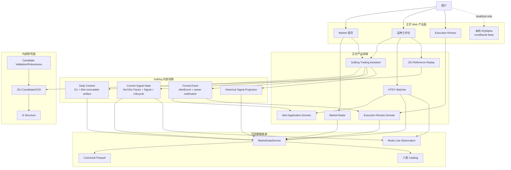
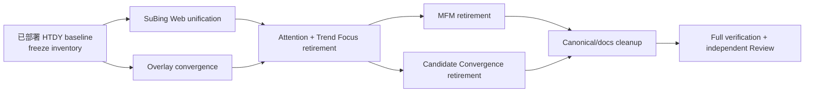

# 归一量化 Architecture Convergence V1 设计

状态：Proposed（Architecture “方案 B”与本轮修订处置方向已获用户批准；本精确修订稿仍待 Gate A 独立审查与用户精确批准）
日期：2026-08-25
设计基线：`develop@af172e1bfa2722681ca67ffbdc8c5c0e895dddd8`
任务等级：Lane 3 Program（产品收敛 + SuBing 信号口径 + HTDY Alert/migration 并行边界 + 大规模退役）

关联且继续有效的 HTDY canonical：

- `docs/superpowers/specs/2026-08-25-htdy-all-frequency-active60-design.md`
- `docs/superpowers/plans/2026-08-25-htdy-all-frequency-active60.md`

上述 HTDY 设计已由 PR `#208` 实现、完成独立 Review 并合入 `develop`。`v1.8.3` 的 production migration `20260825_0040`、release、Runtime promotion 与 Active60 × 七周期 production Scope 已在独立明确授权下完成；真实通知与 HTDY/SuBing 自然时点 evidence 仍是 pending。本设计只保护已部署的 HTDY 合同，不重做任何 migration、release、Runtime、Scope 或通知操作。

---

## 1. 决策摘要

归一量化已经完成主要横向能力建设，进入架构收敛阶段。用户选择的 Architecture “方案 B”固定为：

```text
正式产品面收缩
+ 有价值的内部研究保留
+ 无消费者、无日常价值或只服务已完成阶段的代码退役
```

本次增加两项明确约束：

1. **SuBing 从用户视角收敛为一个产品、一个入口、一个权威领域。**
2. **保护已部署的 HTDY 全品种、全正式周期图表显示与 `symbol × frequency` Alert Scope，不在本 Program 重新实现或逆转。**

收敛后的正式产品主线固定为：

```text
可信数据
→ Market 发现
→ SuBing Trading Assistant / HTDY Watcher
→ AlertEvent
→ 人工决策与执行
→ Execution Review
```

其中：

- SuBing 是一个完整交易助手产品；
- HTDY 是一个全周期观察与提醒产品；
- 日进斗金只保留“参考回放”产品面；
- N Structure、原始 JDJ Candidate、Candidate Validation/Robustness 保留在内部研究面；
- Market Trend Focus、Market Attention、Main Force Mirror、Five-Candidate Convergence 等退出 active 产品和代码面。

用户本轮批准的“方案一”只指修订处置：取消 MFM 与 Market Trend Focus 尚未执行的 future research/evidence Gate，并将它们的 active code、HTTP、CLI、Web、tests、phase-specific protocol/report 完整退役，Git history 是唯一恢复面。这是维护面收敛决策，不是 empirical `STOP`/`ALLOW` 结论，也不将 Architecture “方案 B”重命名；本 Program 不运行也不补造对应 evidence。

本设计不建立通用 Strategy 平台，不把 SuBing、HTDY、JDJ、N 强行适配到统一公式或统一事件模型。

---

## 2. 当前事实与冲突处理

### 2.1 当前 GitHub 基线

当前 `develop@af172e1bfa2722681ca67ffbdc8c5c0e895dddd8` 已包含：

- HTDY 全周期 × Active60 实现，PR `#208` 已 Review 并合入；
- `v1.8.3` 已 release 并 promotion 到精确 Runtime；
- production Alembic 已在 `20260825_0040 (head)`，HTDY Scope 已是 Active60 × 七周期 `420 pairs`；
- SuBing Daily Watch V1；
- SuBing current-rank1 Factor/Signal/Lifecycle read model；
- SuBing Formal AlertEvent 与 Execution Review；
- SuBing Historical Overlay；
- N、JDJ Candidate、JDJ Strategy Replay、MFM、Trend Focus、Candidate Convergence 等横向能力。

当前 HTDY 不再是 in-flight dependency。Architecture Convergence V1 的重叠任务直接以上述已集成、已部署合同为冻结基线：

```text
HTDY implementation = integrated develop / PR #208
production state    = v1.8.3 + migration 0040 + Runtime + 420-pair Scope complete
remaining Gates     = real notification + natural HTDY/SuBing evidence only
program rule        = preserve behavior; no external operation replay
```

任何修改以下重叠文件的任务都必须以已集成 HTDY 行为为 regression baseline：

```text
apps/quant-web/src/pages/market/chart.vue
apps/quant-web/src/components/market/ProductAlertRules.vue
apps/quant-web/src/components/market/ProductCheckSidebar.vue
apps/quant-web/src/api/alerts.ts
apps/quant-web/src/types/market.ts
services/quant-api/app/api/alerts.py
services/quant-api/app/alerts/*
services/quant-api/app/schemas/alerts.py
```

不得重写 HTDY evaluator、Scope/migration、Runtime trigger 或通知语义；不得从已完成 production 事实推导真实通知或自然 evidence 已完成。

### 2.2 SuBing 当前为何看起来是三个部分

当前用户可感知的 SuBing 被分散在三个产品表面：

```text
A. 首页“苏冰今日观察”
   D1 + 60m 盘后趋势背景，回答“今天重点看什么”

B. 首页“需要处理”与 Alert / Execution Review
   5m/15m Formal AlertEvent，回答“现在有什么必须处理”

C. 品种详情页“当前观察 + 更多研究 + 历史 Marker”
   Factor、Resolved Signal、Lifecycle、Historical Signal，回答“当前结构是什么”
```

它们不是三套可以互相替代的事实：

- Daily Watch 是盘后文件 artifact，target trading day 内固定；
- current signal state 是 current-rank1 Canonical + completed Live read model；
- Formal AlertEvent 是不可变 DB 事件，连接通知和 Execution Review。

问题不在于它们内部必须只有一种存储，而在于它们被当作三个产品分别展示、分别命名、分别加载，导致用户需要自己拼接上下文，且 Web 存在重复详情。

### 2.3 收敛的精确定义

“SuBing 收敛成一个”固定解释为：

```text
一个产品身份
+ 一个权威算法领域
+ 一个首页工作台
+ 一个详情面板
+ 一条从背景到事件再到复盘的连续用户流程
```

它**不**解释为：

```text
一个数据库表
一个超大 DTO
一个把文件、Live、AlertEvent 混在一起的 Service
一个同步失败就让全部 SuBing 不可用的聚合端点
```

---

## 3. 目标与非目标

### 3.1 目标

Architecture Convergence V1 完成后：

1. Market 首页只有 Runtime、SuBing、HTDY/正式事件事实和唯一全市场研究入口。
2. SuBing 在首页只出现一个 `SuBingWorkbench`，内部按优先级展示：
   - 当前需要处理的 SuBing Formal Event；
   - 下一/当前交易日 Daily Watch；
   - typed unavailable。
3. SuBing 在品种详情页只出现一个 `SubingPanel`，内部展示：
   - 当前 Formal Event/Execution Review action；
   - 当前 Resolved/Primary Signal；
   - 5m/15m Factor 方向；
   - Lifecycle；
   - SuBing product-level Alert Scope；
   - 折叠的数据身份与研究明细。
4. SuBing current read、Historical replay、Daily Watch 与 Alert 继续复用现有权威 Python 领域逻辑，Web 不复制公式。
5. HTDY 对 operational universe 全品种支持七个正式周期图表观察，并按当前 `symbol × frequency` 独立设置 Alert Scope。
6. Web 主图产品选择收敛为：

```text
无 | 苏冰 | 日进斗金参考回放 | 火天大有
```

7. N Structure 与 raw JDJ Candidate 不再作为 Web 产品入口，但内部研究和 JDJ strict-before dependency 保留。
8. 删除没有 active 产品消费者的 Trend Focus、Market Attention、MFM、Five-Candidate Dossier/Relationships 链路。
9. active canonical 文档只描述真实保留的模块与产品面；完成性过程文档从 Git history 追溯。

### 3.2 非目标

本阶段明确不做：

- 不修改 SuBing Factor、Signal、Calibration、FormalPolicy、Lifecycle 或 Daily Watch 公式；
- 不把 Daily Watch 自动变成 Alert Scope；
- 不把 SuBing 改为 frequency-scoped Alert；SuBing 继续是 product-level Scope；
- 不修改 HTDY approved Spec/Plan 的公式、Scope、Event identity、D1/W1 trigger 或通知语义；
- 不建立统一 `StrategyAdapter`、`OpportunityScore`、Scope DSL、插件系统或策略注册平台；
- 不把 Daily Watch artifact、current snapshot 与 AlertEvent 合并成一个存储；
- 不新增消息队列、retry、replay、backfill、outbox 或逐人通知状态；
- 不改变 Canonical、八表 Catalog、MainContractMap 或 MarketDataService；
- 保留 retained SuBing/HTDY/N/JDJ/Validation/Robustness accepted policies、Alembic migration、universe 与 pending prospective OOS baseline/evidence；明确例外是用户已取消 Gate 的 MFM phase-specific protocol 以及已完成 Five-Candidate phase-specific protocol/report，它们随对应退役删除；
- 不删除 RQAlpha 工作台；它在本阶段为 conditional keep；
- 不修改 Execution Review roll 语义；是否退役自动 roll 是独立后续决策；
- 本 Program 不发布 `main`、不创建 tag、不切换 Runtime、不执行新 production migration、不修改真实 Scope、不发送真实通知；已完成的 `v1.8.3/0040/420 pairs` 不重试。

---

## 4. 收敛原则

### 4.1 以用户任务而不是技术来源组织产品面

用户每天只需要完成三个动作：

```text
看什么
→ 现在是否出现信号
→ 是否执行并复盘
```

技术上 Daily Watch、current read 与 AlertEvent 可以保持独立，但 UI 必须把它们投影为同一个 SuBing 任务流。

### 4.2 只抽象真实重复

保留共享的：

- product identity；
- current-rank1 resolver；
- Factor/Signal/Lifecycle kernel；
- Web 状态协调、generation guard 和展示组件。

不统一不相同的：

- HTDY 与 SuBing Scope；
- Daily Watch 与 intraday Signal；
- SuBing Formal Event 与 HTDY observation Event；
- JDJ reference replay 与正式 AlertEvent。

### 4.3 删除整个失效链路，不留“隐藏但仍维护”代码

当产品面确认退出后，应按顺序删除：

```text
Web consumer
→ API projection
→ composition/export
→ domain/read model
→ CLI
→ tests
→ active docs/reports
```

不能只隐藏按钮而保留完整后端、测试和 canonical 负担。

### 4.4 先证明没有消费者再删除

每个删除任务必须用代码搜索、import graph、route tests 和 CLI parser tests证明：

- Web 无调用；
- Runtime 无调用；
- Alert 无调用；
- Execution Review 无调用；
- internal research 不依赖被删除部分；
- pending Gate 不消费对应 artifact。

### 4.5 Git history 是已完成过程的恢复面

完成且不再是 active canonical 的 Spec、Plan、review、packet、receipt、临时 report 不保留备份副本。删除后只从 Git history 恢复。

---

## 5. 目标架构



目标依赖方向仍然是：

```text
Web/API/CLI
→ application/read model
→ source-specific domain
→ MarketDataService / Redis / Application persistence
```

禁止：

```text
Market/Alert/Runtime → app.research
HTDY → SuBing
SuBing → HTDY
Web → Python formula duplication
RQAlpha → Canonical/Alert/Runtime
```

---

## 6. SuBing 单一产品设计

### 6.1 单一产品身份

所有用户可见名称统一为：

```text
苏冰
产品角色：Trading Assistant
```

允许的次级标签只是同一产品内的状态：

```text
今日观察
当前信号
生命周期
正式事件
需要处理
```

禁止继续把这些标签做成并列的独立产品卡、独立导航或独立策略开关。

### 6.2 一个权威领域，三个必要投影

#### A. Daily Context

职责：回答“今天看什么”。

权威事实：

```text
actual_dominant
D1 + 60m
EMA21 price side
slope_5 / slope_10
source trading day → target trading day
```

存储：扩展盘 immutable ledger/current。

生命周期：盘后生成，target trading day 内固定。

#### B. Current Signal State

职责：回答“当前结构与信号是什么”。

权威事实：

```text
current rank1 physical contract
5m / 15m Factor
primary / companion
primary_signal / resolved_signal
Lifecycle
Canonical + completed Live
```

权威入口继续是 `SubingReadService.snapshot()`；它已经同时返回 Factor、Signal 与 Lifecycle，不新增第二个 current resolver。

#### C. Formal Event

职责：回答“是否出现必须处理的正式信号”。

权威事实：不可变 `subing_entry_signal_v1` AlertEvent。

存储：Alert 两表。

后续：owner notification 与 Execution Review。

三者关系：


Daily Context 不授权 Event，Event 也不要求该品种必须在 Daily Watch 中。两者的关系是产品上下文，不是硬过滤器。

### 6.3 后端边界

V1 不新增把 Market artifact 与 Alert DB 聚合在一起的后端 mega endpoint。

保留现有权威接口：

```text
GET /api/v1/market/research/subing-daily-watch/current
GET /api/v1/market/research/subing
GET /api/v1/market/research/subing/history
GET /api/alerts/formal-signals/current
GET /api/alerts/products/{symbol}/current-events
GET/PUT SuBing product-level Alert Scope
```

原因：

- Daily Watch 属于 Market/盘后 artifact；
- Formal Event 属于 Alert Application Domain；
- 两者故障与持久化边界不同；
- 单用户项目不需要为 UI 一次请求新建跨域聚合服务。

统一发生在 Web application composition，而不是通过数据库或 API 重新耦合。

### 6.4 首页单一工作台

新增：

```text
SubingWorkbench.vue
useSubingWorkbench.ts
```

首页删除两个并列顶层组件：

```text
MarketFormalSignals.vue
SubingDailyWatch.vue
```

`SubingWorkbench` 接收或协调两类现有 DTO：

```ts
interface SubingWorkbenchState {
  formal: CurrentFormalSignalsResponse | null
  formalEventStates: Record<number, EventState>
  formalLoading: boolean
  formalStale: boolean
  dailyWatch: SubingDailyWatchCurrentResponse | null
  dailyLoading: boolean
  dailyStale: boolean
}
```

展示优先级：

1. `Formal Event`：位于工作台顶部，明确“需要处理”；
2. `Daily Watch`：多头观察、空头观察和 typed unavailable；
3. `empty/unavailable`：两个 source 分别标记，不互相伪装成功或失败。

失败隔离：

- Formal API 失败时，Daily Watch 仍可显示；
- Daily Watch 失败时，Formal Event 仍可处理；
- 任一 source 已有成功快照时刷新失败，保留并标记 stale；
- Formal 继续由 `useCurrentFormalSignals.ts` 保留最后一次成功快照，刷新失败只标记 `formalStale=true`，不清空 `status/tradingDay/items`；
- Formal 复用 `useCurrentFormalSignals.ts` 现有 generation，`useSubingWorkbench` 不得再包一层重复 Formal generation 或竞态判定；
- Daily 保留自身独立 generation guard；
- 一个统一 loading 状态不能覆盖 source-specific error。

首页不再让用户判断“需要处理”和“苏冰今日观察”是否属于同一系统。

### 6.5 详情页单一面板

新增：

```text
SubingPanel.vue
```

它替代详情页中重复的：

```text
ProductCheckSidebar 内的 SuBing 当前观察段
SubingResearchSection.vue
SubingLifecyclePanel.vue
SuBing 专属 Alert 展示碎片
```

`SubingPanel` 固定结构：

```text
1. 当前正式事件 / Execution Review action
2. 当前 Resolved Signal；无 resolved 时显示 Primary Signal
3. 5m / 15m Factor 方向与确认时点
4. Lifecycle stage / progress
5. SuBing Alert：当前品种 ON/OFF
6. 折叠详情：contract、segment、source mode、calibration、typed unavailable
```

`SubingPanel` 固定只产生 SuBing 行为：

```ts
emit('open-formal-event', event, state)
emit('toggle-subing-alert', ruleCode, enabled)
```

`ProductCheckSidebar` 负责精确分支：`subing` 只渲染一个 `SubingPanel`，不再在“当前观察”、“提醒”和“更多研究”重复 SuBing；`htdy` 继续渲染 HTDY 观察与 current-frequency pair Scope；`jdj_strategy` 只显示 reference facts；`none` 无策略 Alert。Sidebar 只转发上述 emits，不允许将 HTDY Rule 传入 `SubingPanel` 或将 SuBing toggle 路由到 pair endpoint。

它不重新计算任何 Factor、Signal 或 Lifecycle，只投影 `SubingReadSnapshot` 与 Alert DTO。

历史 SuBing marker 仍在 K 线主图显示，属于同一个 SuBing Overlay，而不是第二个“历史苏冰”产品。

### 6.6 SuBing Alert Scope 保持 product-level

SuBing Rule：

```text
subing_entry_signal_v1
scope identity = rule_code + symbol
```

不增加 frequency 维度。当前 5m/15m resolved signal 的同 boundary 抑制与 bar-level business identity 保持不变。

HTDY 新增的 `scope_product_frequencies` 只能由 `INDICATOR_OBSERVATION` Rule 使用；SuBing 必须保持该字段为空并继续使用 `scope_products`。

### 6.7 不做物理目录大搬家

V1 不因命名整齐而把所有 `subing_*` 文件移动到新目录。先删除用户表面和 composition 重复，保留已经被 Runtime/Research 共同复用的稳定 shared domain。

只有在完成消费者收敛后仍发现同一逻辑有两份实现，才在独立重构任务中移动或合并；不得把大规模路径迁移与产品删除放在同一任务。

---

## 7. HTDY 与收敛设计的兼容合同

HTDY 的目标固定为：

```text
operational universe 全品种
× 1m / 5m / 15m / 30m / 60m / 1d / 1w
× continuous / actual_dominant / contract 图表观察
```

Alert 固定为：

```text
actual_dominant rank1
+ current symbol × current frequency Scope
+ one stable Rule identity: htdy_original_15m
```

Architecture Convergence V1 不改变以下已批准合同：

- Web 只有一个 HTDY Overlay；
- Web 只有一个跟随当前 `symbol × frequency` 的 HTDY Switch；
- 切换图表周期不自动修改 Scope；
- HTDY Scope authority 是 `scope_product_frequencies`；
- SuBing Scope authority 是 `scope_products`；
- intraday 五周期复用 completed Live Bar；
- D1/W1 复用 `canonical_updated` 盘后 seam；
- 同时刻不同 HTDY 周期分别形成 Event；
- HTDY Event identity 含 frequency；
- SuBing Formal Event business identity仍是 bar-level；
- observation-only、future-looking、repainting metadata 不变；
- 不进入正式回测、交易策略或订单。

收敛阶段只允许做以下 HTDY 相关整理：

- 将 HTDY 作为最终四个 Overlay 之一；
- 删除与旧 15m-only 产品文案冲突的 active references；
- 在 SuBing Panel 重构时保护 HTDY pair Scope UI；
- 更新 canonical 文档为真实全周期实现状态。

不得在收敛任务中另写一套 HTDY evaluator、Scope migration 或 Runtime trigger。

---

## 8. 方案 B 完整矩阵

| 能力 | 分类 | 收敛后状态 | 理由 |
|---|---|---|---|
| Data Foundation / Canonical / Catalog / MDS | KEEP | 完整保留 | 可信事实链，不是横向冗余 |
| Market Runtime / After-market / health | KEEP | 保留现有进程隔离 | 生命周期不同，合并进程收益低、风险高 |
| Market Radar items/summary/sector/scatter | KEEP + REUSE | 唯一全市场研究 read model | 可复用一份事实驱动摘要、四象限和明细 |
| Market Attention | DELETE | 删除组件、Radar `attention`、sector DTO `attention_count`、规则与测试；不重定义 | 与四象限/明细/Daily Watch 重复，语义模糊 |
| Market Trend Focus | DELETE | 删除完整链路 | 已不是 active 首页产品，无 Runtime/Alert consumer |
| SuBing | UNIFY | 一个产品、两个 Web 组件、三个内部投影 | 用户任务统一，事实边界仍准确 |
| SuBing Candidate/OOS | INTERNALIZE | 只保留 CLI/evidence | 不作为日常 Web 产品 |
| HTDY | KEEP + PROTECT | 保护已部署的 Active60 × 七周期实现 | PR #208、migration/release/Runtime/Scope 已完成，本 Program 不重做外部操作 |
| N Structure | INTERNALIZE | 删除 Web Overlay，保留 reducer/Policy/JDJ context/OOS | 有内部因果价值，无独立日常产品价值 |
| raw JDJ Candidate | INTERNALIZE | 删除 Web Overlay，保留 Candidate/OOS | 避免 Candidate 与 Strategy Replay 混淆 |
| JDJ Strategy Replay | KEEP + RENAME | “日进斗金参考回放” | 保留用户可检查的确定性参考动作 |
| Candidate Validation / Robustness | KEEP INTERNAL | 保留 source-specific OOS 基础与 generic robustness relationship metrics/summary | 仍服务候选研究可信度 |
| Five-Candidate Dossier / Relationships | DELETE | 删除 Five-Candidate generator、CLI、protocol/report 与 dedicated tests | 只服务已完成阶段，不得误删 generic Robustness relationship metrics |
| Main Force Mirror V2 / Diagnostic | DELETE | 删除 Kernel、API、research/data CLI、Web、tests、active member-rank snapshot reader/builder/RQData provider 与 phase-specific protocol/report | 用户已取消未执行 evidence Gate；保留 Alembic migration/history 与仓库外已有 snapshot，不构成 empirical STOP/ALLOW |
| RQAlpha local workbench | CONDITIONAL_KEEP | 本阶段保留 | 已有投入，下一 JDJ 任务必须产生真实使用；不继续横向扩建 |
| Alert Domain | KEEP | 两表、one-shot 通知、两条 Rule | 当前个人项目足够，不扩消息基础设施 |
| Execution Review | KEEP | 保留现有人工闭环 | 直接服务真实决策与复盘 |
| Execution Review roll | DEFER | 本阶段不改 | 是否退役需独立业务决策与历史数据检查 |
| `.agents/skills` 六个 active skill | KEEP | 保留 | 直接服务当前领域 |
| 完成性 Spec/Plan/report | DELETE WHEN CLOSED | 吸收到 canonical 后删除 | Git history 已提供恢复 |
| Retained accepted policy / Alembic / universe / OOS baseline | KEEP | 保留 SuBing/HTDY/N/JDJ/Validation/Robustness policy、migration history、universe 与 prospective OOS | 属于重建、身份或未来 Gate 的事实资产；MFM 与 Five-Candidate phase-specific protocol/report 是退役例外 |

---

## 9. Web 产品面合同

### 9.1 Market 首页

最终顺序：

```text
Runtime 状态
→ SuBing Workbench
→ 全市场研究（折叠）
```

SuBing Workbench 内部包含正式事件和 Daily Watch；不再有两个并列顶层卡片。

全市场研究只包含：

```text
Market Summary
价格变化 × OI 变化四象限
Market Detail Table
```

删除：

```text
MarketAttentionList
MarketFocusList
自选/额外评分/额外选品清单
```

HTDY 不增加第二个首页扫描器。HTDY 的正式 Event 可在 SuBing Workbench 之外以通用“当前提醒”极窄摘要显示，或只在当前品种/通知中出现；本 V1 不新增 HTDY 首页排行榜。

### 9.2 品种工作台

主图 Overlay 固定：

```text
none
subing
jdj_strategy
htdy
```

用户文案：

```text
无
苏冰
日进斗金参考回放
火天大有
```

删除：

```text
n_structure
jdj raw candidate
```

旧 localStorage 中 `n_structure`、raw `jdj` 和任何 unknown Overlay 值读取时统一迁移为 `none`，不得报错、默认选中 SuBing 或继续发起旧 HTTP 请求。日进斗金稳定 id 始终是 `jdj_strategy`，不新增 `jdj_strategy_reference` 别名。

详情页 Overlay 分支必须显式穷举：

```ts
switch (selectedOverlay) {
  case 'none':
  case 'subing':
  case 'jdj_strategy':
  case 'htdy':
}
```

禁止“其他 Overlay 一律按 HTDY”之类兜底。

### 9.3 Alert 开关

同一详情页中：

- SuBing：当前品种级 ON/OFF；
- HTDY：当前品种 × 当前图表周期 ON/OFF；
- JDJ reference：无 Alert；
- none：不显示策略 Alert 开关。

图表 Overlay 与 Alert Scope mutation 始终独立；选择 Overlay 不能自动开关任何 Rule。

---

## 10. 退役边界

### 10.1 N 与 raw JDJ：只退役产品 projection

删除：

- Web definitions/types/options；
- HTTP Historical Overlay route 和 DTO；
- Web request/composable/marker mapping；
- 只测试 Web projection 的 tests。

保留：

- `app.research.n_structure`；
- N Policy/reducer/strict-before tests；
- JDJ 对 N context 的内部依赖；
- raw JDJ Candidate reducer；
- Candidate Validation/Robustness/OOS evidence。

### 10.2 Market Attention 与 Trend Focus：完整退役

删除：

- read model/domain；
- API/schema，包括 Radar response 的 `attention` 和 sector DTO 的 `attention_count`；
- 任何 Trend Focus CLI 或 phase-specific protocol/report（当前树未发现，执行时仍需搜索确认）；
- Web component/client/type；
- unit/E2E；
- canonical 引用。

在删除前必须证明没有 CLI、Runtime、Alert 或 internal Candidate consumer。

Attention 的 `attention`/`attention_count` 是删除对象，不重定义为新排名、新评分或其他名称的相同计算。Trend Focus 尚未执行的 future research/evidence Gate 已取消；退役不运行该 Gate，也不形成 empirical `STOP`/`ALLOW`。

### 10.3 MFM：完整退役

删除范围包括：

```text
quant-core indicator/registry/policy exports
Market service/composition/API/schema
app.research.main_force
research CLI command/request/payload/parser
data CLI `member-rank snapshot` parser/dispatch
active member-rank snapshot reader/builder and RQData member-rank provider
Web composable/presentation/panel
unit/E2E/golden/reference
MFM-specific reports and active canonical
data/research_protocols/main_force_mirror_diagnostic_phase_a_v1.json
```

`services/quant-api/app/research/main_force/` 、MFM research CLI 所有 command/request/payload/parser、`data member-rank snapshot` active CLI、member-rank reader/builder/RQData provider、所有 MFM unit/research/CLI/API/Web tests 和 golden fixture 都属于同一 active 维护面，必须一次性退役。删除 phase-specific protocol 表示取消未执行 Gate，不是运行 evidence 或生成 `STOP`/`ALLOW`。

退役只删除 active RQData member-rank provider/CLI 与仓库内 reader/builder；保留 Alembic migration/history 以及既有表身份测试，不执行 production migration。仓库外既有 `main_force_member_rank_v1` snapshot 数据不删除、不修改，只通过 Git history 恢复对应 active reader/provider 能力。

不得删除通用 EMA/MACD/ATR/HTDY Indicator Kernel。

### 10.4 Candidate Convergence：删除阶段性汇总器

删除：

```text
app.research.candidate_convergence
candidate-dossier CLI
candidate-relationships CLI
对应 tests
reports/research/candidate_dossier
reports/research/candidate_relationships
data/research_protocols/five_candidate_research_dossier_v1.json
data/research_protocols/five_candidate_relationship_topology_v1.json
```

保留：

```text
candidate_validation
candidate_robustness
source-specific policies
pending prospective OOS baseline/evidence
services/quant-api/app/research/robustness/multi_candidate_events.py
services/quant-api/app/research/robustness/multi_candidate_robustness_service.py
services/quant-api/tests/test_multi_candidate_events.py
```

Candidate Convergence 的 phase-specific protocol JSON 与两个已完成 freeze report 只支持已结束的 dossier/relationship phase；它们与汇总器一起删除。SuBing/HTDY/N/JDJ 源模块、Candidate Validation/Robustness 的 protocol/report 以及 pending prospective OOS 必须保留。

`summarize_candidate_relationship` 等 generic Robustness relationship summary 是 retained Validation/Robustness 内部指标，不是 Five-Candidate Relationships generator。退役搜索只拒绝 retired module/command/protocol/report/dedicated-test identity，不得将 generic relationship metric 当作残留。

---

## 11. 文档与一次性资产规则

### 11.1 可以删除

完成实现并将稳定合同吸收到 canonical 后，可删除：

- 对应 completed Superpowers Spec/Plan；
- 只记录已完成实施过程的 task contract、review packet、receipt；
- 退役模块的完成性 report；
- 过期且被 `AGENTS.md`/`DEVELOPMENT.md`/`TESTING.md` 覆盖的审查说明；
- 退役功能的 OpenSpec；
- 无消费者的 GitHub issue template。

### 11.2 不可按“一次性”删除

必须保留：

- Alembic migration history；
- retained SuBing/HTDY/N/JDJ/Validation/Robustness accepted policy 与公式身份；
- current Canonical/OpenSpec data contracts；
- pending prospective OOS baseline/evidence；
- 仍被 Runtime health、release 或 rollback 使用的 artifact；
- universe 文件；
- current `STATUS.md` pending Gate evidence。

上述保留规则不适用于已明确退役的 phase-only 产物：`main_force_mirror_diagnostic_phase_a_v1.json`、Five-Candidate dossier/relationship 两个 protocol 及其 completed reports 与对应代码同时删除。

### 11.3 当前两组 active docs

本 Program 执行期间保留：

```text
HTDY all-frequency Spec/Plan
Architecture Convergence V1 Spec/Plan
```

HTDY 实现、Review、develop integration 与 production 操作已是既有事实，但 Task 7 不在 Task 8 前删除 HTDY Spec/Plan。只有 Architecture Convergence V1 全 Program 完成后，才可以独立 closeout 删除 HTDY 与本 Program 的 completed Spec/Plan；Git history 为恢复面。

---

## 12. 实施顺序与并行限制



硬规则：

1. HTDY implementation、production migration、release、Runtime promotion 与 Scope mutation 不由本 Plan 重复执行。
2. Task 0 先冻结 PR #208 后的已部署 HTDY 行为与 remaining Gate inventory。
3. `chart.vue`、Alert types/API、ProductAlertRules、ProductCheckSidebar 的任务必须以已集成 HTDY 的最新 `develop` 为基线并保护其 regression。
4. MFM 与 Candidate Convergence 是两个独立删除任务，可在产品面收敛后并行 Review，但不得在同一 PR。
5. 每个任务完成后先进入 `develop`，最后才形成 release candidate。

---

## 13. 测试策略

### 13.1 SuBing parity

必须证明：

- `SubingReadSnapshot` 的 Factor、Signal、Lifecycle 内容未改变；
- Daily Watch JSON contract 未改变；
- Formal AlertEvent identity、Scope、notification route 未改变；
- Historical Signal events 未改变；
- 页面合并前后相同 fixtures 生成相同可见事实和 action。

不需要为纯 Web composition 重跑真实盘后或真实通知。

### 13.2 HTDY coexistence

收敛任务必须重跑已部署 HTDY 的 focused suites，证明：

- 7 周期 capability 仍在；
- HTDY pair Scope 不被 SuBing product Scope 组件覆盖；
- 频率切换不 mutation Scope；
- persistent marker 只显示当前 event frequency；
- SuBing bar-level Event identity 不被放宽。

### 13.3 删除验证

每个退役任务至少执行：

```text
repository search: 旧模块名、route、CLI command、DTO、error code
import smoke
focused backend tests
focused Web unit/E2E
Ruff
Mypy
Web build
secret scan
git diff --check
```

MFM 和 Candidate Convergence 删除后，必须运行完整 non-isolated backend 与完整 Web suite，避免隐藏 imports。

### 13.4 不运行的真实操作

收敛实现不运行：

- 新 production migration 或对既有 `0040` 的重试；
- production DB/Redis/Canonical write；
- real Alert Scope mutation；
- real PushPlus；
- manual after-market；
- Runtime switch；
- main/tag/release；
- RQAlpha real smoke。

---

## 14. Gate 与发布边界

本设计对应多任务 Lane 3 Program。

### Gate A：Spec/Plan 批准

用户批准本精确 Spec 与 Plan 后，才允许开始 Architecture Convergence V1 代码任务。

### Gate B：已部署 HTDY baseline

所有重叠任务必须确认目标基线包含 PR `#208` 的 HTDY 行为，并保护七周期、pair Scope、Event identity 与 one-shot notification 合同。

### Gate C：逐任务 Review

以下任务必须独立 Review：

- SuBing single-product composition；
- Overlay/API removal；
- Trend Focus/Attention removal；
- MFM removal；
- Candidate Convergence removal；
- final canonical cleanup。

### Gate D：允许集成 develop

每个 task branch 的测试与 Review 独立通过后，才能集成 `develop`。Lane 3 不自动批量合并。

### Gate E：release

完整候选通过全量测试与独立 Review后，用户另行批准 `main + annotated tag`。

### Gate F：Runtime promotion

release 后用户再次独立批准 Runtime promotion。release 批准不包含 Runtime、production migration、Scope mutation 或真实通知。

HTDY production migration `0040`、Active60 × 七周期 Scope、release 与 Runtime promotion 已是既有事实，本 Program 不重试。真实通知、HTDY 自然 D1/W1 evidence 与 SuBing 自然 after-market/Live evidence 仍是独立 pending Gate；prospective OOS 仍是 future research Gate。MFM 和 Trend Focus future evidence Gate 已被用户取消，不得与这些保留 Gate 混淆。

---

## 15. 验收标准

### 15.1 产品面

- [ ] 首页只出现一个 SuBing 工作台，不再并列显示 Formal Signals 与 Daily Watch 两个产品卡。
- [ ] SuBing 工作台能独立展示 Formal、Daily Watch 的 ready/loading/stale/unavailable。
- [ ] 详情页只有一个 SuBing Panel，不再重复“当前观察/研究明细/Lifecycle”三块。
- [ ] 主图 Overlay 精确为“无｜苏冰｜日进斗金参考回放｜火天大有”。
- [ ] N 和 raw JDJ 不再产生 Web 请求或 marker。
- [ ] HTDY 对七周期与全部 operational products 保持可显示。
- [ ] HTDY Switch 只控制当前 `symbol × frequency`；SuBing Switch 只控制当前 symbol。
- [ ] 首页全市场研究只保留 Summary、Scatter、Detail Table。

### 15.2 架构与准确性

- [ ] SuBing formulas、Daily Watch classification、Historical events、Formal Event identity 无行为漂移。
- [ ] SuBing 与 HTDY Scope authority 不混用。
- [ ] Market、Runtime、Alert 不新增对 `app.research` 的反向依赖。
- [ ] 无通用 Strategy adapter、mega endpoint、第二套 resolver 或第二套事实存储。
- [ ] Trend Focus、Attention、MFM 不再有 active imports/routes/research 或 data CLI/tests/protocols/reports 或产品/canonical 声称；MFM active member-rank reader/builder/provider 已退役，而 Alembic migration/history、表身份测试与仓库外既有 snapshot 保留；Five-Candidate Dossier/Relationships generator、CLI、protocol/report 与 dedicated tests 不再 active；本执行中退役 Spec/Plan 保留到 Program 后 closeout。
- [ ] N/JDJ internal reducers、Candidate Validation/Robustness 和 pending OOS evidence 保持可用。
- [ ] Generic Robustness relationship metrics/summary 及 `multi_candidate_events.py`、`multi_candidate_robustness_service.py`、`test_multi_candidate_events.py` 保留。
- [ ] Canonical、Catalog、MDS、Alert 两表、Execution Review 四表边界不被错误改写。

### 15.3 工程

- [ ] focused 和 full backend tests 通过。
- [ ] isolated PostgreSQL HTDY migration suites 通过；production `0040` 是执行本 Program 前已完成的既有事实，本 Program 未执行新 production migration。
- [ ] Web unit、Playwright、production build 通过。
- [ ] Ruff、Mypy、OpenSpec、secret scan、diff check 通过。
- [ ] independent Review 结论为 `允许集成 develop`。
- [ ] 本 Program 未触及 main、tag、Runtime、production data、真实 Scope 或通知。

---

## 16. 被拒绝的方案

### 16.1 只隐藏 Web

拒绝。后端、CLI、tests、docs 仍持续维护，Codex 仍会把退役能力当作 active architecture。

### 16.2 删除所有内部研究

拒绝。N、JDJ Candidate、Validation/Robustness 仍是日进斗金和未来 OOS 的真实基础。

### 16.3 把 SuBing 三种事实合成一个表/端点

拒绝。Daily artifact、current read 与 immutable Event 的生命周期和故障边界不同，强行合并会降低准确性。

### 16.4 新建通用 Strategy/Signal 平台

拒绝。当前只有固定少量 source-specific 系统，抽象成本高于复用价值。

### 16.5 撤回 HTDY 全周期设计

拒绝。HTDY PR `#208` 已实现、Review 并合入，`v1.8.3` migration/release/Runtime/Active60 × 七周期 Scope 已部署完成；Architecture Convergence V1 必须保护该既有合同，不得逆转。

---

## 17. 最终产品记忆模型

```text
归一量化
=
可信数据底座
+ Market 发现
+ 一个苏冰交易助手
+ 一个火天大有全周期观察器
+ 一个日进斗金参考回放
+ Alert 提醒
+ 人工 Execution Review
+ 少量不暴露到产品面的内部研究
```

收敛的目标不是“代码越少越好”，而是：

```text
每一个保留的模块都有真实消费者；
每一个用户入口都对应明确任务；
每一份事实只有一个权威来源；
研究、正式事件和人工执行不会互相冒充。
```
