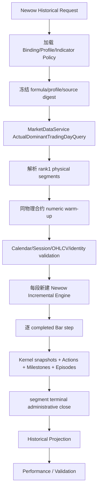

# Newow 独立策略产品族 Spec

状态：`DESIGN_REVIEW_PENDING`

日期：2026-08-31

任务：Issue #262

基线：`develop@a8c394a4c38f0190da531fb00e6892ec5ea5f81a`

替代方向：Issue #259 / PR #260 中“把牛哇概念作为苏冰分层消融”的实施方向

> 本文是 Lane 3 / Design-only 的规范性设计。它定义 Newow（牛哇）独立策略产品族的公式、身份、期货数据语义、状态机、Historical/Incremental 计算、API/Web 投影、因果验证与 OOS 合同。本文不代表牛哇财经私有原始公式，不声明策略盈利，不修改任何苏冰事实，不授权 Alert、Runtime、RQData、Canonical、production DB/Redis、真实通知、订单、main、tag 或 release 操作。

---

## 1. 来源、推断与事实边界

### 1.1 来源明确支持的内容

《牛哇盯盘：AI 可视化盯盘实战指南》明确描述了：

- 蓝变黄买入、黄变黄持有、黄变蓝卖出、蓝变蓝观望；
- 频繁黄蓝切换、无庄控盘或处于“拉高出货”阶段时应放弃买点；
- 基于波动率，使用偏度和峰度量化涨跌风险；
- “吸筹—洗盘—拉高—出货”的阶段化表达；
- A 点首次突破、B 点回踩后二次确认、C/D 结构止损；
- 矩形、三角形、旗形、楔形、双顶底、头肩、杯柄等形态；
- 杯柄的杯底缩量、柄部浅回调、突破杯口和假突破止损；
- 震荡上涨时高抛低吸、趋势上涨时持有主升浪。

期货补充资料明确支持：

- 均线之上只做多、均线之下只做空；
- MACD 零轴附近交叉、成交量放大、持仓量增加和震荡区间突破；
- 假突破及时止损，突破后若干根 K 线不回到区间才属于有效突破；
- 首次突破轻仓、回踩不破后再次突破为二次确认；
- 进场后 3—5 根 K 线不延续应退出；
- 期货需要额外关注成交量、持仓量、主力合约、夜盘和杠杆风险。

### 1.2 来源没有公开的内容

来源没有公开以下可复算规范：

- 黄蓝操盘带的完整公式和 seed policy；
- 偏度、峰度、乖离、阶段标签的窗口、阈值和权重；
- 形态识别的 Pivot、边界、容差和重复匹配规则；
- “策略年化收益匹配、策略绑定个股”的参数选择过程；
- 目标价私有算法、实际成交时序、手续费与全样本结果。

因此，本文中的精确公式、阈值、版本、状态和验收标准都是归一量化的 clean-room 研究定义。产品和页面必须使用“受牛哇手册启发”“统计候选”“研究参考”等表述，禁止写成“复刻牛哇原公式”“主力真实吸筹/出货”或“已经证明盈利”。

---

## 2. 已确认产品决策

### 2.1 独立产品族

```text
Newow / 牛哇策略产品族
├── 牛哇趋势策略            newow_trend_v1
├── 牛哇震荡策略            newow_range_v1
└── 五类共享底层内核
    ├── 阶段内核
    ├── 形态内核
    ├── 目标与风险内核
    ├── 同周期证据融合内核
    └── 风险与执行内核
```

### 2.2 与苏冰的绝对隔离

Newow 不得：

- 读取或筛选 `subing_strategy_v1` Action；
- 继承苏冰 Lifecycle、Position、Episode、Pivot、Daily Context 或 AlertEvent；
- 修改苏冰公式、历史投影、效果快照、Current、Alert、Scope 或 Runtime；
- 使用苏冰版本号表达 Newow 公式；
- 把 Newow 未通过的事件写回、删除或覆盖苏冰事实。

两者只允许共享：

- `MarketDataService`、TradingCalendar、TradingSession、MainContractMap；
- Canonical Bar 与 completed Live 的已有读取边界；
- EMA、ATR、MACD 等纯数学 Kernel；
- 原子文件发布、不可变快照、参数摘要和只读 HTTP 的工程模式。

### 2.3 当前周期绑定

```text
牛哇趋势策略
= newow_trend_v1 @ newow_tf_1d_v1
= actual_dominant + completed D1

牛哇震荡策略
= newow_range_v1 @ newow_tf_15m_v1
= actual_dominant + completed 15m
```

当前 V1 严格同周期：

- 趋势策略只读取 D1；
- 震荡策略只读取 15m；
- 不使用周线否决；
- 不用日线给 15m 震荡定方向；
- 不用 5m 或 1m 确认；
- 不进行任何跨周期证据融合。

未来可以新增：

```text
newow_trend_v1 @ newow_tf_60m_v1
newow_range_v1 @ newow_tf_60m_v1
newow_range_v1 @ newow_tf_1d_v1
```

新增周期必须新增 immutable Timeframe Profile、Candidate Manifest、Validation Protocol、Gold Set 与 OOS 身份。不得修改旧 Profile，也不得在 V1 中写 `if frequency == ...` 的周期特判。

---

## 3. 目标与非目标

### 3.1 目标

1. 建立可解释、可复算、可增量、无未来函数的 Newow 五内核；
2. 建立彼此独立的牛哇趋势和牛哇震荡状态机；
3. 同一权威 `step(completed_bar)` 同时服务 Historical batch、Incremental、Current 和未来 completed-Live；
4. 在 Market Web 上显示趋势带、箱体、Swing、Structure、阶段、形态、A/B、止损与目标；
5. 使用 `actual_dominant`，严格隔离 rank1 物理合约段；
6. 分开验证“形态识别是否正确”和“策略是否有样本外增量”；
7. 为未来 60m / D1 扩展保留 Profile 复用能力，不建设通用策略平台。

### 3.2 非目标

- 不创建 UniversalStrategyAdapter、统一 Opportunity 模型或 mega strategy engine；
- 不创建账户、手数、保证金、下单、成交回报、真实仓位或自动反手；
- 不输出资金曲线、复利收益、年化收益、Sharpe 或净利润；
- 不模拟排队、撮合、涨跌停队列、手续费或滑点；
- 不按品种独立优化参数；
- 不使用机器学习、截图分类或大模型作为 V1 权威识别器；
- V1 不接 Alert、Scope、PushPlus、Runtime 或生产数据库；
- 不在 HTTP 请求路径进行全历史重放或写 cache。

---

## 4. 版本与唯一身份

### 4.1 Timeframe Profile

`NewowTimeframeProfile` 只定义同一算法在某一周期下的 immutable 参数：

```text
schema_version
profile_id
frequency
profile_version

ema_fast_period
ema_slow_period
atr_period
macd_fast / slow / signal
moment_window

minor_swing_reversal_atr
minor_min_leg_bars
major_swing_reversal_atr
major_min_leg_bars

pattern_min_bars
pattern_max_bars
cup_handle_mode

breakout_buffer_atr
retest_tolerance_atr
stop_buffer_atr
breakout_validation_bars
time_stop_bars
segment_entry_cooldown_bars
max_entry_gap_atr

allowed_pattern_families
parameters_hash
```

### 4.2 Strategy Binding

`NewowStrategyFrequencyBinding` 决定一个上层策略是否允许消费某个 Profile：

```text
strategy_code
formula_version
profile_id
series_kind
research_capable
web_capable
live_capable
alert_capable
```

V1 固定：

| strategy_code | profile_id | series_kind | research | web | live | alert |
|---|---|---|---:|---:|---:|---:|
| `newow_trend_v1` | `newow_tf_1d_v1` | `actual_dominant` | true | true | false | false |
| `newow_range_v1` | `newow_tf_15m_v1` | `actual_dominant` | true | true | false | false |

### 4.3 Strategy Instance Identity

```text
strategy_instance_id = sha256(
  strategy_code
  + formula_version
  + profile_id
  + profile_hash
  + series_kind
  + source_policy_id
  + indicator_policy_digest
)
```

同一公式不同周期必须是不同实例；不同实例的 Action、Episode、Snapshot 和 OOS 不合并。

---

## 5. 期货市场专属数据合同

### 5.1 唯一数据入口

Newow Historical 只能通过：

```text
RQData
→ staging + hard validation
→ Canonical Parquet
→ Catalog + MainContractMap
→ MarketDataService
```

不允许读取连续合约文件、glob、自选主力、从网页 Bars 反算或跨频回退。

### 5.2 actual_dominant 与物理合约段

`actual_dominant` 是按 `(symbol, trading_day)` 的 rank1 `MainContractMap` 拼接的查询模式，不是物理 Dataset。Newow 必须把每个 rank1 物理段识别为：

```text
NewowSourceSegment
├── symbol
├── contract
├── effective_start_trading_day
├── effective_end_trading_day
├── segment_id
├── source_identity
└── source_manifest_digest
```

以下状态全部不得跨段：

- Swing / Structure / Pattern 生命周期；
- Range revision；
- Phase 离散状态；
- pending Action；
- active Episode；
- stop / target / trail；
- outcome horizon；
- volume / OI 比较窗口的离散事件身份。

同一物理合约跨交易日继续交易不构成 rollover；只有 MainContractMap 的物理合约变化才构成新段。

### 5.3 夜盘与 trading_day

- 夜盘 Bar 的身份以 Canonical `trading_day` 为准，不以自然日期为准；
- 交易日窗口必须由 TradingCalendar 与 TradingSession 解析；
- 不使用固定 21:00、23:00、01:00 等时刻猜测夜盘；
- 同一交易日可包含前一自然日夜盘和当日日盘；
- session break 不是缺口，不得以固定分钟数推断“下一根 Bar”。

`next_same_contract_bar` 的含义是：按权威 Session 顺序的下一根实际 Bar，而不是 `bar_end + frequency`。

### 5.4 日线、收盘价与结算价

期货 D1 事实来自交易所日行情。Newow V1：

- 信号、EMA、ATR、MACD 和形态使用 `close`；
- 入场/退出参考使用下一同物理合约 D1 `open`；
- 不以 `settlement` 替代 `close`；
- 不声称 reference change 等于期货逐日盯市损益；
- 不计算保证金、结算盈亏或账户风险。

### 5.5 成交量与持仓量

- volume 与 open_interest 必须来自同一物理合约；
- 主力换月时不得比较旧合约和新合约 OI；
- OI 缺失时保持 `null/unavailable`，禁止填 0、前向填充或读取其他合约；
- 几何形态可以在 OI 缺失时存在，但参与度分数和部分策略 Gate 必须降级或 fail-closed；
- 成交量和 OI 只说明参与度，不声称识别了真实多头/空头持仓归属。

### 5.6 乘数、最小变动价位与价格限制

当前 Catalog 有 `contract_multiplier`，但没有形成 Newow 可依赖的完整 tick size、涨跌停价、手续费和交易保证金合同。因此 V1：

- 价格、stop、target 与 R 使用 `Decimal`；
- risk level 不声称已按交易所最小价位舍入；
- 不输出货币 PnL；
- 不输出可执行手数；
- 不根据 OHLC 猜测“涨停/跌停”。

若某 Bar `open == high == low == close`，只标记：

```text
ONE_PRICE_BAR
```

禁止标记为涨停或跌停。ONE_PRICE_BAR 阻止新 entry 和 next-open reference adoption，但不阻断已有 Episode 的风险观察。

未来若要进入 Alert 或订单研究，必须先增加独立的交易规格合同：tick size、limit price、multiplier、fees、margin、close-today 规则和撮合可达性。

### 5.7 跳空与参考成交

Newow Action 的 reference fill 不是实际成交：

```text
fill_basis = next_same_contract_bar_open_reference
```

Pending entry 在下一实际同合约 Bar open 需要二次校验：

```text
gap_atr = abs(next_open - signal_close) / ATR_signal
```

固定：

```text
gap_atr <= 0.50
next bar 非 ONE_PRICE_BAR
open 未越过 stop
open 未越过 Target1
actual RR 仍满足策略阈值
```

否则输出 `ENTRY_GAP_INVALIDATED`，不创建 Episode。

### 5.8 主力换月行政关闭

状态不得跨物理段。Historical 遇到段末仍有 Active Episode 时：

- 以旧段最后一个 completed Bar close 形成 `CONTRACT_SEGMENT_END` 行政参考关闭；
- `fill_basis=segment_terminal_close_reference`；
- `administrative_close=true`；
- 不声明该价格在真实交易中可成交；
- 行政关闭不进入策略主质量指标，但单独计数并展示 raw reference change。

Incremental 遇到不同 Live contract 时，不得立即切换。先返回 `LIVE_CONTRACT_AUTHORITY_PENDING`，仅在 `canonical_updated` 使 MainContractMap 正式 rollover 后关闭旧状态并从新段重建。

### 5.9 同合约 warm-up

为减少主力切换后 EMA/ATR/Moments 长时间不可用，允许：

- 从同一真实物理合约在成为 rank1 前的历史加载纯数值 warm-up；
- warm-up 必须通过 `ContractTradingDayQuery` 和合约 `[listed_date, expired_date)` 有效期；
- EMA、ATR、MACD、rolling moments 可使用这些 Bars；
- Swing、Structure、Pattern、Range、Action 和 Episode 必须在 `effective_start_trading_day` 重置；
- warm-up Bar 不输出任何正式事件；
- 每个 segment 前若 numeric warm-up 不足，明确 `WARMUP_INSUFFICIENT`；
- 进入新段后的前若干 Bar 仍受 `segment_entry_cooldown_bars` 阻塞，避免主力迁移造成的 volume/OI 突增被误判为突破。

---

## 6. 初始周期 Profile

### 6.1 `newow_tf_1d_v1`

```text
frequency                        = 1d
ema_fast_period                  = 10
ema_slow_period                  = 21
atr_period                       = 14
macd                             = 12 / 26 / 9
moment_window                    = 60

minor_swing_reversal_atr         = 1.0
minor_min_leg_bars               = 3
major_swing_reversal_atr         = 2.0
major_min_leg_bars               = 5

pattern_min_bars                 = 10
pattern_max_bars                 = 120
cup_handle_mode                  = research_only

breakout_buffer_atr              = 0.10
retest_tolerance_atr             = 0.35
stop_buffer_atr                  = 0.25
breakout_validation_bars         = 3
time_stop_bars                   = 3
segment_entry_cooldown_bars      = 1
max_entry_gap_atr                = 0.50
```

### 6.2 `newow_tf_15m_v1`

```text
frequency                        = 15m
ema_fast_period                  = 10
ema_slow_period                  = 21
atr_period                       = 14
macd                             = 12 / 26 / 9
moment_window                    = 60

minor_swing_reversal_atr         = 1.0
minor_min_leg_bars               = 3
major_swing_reversal_atr         = 2.0
major_min_leg_bars               = 5

pattern_min_bars                 = 8
pattern_max_bars                 = 64
cup_handle_mode                  = disabled

breakout_buffer_atr              = 0.10
retest_tolerance_atr             = 0.35
stop_buffer_atr                  = 0.25
breakout_validation_bars         = 3
time_stop_bars                   = 3
segment_entry_cooldown_bars      = 3
max_entry_gap_atr                = 0.50
```

未来 60m Profile 必须独立冻结，不直接复制 15m 或 D1 参数。

---

## 7. 模块边界

### 7.1 Pure Kernel

```text
packages/quant-core/guiyi_quant/newow/
├── contracts.py
├── profiles.py
├── phase.py
├── swing.py
├── structure.py
├── target_risk.py
├── evidence.py
├── execution.py
└── patterns/
    ├── models.py
    ├── geometry.py
    ├── lifecycle.py
    ├── channels.py
    ├── flags.py
    ├── double_patterns.py
    ├── head_shoulders.py
    ├── cup_handle.py
    └── candles.py
```

职责：

- NumPy-only；
- 无 DB、Redis、文件、网络和时钟；
- 输入 immutable completed Bar 与 immutable Profile；
- 输出 immutable state / transition；
- 不知道 active60、Alert、Web、Scope 或 production；
- 不写 snapshot，不产生订单。

### 7.2 Strategy Application

```text
services/quant-api/app/market_data/newow/
├── contracts.py
├── bindings.py
├── source_segments.py
├── engine.py
├── trend_machine.py
├── range_machine.py
├── historical_service.py
├── current_service.py
├── overlay_projection.py
├── performance.py
├── snapshot.py
├── snapshot_store.py
├── lineage.py
├── incremental.py
└── composition.py
```

职责：

- 只通过 MarketDataService 加载 actual_dominant / contract warm-up；
- 冻结 physical segment；
- 组合五内核与两条策略机；
- 管理 Action、Milestone、Episode 和 snapshot；
- 不引用 `subing_strategy` 包；
- 不读写 Alert 或 Runtime。

### 7.3 Research Validation

```text
services/quant-api/app/research/newow/
├── candidate_authority.py
├── gold_set.py
├── pattern_validation.py
├── strategy_validation.py
├── reports.py
└── composition.py
```

职责：

- 加载 digest-pinned Candidate Manifest 和 Protocol；
- 执行 Gold Set、retrospective、rolling、prospective OOS；
- 只输出研究报告；
- 不自动选择 winner 或晋升。

### 7.4 API / Schema / Web

```text
services/quant-api/app/api/market_newow.py
services/quant-api/app/schemas/newow_research.py

apps/quant-web/src/api/market.ts
apps/quant-web/src/types/newow.ts
apps/quant-web/src/composables/useNewow*.ts
apps/quant-web/src/components/market/Newow*.vue
apps/quant-web/src/utils/newow*.ts
```

Web 只消费 typed API，不复制公式，不在浏览器计算权威 Swing、Pattern 或 Strategy。

### 7.5 指标政策

Newow 可以复用已验证 EMA Kernel，但 ATR 与 MACD 不能静默复用 Web compatibility policy。实现前必须建立并验证：

```text
newow_ema_sma_window_v1
newow_atr_wilder_sma_seed_v1
newow_macd_sma_window_scale1_v1
```

这些 policy 的 allowed consumer 只包含 Newow research / historical，live 和 alert 默认阻塞。

---

## 8. 共同数据模型

### 8.1 Kernel Envelope

所有五内核输出统一携带：

```text
NewowKernelEnvelope
├── product
├── contract
├── segment_id
├── trading_day
├── frequency
├── profile_id
├── profile_hash
├── formula_version
├── source_bar_end
├── observed_at
├── confirmed_at
├── ready
├── valid
└── unavailable_reason
```

### 8.2 Swing

```text
NewowSwingPoint
├── swing_id
├── scale                MINOR | MAJOR
├── kind                 HIGH | LOW
├── pivot_at
├── confirmed_at
├── price                Decimal
├── atr_at_pivot         Decimal
├── reversal_distance    Decimal
├── previous_swing_id
├── leg_bars
├── leg_move_atr
└── segment_id
```

`pivot_at` 是极值发生时间；`confirmed_at` 是反转距离满足后首次可知时间。策略只认 `confirmed_at`。

### 8.3 Structure

```text
NewowStructureSnapshot
├── structure_state      UPTREND | DOWNTREND | RANGE | TRANSITION_UP | TRANSITION_DOWN
├── major_nodes
├── minor_nodes
├── active_edges
├── last_major_high
├── last_major_low
├── support_zones
├── resistance_zones
├── last_bos
├── last_choch
├── revision
└── envelope
```

### 8.4 Phase

```text
NewowPhaseSnapshot
├── phase_state
├── deviation_atr
├── skew
├── excess_kurtosis
├── er20
├── volatility_ratio
├── progress_atr20
├── volume_ratio20
├── oi_delta5
├── participation_flags
└── envelope
```

### 8.5 Pattern

```text
NewowPatternCandidate
├── pattern_id
├── family
├── variant
├── direction
├── lifecycle_state
├── start_at
├── confirmed_at
├── breakout_at
├── validated_at
├── retest_at
├── rebreak_at
├── invalidated_at
├── upper_boundary
├── lower_boundary
├── neckline_or_rim
├── structural_invalidation
├── target_height
├── major_swing_ids
├── minor_swing_ids
├── hard_valid
├── quality_score
├── evidence_flags
├── action_eligible
├── visual_start_at
└── envelope
```

### 8.6 Risk / Evidence / Strategy

```text
NewowRiskPlan
├── breakout_level
├── entry_reference_a
├── entry_reference_b
├── invalidation_level
├── target_1
├── target_2
├── risk_distance
├── reward_risk_t1
├── reward_risk_t2
├── structural_anchor
└── formula_version
```

```text
NewowEvidenceSnapshot
├── proposed_direction
├── structure_score
├── setup_score
├── phase_score
├── momentum_score
├── participation_score
├── candle_score
├── total_score
├── blockers
├── supporting_reasons
└── opposing_reasons
```

```text
NewowStrategySnapshot
├── strategy_instance_id
├── strategy_code
├── formula_version
├── profile_id
├── profile_hash
├── product
├── contract
├── segment_id
├── frequency
├── bar_end
├── direction
├── band_state
├── lifecycle_state
├── current_setup
├── current_pattern_id
├── current_range_id
├── current_range_revision
├── phase_state
├── structure_state
├── evidence_score
├── blockers
├── supporting_reasons
├── active_episode_id
├── pending_action
├── source_mode
├── ready
├── valid
└── unavailable_reason
```

### 8.7 Action / Milestone / Episode

```text
NewowStrategyAction
├── action_id
├── strategy_instance_id
├── episode_id
├── action_type           OPEN | CLOSE
├── direction             LONG | SHORT
├── reason_code
├── setup_id
├── pattern_id
├── range_id
├── range_revision
├── observed_at
├── confirmed_at
├── effective_at
├── signal_close
├── reference_price
├── fill_basis
├── stop_level
├── target_1
├── target_2
├── source_identity
├── formula_digest
├── profile_hash
├── administrative
└── marketability_flags
```

```text
NewowStrategyMilestone
├── milestone_id
├── episode_id
├── milestone_type
├── milestone_at
├── setup_id
└── diagnostics
```

Milestone 类型：

```text
A_BREAKOUT_OBSERVED
A_BREAKOUT_VALIDATED
B_RETEST_CONFIRMED
TARGET_1_REACHED
TARGET_2_REACHED
REDUCE_WARNING
FALSE_BREAKOUT
RANGE_RESOLUTION
```

Milestone 不等于真实加仓、减仓或订单。

```text
NewowEpisode
├── episode_id
├── strategy_instance_id
├── product
├── frequency
├── segment_id
├── direction
├── primary_setup_id
├── entry_action
├── exit_action
├── milestones
├── initial_stop
├── initial_target_1
├── initial_target_2
├── holding_bar_count
├── mfe_r
├── mae_r
├── reference_change_percent
├── reference_r_multiple
├── complete
├── administrative_close
└── unavailable_reason
```

---

## 9. 内核一：阶段内核

### 9.1 phase 状态

技术状态使用中性名称：

```text
BALANCED
EXPANSION_UP
EXPANSION_DOWN
LOWER_TAIL_EXTREME
LOWER_TAIL_CONTRACTION
UPPER_TAIL_EXTREME
UPPER_TAIL_CONTRACTION
PULLBACK_IN_UPTREND
REBOUND_IN_DOWNTREND
TRANSITION_UP
TRANSITION_DOWN
UNAVAILABLE
```

页面映射可显示“吸筹候选（统计）”“洗盘候选（统计）”“出货候选（统计）”，但 API 权威字段必须保留中性状态。

### 9.2 Moments

最近 `N=60` 根同物理合约完成 Bar 的对数收益：

```text
r_i = ln(close_i / close_(i-1))
```

```text
mean = Σr_i / N
m2 = Σ(r_i - mean)^2 / N
m3 = Σ(r_i - mean)^3 / N
m4 = Σ(r_i - mean)^4 / N
```

无偏偏度：

```text
Skew = sqrt(N(N-1)) / (N-2) * (m3 / m2^(3/2))
```

Fisher 超额峰度：

```text
ExcessKurtosis =
(N-1) / ((N-2)(N-3)) * ((N+1) * (m4/m2² - 3) + 6)
```

要求 `m2 > epsilon`、全部有限、窗口同一合约；否则 `MOMENTS_UNAVAILABLE`。权威实现不依赖 pandas/SciPy 默认 bias 或 fisher 参数。

### 9.3 其他特征

```text
DeviationATR = (close - EMA21) / ATR14

ER20 = abs(close_t - close_(t-20))
       / Σ abs(close_i - close_(i-1))

RV10 = sample_std(last 10 returns)
RV40 = sample_std(last 40 returns)
VolatilityRatio = RV10 / RV40

ProgressATR20 = (close_t - close_(t-20)) / ATR14

VolumeRatio20 = volume_t / median(volume_(t-20)..volume_(t-1))

OIDelta5 = (OI_t - OI_(t-5)) / max(abs(OI_(t-5)), epsilon)
```

### 9.4 固定阈值

```text
deviation_extreme_atr     = 1.00
skew_extreme              = 0.50
excess_kurtosis_extreme   = 1.00
deviation_contraction_atr = 0.20
er_expansion              = 0.35
volatility_ratio_expand   = 1.10
progress_atr_expand       = 2.00
volume_ratio_confirm      = 1.20
```

### 9.5 尾部极端与收缩

```text
lower_extreme =
DeviationATR <= -1.00
AND Skew <= -0.50
AND ExcessKurtosis >= 1.00
```

```text
upper_extreme =
DeviationATR >= +1.00
AND Skew >= +0.50
AND ExcessKurtosis >= 1.00
```

```text
lower_contraction_t =
lower_extreme_(t-1)
AND DeviationATR_t >= DeviationATR_(t-1) + 0.20
AND abs(Skew_t) < abs(Skew_(t-1))
```

上侧完全镜像。

### 9.6 扩张状态

```text
EXPANSION_UP =
Structure == UPTREND
AND ER20 >= 0.35
AND VolatilityRatio >= 1.10
AND ProgressATR20 >= 2.00
```

空头完全镜像。Volume/OI 只增加 participation flag，不决定几何扩张是否存在。

---

## 10. 内核二：形态内核

### 10.1 因果 Swing

同一周期运行 minor 与 major 两个独立状态机：

```text
SEEK_DIRECTION -> UP_LEG <-> DOWN_LEG
```

上升腿保存最高价及其 ATR。当 completed close 从最高点回撤达到：

```text
reversal_multiplier * ATR_at_extreme
```

且腿长达到 `min_leg_bars`，才确认 Swing High：

```text
pivot_at     = 极值 Bar
confirmed_at = 反转阈值满足的当前 Bar
```

下降腿镜像。未确认极值只能作为 `FORMING_EXTREME`，不得进入 Structure、Pattern、Strategy 或 OOS。

### 10.2 HH / HL / LH / LL

```text
equal_tolerance = 0.35 * max(ATR_current, ATR_previous)
```

高点高于上一同类高点超过容差为 HH，低于为 LH，否则 EQH；低点同理得到 HL、LL、EQL。

### 10.3 Structure State

```text
HH + HL -> UPTREND
LH + LL -> DOWNTREND
反向结构突破但新序列未完成 -> TRANSITION_UP / TRANSITION_DOWN
其他 -> RANGE
```

BOS 只认 completed close：

```text
BOS_UP = previous_close <= last_major_high
         AND close_t > last_major_high + 0.10 ATR
```

若此前为 DOWNTREND，同时产生 CHOCH_UP；空头镜像。

### 10.4 支撑压力区

最近至少两个同类 Pivot，价格距离不超过 `0.50 ATR`，形成 Zone：

```text
center = weighted_median(pivot_prices)
major weight = 2
minor weight = 1
zone_low  = center - 0.25 * median_ATR
zone_high = center + 0.25 * median_ATR
```

Zone 只有在最后一个构成 Pivot 的 `confirmed_at` 之后可用。

### 10.5 边界拟合

Pivot High 拟合上边界，Pivot Low 拟合下边界。使用 NumPy 加权最小二乘：

```text
β = (XᵀWX)^(-1) XᵀWy
major weight = 2
minor weight = 1
```

```text
slope_atr_per_bar = β1 / median_ATR
RMSE_ATR = sqrt(Σ w_i * ((price_i - fitted_i)/ATR_i)^2 / Σw_i)
```

共同硬条件：

```text
每侧至少2次触碰
触碰误差 <= 0.35 ATR
RMSE_ATR <= 0.35
形态高度 >= 1.50 ATR
持续长度满足 Profile
上下边界在结束前不交叉
```

### 10.6 V1 命名形态

延续类：

```text
矩形
对称三角形
上升三角形
下降三角形
多头旗形
空头旗形
上升楔形
下降楔形
```

反转类：

```text
双顶 / 双底
头肩顶 / 头肩底
反转楔形
```

杯柄：D1 research-only；15m disabled。

暂缓：三重顶底、圆弧、菱形、蝙蝠、自动波浪计数。

### 10.7 关键几何

```text
convergence_ratio = width_end / width_start
```

- 对称三角：`U <= -0.03`、`L >= +0.03`、ratio `<=0.65`；
- 上升三角：`abs(U)<=0.05`、`L>=+0.03`、ratio `<=0.75`；
- 下降三角镜像；
- 上升楔形：`L > U > 0` 且 `L-U>=0.02`；
- 下降楔形：`U < L < 0` 且 `L-U>=0.02`；
- 旗形前推动腿 `>=3 ATR` 且 `ER>=0.60`，整理回撤不超过推动腿 50%；
- 双顶/底两个极值差 `<=0.50 ATR`，极值到颈线 `>=1.50 ATR`；
- 头肩的头部高于/低于肩部 `>=0.75 ATR`，两肩差 `<=0.75 ATR`，时间比例 0.5—2.0。

### 10.8 杯柄 research-only

D1 杯柄要求：

```text
前置推动 >= 3 ATR
左右杯口差 <= 0.75 ATR
杯深 2—8 ATR
杯子持续时间 >= 2 * 柄部时间
柄部回撤 <= 右侧上涨的1/3
柄部中位量 < 杯子右侧中位量
```

杯形使用二次曲线拟合：

```text
price(x) = ax² + bx + c
a > 0
顶点位于时间区间30%—70%
RMSE <= 0.60 ATR
```

只输出 Pattern / Milestone，不触发正式 Action。

### 10.9 K 线组合

锤子、流星、吞没、凌晨/黄昏之星、白/黑三兵只作为位置确认。只有在 support/resistance、Range edge 或 retest level 的 `0.35 ATR` 内才 `context_valid=true`，不得独立开仓。

### 10.10 Quality Score

```text
geometry_fit       30
boundary_touches   20
shape_quality      15
duration_quality   15
volume_oi_quality  10
structure_context  10
```

`hard_valid=true AND quality_score>=70` 才进入 CONFIRMED。反转形态作为正式趋势 Setup 时要求 `>=80`。

### 10.11 生命周期

```text
FORMING
→ CANDIDATE
→ CONFIRMED
→ BREAKOUT_A
→ BREAKOUT_VALIDATED
→ RETESTING
→ REBREAK_B
→ COMPLETED
```

任意阶段可进入 `INVALIDATED | EXPIRED | UNAVAILABLE`。

A 点、3-Bar 验证和 B 点必须是三个不同的 immutable 事件，禁止后验回画。

---

## 11. 内核三：目标与风险

形态高度：

- Range / 矩形 / 三角 / 旗形 / 楔形：形成区间中位上下边界差；
- 双顶底：极值到颈线；
- 头肩：头部到颈线；
- 杯柄：杯口到杯底。

多头：

```text
Target1 = breakout + pattern_height
Target2 = breakout + 1.618 * pattern_height
Stop    = structural_invalidation - 0.25 ATR
```

空头镜像。Target2 只用于研究显示。

震荡策略的风险计划不使用命名形态高度：

```text
多头 stop   = frozen_lower - 0.25 ATR
多头 target = frozen_upper - 0.15 ATR
```

空头镜像。

---

## 12. 内核四：同周期证据融合

全部输入必须满足：

```text
相同 product
相同 contract
相同 segment_id
相同 frequency
相同 profile_id
相同 source_bar_end
```

不一致返回 `EVIDENCE_IDENTITY_MISMATCH`。

100 分结构：

```text
Structure           25
Pattern / Range      25
Phase                20
Momentum             15
Volume / OI          10
Candle Confirmation   5
```

Evidence 只描述证据，不直接生成 Action。

---

## 13. 内核五：风险与执行

### 13.1 状态

```text
FLAT
→ PENDING_PRIMARY_ENTRY
→ ACTIVE
→ PENDING_CONFIRMATION_ENTRY
→ ACTIVE_CONFIRMED
→ PENDING_EXIT
→ CLOSED
```

A/B 暂时只表示首次机会和二次确认，不表示 3:2:1 手数。

### 13.2 Bar 处理顺序

每根完成 Bar 固定：

1. 在当前 Bar open 应用上一 Bar pending Action；
2. 计算当前完成 Bar 的指标和五内核；
3. Active 时先判断退出；
4. 未退出时更新 A 验证、B 回踩和持有里程碑；
5. 只有 FLAT 才评估新 entry；
6. 每根 Bar 最多产生一个执行 Action；
7. 最后冻结 Snapshot 和可序列化 EngineState。

禁止同 Bar 退出后反手、同 Bar 确认并成交或同 Bar 止损后重入。

### 13.3 时间止损

从 effective entry 开始经过 3 根本周期完成 Bar：

```text
MFE < 0.50R
AND 没有新顺向结构推进
→ TIME_STOP_NO_FOLLOW_THROUGH
```

### 13.4 退出优先级

```text
1. CONTRACT_SEGMENT_END
2. STRUCTURAL_INVALIDATION
3. FALSE_BREAKOUT / OPPOSITE_RANGE_BREAK
4. OPPOSITE_BOS
5. PROFIT_FLOOR_BREACH
6. BAND_REVERSAL
7. TIME_STOP_NO_FOLLOW_THROUGH
8. STRATEGY_DIRECTION_LOST
9. TARGET_OR_EDGE_EXIT
```

同 Bar 多条件只生成一个 Action，其余条件进入 diagnostics。

---

## 14. 牛哇趋势策略 `newow_trend_v1`

### 14.1 趋势带

```text
spread_atr = (EMA10 - EMA21) / ATR14
slope21_atr = OLS_Slope(EMA21[t-4..t]) / ATR14
```

```text
YELLOW =
spread_atr >= +0.05
AND slope21_atr >= +0.02
AND close > EMA21
```

```text
BLUE =
spread_atr <= -0.05
AND slope21_atr <= -0.02
AND close < EMA21
```

其余为 `NEUTRAL`。中性避免均线贴合时频繁翻色。

最近 20 根忽略 NEUTRAL 后的黄蓝直接切换次数：

```text
flip_count_20 > 3 -> CHOP_BLOCK
```

### 14.2 Setup

```text
BAND_TRANSITION_A
GENERIC_RANGE_BREAKOUT_A
CONTINUATION_PATTERN_A
REVERSAL_PATTERN_A
```

杯柄不触发 Action。

反转 Setup 额外要求：

```text
pattern_quality >= 80
CHOCH 同向
BOS 同向
对应尾部风险收缩
```

### 14.3 MACD

Newow MACD：12/26/9、SMA seed、histogram scale 1、completed-only。

多头：

```text
DIF > DEA
histogram > 0
```

趋势带首次转黄要求最近 3 根内 golden cross 且：

```text
max(abs(DIF), abs(DEA)) / ATR14 <= 0.25
```

黄带中的延续突破允许：

```text
histogram_t > histogram_(t-1) >= 0
```

空头镜像。

### 14.4 参与度

```text
participation_pass =
VolumeRatio20 >= 1.20
OR (OI有效 AND OIDelta5 > 0)
```

Volume 和 OI 均不可用时 entry fail-closed。

### 14.5 多头统一 Gate

```text
BandState == YELLOW
close > EMA21
slope21_atr >= +0.02
Structure in {UPTREND, TRANSITION_UP}
无当前/上一根有效 BOS_DOWN
Phase not in {EXPANSION_DOWN, UPPER_TAIL_CONTRACTION}
flip_count_20 <= 3
abs(close - EMA21) / ATR14 <= 1.50
Evidence.total_score >= 70
存在合法多头 Setup
RiskPlan.ready
RR_to_Target1 >= 2.00
participation_pass
FLAT 且无 pending
通过 segment cooldown
当前/下一参考 Bar 不是 ONE_PRICE_BAR
```

空头镜像。

### 14.6 趋势状态机

```text
CASH
→ SETUP_ARMED
→ ENTRY_A_PENDING
→ ACTIVE_A
→ BREAKOUT_VALIDATION
→ RETEST_WAIT
→ CONFIRM_B_PENDING
→ ACTIVE_CONFIRMED
→ EXIT_PENDING
→ CLOSED
→ CASH
```

Setup 超过 3 根未突破、趋势带变化、Pattern 失效、Range revision、反向 BOS 或反向扩张时取消。

### 14.7 A 点验证

生效后 3 根本周期 Bar 内不得重新收回冻结突破边界 `0.05 ATR` 以上；通过产生 `A_BREAKOUT_VALIDATED`，失败产生 `FALSE_BREAKOUT` 并退出。

### 14.8 B 点

A Episode 已生效且存在正 MFE 时，回踩突破位 `±0.35 ATR` 且未触发初始 stop，随后 completed close 再次越过 `breakout + 0.10 ATR`，MACD 延续且 VolumeRatio20 `>=1.20`，产生 `B_RETEST_CONFIRMED`。不增加真实手数。

### 14.9 持有与退出

多头最低持有：

```text
BandState != BLUE
无 BOS_DOWN
无结构止损收盘失守
Setup 未明确失效
```

Target1 产生里程碑并把 profit floor 提升为 `max(initial_stop, effective_entry)`；Target2 只产生 `REDUCE_WARNING`。

正式退出：

```text
STRUCTURAL_INVALIDATION
FALSE_BREAKOUT
OPPOSITE_BOS
PROFIT_FLOOR_BREACH
BAND_REVERSAL
TIME_STOP_NO_FOLLOW_THROUGH
TREND_LOST
CONTRACT_SEGMENT_END
```

---

## 15. 牛哇震荡策略 `newow_range_v1`

### 15.1 只交易有方向的震荡

纯中性箱体只显示，不产生 Action。

Range 由共享 `range_detector_lux_v1` clean-room Kernel 提供。若该 Kernel 尚未实现，它是 Newow 的前置任务，但实现后仍是独立通用指标，不挂在苏冰命名空间，也不自动改变任何苏冰 consumer。

### 15.2 Range Bias

每个 `range_id + revision` 在 `confirmed_at` 冻结方向，使用同周期二取三：

1. EMA21 5-Bar slope：`>=+0.02 ATR` 为 UP，`<=-0.02 ATR` 为 DOWN；
2. 箱体前推动：位移 `>=+2 ATR` 为 UP，`<=-2 ATR` 为 DOWN；
3. Structure：UPTREND / TRANSITION_UP / BOS_UP 为 UP，空头镜像。

至少两票同向：

```text
RANGE_UP
RANGE_DOWN
RANGE_NEUTRAL
```

Bias 只在新 range、revision 或失效后重算；箱体内均线穿越不改变冻结方向。

### 15.3 区间位置

```text
position = (close - lower) / (upper - lower)
LOWER_EDGE = 0.00—0.35
MIDDLE     = 0.35—0.65
UPPER_EDGE = 0.65—1.00
```

`RANGE_UP` 只在 LOWER_EDGE 寻找多头；`RANGE_DOWN` 只在 UPPER_EDGE 寻找空头。

可交易宽度：

```text
1.50 <= (upper-lower)/ATR14 <= 6.00
```

### 15.4 两阶段入场

`EDGE_ARMED_LONG` 要求：

```text
RangeBias == RANGE_UP
position <= 0.35
Range intact
无 BOS_DOWN
range revision 未消费
```

并至少一个极端证据：

```text
LOWER_TAIL_EXTREME
DeviationATR <= -1.00
触及/轻微跌破下沿
下沿局部双底候选
```

Armed 有效 5 根本周期 Bar。

正式确认三项至少两项：

1. `low < lower - 0.10 ATR` 且 `close > lower + 0.05 ATR`；
2. Phase 为 `LOWER_TAIL_CONTRACTION`；
3. 下沿 `0.35 ATR` 内出现 context-valid 锤子、看涨吞没、凌晨之星或白三兵。

同时：

```text
close > previous_close
Evidence.total_score >= 65
RiskPlan.ready
RR_to_opposite_edge >= 1.50
```

空头镜像。

### 15.5 状态机

```text
NO_RANGE
→ RANGE_NEUTRAL | RANGE_READY
→ EDGE_ARMED
→ ENTRY_PENDING
→ ACTIVE
→ EXIT_PENDING
→ CONSUMED
```

Range 失效进入 `INVALIDATED`。每个 `range_id + revision + direction` 最多一个 Episode；退出后必须等待新 range 或 revision。

### 15.6 风险与退出

多头：

```text
stop   = frozen_lower - 0.25 ATR_signal
target = frozen_upper - 0.15 ATR_signal
```

退出：

```text
CONTRACT_SEGMENT_END
STRUCTURAL_INVALIDATION
OPPOSITE_RANGE_BREAK
OPPOSITE_BOS
RANGE_RESOLVED_WITH_TREND
OPPOSITE_EDGE_REACHED
TIME_STOP_NO_FOLLOW_THROUGH
```

顺 RangeBias 突破对侧边界会结束震荡 Episode，并输出 `RANGE_RESOLUTION`；它不会自动创建趋势 Episode。当前没有 15m 趋势实例，且 D1 趋势不得读取该事件。

Active 后 Range revision 只影响未来机会，不改写当前 Episode 的冻结边界、stop 或 target。

---

## 16. Historical 计算流



### 16.1 Request

```text
NewowHistoricalRequest
├── strategy_code
├── profile_id
├── symbol
├── since
└── through
```

`series_kind` 与 frequency 由 Binding 决定，客户端不得传入冲突值。

### 16.2 每段流程

1. 用 actual_dominant 查询得到 rank1 segment；
2. 用 ContractTradingDayQuery 加载同合约 numeric warm-up；
3. 校验合约有效期、Calendar、Session、coverage、单调、重复、OHLCV；
4. numeric Kernel 先 warm；
5. 在 `segment.effective_start` 重置 Swing/Structure/Pattern/Strategy；
6. 逐 Bar 调用同一个 `engine.step()`；
7. 不允许 vectorized batch 使用另一套公式；
8. 段末行政关闭并清空状态；
9. 下一段从 FLAT 开始。

### 16.3 Historical Projection

```text
NewowHistoricalProjection
├── request
├── binding
├── profile
├── source_manifest_digest
├── resolved_cutoff
├── segment_summaries
├── kernel_overlay
├── actions
├── milestones
├── episodes
├── unavailable
└── engine_identity_sha256
```

HTTP History 只读取已发布 projection snapshot；CLI / after-market worker 才能计算与发布。

---

## 17. Incremental、Current 与快照

### 17.1 唯一 Incremental Engine

```text
NewowIncrementalEngine.step(completed_bar)
→ NewowStepResult
```

Historical 只是从空状态逐 Bar fold。Current、after-market tail 和未来 completed-Live 必须复用同一 state 与 step，不允许另写“实时简化公式”。

### 17.2 Serializable State

```text
NewowEngineState
├── indicator_states
├── phase_ring_buffers
├── minor_swing_state
├── major_swing_state
├── structure_graph_state
├── active_ranges
├── pattern_lifecycles
├── strategy_machine_state
├── pending_action
├── active_episode
├── last_bar_identity
├── segment_identity
└── state_digest
```

### 17.3 Snapshot

每个 `strategy_instance_id + symbol` 一份 immutable schema-v1 snapshot，加 current manifest：

```text
schema_version
strategy_instance_id
formula_digest
profile_hash
engine_identity_sha256
source_manifest_sha256
coverage_since
coverage_through
resolved_cutoff
immutable_prefix_segment_count
segment_facts
current_segment_checkpoint
projection
created_at
```

发布流程：临时文件 → fsync/close → `os.replace` → 物理读回 → current manifest 原子切换。失败保留最后有效 snapshot。

不使用 PostgreSQL 存 Bar、Pattern、Action 或 Episode；V1 不加 migration。

### 17.4 Tail Refresh 决策

```text
UNCHANGED
APPEND_CURRENT_SEGMENT
REPLAY_CURRENT_SEGMENT
NEW_PHYSICAL_SEGMENT
FULL_REBUILD_REQUIRED
```

- 仅追加当前段：恢复 checkpoint，feed 新 Bars；
- 当前段内部 source revision：从当前段起点重放；
- 新段：行政关闭旧段，创建新状态；
- 已关闭段 identity 漂移、formula/profile drift 或 immutable prefix 不一致：`FULL_REBUILD_REQUIRED`；
- 不自动悄悄全量回退。

### 17.5 V1 Current 能力

V1 `live_capable=false`：

- D1 Current 只读最新 Canonical / after-market snapshot；
- 15m Current 第一阶段也只读已发布 Canonical snapshot；
- 不从 Redis 实时计算正式 Newow Action；
- Web 可以显示行情 Live，但 Newow 卡片明确标识 `Historical / Post-close`。

未来 Stage 2：

- D1 仍只响应 `canonical_updated`；
- 15m 可消费按 TradingSession bucket 聚合的 completed Live 15m；
- 只允许同 contract / same segment continuation；
- 启动 restore/catch-up 不补 Action、不补通知；
- 不同 Live contract 进入 `LIVE_CONTRACT_AUTHORITY_PENDING`；
- Stage 2 必须另开 Spec/Review/Runtime Gate。

---

## 18. API 合同

统一前缀：

```text
/api/v1/market/research/newow
```

### 18.1 Definitions

```http
GET /definitions
```

返回 Profiles、Bindings、capability、公式版本和 research-only 状态。

### 18.2 Kernel Overlay

```http
GET /overlay/history
  ?strategy_code=
  &profile_id=
  &symbol=
  &since=
  &through=
```

返回同一已发布 snapshot 的：

- trend band / range primitives；
- confirmed Swing；
- Structure event / zone；
- Phase points；
- confirmed / forming Pattern（forming 由 query 开关决定，默认 false）；
- CandleConfirmation；
- confirmed_at 与 visual_start_at。

### 18.3 Strategy Current

```http
GET /strategy/current
  ?strategy_code=
  &profile_id=
  &symbol=
```

返回 `NewowStrategySnapshot`、pending、active/latest Episode、source contract、segment、cutoff 与 snapshot identity。

### 18.4 Strategy History

```http
GET /strategy/history
  ?strategy_code=
  &profile_id=
  &symbol=
  &since=
  &through=
```

只对当前 snapshot 做切片，返回 Action、Milestone、Episode 与 segment summary；不在请求中重放。

### 18.5 Performance

```http
GET /strategy/performance
  ?strategy_code=
  &profile_id=
  &symbol=
```

返回 gross reference stats、R、MFE/MAE、exit reason、administrative close、coverage、cache identity 与 OOS maturity。禁止返回年化收益、资金曲线或“可交易”结论。

### 18.6 错误

422：非法 request / unsupported binding。

409：数据或 snapshot 不可用。

固定 code 至少包括：

```text
INVALID_NEWOW_REQUEST
NEWOW_BINDING_UNSUPPORTED
NEWOW_PROFILE_INVALID
NEWOW_SOURCE_UNAVAILABLE
NEWOW_SOURCE_IDENTITY_MISMATCH
NEWOW_TRADING_CALENDAR_MISSING
NEWOW_TRADING_SESSION_MISSING
NEWOW_CONTRACT_METADATA_MISSING
NEWOW_WARMUP_INSUFFICIENT
NEWOW_OI_UNAVAILABLE
NEWOW_ONE_PRICE_BAR
NEWOW_ENTRY_GAP_INVALIDATED
NEWOW_NEXT_SAME_CONTRACT_BAR_UNAVAILABLE
NEWOW_LIVE_CONTRACT_AUTHORITY_PENDING
NEWOW_SNAPSHOT_MISSING
NEWOW_SNAPSHOT_STALE
NEWOW_SNAPSHOT_IDENTITY_MISMATCH
NEWOW_FULL_REBUILD_REQUIRED
NEWOW_OOS_PENDING
```

API 不返回内部路径、SQL、provider reference 或 stack trace。

---

## 19. Market Web 展示

### 19.1 Overlay 与二级策略

顶层 Overlay 增加：

```text
none | subing | newow | htdy
```

Newow 内部二级切换：

```text
牛哇趋势策略
牛哇震荡策略
```

不增加两个顶层 Overlay，避免工具栏拥挤。

### 19.2 周期能力

- 牛哇趋势 V1 只支持 D；
- 牛哇震荡 V1 只支持 15m；
- 当前图表周期不匹配时显示“该策略仅支持 D / 15m”和显式切换按钮；
- 不静默读取另一个周期，不在侧栏暗中显示跨周期结果。

### 19.3 主图

趋势模式默认显示：

- 黄/蓝/中性趋势带；
- confirmed Range / Pattern 边界；
- A、A 验证、B；
- OPEN/CLOSE；
- initial stop、Target1；
- 物理合约 rollover seam。

震荡模式默认显示：

- Range 上下沿、中轴；
- LOWER / UPPER edge 区；
- RangeBias；
- 边界确认 K 线；
- OPEN/CLOSE、stop、对侧 target；
- consumed / invalidated 状态。

### 19.4 形态显示

- FORMING 默认关闭，开启后使用虚线/低透明度；
- CONFIRMED 使用实线；
- 若向左绘制形态，tooltip 必须同时显示 `visual_start_at` 和“确认于 confirmed_at”；
- 不把 Pivot 所在时间画成信号时间；
- 同一窗口多候选都可在检查面板查看，主图只显示 primary pattern。

### 19.5 侧栏

首屏固定回答：

```text
当前策略
当前周期
当前真实主力合约
物理段起点
截至哪根完成K线
趋势/Range方向
生命周期状态
当前Setup/Pattern
Evidence分数
关键Blocker
confirmed_at
effective_at
stop / target
当前Episode
```

期货专属标签：

- trading_day 与自然时间；
- 夜盘/日盘 session；
- OI available / unavailable；
- segment age bars；
- ONE_PRICE_BAR；
- reference fill / administrative close；
- rollover seam。

### 19.6 图表设置

```text
显示形成中形态          default off
显示Swing/Structure     default off
显示阶段副图            default on
显示Target2             default off
显示全历史参考表现       default off
```

Newow V1 不显示 Alert Scope 开关或 PushPlus 状态。

### 19.7 路由与偏好

```text
/market/chart
?overlay=newow
&newow_strategy=trend|range
&newow_profile=newow_tf_1d_v1|newow_tf_15m_v1
```

主图偏好升级新 schema，旧偏好迁移失败不得阻塞页面。

---

## 20. 形态 Gold Set 验收

### 20.1 样本

建立 200—300 个人工复核窗口，覆盖：

- active60 代表品种与各交易所；
- D1 / 15m；
- long / short；
- 趋势延续、反转、近似但不合格、无形态；
- 假突破、B 点回踩；
- 夜盘、长 break、节假日前后；
- 主力换月附近；
- OI 缺失、ONE_PRICE_BAR、跳空；
- 成功与失败案例。

程序先提出候选，人工只标注固定窗口，不根据策略收益回改标签。

### 20.2 指标

```text
primary precision
per-family precision / recall / F1
false-positive rate
confirmation lag bars
confirmed identity stability
pattern overlap count
roll-near false-positive count
```

### 20.3 Pattern Gate

```text
confirmed identity stability = 100%
primary precision >= 80%
有 >=20 标签的单一形态族 precision >=70%
roll seam 不得产生跨合约形态
FORMING 不得进入策略
```

Recall 只报告，不为提高 Recall 降低因果和精度标准。

---

## 21. 策略 OOS 合同

### 21.1 Authority

每个 strategy instance 独立拥有：

```text
data/research_candidates/newow_<strategy>_<profile>_candidate_v1.json
data/research_protocols/newow_<strategy>_<profile>_validation_v1.json
```

Manifest 与 Protocol raw bytes 必须 digest pin；same-ID byte drift fail-closed。

### 21.2 窗口

Trend D1：

```text
retrospective floor  = 2023-01-01
reference months     = 18
test months          = 6
step months          = 3
embargo bars         = 20 D1
horizons             = 3 / 5 / 10 / 20 D1
```

Range 15m：

```text
retrospective floor  = 2023-01-01
reference months     = 12
test months          = 3
step months          = 3
embargo bars         = 16 15m
horizons             = 3 / 5 / 8 / 16 15m
```

Prospective OOS 从 Candidate + Profile + Protocol + formula digest 同时冻结后的下一个权威交易日开始。Retrospective 不得回填 prospective。

### 21.3 Outcome

只使用：

```text
gross reference change
R multiple
MFE_R
MAE_R
holding bars
exit reason
gap bucket
marketability flags
```

不使用资金、手数、保证金、手续费、结算盈亏或复利。

行政 rollover closure、ONE_PRICE_BAR reference、缺少下一同合约 open 的 Episode 从主策略质量指标排除，单独报告。

### 21.4 分层

必须分别报告：

- trend / range；
- profile；
- long / short；
- product / sector / exchange；
- pattern family / generic range；
- A / B；
- Phase；
- OI available / unavailable；
- day / night confirmation；
- segment age；
- roll proximity；
- gap bucket；
- complete / administrative / unavailable。

### 21.5 Research Support 标准

全部因果 Gate 通过后，才评估统计门槛。

Trend D1：

```text
complete non-administrative episodes >= 60
覆盖产品 >= 20
有样本 rolling test folds >= 4
aggregate median R > 0
>=60% 有样本fold的 median R > 0
median abs(MAE_R) <= 1.10
单品种正向贡献集中度 <=20%
administrative close ratio 单独报告且不得冒充策略退出
```

Range 15m：

```text
complete non-administrative episodes >= 200
覆盖产品 >= 30
有样本 rolling test folds >= 6
aggregate median R > 0
>=60% 有样本fold的 median R > 0
median abs(MAE_R) <= 1.10
单品种正向贡献集中度 <=20%
```

Prospective maturity：

```text
Trend: 至少6个自然月且>=30完整Episode
Range: 至少3个自然月且>=100完整Episode
```

达到标准只允许输出：

```text
RESEARCH_SUPPORT_OBSERVED
```

未达到输出：

```text
RESEARCH_SUPPORT_NOT_OBSERVED
INSUFFICIENT_SAMPLE
OOS_PENDING
CONTRACT_FAILED
```

任何状态都不自动成为正式策略、Alert 或 Runtime。

---

## 22. 因果与一致性验收矩阵

| Gate | 必测场景 | 通过条件 |
|---|---|---|
| completed-only | 未完成 Bar 变化 | 正式输出完全不变 |
| strict-before | Swing/Range/Pattern 同 Bar 新确认 | 当前策略不得使用当前新确认作为更早条件 |
| no-future | 截断 future tail | 截断前输出一致 |
| prefix invariance | `run(data[:k])` 对比 full prefix | Snapshot/Action/Pattern identity 逐字段一致 |
| append parity | append 1 Bar vs full rerun | 新旧前缀一致，仅新增合法 tail |
| prepend invariance | 补更早同合约 warm-up | 只允许填充原 unavailable，不改已有完整前缀 |
| batch/incremental | batch fold vs step | Kernel、Action、Episode、reason、time 全一致 |
| engine restore | 序列化/恢复后继续 | 与不中断运行一致 |
| physical segment | 主力换月 | 不跨段 Swing/Pattern/Episode/参考价 |
| same-contract cross-day | 夜盘跨交易日 | 同合约可继续，不误判 rollover |
| trading_day | 夜盘自然日期 | 归属权威 trading_day |
| session gap | 午休/夜盘 break | 不制造缺 Bar 或固定时长下一 Bar |
| one-price | OHLC 全等 | 新 entry 阻塞，不声称涨跌停 |
| next-open | 信号 Bar 与下一 Bar | 只用下一实际同合约 open；gap 失败取消 |
| no-cross-fill | 段末无下一同合约 Bar | 不取新合约 open |
| administrative close | 段末 Active | 显式行政关闭并从主质量指标排除 |
| range revision | Active 后边界 revision | 不改写旧 stop/target/entry |
| pattern anti-backpaint | 追加未来数据 | confirmed identity/time 不变 |
| A/B separation | A 后3 Bar与B回踩 | 三类事件时间独立 |
| phase moments | NumPy golden fixture | skew/kurtosis公式固定一致 |
| OI missing | OI null | 不填0，不跨合约；Gate按policy降级 |
| formula drift | same ID different bytes | fail-closed |
| snapshot prefix | closed segment source drift | FULL_REBUILD_REQUIRED |
| API/Web parity | API primitives vs chart | Web不重算，identity完全一致 |
| strategy isolation | 同品种苏冰与Newow | 两者状态和事件互不读写 |
| profile isolation | 增加60m Profile | 旧1d/15m输出与digest不变 |
| outcome boundary | horizon跨segment或数据尾 | unavailable，不缩短或跨段补齐 |

所有 Gate 必须 100% 通过；统计结果不能豁免因果失败。

---

## 23. 测试分层

### 23.1 Pure Kernel

- moments golden；
- minor/major Swing；
- HH/HL/LH/LL、BOS、CHOCH；
- Zone；
- boundary regression；
- 每个 Pattern positive/negative fixture；
- Pattern overlap 与 primary selection；
- A/validate/B lifecycle；
- Phase priority；
- Evidence identity mismatch；
- Decimal risk plan。

### 23.2 Application

- MarketDataService actual_dominant；
- same-contract numeric warm-up；
- segment reset；
- D1 / 15m binding；
- next-open reference；
- gap invalidation；
- administrative close；
- snapshot atomic publish/readback；
- tail decision；
- full rebuild required；
- current/history parity。

### 23.3 API/Web

- 422 / 409 stable errors；
- unsupported frequency capability；
- overlay mode preference migration；
- confirmed_at tooltip；
- FORMING default off；
- rollover seam；
- no Newow Alert controls；
- no formula in browser；
- browser smoke and screenshot review。

### 23.4 Validation

- manifest/protocol digest；
- rolling window calendar boundaries；
- embargo；
- prospective OOS no backfill；
- outcome segment boundary；
- product concentration；
- Pattern Gold Set report。

---

## 24. 实施顺序与 Gate

本 Spec 批准后才进入 Implementation Plan。建议拆成独立任务：

```text
0. 旧 Newow→SuBing 设计方向清理
1. Newow contracts / profiles / indicator formal policies
2. Phase moments Kernel
3. Causal Swing + Structure Graph
4. Shared Range + Pattern Geometry / Lifecycle
5. Target-Risk + Evidence Kernel
6. Trend D1 Machine
7. Range 15m Machine
8. Historical Projection + Snapshot + Incremental Tail
9. API + Market Web
10. Pattern Gold Set + Candidate/OOS Validation
11. 独立 Review 与结果解释
```

每项：

```text
一个 task branch/worktree
一个 PR
TDD
独立 Review
人工批准后合入 develop
```

任何一项合入 `develop` 都不等于 main/release/Runtime/Alert promotion。

---

## 25. 旧设计的处理

Issue #259 / PR #260 保留 Git lineage，但其中以下实施方向被本文取代：

```text
T0/T1/T2/T3 挂在苏冰趋势候选下
R1/R2 筛选 subing_strategy_v1 Action
```

本文获用户批准后，另开清理任务：

- 删除两份无 active consumer 的旧 task 文档；
- 在 #259 明确记录 superseded 并关闭；
- 不创建 archive、legacy 或 backup 副本；
- 不修改任何苏冰代码、数据、Rule、Event 或 Runtime。

---

## 26. Spec 验收

本设计只有满足以下条件才允许进入 Implementation Plan：

1. Newow 与 SuBing 的状态、事件、存储和消费者完全隔离；
2. 当前趋势严格 D1、震荡严格 15m，无隐式跨周期输入；
3. 周期扩展只通过 Profile/Binding，新周期不改变旧实例；
4. 期货 trading_day、夜盘、Session、主力换月、OI、跳空、一字价、结算价和行政关闭边界完整；
5. 所有公式、阈值、reason、状态和时序无 TBD；
6. Pattern `pivot_at/confirmed_at/visual_start_at` 明确区分；
7. Historical 与 Incremental 共享唯一 step；
8. HTTP 不重放、不写 cache，Web 不复制策略公式；
9. OOS 不回填、不自动选 winner、不自动晋升；
10. 仍保持本地、单用户、无订单、个人可维护规模。

当前状态：`DESIGN_REVIEW_PENDING`。