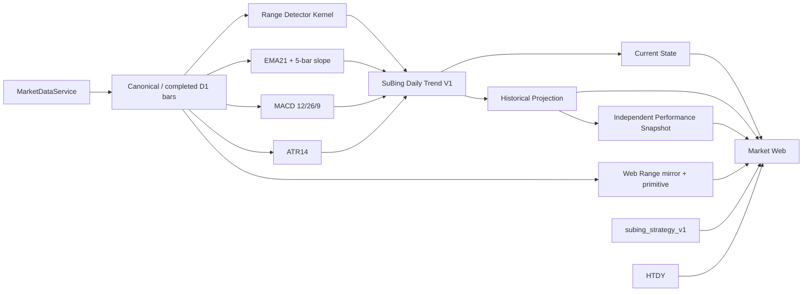
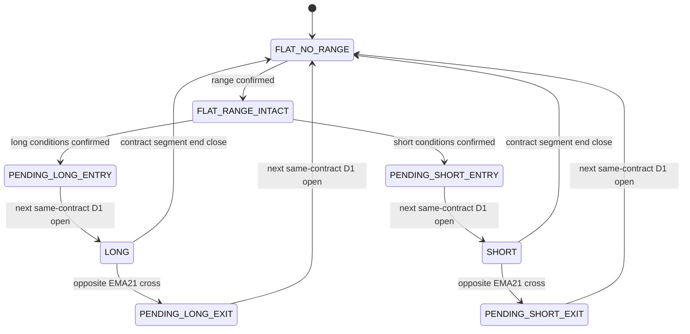

# 苏冰双策略、Lux Range 箱体指标与 Market 页面升级设计

状态：`DESIGN_REVIEW_PENDING`

日期：2026-08-31

基线：`develop@f84890906e5de95c9b09651339d6a398784aade7`

## 1. 文档职责

本文件定义以下新增能力的设计合同：

1. 在不改变现行 `subing_strategy_v1` 公式、历史事实和 Alert lineage 的前提下，把苏冰产品组织为“震荡策略”和“趋势策略”两个独立策略视图；
2. 以 LuxAlgo Range Detector 的公开行为为参考，增加一个可复算、因果安全、可在图表设置中独立开启的箱体识别指标；
3. 新建日线趋势策略 `subing_daily_trend_v1`，使用已确认箱体、EMA21、EMA21 斜率和零轴附近 MACD 交叉形成信号；
4. 将 Market 图表页调整为“品种行情头部 → 策略入口 → 当前判断 → 图表与检查”的信息结构；
5. 定义历史研究、效果快照和未来 Alert 启用 Gate。

本文件不是 active canonical。实现进入 active surface 后，必须按职责更新对应 deep canonical、`PROJECT_SOURCE.md`、`DECISIONS.md`、`docs/ARCHITECTURE.md`、`docs/INDICATOR_KERNEL.md` 与 OpenSpec。未经实现、测试、独立 Review 和真实 Gate，不得据此修改 `STATUS.md`、生产 Rule、Runtime 或发布状态。

## 2. 已确认决策

### 2.1 产品与身份

- 苏冰仍是一个产品，不拆成两个 Overlay。
- Market 的 Overlay 身份继续保持 `none | subing | htdy`；火天大有仍是独立产品能力，不并入苏冰。
- 苏冰内部新增策略视图：
  - `range`：页面名称“震荡策略”，副标题“现行短线策略”；内部公式身份继续是 `subing_strategy_v1`。
  - `daily_trend`：页面名称“趋势策略”；内部公式身份为 `subing_daily_trend_v1`。
- `subing_strategy_v1` 的 D1 + H1 方向 Gate、15m 正式决策、1m/5m 内部输入、Action、Episode、历史效果、Alert Rule 和 Runtime 语义全部保持不变。
- 不把 `subing_strategy_v1` 迁移重命名为 `subing_range_v1`，避免破坏既有历史和生产 lineage。

### 2.2 趋势策略关键选择

- 正式周期只使用 completed D1。
- 箱体由本文件定义的 Lux Range 因果实现识别。
- EMA21 方向只要求 5-bar 回归斜率同向；不要求 10-bar 斜率同向。
- 退出只认 completed D1 收盘价反向穿越 EMA21；反向 MACD 交叉不是退出条件。
- 页面状态简化为五类：`震荡中 | 等待突破 | 已确认 | 持有中 | 数据不足`；方向 `多 | 空 | 无` 独立展示。
- 趋势 Alert 可在历史研究结果通过并由用户明确批准后进入独立实现任务；不把 prospective Shadow 设为强制前置，但不得绕过策略 Review、migration、release、Runtime promotion 和真实通知 Gate。
- 其余条件采用本文件固定的默认值，不留运行时可随意调整的策略参数。

## 3. 目标与非目标

### 3.1 目标

- 先交付一个独立、可观察、可测试的箱体指标，再把其因果输出作为趋势策略输入。
- 对同一套算法同时支持批量 Historical 与增量计算，并证明 prefix invariance、append parity 和无未来泄漏。
- 页面让用户快速回答：当前品种、当前策略、当前状态、信号条件是否齐备、依据截至哪根已完成 K 线。
- 两个策略分别维护公式版本、状态机、Action、Episode、Current 和 Performance，不合并研究结果。
- 保持个人本地工作站规模，不建设通用策略平台、worker/queue、账户或订单域。

### 3.2 非目标

- 不修改现行 `subing_strategy_v1` 公式或生产 Alert。
- 不实现自动下单、账户、真实仓位、资金曲线、复利收益或自动反手。
- 趋势策略 V1 不使用成交量、持仓量、BOLL、加仓、减仓、分段止盈、时间止损或移动止损作为硬条件。
- 不建立 `UniversalStrategyAdapter`、统一 Opportunity 模型或 mega endpoint。
- 不复制或提交第三方 Pine Script 源码；仅根据公开行为规范进行 clean-room 重写并保留来源说明。
- 本设计任务不修改 `main`、tag、Runtime、production DB、Alert Scope 或真实通知。

## 4. 总体架构



边界：

- Range Detector 算法权威位于 `packages/quant-core/guiyi_quant/indicators/`，纯计算、无 I/O、无业务写入。
- 浏览器只保留与 Kernel golden parity 的显示镜像，用现有 Market Bars 绘制箱体；浏览器输出不得作为策略、Alert 或历史结论权威。
- `subing_daily_trend_v1` 是独立的 source-specific 策略模块，直接消费 Kernel 的 Range/EMA/MACD/ATR 输出。
- Historical、Current 和未来 completed-D1 evaluator 必须复用同一个增量策略状态机。
- Web 只组合 typed API 和显示镜像，不复制策略真值表。

## 5. Lux Range 箱体指标合同

### 5.1 来源与实现方式

行为参考：

- LuxAlgo Range Detector 说明页：`https://www.luxalgo.com/library/indicator/range-detector/`
- TradingView 开源脚本页：`https://www.tradingview.com/script/QOuZIuvH-Range-Detector-LuxAlgo/`

仓库实现必须：

- 使用 clean-room Python/TypeScript 实现，不复制第三方 Pine Script 文件或大段源码；
- 在 Indicator metadata 和文档中记录来源、参数与差异；
- 通过独立构造的 fixture 和公开示例验证行为，不把第三方源码作为 Runtime 依赖；
- 不宣称与第三方品牌存在授权、合作或完全字节级等同。

### 5.2 身份与定位

```text
indicator_code: range_detector_lux_v1
indicator_version: v1
formal_policy_id: range_detector_lux_v1
显示名称: 箱体识别（Lux Range）
类型: main-pane observation overlay
repainting_risk: visual_backpaint_only
closed_bar_only: true
confirmed_only: true
web_capable: true
backtest_capable: true
live_capable: false  # V1 不消费未完成 D1
alert_capable: false # 指标本身不直接发 Alert
```

`visual_backpaint_only` 表示：箱体为了还原阅读效果可以从确认时点向左绘制，但任何策略判断只允许从 `confirmed_at` 开始使用。视觉回画不得改写历史策略状态。

### 5.3 固定默认参数

```text
minimum_range_length = 20
range_width_atr_multiplier = 1.0
range_atr_length = 500
source = close
atr_smoothing_policy = wilder_sma_seed
round_digits = 6
```

说明：

- 先前讨论的 10-bar 震荡窗口被显式替换为 Lux Range 的 20-bar 默认窗口；这是用户后续指定箱体算法后的优先决策。
- 图表设置第一版只允许显示开关，不向普通页面暴露参数编辑，避免页面参数与策略 policy 漂移。
- 策略 policy 固定 pin 上述参数；未来修改任一参数必须发布新的指标/策略版本。

### 5.4 单 Bar 计算

对 completed Bar 索引 `t`：

```text
L = 20
N = 500
M = 1.0

center_t = SMA(close[t-L+1 ... t])
width_t  = ATR_N[t] * M
upper_t  = center_t + width_t
lower_t  = center_t - width_t

candidate_valid_t =
  对 i = 0 ... L-1，均满足 abs(close[t-i] - center_t) <= width_t
```

只有 EMA/SMA/ATR warm-up 均完整且输入 Bar 单调、有限、已确认时才可形成 candidate。任一输入异常返回显式 unavailable，不使用 0、前值或跨周期回退。

### 5.5 确认、回画与合并

- 当 `candidate_valid_t=true` 且上一 Bar 不为有效 candidate 时，形成一次新的 range confirmation。
- `confirmed_at = bar_end[t]`。
- 为对齐公开指标的阅读方式，`visual_start_at = bar_end[t-L]`；若该 Bar 不存在则尚不可确认。
- 初始边界：`initial_upper=upper_t`、`initial_lower=lower_t`、`initial_mid=(upper_t+lower_t)/2`。
- 当新的 candidate 与上一箱体的可视区间重叠时，不创建第二个并列箱体，而是生成同一 `range_id` 的新 revision：
  - `current_upper = max(previous_upper, candidate_upper)`
  - `current_lower = min(previous_lower, candidate_lower)`
  - `current_mid = (current_upper + current_lower) / 2`
  - `merged_count += 1`
  - `revision += 1`
- revision 只从本次 `confirmed_at` 向后生效；不得用扩展后的边界重算此前策略决策。
- candidate 持续有效时更新 `last_extended_at`；箱体上下沿和中线可继续绘制。

### 5.6 突破状态

Range 生命周期：

```text
intact -> broken_up
intact -> broken_down
broken_up / broken_down -> 等待下一次新 range confirmation
```

- `close_t > current_upper`：`broken_up`。
- `close_t < current_lower`：`broken_down`。
- 等于边界仍视为箱体内。
- 突破方向一旦形成，在下一次新 range confirmation 前不因价格重新进入箱体而自动恢复 `intact`。
- 单个 `range_id` 最多生成一次可供趋势策略消费的突破机会。

### 5.7 因果边界

这是实现的硬约束：

1. 策略在决策 Bar `t` 只能读取截至 `t-1` 已确认、当时为 `intact` 的 range snapshot 和边界。
2. `t` 自身形成的新箱体或 merge revision 不能被 `t` 的入场判断使用。
3. `visual_start_at` 仅用于绘图；`confirmed_at` 才是策略可见时间。
4. prepend 更早历史后，只允许填充原先 unavailable 的 warm-up 区；任何已经拥有完整 warm-up 的已确认前缀不得漂移。
5. Historical 批量计算、逐 Bar 增量计算和浏览器镜像必须在相同输入前缀上给出相同 range identity、边界、revision、confirmation 和 break 状态。

### 5.8 输出合同

最小 typed snapshot：

```text
RangeDetectorSnapshot
- formula_version
- policy_id
- range_id
- revision
- visual_start_at
- confirmed_at
- last_extended_at
- initial_upper / initial_lower
- current_upper / current_lower / current_mid
- state: intact | broken_up | broken_down
- broken_at
- merged_count
- source_bar_end
- source_trading_day
- source_identity
```

`range_id` 必须由稳定的 source identity、首次 `confirmed_at` 和公式版本确定性生成，不使用随机 UUID。

### 5.9 图表表现

- intact：蓝色边界与半透明箱体；
- broken_up：绿色边界；
- broken_down：红色边界；
- 中线：点线；
- confirmation Bar：灰色弱提示；
- tooltip 固定显示：`箱体起点为回画展示；策略自确认时刻起才可使用`。

箱体通过独立 Lightweight Charts primitive 绘制，不把每个边界伪装成 Strategy marker，也不改变蜡烛数据。

## 6. `subing_daily_trend_v1` 策略合同

### 6.1 身份

```text
strategy_id: subing_daily_trend_v1
formula_version: subing_daily_trend_v1
policy_id: subing_daily_trend_v1
public_identity: single product + actual_dominant + 1d
research_only: true
formal_decision_bar: completed D1
reference_fill: next actual same-physical-contract D1 open
```

第一版无生产 Rule。未来 Alert Rule code 也使用 `subing_daily_trend_v1`，但只有独立 migration/Review/Gate 才能创建。

### 6.2 数据和主力段

- Historical 只通过 `MarketDataService` 读取 `actual_dominant + 1d`。
- EMA21、MACD、ATR14 和 Range Detector 使用 rank1 stitched raw D1 历史计算，避免每次换月都丢失长周期 warm-up。
- Action、pending fill 和持仓状态不得跨物理主力段。
- 新物理段第一根 completed D1 禁止开仓；从第二根开始才可判断。
- 当前段、source Bar、MainContractMap 和物理可读性任一异常时 fail-closed。

### 6.3 指标政策

```text
EMA21
- period: 21
- seed: sma_window
- slope: latest 5 EMA21 points linear-regression slope
- long: slope_5_bps_per_bar > 0
- short: slope_5_bps_per_bar < 0
- 不要求 slope_10

MACD
- fast / slow / signal: 12 / 26 / 9
- EMA seed: sma_window
- histogram_scale: 2
- golden: previous_dif <= previous_dea and current_dif > current_dea
- dead: previous_dif >= previous_dea and current_dif < current_dea

near_zero
- max(abs(current_dif), abs(current_dea)) / ATR14 <= 0.25

not_far_from_ema
- abs(current_close - current_ema21) / ATR14 <= 1.5

Range
- range_detector_lux_v1
- L=20, multiplier=1.0, ATR length=500
```

ATR14 只用于 MACD 零轴距离和 EMA 距离归一化；ATR500 只用于 Range width。两者身份不得混用。

### 6.4 多头入场真值表

在同一根 completed D1 `t` 上，以下条件必须全部成立：

1. 截至 `t-1` 存在 `intact` 的已确认 range，且 `confirmed_at < bar_end[t]`；
2. `previous_close <= frozen_range_upper` 且 `current_close > frozen_range_upper`；
3. `previous_close <= previous_ema21` 且 `current_close > current_ema21`；
4. `ema21_slope_5_bps_per_bar > 0`；
5. 当前 Bar 形成 MACD golden cross；
6. `max(abs(DIF), abs(DEA)) / ATR14 <= 0.25`；
7. `abs(close - EMA21) / ATR14 <= 1.5`；
8. 当前不是新主力物理段第一根 D1；
9. 当前状态为 flat，且没有 pending entry/exit；
10. 所有输入均 ready、同一 source identity、同一 completed D1 边界。

### 6.5 空头入场真值表

完全对称：

1. 截至 `t-1` 存在 `intact` 的已确认 range；
2. `previous_close >= frozen_range_lower` 且 `current_close < frozen_range_lower`；
3. `previous_close >= previous_ema21` 且 `current_close < current_ema21`；
4. `ema21_slope_5_bps_per_bar < 0`；
5. 当前 Bar 形成 MACD dead cross；
6. 零轴距离不超过 `0.25 × ATR14`；
7. EMA 距离不超过 `1.5 × ATR14`；
8. 其余身份、状态与 ready 条件同多头。

### 6.6 严格同 Bar 规则

Range 突破、EMA21 突破、EMA21 斜率、MACD 交叉、零轴距离和 EMA 距离必须在同一根 completed D1 上共同成立。

若某个 range 已发生向上或向下突破，但该突破 Bar 未同时满足其余条件：

- 不允许在后续 Bar 追认该次突破；
- 不建立 delayed window；
- 不从同一 `range_id` 生成第二次机会；
- 必须等待新的已确认 range。

这条规则优先保证公式清晰和可验证，即使第一版信号较少也不放宽。

### 6.7 信号和参考生效

- completed D1 `t` 只形成 `ENTRY_LONG_CONFIRMED` 或 `ENTRY_SHORT_CONFIRMED` Action。
- 普通入场参考价是下一根同物理合约实际 D1 Bar 的 open。
- gap 不取消入场，记录：
  - `signal_close`
  - `effective_open`
  - `gap_abs`
  - `gap_atr14`
- 若没有下一根同物理合约 D1，pending entry 以 `NO_SAME_CONTRACT_EFFECTIVE_BAR` 取消，不创建 Episode。
- 不使用信号日 close 冒充入场价。

### 6.8 退出

普通退出只有一类：`EMA21_OPPOSITE_CROSS`。

```text
long exit:
  previous_close >= previous_ema21
  and current_close < current_ema21

short exit:
  previous_close <= previous_ema21
  and current_close > current_ema21
```

- 退出由 completed D1 确认，参考价为下一根同物理合约 D1 open。
- 反向 MACD 交叉、上一根 K 线极值、Pivot、成交量、时间、止盈比例均不退出。
- 物理段结束时仍持有，则在旧段最后一根 D1 close 形成 `CONTRACT_SEGMENT_END` 终止，不迁移到新主力。
- 反向完整入场信号只先触发退出；不得在同一决策 Bar 或同一 effective open 反手。退出后等待新的完整 range 和入场信号。

### 6.9 状态机

内部状态：

```text
UNAVAILABLE
FLAT_NO_RANGE
FLAT_RANGE_INTACT
PENDING_LONG_ENTRY
PENDING_SHORT_ENTRY
LONG
SHORT
PENDING_LONG_EXIT
PENDING_SHORT_EXIT
```

核心转移：



UI 映射：

| 内部事实 | 页面状态 | 方向 |
|---|---|---|
| unavailable / warm-up | 数据不足 | 无 |
| flat + intact range | 震荡中 | 无 |
| flat + 无 intact range | 等待突破 | 无 |
| pending entry | 已确认 | 多 / 空 |
| long / short / pending exit | 持有中 | 多 / 空 |

退出 Action 作为一次性事实显示，不增加长期“退出风险”页面状态。

### 6.10 Action 与 Episode

每个 Action 至少包含：

```text
action_id
strategy_id / formula_version / policy_id
symbol / actual_contract / segment_start_trading_day
signal_bar_end / signal_trading_day
action_type
range_id / range_revision / range_confirmed_at
range_upper / range_lower
ema21 / slope_5_bps_per_bar
macd_dif / macd_dea / macd_cross
atr14 / macd_zero_distance_atr / ema_distance_atr
effective_bar_end / reference_price
source_identity_digest
```

Episode：

- 一次有效入场到有效退出；
- 不加减仓、不反手；
- open Episode 只展示，不进入完成统计；
- 完整 Episode 保存 entry/exit Action、reference change、持有 D1 Bar 数、entry gap 和退出原因；
- Decimal 用于价格、比率和统计中间值。

## 7. Historical、Current 与 Performance

### 7.1 Historical Projection

- 每个 rank1 物理段确定性重放；指标可以使用 stitched raw warm-up，但状态在段边界重置。
- 批量重放与逐 Bar state machine 必须 golden parity。
- first valid lower bound 同时满足 Range ATR500、EMA21 slope、MACD、ATR14 warm-up。
- 数据身份、segment coverage、时间单调、物理可读性异常显式失败，不缩短窗口冒充成功。

### 7.2 Current State

第一版 Current 只基于最新 Canonical completed D1 重建：

- 不用未完成日线；
- 不用 intraday Live 合成 D1；
- 不从 AlertEvent 恢复策略状态；
- 返回当前简化状态、方向、最新条件事实、pending Action、active range 和 source identity；
- 只读 HTTP 不在请求路径写 cache、修复数据或重放全历史。

### 7.3 独立 API

不把两个策略塞进同一个 DTO。新增独立路径：

```text
GET /api/v1/market/research/subing-daily-trend/current
GET /api/v1/market/research/subing-daily-trend/history
GET /api/v1/market/research/subing-daily-trend/performance
```

现有路径保持不变：

```text
/market/research/subing-strategy/current
/market/research/subing-strategy/history
/market/research/subing-strategy/performance
```

可以复用 source identity、snapshot publication 和 query validation 的基础设施，但不得建立通用 Strategy Adapter 或用一个 `strategy_id` 参数驱动任意公式。

### 7.4 Performance

趋势策略独立 snapshot 和 manifest，不与现行策略合并。

第一版指标：

- 完整 Episode 数；
- 多/空数量；
- 正向比例；
- 平均、中位、25%/75% reference change；
- 最大正向、最大反向 reference change；
- 持有 D1 Bar 数；
- `EMA21_OPPOSITE_CROSS` 与 `CONTRACT_SEGMENT_END` 次数；
- entry gap 分布；
- 按年份、品种、方向分组。

不输出本金、仓位、手续费、资金曲线、复利收益或订单结论。

单品种完整 Episode 少于 30：标记 `INSUFFICIENT_SAMPLE`，保留明细但不形成充分样本结论。先对 JM、AG、RB、EG 输出详细案例，再跑 active60 汇总。

## 8. Market 页面设计

### 8.1 页面层级

```text
品种行情头部
→ 研究入口
→ 当前判断
→ 图表 + 检查侧栏
→ 可选历史效果
```

### 8.2 行情头部

显示：

- 品种代码和名称；
- 当前真实主力合约；
- 最新已完成价；
- 涨跌额和涨跌幅；
- 开、高、低、收；
- 成交量、持仓量；
- 交易日；
- Live / Historical / 收盘快照和数据健康状态。

不显示股票市值、换手率或仓位建议。

### 8.3 研究入口

页面入口显示：

```text
[震荡策略] [趋势策略] [火天大有]
```

实现语义：

- 前两个是 `overlay=subing` 内部的 `strategy_view`；
- 火天大有切换到 `overlay=htdy`；
- 不新增 `subing_range` 或 `subing_trend` Overlay；
- URL 可增加稳定参数 `strategy_view=range|daily_trend`，但现有苏冰 Action/Daily Watch 深链保持兼容。

### 8.4 周期行为

- 选择“震荡策略”：默认切到 15m；
- 选择“趋势策略”：默认切到 D1；
- 用户之后仍可查看其他周期；
- 页面持续标注策略事实来源周期，例如 `判断来源：D1 已完成 Bar`；
- 非正式周期只查看图表，不重新计算或伪造策略状态。

### 8.5 当前判断

只显示当前选中策略，不做综合裁决。

趋势策略首屏：

- 状态：五类简化状态；
- 方向：多/空/无；
- 一句原因摘要；
- 数据截至时间；
- active range 上下沿；
- EMA21 位置与 5-bar 斜率；
- MACD 交叉和零轴距离；
- 是否满足同 Bar 共振。

相反策略信号分别存在，不自动压制、不自动合并、不生成仓位建议。

### 8.6 图表设置

在现有 EMA 设置旁新增：

```text
箱体识别 [开关]
```

规则：

- 全局默认关闭；
- 用户可在任意标准 Market 周期/序列上作为观察指标开启；
- 选择趋势策略时，页面的 effective display 强制显示 EMA21、箱体和 MACD，但不覆盖用户持久化偏好；离开趋势策略后恢复用户设置；
- 主图偏好 schema 从 v7 升级到 v8，并提供 v7 → v8 单向迁移；
- 不向普通设置暴露策略参数。

### 8.7 趋势图表

- 主图：蜡烛、EMA21、Range boxes；
- 副图：现有 MACD；
- Historical Action：完整开/平标记；
- 点击标记：显示条件、range identity、信号价、参考生效价和退出原因；
- 明确提示 Range 起点属于回画显示，正式信号只从 `confirmed_at` 后产生。

### 8.8 效果面板

- 震荡策略继续使用现有独立效果面板；
- 趋势策略使用独立面板和 snapshot；
- 可以做并排阅读，但不合并 Episode、胜率或收益口径。

## 9. Alert Gate

### 9.1 当前生产面

- `subing_strategy_v1` Rule、Scope、Event、Runtime 和自然 evidence 全部保持不变。
- 本设计和前三阶段实现不得修改现有 production migration、Rule code、`scope_products` 或真实 PushPlus。

### 9.2 “历史结果通过后启用”的精确定义

用户选择允许趋势策略在历史结果通过后进入 Alert 实现，不把 prospective Shadow 设为强制前置。这里的“通过”不是代码内硬编码盈利阈值，而是同时满足：

1. 公式、边界和参数已冻结为 `subing_daily_trend_v1`；
2. causality、strict-before、future-leak、prefix invariance、batch/incremental golden parity 全部通过；
3. JM/AG/RB/EG 详细案例和 active60 Historical 报告完成；
4. 固定最后一段 retrospective holdout 与开发样本分离，未用 holdout 反调参数；
5. 样本不足品种被明确标记，不以聚合结果掩盖；
6. 用户审阅历史结果后明确接受该公式进入 Alert 实现；
7. 独立 Lane 3 Review 批准 Alert contract、migration 和 completed-D1 seam。

prospective OOS 继续独立积累且不得回填，但不作为第一次 Alert 实现的强制等待周期。

### 9.3 未来 Alert 实现仍需独立 Gate

历史接受只允许开始下一任务，不自动授权：

- 创建或执行 migration；
- 创建/启用 `subing_daily_trend_v1` Rule；
- 修改 production Scope；
- 发布 main/tag；
- Runtime promotion；
- 真实通知。

未来 Rule 继续使用 product-level `scope_products`，与现行策略分别开关。两个策略同品种出现相反信号时分别保存和通知，不做系统自动裁决。

## 10. 推荐实施顺序

### 阶段 1：Range Detector 指标

- Quant-core Kernel、registry metadata、batch/incremental API；
- Browser golden mirror；
- Lightweight Charts primitive；
- 图表设置开关和 preference v8 migration；
- parity、causality、prefix 和视觉交互测试；
- 不改苏冰策略、Alert 或 Runtime。

### 阶段 2：Daily Trend 策略内核

- 独立 contracts、policy、state machine、Action/Episode；
- Historical Projection；
- segment、fill、gap、exit、no-reversal 测试；
- 不接 Alert。

### 阶段 3：Snapshot 与只读 API

- Current、History、Performance typed schema；
- 独立 immutable snapshot/current manifest；
- active60 Historical evidence；
- HTTP 只读验证。

### 阶段 4：Market Web 双策略页面

- 行情头部；
- strategy view tabs；
- 当前判断；
- D1 自动切换和来源标记；
- 趋势 Historical markers 和独立效果面板；
- 页面/E2E 回归现行苏冰和 HTDY。

### 阶段 5：可选 Alert

只有第 9 节 Gate 通过后另开 Lane 3 任务：Rule、migration、completed-D1 evaluator、Event、one-shot transport、release 和 Runtime promotion 分开审批。

## 11. 测试与验收

### 11.1 Range Detector

必须覆盖：

- 参数、warm-up 和非法输入；
- 20-bar candidate、500-bar ATR；
- exact-boundary 仍为 intact；
- 向上/向下突破；
- overlapping merge 和 revision 生效时间；
- visual start 与 confirmed_at 分离；
- broken 状态不自动恢复；
- deterministic range_id；
- batch = incremental；
- prefix invariance；
- prepend 完整 warm-up 后稳定前缀不漂移；
- Python Kernel = TypeScript mirror golden parity；
- 设置开关、偏好迁移、primitive resize/pagination/fullscreen。

### 11.2 Daily Trend

必须覆盖：

- 多头/空头完整真值表；
- 只有 5-bar EMA slope，10-bar slope 不参与；
- Range/EMA/MACD 必须同一 D1；
- near-zero 和 not-far 边界；
- breakout Bar 条件不完整时不得后续追认；
- 新物理段第一根禁止入场；
- next same-contract D1 open 生效；
- gap 记录；
- 无下一同合约 Bar 时 pending entry 取消；
- EMA21 opposite cross 是唯一普通退出；
- 反向 MACD 不退出；
- 不同 Bar 不反手；
- segment end close；
- open Episode 不进统计；
- Historical = incremental current engine；
- strict-before、future-leak、prefix invariance、golden parity、fail-closed。

### 11.3 Web 与兼容

必须证明：

- 现行 `subing_strategy_v1` API、深链、历史标记、Current、Performance 和 Alert 开关语义不变；
- HTDY Overlay 和七周期能力不变；
- `strategy_view` 不改变底层 Overlay authority；
- 趋势策略来源周期标记准确；
- 五类状态和方向分离；
- 两个效果面板不串数据；
- 浏览器不计算正式策略结论；
- desktop、窄屏、drawer、fullscreen、分页和 Live 更新不破坏箱体绘制。

### 11.4 交付状态

实现只能按证据声明：

```text
CODE_COMPLETE
TEST_COMPLETE
HISTORICAL_REPORT_READY
ALERT_GATE_PENDING
RELEASED
RUNTIME_READY
```

任何前一状态都不能自动推导后一状态。

## 12. 风险与禁止范围

- Range 的左侧回画很容易被误用为“当时已经知道”；必须在模型、API、tooltip 和测试中同时区分 `visual_start_at` 与 `confirmed_at`。
- ATR500 导致较长 warm-up；数据不足必须显示，不得降低 ATR 长度或静默跨频替代。
- 同 Bar 三重突破会令样本较少；第一版不得为了增加样本偷偷放宽到 3/5 Bar 窗口。
- Lux 行为 parity 与策略因果用途不同；视觉对齐不能牺牲策略 strict-before。
- 历史结果差不构成实现失败，也不得在同一版本内反复调参后继续沿用 V1 identity。
- 不把两套策略合并为“综合买卖建议”。
- 不显示仓位比例、减仓比例或自动交易措辞。
- 不因代码合入 `develop` 自动发布 main/tag、同步 Runtime、写生产 DB 或发送真实通知。

## 13. 文档和 canonical 更新时点

- 阶段 1 实现合入时：更新 `docs/INDICATOR_KERNEL.md` 和 Range Detector OpenSpec；若仅观察指标尚未进入稳定产品面，不提前改 `PROJECT_SOURCE.md`。
- 阶段 2/3 经 Review 合入时：增加 `subing_daily_trend_v1` deep canonical 和对应 OpenSpec，更新 `docs/ARCHITECTURE.md`、`DECISIONS.md`；只有稳定页面能力完成后更新 `PROJECT_SOURCE.md`。
- `STATUS.md` 只记录实际代码、测试、报告、release、Runtime 和 pending Gate，不复制本设计过程。
- Alert migration、release 和 Runtime 事实只在各自真实执行后更新，不得由设计批准代替。
