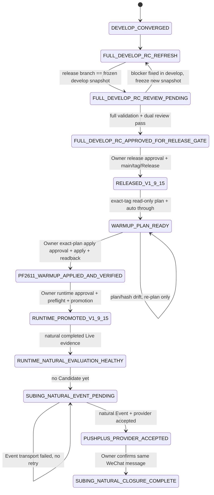

# v1.9.15 Release 与 SuBing 自然推送闭环设计

日期：2026-09-05  
状态：`DESIGN_REVISED / USER_REVIEW_PENDING / IMPLEMENTATION_NOT_STARTED / EXTERNAL_GATES_PENDING`

## 1. 目的

本设计定义“阶段二：完成 `v1.9.15` 与苏冰自然推送闭环”的执行边界。

Owner 已确认两项关键决策：

1. `v1.9.15` 不再冻结旧的最小 RC，而是**全量纳入执行时最新、已收敛且可验证的 full `develop`**；
2. PF2611 warm-up 的 `through` 不再固定在 `2026-09-03`。执行时先只读解析权威最近完整交易日；**如果晚于 `2026-09-03`，直接使用该更晚日期生成计划并继续处理，不为日期扩大单独增加人工 Gate**。

本阶段目标链路为：

```text
冻结 latest full develop exact snapshot
→ 将 codex/release-v1.9.15 同步到该 exact tree
→ exact-head 全量验证 + Standards/Spec 双轴 Review
→ Owner release Gate
→ main + annotated v1.9.15 tag + GitHub Release
→ exact-tag PF2611 contract-warmup read-only plan
→ 自动解析 latest authoritative completed through date
→ Owner exact plan hash / real apply Gate
→ 真实 RQData / Canonical apply
→ apply 后只读验证
→ Owner Runtime promotion Gate
→ exact-tag 五项 Runtime promotion
→ 自然 completed 15m SuBing evaluation
→ immutable AlertEvent
→ one-shot PushPlus provider acceptance
→ Owner 确认微信实际收到同一自然 Event
```

只有最后一项完成后，本阶段才可以标记为 `SUBING_NATURAL_CLOSURE_COMPLETE`。

本设计本身不授权 release、生产数据写入、Runtime 切换或真实通知。真实 mutation 仍受 `AGENTS.md` 的单次执行意图约束。

---

## 2. 当前事实基线

### 2.1 develop 已完成收敛

当前设计基线：

```text
develop = 817f37fe8c48adb6d34a98c65fe22e256a927c8b
merge   = PR #335 [Lane 2] 收敛全分支合并后的 develop
```

PR `#335` 合入前的最终 task head `79b66d5ac5eb2c7175d6d12c1570b00e2daa978b` 已完成：

```text
Standards Review = APPROVED / P1=0 / P2=0 / P3=0
Spec Review      = APPROVED / P1=0 / P2=0 / P3=0
worktree         = clean
```

因此阶段一“收敛全分支合并后的 develop”视为完成，不在本任务重复做仓库大清理。

### 2.2 当前正式 Release 与 Runtime

当前 production 仍为：

```text
Release = v1.9.14@ca15456eaff988db4fe61c37657ca37302a7f977
Runtime = clean detached v1.9.14 root
Alembic = 20260903_0045
```

`main@10d19c3a2b266fb0aefb9abd320d96ff46d410aa` 在 `v1.9.14` tag 后还有一次未发布合入，因此 `main` 不是当前 release identity。

2026-09-03 的自然 `LIVE_DOMINANT_MISMATCH` 仍是历史真实失败，任何 warm-up、release、manual task、replay 或 Runtime promotion 都不得把该记录改写为 passed。

### 2.3 当前 SuBing 事实

```text
rule_code       = subing_ths_alert_15m_v1
formula_version = subing_ths_15m_v3
frequency       = 15m
series_kind     = actual_dominant
auto_order      = false
scope_hash      = ce1daca77aeb1abe134806b67aebd96b2c35db3ba82aa10af58f6e5a2e4f5fa2
```

当前状态：

- operational Scope：60 个品种 × 15m；
- SuBing Rule：enabled；
- SuBing Event：0；
- Alert transport：PushPlus；
- `provider accepted != 微信实际送达`。

本阶段**不重新执行首次 Scope activation**，不修改 Rule、Scope、audience、Topic 或 PushPlus 配置。release、warm-up apply 与 Runtime promotion 前后都要只读证明 `scope_hash` 没有未授权变化。

### 2.4 旧 v1.9.15 RC 已成为待刷新历史候选

PR `#333` 当前为：

```text
base        = main
head branch = codex/release-v1.9.15
head SHA    = 2eb33e6d9f8195847b908e399539c5e12f5ff7b6
state       = OPEN / MERGEABLE
review      = RELEASE_REVIEW_STALE
```

设计时比较：

```text
2eb33e6d... -> 817f37fe...
status     = ahead
behind_by  = 0
ahead_by   = 148
```

即旧 release branch head 是当前 full `develop` 的祖先。

Owner 已明确改变此前的最小 RC 决策：**`v1.9.15` 必须包含 full `develop`，旧 `2eb33e6d...` 不再作为可发布 exact RC。**

---

## 3. 核心设计原则

### 3.1 full develop 是一个冻结的 exact snapshot，不是永远追逐的移动目标

“全量纳入 latest full develop”定义为：

1. Gate A 开始时 fresh fetch `origin/develop`；
2. 要求该 `develop` 是 clean、已收敛、无已知 convergence blocker；
3. 将当时的 40 字符 SHA 冻结为 `$RC_SOURCE_DEVELOP_SHA`；
4. `v1.9.15` release tree 必须包含该 SHA 的**完整 tracked tree**，不得选择性漏掉 Newow、文档、测试或其它已合入内容；
5. 一旦开始 exact-head 验证，该 snapshot 冻结。之后 `develop` 再前进不会自动进入已审查 RC，否则 Review 永远无法闭合。

如果 Gate A 验证期间发现 release-blocking 缺陷，修复必须先进入 `develop`，然后重新冻结新的 latest full develop snapshot，再重新执行 Gate A。

因此不允许形成长期 release-only hotfix 分叉。

### 3.2 full develop 进入 release，不等于扩大生产 Runtime 权限

`v1.9.15` 会包含 full develop 中已经存在的 Newow research/page-parity/Market Detail 等代码和资产，但本阶段的生产验收目标仍只有：

```text
现有 Market Runtime
+ 现有 Alert Runtime
+ SuBing natural closure
```

本阶段不因此新增：

- Newow Alert Rule；
- Newow Runtime；
- Newow PushPlus；
- 参考交易写入；
- 风险模块；
- 模拟账户；
- PostgreSQL 交易 Ledger；
- 订单或真实账户能力。

也就是说：**代码全量发布，运行权限不自动扩张。**

### 3.3 Release、数据 apply、Runtime、自然 Event 是不同事实

不得混用以下状态：

```text
CODE_COMPLETE
RC_REVIEWED
RELEASED
CANONICAL_WARMUP_APPLIED
RUNTIME_PROMOTED
RUNTIME_READY
SUBING_EVENT_CREATED
PUSHPLUS_PROVIDER_ACCEPTED
WECHAT_DELIVERY_CONFIRMED
```

每层必须拥有独立 exact identity 和 evidence。

### 3.4 `through` 日期自动解析，不形成额外日期确认 Gate

PF2611 warm-up 的实际 `$THROUGH_DATE` 由 exact-tag 执行时的权威 Calendar / Catalog / Canonical 状态确定：

```text
$THROUGH_DATE = 当前可证明的最近完整交易日
```

约束：

- 必须位于 PF2611 合法 lifecycle 内；
- 不得使用未完成交易日；
- 如果 `$THROUGH_DATE > 2026-09-03`，**直接使用更晚日期生成 plan，不因该范围扩大停下来要求额外确认**；
- 如果权威结果反而 `< 2026-09-03`，或 latest completed trading day 无法唯一证明，则 fail-closed；
- 不使用“今天”这种不稳定字符串作为 plan identity。

日期自动选择只取消“日期扩大二次确认”。真实 RQData / Canonical `--apply` 仍必须绑定 exact release、exact `$THROUGH_DATE` 与 exact `$PLAN_SHA256`，遵守一次性真实 mutation Gate。

### 3.5 自然 evidence 不可伪造

以下均不能替代自然 SuBing 闭环：

- synthetic Candidate；
- replay / backfill；
- 手工发送 PushPlus；
- 手工写 AlertEvent；
- 手工运行 after-market 冒充自然执行；
- provider accepted 冒充微信实际送达。

### 3.6 observation-only 边界继续成立

本阶段仍是：

```text
Market Fact
→ SuBing observation
→ immutable AlertEvent
→ one-shot notification
→ Owner 人工判断
```

`auto_order=false` 保持不变。

---

## 4. RC 刷新策略：release branch 全量同步 latest develop

### 4.1 冻结 release source

Gate A 开始时解析：

```text
$RC_SOURCE_DEVELOP_SHA = fresh origin/develop
$RC_SOURCE_TREE_SHA    = tree($RC_SOURCE_DEVELOP_SHA)
```

当前设计时的候选值为：

```text
817f37fe8c48adb6d34a98c65fe22e256a927c8b
```

执行时如果 `origin/develop` 已前进，则使用 fresh latest develop，并重新记录 exact identity。

### 4.2 同步 `codex/release-v1.9.15`

当前旧 release head 是 develop 的祖先，因此优先要求：

```text
codex/release-v1.9.15
fast-forward -> $RC_SOURCE_DEVELOP_SHA
```

同步后必须满足：

```text
$RC_HEAD_SHA == $RC_SOURCE_DEVELOP_SHA
$RC_TREE_SHA == $RC_SOURCE_TREE_SHA
```

禁止：

```text
selective cherry-pick
squash full develop into opaque commit
force rewrite history
漏掉 develop 中已 tracked 的某些目录
在 release branch 追加未进入 develop 的功能修复
```

如果 fresh topology 已不再允许安全 fast-forward，则停止并先解析分叉；不得 force update 来绕过。

### 4.3 PR #333 继续作为 v1.9.15 release PR

同步 release branch 后，PR `#333` 继续以：

```text
head = codex/release-v1.9.15
base = main
```

承载新的 full-develop release diff。

PR body 必须更新为新的 exact head，并明确旧 `2eb33e6d...` 的测试/Review 已失效。

### 4.4 RC head 变化使证据失效

任何 RC head 变化都要求：

```text
fresh applicable verification
→ fresh Standards Review
→ fresh Spec Review
→ fresh GitHub checks readback
```

不得继承旧 exact head 的测试计数或 Review。

---

## 5. Gate A：full-develop exact RC 验证与双轴 Review

Gate A 全部为代码/本地/只读验证，不授权 production mutation。

由于 `v1.9.15` 现在全量纳入 full develop，验证矩阵也必须覆盖 full develop，而不能只验证 SuBing release diff。

### 5.1 必须验证

至少包括：

1. Backend full：排除 `isolated_postgresql` 与 `manual_acceptance`；
2. SuBing / MarketRead / Alert / Scope 定向合同；
3. physical-contract warm-up / HistoricalDataManager / CLI plan hash；
4. Newow 全量 regression；
5. Engineering repository hygiene + canonical consistency；
6. Ruff；
7. Mypy；
8. Web Alert ownership；
9. Web full unit；
10. Web build；
11. Playwright full E2E；
12. OpenSpec strict；
13. secret scan；
14. `git diff --check`；
15. GitHub checks readback。

PR #335 convergence 阶段曾取得的 `1633 backend / 553 Newow / 71 engineering / 327 Web / 71 Playwright` 等结果只能作为历史证据，**不能替代新的 full-develop RC exact-head 验证**。

如果 GitHub 没有配置 checks，只记录 `NO_CHECKS_REPORTED`，不得表述为 checks passed。

### 5.2 isolated PostgreSQL

production 已为 Alembic `20260903_0045`。只有 fresh full-develop RC diff 或 active test contract 证明 migration 需要重新验证时，才运行 isolated PostgreSQL，并且只能使用专用、可销毁数据库。

普通 Gate A 不连接 production PostgreSQL，不运行真实 migration。

### 5.3 双轴 Review

对同一 `$RC_HEAD_SHA` 独立完成：

```text
Standards Review: P1=0 / P2=0
Spec Review:      P1=0 / P2=0
```

P3 可以记录，但不得存在未解释的 release blocker。

### 5.4 blocker 修复路线

如 Gate A 发现阻断问题：

```text
发现 blocker
→ 独立修复进入 develop
→ fresh origin/develop
→ 重新冻结 $RC_SOURCE_DEVELOP_SHA
→ release branch 再同步
→ Gate A 从头重跑
```

不得只修 release branch 而让 develop 缺失该修复。

Gate A 完成状态：

```text
FULL_DEVELOP_RC_APPROVED_FOR_RELEASE_GATE
```

---

## 6. Gate B：v1.9.15 Release

这是第一个真实外部 mutation Gate。

授权前必须展示并冻结：

```text
version                = v1.9.15
rc_source_develop_sha  = $RC_SOURCE_DEVELOP_SHA
rc_head_sha            = $RC_HEAD_SHA
rc_tree_sha            = $RC_TREE_SHA
PR                     = #333
current_main_sha       = $MAIN_SHA
```

且必须证明：

```text
$RC_HEAD_SHA == $RC_SOURCE_DEVELOP_SHA
$RC_TREE_SHA == tree($RC_SOURCE_DEVELOP_SHA)
```

Owner 明确批准 exact release 后才允许：

```text
PR #333 -> main
annotated tag v1.9.15
GitHub Release v1.9.15
```

Gate A 后如果 RC head、main、mergeability 或最终 merge tree 变化，release Gate 失效，必须重新证明最终 tree 未带入未经 Review 的内容。

推荐硬条件：

```text
$RELEASE_TREE_SHA == $RC_TREE_SHA
```

发布后只读确认：

- `main` release commit；
- annotated tag object；
- peeled tag target；
- GitHub Release target；
- release tree；
- reviewed RC tree；
- API/Web version identity（若现有 seam 支持）。

通过后仅标记：

```text
RELEASED_V1_9_15
```

发布不等于 Runtime 已切换。

---

## 7. Gate C：exact-tag PF2611 read-only warm-up plan

Gate C 只读，不连接真实 RQData，不写 Canonical。

必须从 clean detached exact `v1.9.15` root 执行 `contract-warmup` dry-run。

固定目标：

```text
symbol      = pf
contract    = PF2611
frequencies = 1m,5m,15m,30m,60m,1d,1w
```

### 7.1 自动解析 through

先只读解析：

```text
Contract lifecycle
TradingCalendar
TradingSession
Canonical coverage
latest authoritative completed trading day
```

然后：

```text
$THROUGH_DATE = latest authoritative completed trading day
```

规则：

- 若为 `2026-09-03`，正常继续；
- 若晚于 `2026-09-03`，**直接使用该最新完整交易日继续，不增加日期确认 Gate**；
- 若早于 `2026-09-03`，或权威来源相互冲突，停止；
- 不使用未完成交易日。

### 7.2 plan identity

plan 至少冻结：

```text
release_tag = v1.9.15
release_commit = $RELEASE_COMMIT_SHA
symbol = pf
contract = PF2611
listed_date
through = $THROUGH_DATE
window
frequency targets
direct / derived target count
expected bars
readonly = true
plan_sha256 = $PLAN_SHA256
```

`provider_request_count` 若现有 plan/report seam 可读则记录，否则明确 `NOT_EXPOSED`，不得为补这个字段额外发真实 provider 请求。

没有稳定 hash 或 identity 不完整，不得进入 apply。

Gate C 完成状态：

```text
WARMUP_PLAN_READY
```

---

## 8. Gate D：PF2611 真实 RQData / Canonical apply

这是第二个真实 mutation Gate。

这里**没有单独的 through-date 再确认**。Owner 的 apply 授权对象直接是 Gate C 自动解析出的 exact plan：

```text
release = v1.9.15@$RELEASE_COMMIT_SHA
symbol = pf
contract = PF2611
through = $THROUGH_DATE
plan_sha256 = $PLAN_SHA256
```

只有取得针对该 exact plan 的真实 apply 意图，才执行一次 `--apply`。

### 8.1 apply 不变量

- maintenance lease 内重新计算计划；
- plan hash 漂移在首次 RQData 请求前阻断；
- 只处理 PF2611 physical contract family；
- 只接受真实 RQData；
- 5m/15m/30m/60m 只由通过校验的同合约 1m 派生；
- 1w 只由完整同交易所日行情生成；
- 不修改 continuous；
- 不修改 MainContractMap；
- 不修改 Rule / Scope / Event / Redis Live / notification；
- `scope_hash` 不变；
- 不发送 PushPlus；
- 不自动重试失败或 partial apply。

### 8.2 partial / failed

如果真实 apply 返回 partial 或 failed：

1. 停止；
2. 保留已经原子成功的合法分区；
3. 只读报告精确成功/失败 target；
4. 重新 dry-run；
5. 生成新的 exact `$PLAN_SHA256`；
6. 新 plan 的真实重试仍需要新的单次执行意图。

### 8.3 apply 后只读验证

至少证明：

- PF2611 七周期 identity 与 coverage；
- physical lifecycle 合法；
- required mapped bars 完整；
- extra warm-up bars 均在合法 lifecycle/session；
- 15m replay warm-up 足以让 `subing_ths_15m_v3` 从当前 physical contract 自身历史重建；
- 其它 Dataset 无未授权 mutation；
- Rule、`scope_hash`、Event 数和 notification 状态未变化。

通过后：

```text
PF2611_WARMUP_APPLIED_AND_VERIFIED
```

仍不代表 Runtime 已使用这些数据。

---

## 9. Gate E：exact-tag 五项 Runtime promotion

这是第三个真实 mutation Gate。

Owner 授权必须绑定：

```text
workstation      = 当前识别出的本地工作站
release          = v1.9.15@$RELEASE_COMMIT_SHA
services         = API / Web / Live / after-market / Alert
new_runtime_root = $RUNTIME_ROOT
rollback_root    = $ROLLBACK_ROOT  # 只有本轮明确批准一次 rollback 时存在
```

### 9.1 promotion preflight

必须先运行现有 Market Runtime promotion preflight。

允许的 pass reason 仅为：

```text
snapshot_ready
before_first_session
after_market_complete
non_trading_interval
```

以下全部阻断且零 Runtime mutation：

```text
MARKET_RUNTIME_PROMOTION_LIVE_SNAPSHOT_REQUIRED
MARKET_RUNTIME_PROMOTION_LIVE_SNAPSHOT_INVALID
MARKET_RUNTIME_PROMOTION_STATE_UNAVAILABLE
```

没有 override、repair、synthetic snapshot、retry 或 fallback。

### 9.2 promotion 与 readback

preflight 通过后：

1. 从 exact tag 建立/确认 clean detached `$RUNTIME_ROOT`；
2. render-only；
3. 切换五项 launchd 服务；
4. readback `GUIYI_PROJECT_ROOT` 与 `GUIYI_RUNTIME_COMMIT`；
5. 五项服务必须指向同一 `$RELEASE_COMMIT_SHA`；
6. `scope_hash` 保持不变。

失败时：

- 不自动再次 promotion；
- 不改 Scope；
- 不补发通知；
- 只有本轮预先批准 `$ROLLBACK_ROOT` 时允许一次 rollback；
- rollback 后停止。

通过后仅标记：

```text
RUNTIME_PROMOTED_V1_9_15
NATURAL_EVIDENCE_PENDING
```

---

## 10. Gate F：自然 Runtime evaluation evidence

`RUNTIME_READY` 必须由 exact `v1.9.15` 的自然运行证明。

至少等待一个真实 completed、与 operational Scope 一致的自然 Live 周期，并只读确认：

- 五项 Runtime 仍为 exact `v1.9.15`；
- Live phase/subscription identity 正常；
- Alert heartbeat 前进；
- relevant SuBing 15m evaluation 推进 `last_evaluated_bar_at`；
- per-rule processing error 为空；
- current rank1 physical contract 与 replay identity 一致；
- 无旧 physical contract 递归状态继承；
- `scope_hash` 不变；
- 没有 replay/backfill 历史 Event。

如果自然 Bar 没有 Candidate：

```text
runtime evaluation healthy
candidate = none
```

这是正常结果，不得人为制造 Candidate。

允许中间状态：

```text
RUNTIME_NATURAL_EVALUATION_HEALTHY
SUBING_NATURAL_EVENT_PENDING
```

---

## 11. Gate G11：自然 SuBing Event + PushPlus provider acceptance

只有 exact `v1.9.15` Runtime 自然产生 Candidate 才进入 G11。

Candidate/Event 必须满足：

```text
rule_code       = subing_ths_alert_15m_v1
formula_version = subing_ths_15m_v3
frequency       = 15m
series_kind     = actual_dominant
completed       = true
```

公式仍只有：

```text
MACD(12,26,9) exact CROSS
+ EMA(CLOSE,21)
+ same physical-contract warm-up
```

不得增加零轴、Range、量能/OI、ATR、EMA 斜率或多周期隐藏过滤。

Event 发生时必须 readback supervised Runtime 仍为 `$RELEASE_COMMIT_SHA`，且 Event `detected_at` 晚于该次 promotion 成功时间。

### 11.1 Event-first

固定顺序：

```text
Candidate
→ commit immutable AlertEvent
→ 最多一次 PushPlus transport attempt
```

### 11.2 provider failure

如果 Event 已提交但 formatter/PushPlus/provider 失败：

- Event 保持不可变；
- 记录 Runtime failure；
- 不 retry 同一 Event；
- 不 replay / manual send；
- 等待未来新的自然 Event。

### 11.3 provider acceptance

同一自然 Event 被 provider 接受后记录：

```text
SUBING_NATURAL_EVENT_PERSISTED
PUSHPLUS_PROVIDER_ACCEPTED
```

仍不能称为微信实际送达。

---

## 12. Gate G12：Owner 微信实际送达确认

最终 Gate 由 Owner 人工确认。

确认对象至少与 G11 Event 匹配：

- symbol；
- direction/result code；
- 15m `bar_end`；
- Event 对应通知内容。

Owner 确认微信实际收到后，才允许：

```text
SUBING_WECHAT_DELIVERY_CONFIRMED
SUBING_NATURAL_CLOSURE_COMPLETE
```

随后才更新 `STATUS.md` 并关闭 Issue `#307`。

如果 provider accepted 但 Owner 未收到：

- 不重发同一 Event；
- 保留 provider acceptance 事实；
- G12 保持 pending；
- 后续作为新的 delivery investigation 处理。

---

## 13. 状态机



---

## 14. 失败处理矩阵

| 阶段 | 失败 | 处理 |
|---|---|---|
| full develop freeze | branch/tree 身份无法唯一证明 | 停止，不同步 release branch |
| release sync | 不能安全 fast-forward | 停止解析分叉，不 force update |
| RC validation | 测试/lint/build/OpenSpec 失败 | 修复进入 develop，重新冻结 latest develop，Gate A 从头执行 |
| RC Review | P1/P2 finding | 阻塞 release；修复进入 develop 后重新验证/Review |
| Release | main/head/tree drift | 不 merge/tag，返回 Gate A identity check |
| Warm-up plan | latest completed day/identity/hash 不稳定 | 不 apply，重新只读解析 |
| Warm-up apply | partial/failed | 不自动重试；只读核对并生成新 plan |
| Runtime preflight | 任一 block reason | 零 Runtime mutation |
| Runtime promotion | 切换失败 | 不重试；仅允许预授权的一次 rollback |
| Natural evaluation | no Candidate | 正常等待 |
| Natural Event | provider failure | Event 保留，不重发，等待新自然 Event |
| Delivery | accepted 但用户未确认 | G12 pending |

---

## 15. 文档与事实职责

本阶段不建立 approval packet、receipt、archive 或第二套状态文件。

- `STATUS.md`：当前 Release、Runtime、Scope、自然 evidence 与 pending Gate；
- `PROJECT_SOURCE.md`：本阶段不改变稳定产品边界，原则上不改；
- `DECISIONS.md`：如“full develop 作为该 release source”仅是本次 release 决策，不必写成长久产品 ADR；
- `docs/ARCHITECTURE.md`：没有 active dependency 变化时不改；
- `openspec/specs/subing-ths-alert/spec.md`：业务公式/事件合同不变；
- PR `#333`：新的 full-develop exact RC identity、验证与 Review；
- Issue `#307`：SuBing 自然闭环 Gate；
- Git tag / GitHub Release：正式 release identity；
- Runtime status / `AlertEvent` / provider response：真实运行 evidence。

`STATUS.md` 只能写已经发生的事实，不预写后续成功。

---

## 16. 明确不做

本阶段不做：

- 不选择性裁剪 full develop 已合入内容；
- 不开始 Newow Alert/Runtime/自动交易；
- 不实现牛哇参考交易；
- 不实现风险模块、模拟账户、PostgreSQL 交易 Ledger；
- 不新增 SuBing filter 或修改 `subing_ths_15m_v3` 数学公式；
- 不重新写 SuBing Scope 或重新 enable Rule；
- 不修改 PushPlus audience / Topic / token；
- 不新增 notification retry / queue / replay / backfill；
- 不恢复已退役策略域；
- 不修改 `auto_order=false`；
- 不连接真实交易账户或产生订单。

---

## 17. 验收标准

只有全部满足才完成本阶段：

1. PR `#335` convergence 已进入 `develop`；
2. execution-time latest full `develop` 被冻结为 `$RC_SOURCE_DEVELOP_SHA`；
3. `codex/release-v1.9.15` 与该 full develop snapshot 的 head/tree 完全一致；
4. exact full-develop RC 完成 fresh full validation；
5. 同一 exact RC Standards/Spec 双轴 Review P1/P2=0；
6. Owner 明确批准 exact release；
7. `main`、annotated `v1.9.15` tag、GitHub Release 与 reviewed tree 一致；
8. exact-tag PF2611 read-only plan 自动解析 `$THROUGH_DATE`；若晚于 `2026-09-03` 已直接使用最新完整交易日；
9. plan 生成稳定 `$PLAN_SHA256`；
10. Owner 明确批准该 exact plan 的真实 apply；
11. PF2611 七周期 Canonical / lifecycle / warm-up readback 通过；
12. Owner 独立批准 exact-tag 五项 Runtime promotion；
13. promotion preflight 通过，五项 Runtime 同一 exact release；
14. `scope_hash` 从设计基线到 promotion 后保持不变；
15. exact v1.9.15 Runtime 自然完成健康 SuBing 15m evaluation；
16. 后续自然 Candidate 先形成 immutable `AlertEvent`；
17. 同一 Event 获得一次 PushPlus provider acceptance；
18. Owner 人工确认微信实际收到同一自然 Event；
19. `STATUS.md` 与 Issue `#307` 按真实事实收口，没有 synthetic/replay/manual send 替代自然 evidence。

全部完成后才允许：

```text
v1.9.15 RELEASED
v1.9.15 RUNTIME_READY
SUBING_NATURAL_CLOSURE_COMPLETE
```

---

## 18. 设计结论

阶段一 develop convergence 已完成。

阶段二采用 Owner 已确认的新方案：

```text
latest full develop
→ full-develop v1.9.15 RC
→ full validation / dual review
→ release
→ PF2611 auto-through warm-up plan/apply
→ exact-tag Runtime promotion
→ natural SuBing Event
→ PushPlus acceptance
→ Owner WeChat confirmation
```

其中 PF2611 `through` 若晚于 `2026-09-03`，直接按权威最新完整交易日处理，不增加额外日期确认 Gate；真实 RQData/Canonical apply 仍绑定 exact plan hash 的一次性 mutation Gate。

设计经 Owner 最终审阅确认后，下一步才进入 implementation plan；当前不执行 release、RQData/Canonical apply、Runtime switch 或真实通知。