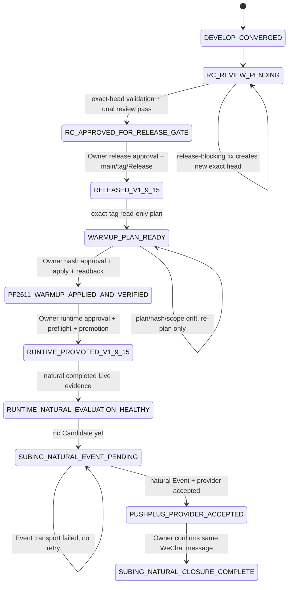

# v1.9.15 Release 与 SuBing 自然推送闭环设计

日期：2026-09-05  
状态：`DESIGN_DRAFT / IMPLEMENTATION_NOT_STARTED / EXTERNAL_GATES_PENDING`

## 1. 目的

本设计定义“阶段二：完成 `v1.9.15` 与苏冰自然推送闭环”的唯一执行边界。

目标不是继续开发 SuBing 公式，也不是扩大 Newow 范围，而是把当前已经完成代码和测试的 SuBing / physical-contract warm-up 能力，沿受控 release 与 Runtime 链路推进到真实自然证据：

```text
冻结 exact v1.9.15 RC
→ exact-head 全量验证 + Standards/Spec 双轴 Review
→ Owner release Gate
→ main + annotated v1.9.15 tag + GitHub Release
→ exact-tag PF2611 contract-warmup read-only plan
→ Owner exact plan hash Gate
→ 真实 RQData / Canonical apply
→ apply 后只读验证
→ Owner Runtime promotion Gate
→ exact-tag 五项 Runtime promotion
→ 自然 completed 15m SuBing evaluation
→ immutable AlertEvent
→ one-shot PushPlus provider acceptance
→ Owner 确认微信实际收到同一自然 Event
```

只有最后一项完成后，本阶段才可以标记为 `SUBING_NATURAL_CLOSURE_COMPLETE`。

本设计不授权任何 release、生产数据写入、Runtime 切换或真实通知；每个真实 mutation 仍按 `AGENTS.md` 单独取得一次明确执行意图。

---

## 2. 当前事实基线

本设计以以下事实为起点。

### 2.1 develop 已完成收敛

- `develop@817f37fe8c48adb6d34a98c65fe22e256a927c8b`
- merge commit：PR `#335`，`[Lane 2] 收敛全分支合并后的 develop`
- PR `#335` 的最终 task head `79b66d5ac5eb2c7175d6d12c1570b00e2daa978b` 已完成：
  - Standards Review：`APPROVED / P1=0 / P2=0 / P3=0`
  - Spec Review：`APPROVED / P1=0 / P2=0 / P3=0`
  - worktree clean
- 收敛任务已由 Owner 批准并合入 `develop`。

因此阶段一“收敛全分支合并后的 develop”视为完成，不在本任务重复实现或重新清理。

### 2.2 当前正式 Release 与 Runtime

- 最新正式 Release：`v1.9.14@ca15456eaff988db4fe61c37657ca37302a7f977`
- `main@10d19c3a2b266fb0aefb9abd320d96ff46d410aa` 含一次 tag 后未发布合入，不等于 release identity。
- 五项 production Runtime 仍运行 clean detached `v1.9.14@ca15456e`。
- 当前 Runtime health 仍保留 2026-09-03 自然 `LIVE_DOMINANT_MISMATCH` 失败事实；该事实不得被 warm-up、手工任务、release 或 replay 改写为 passed。
- production Alembic 已为 `20260903_0045`。

### 2.3 当前 SuBing 事实

```text
rule_code       = subing_ths_alert_15m_v1
formula_version = subing_ths_15m_v3
frequency       = 15m
series_kind     = actual_dominant
auto_order      = false
scope_hash      = ce1daca77aeb1abe134806b67aebd96b2c35db3ba82aa10af58f6e5a2e4f5fa2
```

- operational Scope：60 个品种 × 15m。
- SuBing Rule 已 enabled。
- 当前 SuBing Event 数量为 0。
- Alert transport 为 PushPlus。
- `provider accepted != 微信实际送达`。
- 不需要也不得重新执行首次 Scope activation；本阶段不修改 Rule、Scope、audience、Topic 或 PushPlus 配置。
- release、warm-up apply 与 Runtime promotion 前后都必须只读证明 `scope_hash` 未发生未授权变化。

### 2.4 当前 v1.9.15 Release Candidate

PR `#333`：

```text
base        = main
head branch = codex/release-v1.9.15
head SHA    = 2eb33e6d9f8195847b908e399539c5e12f5ff7b6
state       = OPEN / MERGEABLE
review      = RELEASE_REVIEW_STALE
```

`2eb33e6d...` 已经是当前 `develop` 的祖先；设计时比较结果为：

```text
base = 2eb33e6d9f8195847b908e399539c5e12f5ff7b6
head = 817f37fe8c48adb6d34a98c65fe22e256a927c8b
status = ahead
behind_by = 0
ahead_by = 148
```

这说明当前完整 `develop` 包含 RC，但 RC 后还有大量 convergence / Newow research / 文档等后续提交。

**本设计决定：不把完整 `develop` 自动快进到 `v1.9.15` RC。**

原因：

1. `STATUS.md` 与 PR `#333` 已明确“当前 full develop 不自动属于该 RC”。
2. 本阶段目标是关闭 SuBing release / warm-up / Runtime / 自然通知链，优先最小化 release drift。
3. `develop` 后续 148 个提交已经形成下一阶段集成基线，但不应仅因已经合入 develop 就自动扩大当前 production release。
4. 若 exact RC Review 发现 release-blocking 缺陷，只允许最小修复进入 `codex/release-v1.9.15`；每次 head 变化都重新冻结 exact SHA 并重跑适用验证与双轴 Review。

---

## 3. 设计原则

### 3.1 Release、数据 apply、Runtime、自然 Event 是不同事实

不得将以下状态混为一谈：

```text
CODE_COMPLETE
RC_REVIEWED
RELEASED
CANONICAL_WARMUP_APPLIED
RUNTIME_PROMOTED
RUNTIME_READY
SUBING_EVENT_CREATED
PUSHPLUS_PROVIDER_ACCEPTED
WECHAT_DELIVERY_CONFIRMED
```

每一层必须有自己的 exact identity 和证据。

### 3.2 每个真实 mutation 都有独立 Gate

以下 Gate 不能互相继承：

- release 到 `main` / annotated tag / GitHub Release；
- PF2611 真实 RQData / Canonical apply；
- Runtime promotion；
- 任意失败后的真实重试。

read-only plan、测试、Review、配置存在、branch 名称或历史授权都不能替代 mutation Gate。

### 3.3 自然 evidence 不可伪造

以下都不能替代自然 SuBing 闭环：

- synthetic Candidate；
- replay / backfill；
- 手工发送 PushPlus；
- 手工写 AlertEvent；
- 手工运行 after-market 冒充自然执行；
- provider accepted 冒充微信送达。

### 3.4 保持 observation-only

本阶段仍属于当前稳定产品面：

```text
Market Fact
→ SuBing observation
→ immutable AlertEvent
→ one-shot notification
→ Owner 人工判断
```

不新增仓位、订单、模拟账户、真实账户、自动交易或 Newow 交易语义。

### 3.5 执行时变量不是设计 TBD

以下变量必须在对应 Gate 的 fresh readback 中解析并冻结；它们不是可由执行者猜测的占位符：

```text
$RC_HEAD_SHA
$RC_TREE_SHA
$MAIN_SHA
$RELEASE_COMMIT_SHA
$RELEASE_TREE_SHA
$THROUGH_DATE
$PLAN_SHA256
$RUNTIME_ROOT
$ROLLBACK_ROOT
$EVENT_IDENTITY
```

任何变量在 Gate 内无法唯一解析时，必须停止并报告缺口。

---

## 4. RC 策略：冻结现有 release branch，不吸收 full develop

### 4.1 初始 exact RC

初始候选固定为：

```text
rc_branch = codex/release-v1.9.15
rc_head   = 2eb33e6d9f8195847b908e399539c5e12f5ff7b6
```

进入验证前必须 fresh readback：

- PR `#333` 仍 open；
- head SHA 未变化；
- base branch 仍为 `main`；
- branch/worktree clean；
- 当前 `main` 与 PR mergeability 无新冲突。

任一身份变化都必须重新记录 exact RC；不得沿用旧 SHA 的验证或 Review。

### 4.2 RC 不做的同步

不执行：

```text
merge develop -> codex/release-v1.9.15
fast-forward release branch -> develop
cherry-pick Newow future work
repository-wide cleanup
new feature addition
```

只有 Review 或验证证明存在**阻断 v1.9.15 发布 / SuBing 自然闭环**的缺陷时，才允许建立最小 release fix。

### 4.3 RC head 变化规则

任何 commit 都使旧证据失效：

```text
RC_HEAD_n
→ code/test/doc fix
→ RC_HEAD_n+1
→ fresh applicable verification
→ fresh Standards Review
→ fresh Spec Review
→ fresh GitHub checks readback
```

不得把旧 head 的测试计数或 Review 复制到新 head。

---

## 5. Gate A：exact RC 完整验证与双轴 Review

Gate A 全部为代码/本地/只读验证，不授权 production mutation。

### 5.1 必须验证

至少包含：

1. Backend full：排除 `isolated_postgresql` 与 `manual_acceptance`。
2. SuBing / MarketRead / Alert / Scope 定向合同。
3. Physical-contract warm-up / HistoricalDataManager / CLI plan hash 定向合同。
4. Engineering canonical consistency 与适用 repository consistency。
5. Ruff。
6. Mypy。
7. Web Alert ownership / unit / build。
8. 由于 RC 包含 Market Detail 改动，执行 Playwright E2E。
9. OpenSpec strict。
10. secret scan。
11. `git diff --check`。
12. GitHub checks readback。

如果 GitHub 没有配置 checks，只记录 `NO_CHECKS_REPORTED`；不得把“没有 checks”表述为 checks passed，也不得用它替代本地验证。

### 5.2 不要求生产数据库验证

当前 production 已在 Alembic `20260903_0045`，warm-up repair 不新增 migration。因此除非 fresh RC diff 重新出现 migration 变化，否则本 Gate 不连接 production PostgreSQL，也不为了 release 人为运行 production migration。

isolated PostgreSQL 只有在 fresh RC diff 或适用测试合同证明 migration 需要重新验证时才运行，并且只能指向专用可销毁数据库。

### 5.3 双轴 Review

对同一 exact RC head 独立完成：

```text
Standards Review: P1=0 / P2=0
Spec Review:      P1=0 / P2=0
```

P3 可记录建议，但不得存在未解释的 release-blocking finding。

### 5.4 Gate A 输出状态

通过后只能声明：

```text
RC_APPROVED_FOR_RELEASE_GATE
```

不能声明 `RELEASED`、`RUNTIME_READY`、数据已补齐或自然通知闭环。

---

## 6. Gate B：v1.9.15 Release

这是第一个真实外部 mutation Gate。

### 6.1 Owner 授权必须绑定 exact identity

授权前必须向 Owner 展示并冻结：

```text
version = v1.9.15
rc_head_sha = $RC_HEAD_SHA
rc_tree_sha = $RC_TREE_SHA
PR = #333
current_main_sha = $MAIN_SHA
```

Owner 明确批准后，才允许执行：

```text
PR #333 -> main
annotated tag v1.9.15
GitHub Release v1.9.15
```

### 6.2 main/base drift

Gate A 完成后，如果：

- RC head 改变；或
- `main` 改变；或
- mergeability/merge result 发生变化；

则 release Gate 失效，必须重新证明最终 release tree 没有带入未经 Review 的内容。

推荐要求：

```text
$RELEASE_TREE_SHA == $RC_TREE_SHA
```

若不能证明，返回 Gate A。

### 6.3 Release readback

发布后必须只读确认：

- `main` release commit `$RELEASE_COMMIT_SHA`；
- annotated tag object；
- peeled tag target；
- GitHub Release target；
- `$RELEASE_TREE_SHA` 与 `$RC_TREE_SHA`；
- API/Web version identity（如现有只读 seam 支持）。

只有这些一致才标记：

```text
RELEASED_V1_9_15
```

发布本身仍不代表 Runtime 已切换。

---

## 7. Gate C：exact-tag PF2611 read-only warm-up plan

Gate C 是只读 Gate，不连接真实 RQData，不写 Canonical。

必须从 clean detached exact `v1.9.15` release root 运行 `contract-warmup` dry-run。

目标身份：

```text
symbol      = pf
contract    = PF2611
frequencies = 1m,5m,15m,30m,60m,1d,1w
```

### 7.1 through 日期

历史 warm-up repair 设计中的事故目标为 `through=2026-09-03`。执行本 Gate 时不得静默扩大日期范围。

先只读解析当前 Calendar、Catalog、Canonical coverage 和最近完整交易日：

- 如果 `2026-09-03` 仍足以满足 exact-tag Runtime 的同 physical-contract replay，则 `$THROUGH_DATE=2026-09-03`；
- 如果 Runtime 要求更晚的完整交易日前缀，则生成新的明确 `$THROUGH_DATE` plan，向 Owner 报告范围变化，并以新的 `$PLAN_SHA256` 作为下一 Gate 唯一授权对象；
- 不允许为了方便直接使用“今天”或未完成交易日。

### 7.2 plan 与 Gate record 必须冻结

`contract-warmup` dry-run 自身至少提供现有合同中的：

```text
symbol
contract
listed_date
through
window
direct / derived target count
expected bars
readonly=true
plan_sha256
```

Gate record 还必须额外绑定：

```text
release_tag = v1.9.15
release_commit = $RELEASE_COMMIT_SHA
provider_request_count = <若现有 plan/report seam 可读则记录，否则明确 NOT_EXPOSED>
```

不得为了满足文档额外发起 provider 请求。没有稳定 hash 或 identity 不完整时，不得进入 apply。

Gate C 成功状态：

```text
WARMUP_PLAN_READY
```

---

## 8. Gate D：PF2611 真实 RQData / Canonical apply

这是第二个真实 mutation Gate。

Owner 必须明确引用：

```text
release = v1.9.15@$RELEASE_COMMIT_SHA
symbol = pf
contract = PF2611
through = $THROUGH_DATE
plan_sha256 = $PLAN_SHA256
```

才允许执行一次 `--apply`。

### 8.1 apply 不变量

- maintenance lease 内重新计算计划；
- hash 漂移在首次 RQData 请求前阻断；
- 只处理 PF2611 physical contract family；
- 只接受真实 RQData；
- derived 5m/15m/30m/60m 只来自通过校验的同合约 1m；
- 1w 只来自完整同交易所日行情；
- 不修改 continuous；
- 不修改 MainContractMap；
- 不修改 Rule / Scope / Event / Redis Live / notification；
- `scope_hash` 必须保持既有值；
- 不发送 PushPlus；
- 不自动重试失败或 partial apply。

### 8.2 partial / failed

真实 apply 若返回 partial 或 failed：

1. 停止；
2. 保留已经原子成功的合法分区；
3. 只读报告精确成功/失败 target；
4. 重新 dry-run 得到新的 exact plan；
5. 取得新的单次 Owner 授权后才能重试。

### 8.3 apply 后只读验证

至少确认：

- PF2611 1m/5m/15m/30m/60m/1d/1w identity 与 coverage；
- physical contract lifecycle 合法；
- required mapped bars 仍完整；
- extra warm-up bars 均位于合法 lifecycle/session；
- 15m replay warm-up 足以让 `subing_ths_15m_v3` 在当前合约从自身历史重建；
- 其它 Dataset 未出现未授权 mutation；
- Rule、`scope_hash`、Event 数、notification 状态未变化。

通过后状态：

```text
PF2611_WARMUP_APPLIED_AND_VERIFIED
```

仍不能声明 Runtime 已使用这些数据。

---

## 9. Gate E：exact-tag Runtime promotion

这是第三个真实 mutation Gate，与 release/data apply 完全独立。

### 9.1 promotion 授权身份

Owner 必须明确批准：

```text
workstation = 当前识别出的本地工作站
release = v1.9.15@$RELEASE_COMMIT_SHA
services = API / Web / Live / after-market / Alert
new_runtime_root = $RUNTIME_ROOT
rollback_root = $ROLLBACK_ROOT  # 仅在 Owner 本轮明确允许一次 rollback 时存在
```

### 9.2 mutation 前 preflight

必须先运行现有 Market Runtime promotion preflight。它只允许现有 canonical 的通过原因：

```text
snapshot_ready
before_first_session
after_market_complete
non_trading_interval
```

任何以下原因都阻断且零 Runtime mutation：

```text
MARKET_RUNTIME_PROMOTION_LIVE_SNAPSHOT_REQUIRED
MARKET_RUNTIME_PROMOTION_LIVE_SNAPSHOT_INVALID
MARKET_RUNTIME_PROMOTION_STATE_UNAVAILABLE
```

没有 override、repair、synthetic snapshot、retry 或 fallback。

### 9.3 promotion

preflight 通过后：

1. 从 exact tag 建立/确认 clean detached `$RUNTIME_ROOT`；
2. render-only；
3. 切换五项 launchd 服务；
4. readback 已加载 `GUIYI_PROJECT_ROOT` 与 `GUIYI_RUNTIME_COMMIT`；
5. 五项服务必须指向同一 `$RELEASE_COMMIT_SHA`；
6. `scope_hash` 必须保持既有值。

失败时：

- 不自动再次 promotion；
- 不改 Scope；
- 不补发通知；
- 仅当本次授权预先包含 `$ROLLBACK_ROOT` 时，允许一次 rollback；
- rollback 后停止并重新取得后续授权。

### 9.4 promotion 后只读 readback

至少读取：

- API/Web/Live/after-market/Alert service state；
- supervised root / commit；
- local HTTP health；
- Runtime health；
- Live subscription snapshot；
- Alert heartbeat；
- SuBing per-rule status；
- current physical contract identity；
- `scope_hash`。

2026-09-03 的旧 `LIVE_DOMINANT_MISMATCH` 仍保留为历史自然失败，不能因 promotion 被改写。

通过 promotion 只能声明：

```text
RUNTIME_PROMOTED_V1_9_15
NATURAL_EVIDENCE_PENDING
```

---

## 10. Gate F：自然 Runtime evidence

`RUNTIME_READY` 必须由 exact `v1.9.15` Runtime 的自然行为证明，不允许手工补证。

### 10.1 首个自然 completed Live evidence

至少等待一个真实 completed、与 operational Scope 一致的自然 Live 周期，并只读确认：

- Market Runtime 仍在 exact `v1.9.15` root；
- Live phase/subscription identity 正常；
- Alert Runtime heartbeat 前进；
- relevant SuBing 15m evaluation 能推进 `last_evaluated_bar_at`；
- per-rule processing error 为空；
- 当前 rank1 physical contract 与 replay identity 一致；
- 无旧合约状态继承；
- `scope_hash` 未变化；
- 没有 replay/backfill 历史 Event。

如果该 Bar 没有 SuBing Candidate，这是正常结果：

```text
runtime evaluation healthy
candidate = none
```

不得为了完成 Gate 主动制造 Candidate。

### 10.2 Runtime health 与业务闭环分开

允许存在中间状态：

```text
RUNTIME_NATURAL_EVALUATION_HEALTHY
SUBING_NATURAL_EVENT_PENDING
```

但本阶段任务仍未完成。

---

## 11. Gate G11：自然 SuBing Event + one-shot PushPlus acceptance

只有 promotion 后 exact `v1.9.15` Runtime 自然遇到 Candidate，才进入 G11。

### 11.1 Event 资格

Candidate / Event 必须满足：

```text
rule_code = subing_ths_alert_15m_v1
formula_version = subing_ths_15m_v3
frequency = 15m
series_kind = actual_dominant
completed = true
```

并且 Candidate 来自：

```text
MACD(12,26,9) exact CROSS
+ EMA(CLOSE,21)
+ same physical-contract warm-up
```

无任何隐藏零轴、Range、量能/OI、ATR、斜率或多周期过滤。

`AlertEvent` 本身不要求新增 `runtime_commit` 字段。G11 的 release 身份通过**Event 发生时的 supervised Runtime readback**证明：五项 Runtime 必须仍指向 `$RELEASE_COMMIT_SHA`，且 Event 的 `detected_at` 晚于该次 promotion 成功时间。

### 11.2 Event-first

必须：

```text
Candidate
→ commit immutable AlertEvent
→ 最多一次 PushPlus transport attempt
```

不得先发送后补 Event。

### 11.3 provider failure

如果自然 Event 已提交但 formatter/PushPlus/provider 失败：

- Event 保持不可变；
- 记录 Runtime failure；
- 不 retry 同一 Event；
- 不 replay / manual send；
- G11 仍未完成；
- 等待未来新的自然 SuBing Event。

### 11.4 provider acceptance

如果同一自然 Event 获得 provider acceptance，记录：

```text
SUBING_NATURAL_EVENT_PERSISTED
PUSHPLUS_PROVIDER_ACCEPTED
```

仍不能声明微信实际收到。

---

## 12. Gate G12：Owner 微信实际送达确认

最终 Gate 必须由 Owner 人工确认。

确认对象必须能与 G11 Event 对齐，至少匹配：

- symbol；
- direction/result code；
- 15m `bar_end`；
- Event 对应通知内容。

Owner 明确确认“微信实际收到”后，才允许：

```text
SUBING_WECHAT_DELIVERY_CONFIRMED
SUBING_NATURAL_CLOSURE_COMPLETE
```

随后才更新 `STATUS.md` 的当前事实，并允许关闭 Issue `#307`。

如果 provider accepted 但 Owner 未收到：

- 不重发同一 Event；
- 保留 provider acceptance 事实；
- G12 保持 pending；
- 后续处理必须作为新的 transport/delivery 调查任务，不能改写 G11 Event。

---

## 13. 状态机



---

## 14. 失败处理矩阵

| 阶段 | 失败 | 处理 |
|---|---|---|
| RC validation | 测试 / lint / build / OpenSpec 失败 | 停止，最小修复，生成新 exact head，全部相关证据重跑 |
| RC Review | P1/P2 finding | 阻塞 release；修复后重新验证 + 双轴 Review |
| Release Gate | main/head/base drift | 不 merge/tag；重新冻结 release tree 并审查 |
| Warm-up plan | identity/hash 不稳定 | 不 apply；重新只读 plan |
| Warm-up apply | partial/failed | 不自动重试；只读核对，生成新 plan，重新授权 |
| Runtime preflight | 任何 block reason | 零 Runtime mutation，停止 |
| Runtime promotion | 切换失败 | 不重试；仅执行预授权一次 rollback，否则停止 |
| Natural evaluation | no Candidate | 正常等待，不视为失败 |
| Natural Event | transport/provider fail | Event 保留，不重发；等待未来新的自然 Event |
| Delivery | provider accepted 但用户未确认 | G12 pending；不把 accepted 当送达 |

---

## 15. 文档与事实写入职责

本阶段不新建 approval packet、receipt、archive 或第二套状态文件。

事实更新仍按现有职责：

- `STATUS.md`：当前 release、Runtime、Scope、自然 evidence、pending Gate；
- `PROJECT_SOURCE.md`：本阶段不改变稳定产品边界，原则上不修改；
- `DECISIONS.md`：本阶段不新增长期产品决策，原则上不修改；
- `docs/ARCHITECTURE.md`：没有 active dependency 变化时不修改；
- `openspec/specs/subing-ths-alert/spec.md`：只有发现业务合同缺口时才修改；
- PR `#333`：RC exact-head 验证、Review、release metadata；
- Issue `#307`：SuBing 闭环的当前 Gate 与最终关闭；
- Git tag / GitHub Release：正式 release identity；
- Runtime status / `AlertEvent` / provider response：真实运行证据。

任何阶段更新 `STATUS.md` 时只能写已发生事实，不预写后续成功。

---

## 16. 明确不做

本阶段不做：

- 不把 full `develop` 自动纳入 `v1.9.15`；
- 不开始 Newow 下一阶段产品化；
- 不实现牛哇参考交易；
- 不实现风险模块、模拟账户、PostgreSQL 交易 Ledger；
- 不新增 SuBing 过滤器或修改 `subing_ths_15m_v3` 数学公式；
- 不重新写 SuBing Scope 或重新 enable Rule；
- 不修改 PushPlus audience / Topic / token；
- 不新增 notification retry / queue / replay / backfill；
- 不恢复已退役策略域；
- 不修改 `auto_order=false`；
- 不连接真实交易账户或产生订单。

---

## 17. 验收标准

本设计对应阶段只有全部满足以下条件才完成：

1. PR `#335` 收敛结果已合入 `develop`，阶段一关闭；
2. exact `v1.9.15` RC 完成 fresh applicable verification；
3. 同一 exact RC 完成 Standards/Spec 双轴独立 Review，P1/P2=0；
4. Owner 明确批准 exact release；
5. `main`、annotated `v1.9.15` tag、GitHub Release identity 一致，且 release tree 与 reviewed RC tree 一致；
6. exact-tag PF2611 warm-up read-only plan 生成稳定 `$PLAN_SHA256`；
7. Owner 明确批准 exact hash 的真实 apply；
8. PF2611 七周期 Canonical / lifecycle / warm-up 只读验证通过；
9. Owner 独立批准 exact-tag 五项 Runtime promotion；
10. promotion preflight 通过且五项 Runtime readback 同一 exact release identity；
11. `scope_hash` 从设计基线到 Runtime promotion 后保持不变；
12. exact `v1.9.15` Runtime 出现自然 completed SuBing 15m Candidate；
13. 同一 Candidate 先形成 immutable `AlertEvent`；
14. 同一 Event 获得一次 PushPlus provider acceptance；
15. Owner 人工确认微信实际收到同一自然 Event；
16. `STATUS.md` 与 Issue `#307` 按真实事实收口，且没有 synthetic/replay/manual send 代替自然证据。

只有第 1–16 项全部满足，最终结论才允许为：

```text
v1.9.15 RELEASED
v1.9.15 RUNTIME_READY
SUBING_NATURAL_CLOSURE_COMPLETE
```

在此之前必须使用最窄的中间状态，例如：

```text
RC_REVIEW_PENDING
RELEASE_GATE_PENDING
WARMUP_APPLY_GATE_PENDING
RUNTIME_PROMOTION_GATE_PENDING
SUBING_NATURAL_EVENT_PENDING
WECHAT_DELIVERY_CONFIRMATION_PENDING
```

---

## 18. 设计结论

阶段一 develop convergence 已完成，可以进入阶段二。

阶段二不需要继续扩展代码面，核心是**冻结既有 `v1.9.15` 最小 Release Candidate，并严格按 release → exact-tag warm-up → Runtime promotion → 自然 Event → 实际微信送达的证据链推进**。

当前最小下一步是：

```text
对 codex/release-v1.9.15 的 current exact head 做 fresh release verification
→ Standards Review
→ Spec Review
→ GitHub checks readback
```

完成并得到 `RC_APPROVED_FOR_RELEASE_GATE` 后，再向 Owner申请独立的 `main/tag/GitHub Release` Gate。
