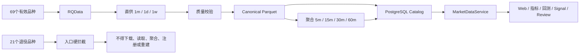

# GY-DATA-PRODUCT-RETIREMENT-21

更新时间：2026-08-05

## 1. 目标与精确范围

本任务已将活动品种池从 90 个收口为 69 个，并退役以下 21 个品种：

| 中文名 | 代码 | 中文名 | 代码 |
|---|---:|---|---:|
| 粳稻 | JR | 普麦 | PM |
| 早籼稻 | RI | 强麦 | WH |
| 动力煤 | ZC | 线材 | WR |
| 胶合板 | BB | 纤维板 | FB |
| 聚丙烯月均价 | PP_F | 聚乙烯月均价 | L_F |
| 聚氯乙烯月均价 | V_F | 国际铜 | BC |
| 棉纱 | CY | 原木 | LG |
| 铸造铝合金 | AD | 胶版印刷纸 | OP |
| 粳米 | RR | 10年期国债 | T |
| 5年期国债 | TF | 2年期国债 | TS |
| 30年期国债 | TL |  |  |

匹配只允许标准化后的精确代码；`PP_F/L_F/V_F` 不得命中 `PP/L/V`，`T` 不得命中 `TA`。

全链路范围包括 RQData raw、provider-direct `1m/1d/1w`、Canonical、由 1m 生成的
`5m/15m/30m/60m`、processed、Catalog/quality/task/mapping/contract/parameter/Profile Binding
等精确数据库记录，以及当前 Git 版本中仅属于目标品种的清单和证据。混合 Profile 只删除目标
Binding，不删除 Profile；混合文本证据按目标品种匹配规则处理，不重写 Git 历史。

## 2. 目标链路

`data/universe/active_products.txt` 是唯一活动品种文件。退役集合由
`app.data_core.product_retirement` 冻结；下载入口和 `MarketDataService` 在外部调用前拒绝目标品种。

## 3. 生产执行结果

受控入口为 `guiyi runtime product-retirement execute/resume`。本次以
`runtime-20260805-b81a9d99` 完成断点恢复和最终验收：

- 删除 8,625 个文件，合计 1,466,729,156 bytes；
- 删除 PostgreSQL 1,141,643 条精确目标记录；
- packet SHA-256 为 `fee133a5015ab2fb0ea5929a232eb6f3110bc8b61aca56cfed79c1a46c0b29ec`；
- 残留数据库记录 0，残留数据文件 0；
- 69 个保留品种的 443 个直供目标和 608 个聚合目标全部通过；
- 仓库内 1,035 个仅属于退役品种的历史 manifest 已删除；混合品种审计报告不整文件删除。

数据删除已提交，`runtime-rollback-20260805-9e816720` 只能回退代码。如需恢复退役品种，
必须从 RQData 重新下载并按 Git 历史重建 Catalog/Manifest。

## 4. 历史事实边界

本文档现为 `historical_fact`，不授权任何后续删除、RQData 写入、release、Runtime、live 或通知操作。
