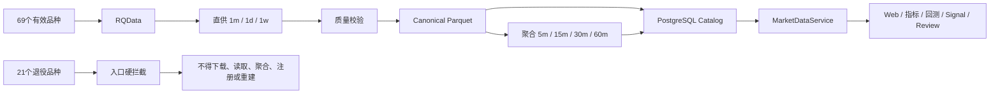

# GY-DATA-PRODUCT-RETIREMENT-21

更新时间：2026-08-05

## 1. 目标与精确范围

本任务将当前活动品种池从 90 个收口为 69 个，并在独立真实删除 Gate 后退役以下 21 个品种：

| 中文名 | 代码 | 中文名 | 代码 |
|---|---:|---|---:|
| 粳稻 | JR | 普麦 | PM |
| 早籼稻 | RI | 强麦 | WH |
| 动力煤 | ZC | 线材 | WR |
| 胶合板 | BB | 纤维板 | FB |
| 聚丙烯月均价 | PP_F | 聚乙烯月均价 | L_F |
| 聚氯乙烯月均价 | V_F | 国际铜 | BC |
| 棉纱 | CY | 原木 | LG |
| 铸造铝合金 | AD | 胶版印刷纸 | OP |
| 粳米 | RR | 10年期国债 | T |
| 5年期国债 | TF | 2年期国债 | TS |
| 30年期国债 | TL |  |  |

匹配只允许标准化后的精确代码；`PP_F/L_F/V_F` 不得命中 `PP/L/V`，`T` 不得命中 `TA`。

全链路范围包括 RQData raw、provider-direct `1m/1d/1w`、Canonical、由 1m 生成的
`5m/15m/30m/60m`、processed、Catalog/quality/task/mapping/contract/parameter/Profile Binding
等精确数据库记录，以及当前 Git 版本中仅属于目标品种的清单和证据。混合 Profile 只删除目标
Binding，不删除 Profile；混合文本证据只允许在独立 Git deletion manifest 中删除目标行。

## 2. 目标链路

`data/universe/active_products.txt` 是唯一活动品种文件。退役集合由
`app.data_core.product_retirement` 冻结；下载入口和 `MarketDataService` 在外部调用前拒绝目标品种。

## 3. 工具与 Gate

受控入口为 `scripts/rqdata_product_retirement.py`：

- `inventory`：只读扫描显式传入的 bounded raw/canonical/processed roots 与当前 PostgreSQL，生成
  逐文件 SHA-256、逐表主键/identity digest 和 blocker；数据库清单按表切分为 packet 旁的
  hash-bound JSONL 分片，避免百万行全部内嵌在单个 JSON；不调用 RQData。代码与 Runtime
  worktree 必须 clean，否则拒绝生成可审批 packet。
- `apply`：必须同时绑定 packet 文件 SHA-256、approval 文件 SHA-256、代码 SHA、Runtime SHA、
  DB revision、21 品种摘要、停服 receipt SHA-256 和 expiry；全部 writer 的 launchd job 必须已经
  unload。执行前重新盘点目标文件和数据库全集并匹配 packet 摘要，数据库校验与分批删除在同一个
  `SERIALIZABLE` 事务中完成。任一新增、缺失或内容漂移均零写入。
- `verify`：重新扫描全部显式 root 和 PostgreSQL，要求目标残留为零。

真实执行顺序固定为：代码/测试/Review/CI 合入 `develop` → 独立 release Gate → 独立 Runtime
promotion Gate → 新 Runtime 验证 69 品种且无回灌 → unload 全部 writer 并生成停服 receipt →
生成当时生产 exact packet → owner 同时批准 packet 与停服 receipt 的 exact hash → apply → verify →
重启和一个增量周期观察。若 inventory 报告仍有 `pending/running/retrying` 目标任务，必须先在独立
DB 写入 Gate 下将其安全终止，再重新生成 packet；不得忽略 blocker 或手改清单。

文件在 apply 同一窗口内先按 packet digest 原子移入各 root 内部 staging；DB 事务失败则原路恢复，
提交成功立即物理销毁 staging，不保留长期隔离区或备份。成功后的恢复只能从 RQData 和 Git 历史重建。

## 4. 当前状态

当前仅授权并实施代码、测试、活动品种配置、只读 inventory 与文档合同。尚未授权或执行：

- 删除当前 Git 中的历史 manifest/report/receipt；
- `main`/release/tag；
- Runtime promotion 或停服；
- 真实 PostgreSQL DML；
- Raw/Canonical/聚合/processed 文件删除；
- 任何 RQData 下载或重建。

最小最终退役 receipt 必须保留中文名/代码、packet SHA-256、实际文件/行数、验证结果及精确
release/Runtime/DB revision；它是唯一新增的长期退役凭证。
