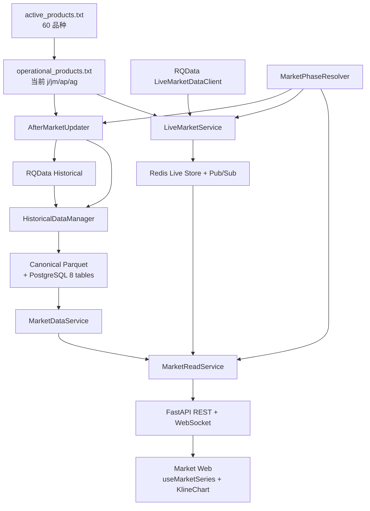

# GY-MARKET-RUNTIME-V1：历史分页、盘后自动更新与主力实时行情设计

更新时间：2026-08-11
Disposition：`historical_fact`
Current acceptance：`partial_canary_development_runtime`
当前实现基线：仓库实现与即时验收已完成；精确当前事实以 `STATUS.md` 为准

## 1. 目标

本设计用于把当前 Market-only 个人量化工作站从“历史数据闭环”继续打通到完整的日常使用链路：

```text
历史 Canonical
→ Web 高性能分页浏览
→ 盘后自动更新
→ 盘中主力实时 1m
→ 本地 5m/15m/30m/60m 聚合
→ Redis Live Overlay
→ FastAPI WebSocket
→ Market Web 无缝显示历史 + 当天实时
```

项目仍是本地优先、单用户、个人开发和个人使用。设计优先级为：

```text
正确的数据语义
> 响应速度
> 简单可维护
> 必要复用
> 企业级扩展能力
```

只为真实复用抽象，不为了设计模式增加层级。坚持 YAGNI、DRY、Single Responsibility，但不建设团队级或 SaaS 级平台能力。

---

## 2. 当前事实基线

### 当前实现与部署状态

- MR-01～MR-07 的仓库实现已经完成；MR-08 的即时代码、测试和受控实盘检查已形成证据。
- MR-08 仍为 `PARTIAL`：开发态自然 10:15/10:31 与 17:00 完整收口已经通过；周末/非交易日和最终
  isolated exact-commit Runtime 证据尚未形成。
- 开发期 launchd 临时直接运行主 `develop` 工作区；旧 detached Runtime worktree 已移除。
- `develop` 便于快速修改和查看，但源码变更不会热加载；Web、API 或 Live 每次重载仍需新的单次执行意图。
- 最终闭环前必须重新建立 clean、detached、exact-commit/tag 的独立 Runtime worktree。release、`main` 合并与 Runtime
  promotion 继续是相互独立的人工 Gate。

### 2.1 active universe

`data/universe/active_products.txt` 固定为 60 品种。

### 2.2 operational 品种的历史闭环

四个 operational 品种均已完成历史闭环：

| 品种 | 交易所 | 正式月分区 | 状态 |
|---|---|---:|---|
| J 焦炭 | DCE | 686（continuous 308 / contract 378） | 完成 |
| JM 焦煤 | DCE | 678（308 / 370） | 完成 |
| AP 苹果 | CZCE | 685（308 / 377） | 完成 |
| AG 白银 | SHFE | 748（308 / 440） | 完成 |

四个品种均已完成对应的 audit、fixed-T0 NOOP、Catalog/Parquet 读回和 `MarketDataService` 七周期验证。
全域 DFD-07 的最新闭环数量不由本历史设计维护，以 `STATUS.md` 为准。

### 2.3 当前 Data Foundation

继续冻结以下合同，不在本任务重构：

- `DatasetKey=(kind,symbol,series_or_contract,frequency)`；
- 物理 kind 只有 `continuous|contract`；
- `actual_dominant` 只在查询时由 rank1 `MainContractMap` 拼接；
- Direct：`1m/1d/1w`；
- Derived：`5m/15m/30m/60m`，只从 Canonical 1m 按实际 TradingSession 聚合；
- 每 Dataset 每自然月一个 `part.parquet`；
- PostgreSQL 八表；
- `HistoricalDataManager` 是唯一历史写入口；
- `MarketDataService` 是唯一正式历史读入口。

### 2.4 当前 Web 问题

当前图表页按 `start/end` 一次性读取整个请求窗口，并把全部 bars 交给 `KlineChart.setData()`；`KlineChart` 每次 bars 变化后又执行 `fitContent()`。

这在 2023 至今的 1m 数据和后续每分钟 Live 更新场景下都不适合作为最终主路径。

### 2.5 当前 Runtime

当前 FastAPI 保持 Market + Runtime 面；历史分页、rank1 Live、Redis Overlay、REST/WebSocket seam、盘后更新与 Runtime
health 已实现。`j/jm/ap/ag` 四品种的本地有界 Runtime 已启用，当前 launchd 临时直接运行主 `develop` 工作区；旧
detached Runtime worktree 和旧 scheduler 路径已移除。Redis 不承载已退役的业务队列。

本设计不恢复旧 RQ worker、Signal worker、任务中心或历史 Live 兼容路径。

---

## 3. 范围与禁止范围

### 3.1 本任务做

1. 历史 K 线游标分页；
2. Web 左拖自动加载更早历史；
3. operational universe；
4. MarketPhaseResolver；
5. macOS launchd 盘后自动更新；
6. RQData `LiveMarketDataClient` 主力 1m 实时接入；
7. Live 5m/15m/30m/60m 本地聚合；
8. Redis 当日 Live Overlay；
9. FastAPI WebSocket；
10. MarketReadService；
11. Web 历史 + Live 无缝显示；
12. 盘后失败本地状态 + macOS 通知；
13. Runtime health 接入真实 Live / After-market 状态。

### 3.2 本任务不做

- tick；
- 五档盘口；
- continuous/SYMBOL88 的盘中 Live；
- 非当前主力真实合约的盘中 Live；
- Live 1d / 1w；
- Live 数据直接写 Canonical；
- Live Parquet archive；
- PostgreSQL Live 表；
- 回测；
- Signal / Review；
- 企业微信通知；
- Kafka / EventBus / CQRS / Event Sourcing；
- RQ worker / scheduler database / task center；
- distributed lock / multi-user subscription / service mesh；
- 自动交易；
- 订单接口。

`auto_order=false` 始终成立。

---

## 4. 最终总体架构



核心边界：

```text
HistoricalDataManager = 正式历史写
MarketDataService      = 正式历史读
LiveMarketService      = 当日 Live 采集/聚合
MarketReadService      = Web 展示读模型
AfterMarketUpdater     = 盘后自动化控制层
MarketPhaseResolver    = 交易阶段/交易日判断
```

---

## 5. Operational Universe

新增：

```text
data/universe/operational_products.txt
```

V1 内容固定为：

```text
j
jm
ap
ag
```

定义：

> Operational Product = 已完成完整历史闭环，并明确允许进入自动盘后更新和盘中 Live 的品种。

硬约束：

```text
operational_products ⊆ active_products
operational_products ∩ retired_products = ∅
```

不自动扫描 Catalog 推断 operational 状态。

一个新品种加入 operational universe 前至少已完成：

```text
audit passed
+ fixed-T NOOP
+ 七周期 continuous/contract/actual_dominant MDS readback
+ 人工确认加入 operational_products.txt
```

以后从 4 扩到 60，只改该配置，不改 AfterMarketUpdater、LiveMarketService 或 WebSocket 架构。

---

## 6. 市场阶段：MarketPhaseResolver

新增纯领域模块：

```text
app/market_data/market_phase.py
```

禁止硬编码 `09:00-15:00`、`10:15-10:30` 等通用时间表；统一复用 PostgreSQL `TradingCalendar`、`TradingSession` 和现有 `session_clock.py`。

### 6.1 按品种解析，不使用一个全市场统一 phase

不同品种夜盘时间不同，因此：

```text
resolve(symbol, now)
→ ProductMarketPhase
```

### 6.2 四种状态

```text
TRADING
BREAK
CLOSED
UNKNOWN
```

定义：

- `TRADING`：`now` 落在该品种某个实际 SessionWindow 的 `[start,end)` 内；
- `BREAK`：同一 trading_day 前一 Session 已结束、后一 Session 尚未开始；
- `CLOSED`：周末、节假日、交易日前未开始、当日交易全部结束、夜盘与日盘之间的关闭阶段；
- `UNKNOWN`：Calendar / Session 事实不足，必须 fail-closed。

### 6.3 必须覆盖的边界

日盘示例：

```text
09:00       TRADING
10:14:59    TRADING
10:15:00    BREAK
10:20       BREAK
10:29:59    BREAK
10:30:00    TRADING
11:30:00    BREAK
13:30:00    TRADING
15:00:00    CLOSED
```

因此 10:15-10:30 不产生 Live bar，也不得被误判为 Live stale / disconnect。

### 6.4 夜盘 trading_day

复用现有 `session_windows_for_trading_day`：夜盘实际自然日时间锚定前一交易日，但身份属于后一个 trading_day。

禁止：

```python
trading_day = datetime.now().date()
```

Live 和 Historical 必须共用同一交易日语义。

---

## 7. Historical Pagination

### 7.1 新主路径

新增 REST：

```text
GET /api/v1/market/bars/page
```

请求：

```text
series_kind
symbol
contract?          # 仅 contract 必填
frequency
before?            # exclusive bar_end cursor
limit              # 默认 1200，最大 2000
```

第一次请求：

```text
before = null
limit = 1200
```

含义：

> 返回该逻辑序列最近最多 1200 根正式 Canonical Bar。

返回 bars 按 `bar_end` 升序。

响应：

```text
request
bars
canonical_coverage
page:
  has_more_before
  next_before
resolved_contract_segments
```

`next_before = 当前页面最早 bar_end`。

### 7.2 为什么使用 cursor

不用 `page/offset`，避免新数据加入后页边界漂移。

不用固定日期窗口作为主交互，因为 1m、15m、1d 同日期跨度的数据量差异很大。

### 7.3 MarketDataService 扩展

分页仍必须由 `MarketDataService` 提供正式历史数据，不允许 MarketReadService 自行 glob Parquet。

建议新增领域合同：

```text
SeriesPageQuery
MarketSeriesPageResult
MarketDataService.query_page()
```

物理序列：按 Catalog 月分区从新到旧读取，直到收集 `limit` 根。

`actual_dominant`：按 MainContractMap 从 cursor 向前解析所需 rank1 segment，仅读取命中映射日的真实合约分区；周线继续使用现有完整 ISO 周 owner 规则。

### 7.4 旧接口

现有 `/bars/canonical?start&end` 可继续保留用于显式窗口查询、测试和诊断，但 Market Web 主路径改为 `/bars/page`。

---

## 8. Live 支持范围

### 8.1 Live V1 频率

```text
1m
5m
15m
30m
60m
```

`1d / 1w` 仍为 Historical-only。

### 8.2 Series live eligibility

```text
actual_dominant
→ operational + intraday frequency 时支持 Live

contract
→ contract == 当日 Live rank1 时支持 Live

continuous
→ V1 永远 Historical-only

contract != 当日 rank1
→ Historical-only
```

禁止用 rank1 Live 冒充 continuous MAIN。

---

## 9. Live 当日 rank1

### 9.1 正式规则

每个品种每个 trading_day 只确定一次：

```text
RQData futures.get_dominant(
  symbol,
  start_date=trading_day,
  end_date=trading_day,
  rule=2,
  rank=1
)
```

整 trading_day 冻结，不按盘中成交量再次切换。

### 9.2 生命周期

对每个 operational product：

```text
进入新的 trading_day 的首个 Session
→ 查询当日 rule=2 rank1
→ 写 Redis LiveSubscriptionSnapshot
→ subscribe bar_<rank1_contract>
→ 整 trading_day 固定
```

无夜盘品种在日盘首 Session 前解析；有夜盘品种在夜盘所属新 trading_day 开始时解析。

### 9.3 Snapshot 性质

Redis：

```text
live:subscription:{trading_day}
```

内容是：

```text
symbol -> contract
```

这是临时 Live subscription snapshot，不是正式 `MainContractMap`。

禁止：

```text
Redis snapshot → promote → PostgreSQL MainContractMap
```

盘后 MetadataSynchronizer 必须独立重新从 RQData 获取正式 rank1 map。

---

## 10. RQData Live 接入

新增：

```text
app/market_data/live_market.py
```

### 10.1 Provider 选择

使用：

```text
rqdatac.LiveMarketDataClient
```

只订阅：

```text
bar_<rank1_contract>
```

支持多标的一次性订阅；不订阅 tick。

### 10.2 不直接订阅 RQData 5m/15m/30m/60m

RQData 官方实时多分钟合成对 30/60 分钟使用时间切片，休市段可能产生与当前 TradingSession 聚合规则不同的桶。

所以 V1：

```text
RQData Live 只取 1m
→ 本地使用现有 Session 语义聚合 5/15/30/60
```

### 10.3 LiveBarAdapter

Live provider payload 统一映射为与 `CanonicalBar` 字段一致的 Bar DTO：

```text
bar_end
trading_day
open
high
low
close
volume
turnover
open_interest
```

价格、量额和持仓继续使用 Decimal 语义。

### 10.4 完成 1m 的判定

V1 只向 Web 发布已完成 1m。

为避免依赖 provider 是否会在分钟内重复推送同一个 bar，使用简单边界规则：

1. 事件的 bar_end 必须是当前 TradingSession 的 expected 1m 边界；
2. 相同 bar_end 在最终发布前只保留最新 payload；
3. `now >= bar_end + 2 seconds` 后才 final；
4. final 后该 bar_end 不再修改；
5. Session 最后一根只接受 `bar_end == session_end`，已启动的 provider 可在
   `session_end + 60 seconds` 前补交；到达时若已超过 2 秒 finalization 边界则立即 final；
6. 收盘后的 Session 中间分钟与超过 60 秒才到达的末根均丢弃并记录稳定错误码。

2 秒 finalization 与 60 秒 session-end arrival grace 是两个独立边界。典型 09:31 bar
仍最晚约 09:31:02 进入 Live Overlay；额外窗口只保护精确的 Session 末根，不构成
历史补洞、repair 或 replay。

### 10.5 缺失 Live 分钟

Live 不做历史补洞。

若盘中网络中断漏掉某分钟：

```text
Web 当天 Live 可出现空洞
→ Historical Canonical 不受影响
→ 盘后 RQData historical update 正式补齐
```

不为 Live 建 repair/replay/checkpoint 体系。

---

## 11. Live Derived 聚合

### 11.1 必须复用 Historical 规则

历史与 Live 不允许维护两套 bucket 口径。

从 `aggregation.py` 提炼最小公共 primitive，例如：

```text
resolve_bucket_end(session, frequency, bar_end)
aggregate_bucket(bars, bucket_end)
```

Historical `aggregate_from_1m()` 与 Live 聚合共同使用。

### 11.2 简单增量实现

confirmed 1m 到达后：

```text
写 Redis 1m
→ 对 5/15/30/60 分别计算所属 bucket_end
→ 如果当前 1m == bucket 最后一根
   → 从 Redis 读取该 bucket 所需 1m
   → expected 完整才聚合
   → 写 Redis Derived
   → Pub/Sub
```

这样 LiveMarketService 重启后不需要复杂 checkpoint：当前交易日已存在 Redis 1m 时仍可继续完成后续 bucket。

10:15-10:30 和 11:30-13:30 因为属于不同 Session，桶不会跨休市拼接。

---

## 12. Redis Live Store

Redis 只保存当天临时观察数据，不是正式历史数据库。

### 12.1 Keys

建议：

```text
live:bars:{trading_day}:{symbol}:{frequency}
live:subscription:{trading_day}
live:heartbeat
```

bars 使用 Redis Sorted Set：

```text
score  = bar_end epoch milliseconds
member = compact JSON bar
```

final bar 不会修改，因此不需要复杂版本控制。

### 12.2 Pub/Sub

```text
live:bar:{symbol}:{frequency}
market:state
```

`market:state` 只用于通知 WebSocket gateway 重新读取当前 state，例如 canonical 已前进。

### 12.3 TTL

Live bars / subscription snapshot 设置 3 天 TTL。

盘后成功时主动删除已被 Canonical 覆盖的对应 trading_day Live keys；若清理失败，TTL 自动回收即可，不建立恢复任务。

---

## 13. LiveMarketService 进程

独立常驻进程，不运行在 FastAPI worker 内。

建议 CLI：

```text
guiyi runtime live
```

职责：

```text
加载 operational_products
→ 按品种解析 MarketPhase
→ 新 trading_day 解析 rank1
→ 管理 LiveMarketDataClient subscriptions
→ normalize confirmed 1m
→ Redis 1m
→ 本地 Derived
→ Redis Pub/Sub
→ heartbeat
```

### 13.1 reconnect

TRADING 状态下 provider 连接断开：固定 10 秒重连，不做 exponential backoff/circuit breaker。

BREAK/CLOSED 不把“没有新 bar”视为 provider 故障。

### 13.2 CLOSED

服务进程可常驻，但 CLOSED 时不要求保持无意义的行情消费；到下一有效 Session 自动恢复订阅。

### 13.3 Redis 故障

Redis 不可用时 Live 标记 unavailable；Historical Web 必须继续正常工作。

不把 Live 数据回退写本地文件。

---

## 14. MarketReadService

新增：

```text
app/market_data/market_read.py
```

它是展示 Query Facade，不替代 MarketDataService。

只负责五件事：

```text
Historical page
Canonical/Live seam
Live eligibility + snapshot
Market phase/state
After-market state
```

禁止承担：

```text
RQData 下载
Parquet 写入
MainContractMap 计算
Live provider subscription
scheduler
通知发送
```

### 14.1 Seam Rule

```text
Canonical 永远优先
Live 只允许 bar_end > canonical_end
```

Live 不能覆盖已经正式存在的 Canonical bar。

### 14.2 state

统一 state 至少返回：

```text
symbol
series_kind
frequency
operational
phase
trading_day
live_eligible
live_available
live_contract
canonical_end
after_market
```

Market Web 不自行推断交易阶段、主力或 Canonical seam。

---

## 15. REST / WebSocket 合同

### 15.1 Historical REST

```text
GET /api/v1/market/bars/page
```

只返回 Canonical。

### 15.2 State REST

```text
GET /api/v1/market/state
```

供页面首屏和 Historical-only 序列读取当前状态。

### 15.3 WebSocket

```text
/api/v1/market/ws
```

请求 identity：

```text
series_kind
symbol
contract?
frequency
after?      # 客户端最后已知 live bar_end
```

V1 只使用四种消息：

```text
state
snapshot
bar
reset
```

#### state

用于：

```text
TRADING/BREAK/CLOSED/UNKNOWN
live_available
live_contract
canonical_end
after-market state
```

Canonical 前进时也重新发送 `state`，不新增第五种事件类型。

#### snapshot

连接/重连后返回：

```text
canonical_end 之后
且 after 之后
的全部当日 Live bars
```

#### bar

发送单个 confirmed Live bar。

#### reset

新的 trading_day / rank1 contract 生效时发送。

### 15.4 REST → WebSocket race

连接流程固定为：

```text
1. REST 取 Historical page，得到 canonical_end
2. WebSocket connect(after=canonical_end 或 last_live_end)
3. Server 先 subscribe Redis Pub/Sub
4. 再读取 Redis snapshot
5. 发送 snapshot
6. 开始消费 Pub/Sub
7. 按 bar_end 去重
```

避免 REST 完成和 WebSocket 建立之间漏一根 Live bar。

---

## 16. Web 前端结构

### 16.1 `chart.vue`

只负责：

```text
symbol / series / frequency controls
状态展示
调用 useMarketSeries
```

不继续承载分页、WebSocket、重连、seam 合并细节。

### 16.2 `useMarketSeries`

新增一个 composable 即可，不拆更多状态框架。

职责：

```text
initial page
loadMoreBefore
generation token
WebSocket lifecycle
snapshot merge
live append
reconnect
phase/state
after-market state
```

切换 symbol/series/frequency 时：

```text
generation += 1
close old websocket
ignore old HTTP response
replace new series
```

避免旧 AG 响应串进新 JM 页面。

### 16.3 `KlineChart`

从“bars props 变化就全量 setData + fitContent”改为三个动作：

```text
replace
prepend
append/update
```

#### replace

首次加载或切序列：

```text
setData
fitContent
```

#### prepend

左拖加载旧历史：

```text
prepend bars
保持原 viewport
```

不得因为加载更早历史跳回最右侧。

#### append/update

Live 新 bar：

```text
candles.update(bar)
volume.update(bar)
```

绝不全量 `setData()`，绝不无条件 `fitContent()`。

### 16.4 follow latest

初次进入默认 `followLatest=true`。

用户向左浏览历史后自动关闭 follow；Live 新 bar 不把画面强拉回今天。

页面提供一个轻量“回到最新”入口恢复 follow。

### 16.5 Historical 左拖

默认首屏最近 1200 根。

图表左侧接近已加载边界时：

```text
before = current_earliest_bar_end
→ GET bars/page
→ prepend
```

直到 `has_more_before=false`，可以一直浏览至 2023 第一根。

---

## 17. Indicator 边界

本任务不新增 Live Indicator Service。

Indicator Kernel 仍是 Bar 的消费者。

Web 若展示 EMA/MACD/ATR/HTDY：

```text
Historical page + confirmed Live bars
→ 统一 BarData
→ 现有 Indicator Kernel / observation mirror
```

只让 confirmed bar 进入指标，不计算 tick/provisional bar。

指标无新持久化层。

---

## 18. AfterMarketUpdater

新增：

```text
app/market_data/after_market.py
```

建议 CLI：

```text
guiyi data after-market
```

由 macOS launchd 每天 17:00 启动一次短生命周期进程。

### 18.1 Scope

只处理：

```text
operational_products.txt
```

当前：

```text
j / jm / ap / ag
```

不是 active 60 全量。

### 18.2 首次尝试

17:00：

```text
1. load operational products
2. resolve latest complete trading day T
3. 如果 T 不是当日需要处理的新交易日 → skipped/noop
4. rqdatac.is_data_ready(
     categories=[future_daybar, future_minbar],
     expected_date=T,
     market=cn
   )
5. ready → HistoricalDataManager.update(products, through=T, apply=True)
6. passed/noop → success
```

### 18.3 Retry

第一次 not ready 或执行失败：

```text
等待 1 小时
→ 仅重试 1 次
```

第二次失败：

```text
final failed
→ 不再重试
→ 写状态
→ macOS notification
→ 退出
```

不做循环 retry、任务队列、补偿 workflow。

### 18.4 周末/节假日

launchd 可以每天拉起。

非交易日：

```text
status=skipped
reason=non_trading_day
0 provider bar request
0 Canonical write
0 retry
```

### 18.5 每日全量 audit

不自动执行全历史 audit。

`HistoricalDataManager.update()` 的发布校验和消费者读回继续承担当次更新正确性；完整 audit 留给人工检查/新 operational 品种闭环。

---

## 19. After-market 状态与 macOS 通知

不建 DB task table。

使用已经 gitignore 的 `.run/`：

```text
.run/after-market-status.json
```

只保存当前摘要，不保存任务历史流水。

建议结构：

```text
last_run
last_successful_trading_day
last_failure
```

`last_failure` 在下一次成功后清空；周末 `skipped` 不清除尚未被成功修复的 failure。

最终失败通知使用 macOS 原生 `osascript` 固定参数调用，不增加第三方通知依赖。

只在 final failed 时弹一次本地通知；成功不弹。

Web 通过 MarketReadService state 显示最近盘后状态。

---

## 20. 盘后 Canonical 与 Live 对齐

### 20.1 MainContractMap

盘中 Redis snapshot：

```text
AG -> AGxxxx
```

盘后 MetadataSynchronizer 独立重新获取正式 RQData rule=2 rank1 后写 PostgreSQL `MainContractMap`。

成功后比较：

```text
LiveSubscriptionSnapshot
vs
正式 MainContractMap
```

一致：正常。

不一致：

```text
LIVE_DOMINANT_MISMATCH
```

记录在 after-market status 并通知；正式 MainContractMap 仍以历史同步结果为准，不回滚去迎合 Live。

### 20.2 Live Bar 不 promote

盘中 Live bar 永远不直接变成 Canonical。

盘后流程：

```text
RQData Historical
→ HistoricalDataManager
→ 正式 Canonical
```

成功后：

```text
canonical_end 前进
→ market:state Pub/Sub
→ WebSocket state 更新
→ Web 重新取最右端 Canonical page
→ Canonical 覆盖当日 Live
→ 清理该 trading_day Live Redis keys
```

图形应尽量保持连续，但数据身份从 Live 切换为正式 Canonical。

---

## 21. 非盘中行为

### 21.1 周末

```text
Historical REST 正常
左拖分页正常
phase=CLOSED
live_available=false
AfterMarketUpdater 17:00 → skipped
```

LiveMarketService 不影响历史浏览。

### 21.2 10:15-10:30 / 11:30-13:30

```text
phase=BREAK
无新 Live bar
不判 stale
不换主力
不重连 provider
Redis 不清理
```

到下一 Session 自动恢复。

### 21.3 Live 服务停止

```text
Historical Web 100% 可用
Live unavailable
```

Live 绝不能成为历史读取的硬依赖。

### 21.4 After-market 失败

```text
Canonical 保持最后成功状态
Live 不 promote
Web 显示盘后失败
```

下一次正常 update 依靠既有 coverage 机制自然补缺，不建设补偿任务中心。

---

## 22. Runtime / launchd

### 22.1 Live

建议提供 LaunchAgent：

```text
RunAtLoad=true
KeepAlive=true
```

运行：

```text
guiyi runtime live
```

### 22.2 After-market

LaunchAgent：

```text
StartCalendarInterval: 17:00 daily
```

运行：

```text
guiyi data after-market
```

进程自己处理一次 1 小时后的最终 retry。

### 22.3 不恢复 RQ worker

Redis 只用于 Live Store / PubSub，不恢复旧业务 RQ 队列。

---

## 23. Runtime Health

现有 `/api/runtime/health` 中 retired Live / After-market stub 在实现完成后替换为真实但简单的读状态：

### live_market

```text
status
operational_count
subscribed_count
last_heartbeat_at
last_bar_at
phase_counts
```

heartbeat 放 Redis，短 TTL。

### after_market

读取：

```text
.run/after-market-status.json
```

返回：

```text
last_run
last_successful_trading_day
last_failure
```

不恢复旧 archive/notification retry 体系。

---

## 24. 自动化授权模型需要同步更新

当前 canonical 规则仍以“每次正式数据 mutation 都需要单次执行意图”为基础；这与用户已经确认的每日自动盘后更新目标冲突。

实现阶段必须明确更新 `AGENTS.md` / `DECISIONS.md`：

1. 代码和 launchd 配置默认不自动启用；
2. 用户明确执行一次“启用 Market Runtime V1”后，允许以下**有界、持续自动行为**：
   - LiveMarketService 只订阅 `operational_products` 当日 rank1；
   - AfterMarketUpdater 只在 17:00/最多一次 1h retry 内对 `operational_products` 调用正式 `HistoricalDataManager.update`；
3. 启用后每日运行不再要求逐日人工确认；
4. 新增品种通过显式修改 `operational_products.txt` 扩展自动范围；
5. main/tag/release、Runtime 版本 promotion、真实通知外部渠道、其他生产 DB mutation 仍不因此获得授权；
6. `auto_order=false` 不变。

该变更是实现自动化所必需的产品行为调整，不建立新的审批 packet 或权限系统。

---

## 25. 错误处理原则

本项目不建设企业级恢复体系。

### 25.1 Historical

保持现有 fail-closed：

```text
missing partition / map / coverage / unreadable parquet
→ 明确失败
```

### 25.2 Live

```text
provider disconnect
→ TRADING 时固定 10s 重连

Redis down
→ Live unavailable
→ Historical unaffected

missing live minute
→ 不补洞
→ 盘后 Historical 正式补齐

BREAK/CLOSED
→ 没有新 bar 是正常状态
```

### 25.3 After-market

```text
第一次失败
→ 1h 后再试一次

第二次失败
→ status + macOS notification
→ 退出
```

无 DLQ、无 retry table、无 recovery workflow。

---

## 26. 推荐代码结构

尽量控制新增模块数量：

```text
services/quant-api/app/market_data/
  operational_universe.py
  market_phase.py
  live_market.py
  market_read.py
  after_market.py

现有复用：
  aggregation.py
  session_clock.py
  service.py
  maintenance.py
  infrastructure.py
```

API 尽量继续放在现有 `app/api/market.py`，除非 WebSocket 代码使文件明显失焦时才拆 `market_live.py`。

前端：

```text
apps/quant-web/src/
  composables/useMarketSeries.ts
  pages/market/chart.vue
  components/kline/KlineChart.vue
  api/market.ts
  types/market.ts
```

不引入全局状态框架。

---

## 27. API / CLI 目标面

### API

```text
GET /api/v1/market/bars/page
GET /api/v1/market/state
WS  /api/v1/market/ws
```

现有：

```text
GET /api/v1/market/bars/canonical
GET /api/v1/market/dominants
GET /api/v1/market/coverage/canonical
```

继续可用。

### CLI

```text
guiyi data update
guiyi data refresh
guiyi data audit
guiyi data retire-products
guiyi data after-market

guiyi runtime status
guiyi runtime live
```

---

## 28. 测试设计

### 28.1 Operational universe

- 当前 j/jm/ap/ag 通过；
- 非 active 拒绝；
- retired 拒绝；
- 重复码拒绝；
- 未来扩到 60 无代码改动。

### 28.2 MarketPhaseResolver

必须覆盖：

- DCE/CZCE/SHFE；
- 有夜盘 / 无夜盘；
- 10:15-10:30 BREAK；
- 11:30-13:30 BREAK；
- 15:00 CLOSED；
- 夜盘新 trading_day；
- 跨午夜；
- 周末；
- 节假日；
- Calendar/Session 缺失 UNKNOWN。

### 28.3 Historical page

- physical continuous；
- physical contract；
- actual_dominant；
- before exclusive；
- limit；
- 多月跨分区；
- 主力换月；
- W1 owner；
- has_more_before；
- 到 history floor 后 false。

### 28.4 Live rank1

- 每 trading_day 一次 rule2 rank1；
- 整日冻结；
- 新 trading_day 可切换；
- 非 operational 不订阅；
- current rank1 contract live eligible；
- continuous live disabled。

### 28.5 Live 1m

- expected boundary；
- 2s finalize；
- same bar_end dedupe；
- session last bar；
- break 不产生 bar；
- outside-session 拒绝；
- trading_day 正确。

### 28.6 Live Derived

同一组 1m fixture 同时喂给：

```text
Historical aggregate_from_1m
Live incremental aggregate
```

5m/15m/30m/60m 输出必须逐字段一致。

### 28.7 Redis

- ordered snapshot；
- Pub/Sub；
- TTL；
- current trading_day isolation；
- cleanup。

### 28.8 WebSocket

- state；
- snapshot；
- bar；
- reset；
- REST/WS gap 不漏 bar；
- reconnect snapshot 补齐；
- duplicate bar_end 去重。

### 28.9 After-market

- non-trading day skipped；
- ready first attempt success；
- first fail + 1h retry success；
- second fail final；
- status file；
- macOS notifier mock；
- MainContractMap match；
- LIVE_DOMINANT_MISMATCH。

### 28.10 Frontend

- initial latest page；
- left-scroll loadMore；
- prepend 保持 viewport；
- append 不全量 setData；
- follow latest；
- 切品种 generation 防串数据；
- weekend historical-only；
- BREAK UI；
- Live disconnect 不影响 historical；
- canonical advanced 后替换已覆盖 Live。

---

## 29. 推荐实施顺序

本设计批准后再进入 implementation plan。推荐顺序固定为：

```text
MR-01  Historical Pagination + Kline performance
MR-02  Operational Universe + MarketPhaseResolver
MR-03  AfterMarketUpdater + status + launchd dry implementation
MR-04  LiveMarketService + Redis + shared aggregation
MR-05  MarketReadService + WebSocket
MR-06  Web unified historical/live integration
MR-07  Runtime health + launchd activation packaging
MR-08  J/JM/AP/AG real canary
```

MR-01～MR-07 已在不真实启用自动写入/Live 的阶段完成 fixture 与隔离测试。

MR-08 的四品种真实 Provider/Runtime 启用已经按用户明确范围执行；开发态日盘 BREAK/恢复与 17:00
盘后自然 canary 已通过。当前只保留周末/非交易日与最终隔离 Runtime 验收，不扩大 operational scope。

---

## 30. 真实 canary 验收

V1 只验证 operational 四品种：

```text
J / JM / AP / AG
```

至少验证一个完整交易日中的：

```text
夜盘（适用品种）
日盘第一阶段
10:15-10:30 BREAK
日盘第二阶段
11:30-13:30 BREAK
下午阶段
盘后 17:00 更新
```

当前真实验收台账：

| 验收项 | 状态 | 当前证据 |
|---|---|---|
| Web 首屏最近历史快速显示 | PASS | actual_dominant 页面真实加载与 coverage 显示通过 |
| 左拖可持续加载到 2023 | PASS | 同一页面真实拖拽从 1237 增至 24037 bars，coverage 起点到 `2023-11-20T01:46:00Z`，console 无错误 |
| actual_dominant 1m 实时 | PASS | 四品种 current rank1 Live 已通过 |
| 5m/15m/30m/60m 按本地 Session 规则实时 | PASS | 真实 15m/30m/60m 字段级聚合及既有 5m 证据通过 |
| continuous 无 Live | PASS | continuous 保持 Historical-only |
| 当前 rank1 contract 复用同一 Live | PASS | J2609/JM2609/AP2610/AG2610 通过 |
| 10:15-10:30 不报 stale | PASS | 10:15 自然 BREAK、10:31 自动恢复通过 |
| 11:30-13:30 BREAK/恢复 | PASS | 11:30 BREAK、13:33 自然恢复通过 |
| 夜盘 trading_day 正确 | PASS | 夜盘正确映射下一 trading_day |
| 周末 Historical 正常、Live CLOSED | PENDING | 等待周末自然证据 |
| 17:00 ready 时 Canonical 自动前进 | PASS | 2026-08-11 17:00 自然任务一次完成，四品种 15m edge 前进到 07:00Z |
| 首次失败仅 1h 后重试一次 | PASS | 2026-08-10 失败链为两次尝试，无第三次重试 |
| 最终失败写状态并 macOS 通知 | PARTIAL | 2026-08-10 状态文件真实记录稳定公开错误码；通知能力已有测试，尚未单独采集自然通知证据 |
| 盘后正式 MainContractMap 与 Live snapshot 对齐 | PASS | 运行前四品种正式映射与冻结 Live snapshot 完全一致 |
| Canonical 前进后 Web 无缝切换、Live 不 promote | PASS | 原页面 1200→1237 bars 自动刷新；Redis Live 清理，未写入 Parquet |
| operational scope 可配置扩展 | PASS（代码能力） | 统一读取 operational products；本轮未扩大四品种真实范围 |
| 非交易日 17:00 skipped | PENDING | 等待自然 `non_trading_day` 证据 |

---

## 31. 完成后的项目主架构

```text
                           RQData
                    ┌────────┴────────┐
                    │                 │
              Historical           Live 1m
                    │                 │
                    ▼                 ▼
        HistoricalDataManager   LiveMarketService
                    │                 │
                    ▼                 ▼
        Canonical + 8 tables        Redis
                    │                 │
                    ▼                 │
          MarketDataService           │
                    │                 │
                    └───────┬─────────┘
                            ▼
                    MarketReadService
                            │
                 ┌──────────┴──────────┐
                 ▼                     ▼
           Historical REST         WebSocket
                 │                     │
                 └──────────┬──────────┘
                            ▼
                     useMarketSeries
                            │
                            ▼
                       KlineChart

launchd 17:00
      │
      ▼
AfterMarketUpdater
      │
      ├─ success → Canonical advanced
      └─ fail → 1h retry once → status + macOS notification
```

---

## 32. 最终设计结论

本设计把项目控制在个人量化工作站所需的最小复杂度：

```text
正式历史 = Canonical
盘中观察 = Redis Live Overlay
自动范围 = operational_products
历史读 = MarketDataService
展示读 = MarketReadService
盘后写 = HistoricalDataManager.update
Live 输入 = 当日 rank1 completed 1m
```

真正严格的地方只保留在：

```text
TradingCalendar
TradingSession
trading_day
rank1 MainContractMap
1m → Derived 聚合
Canonical / Live seam
```

其余不建设企业级恢复、队列、权限、多用户或多版本体系。

MR-01～MR-07 已完成本地代码、fixture/mock、build 与 render-only 验证；MR-08 已完成有界启用、即时验收、
开发态自然 10:15/10:31 与 17:00 完整收口。本文件作为 `historical_fact` 保留，当前验收状态仍为
`partial_canary_development_runtime`。launchd 临时直接运行主 `develop` 工作区，只服务于开发期快速修改和
观察，不构成 exact-commit Runtime、release 或 promotion 证据。

最终关闭本文件仍需：周末/非交易日自然行为，以及在新建 clean detached Runtime worktree 上按 exact
commit 重新读回最终自然证据。手工 after-market、fixture、旧状态或受控重跑均不得冒充自然证据；
`auto_order=false` 与四品种 operational scope 保持不变。
