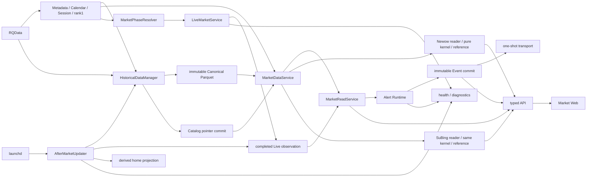
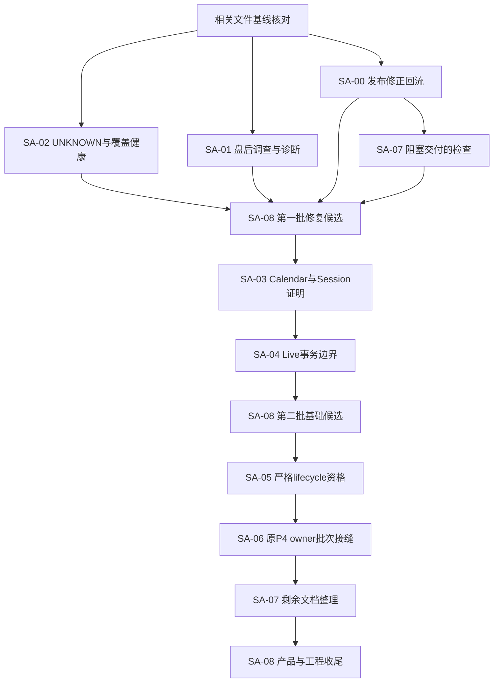

# 全系统审计与渐进重构决策
审计日期：2026-09-22。状态：审计与规划，业务尚未实施。原审计文档已由后续提交 `a6102bbf6` 收录。
本次按用户“开发顺序、第九节按你的思考来”的要求收敛规划；只修改两份规划文档，不执行业务或生产操作。
任务入口：[Sol 任务包](implementation-plan.md)。

## 1. 一页决策摘要

**需要定向修复和少量共享接口收口，不需要全系统重写，也不需要先把目录重分成五层。**

现有模块化单体、Canonical/Catalog/MDS、策略纯核、独立 Alert 和只读参考交易的主要分界值得保留。
当前最有价值的工作，是让同一交易时间事实在所有读取入口被同样验证，让业务未知状态明确降级，
并把发布修复回流到 develop。只搬目录、统一所有重试或新建任务框架，不能解决已复现问题。

开发顺序确定为以下六批；任务编号是身份，不表示必须按数字大小排队：

1. **基线准备：SA-00 + SA-07中阻塞交付的检查。** 先核对当前develop与发布修正，
   回流真正缺失的行为；修正过时版本/文档检查。完整回流和文档整理不能阻塞无重叠的小修。
2. **第一批业务修复：SA-02 → SA-01。** 先让Live未知状态真实降级，再让盘后初始化/失败有可定位证据。
   有两个实施会话时两项可并行；SA-01只读取证从准备阶段就开始。具体事故根因未知时不猜修数据。
3. **第二批基础收口：SA-03 → SA-04。** 先统一Calendar/Session权威证明，再缩短Live数据库事务；
   先固定读事实合同，再改资源装配，避免同一文件两轮返工。
4. **第三批产品闭环：SA-05 → SA-06。** 主升浪按完整lifecycle证据恢复严格资格；
   P4沿用原负责人，接入这一固定语义并修批次/输入身份。仓储独立复现可提前，不另起一套P4。
5. **第四批维护减负：完成SA-07剩余文档与流程整理。** 等真实接口稳定后再整理，避免文档反复追着设计改。
6. **SA-08贯穿每批集成。** 第一批通过即可形成稳定性修复候选，不等待全部重构和P4。
   发布、Runtime切换、自然运行各自绑定精确版本与授权，不能以开发完成替代。

当前不做：全仓目录搬迁、微服务、消息队列/outbox、通用重试引擎、新数据 authority、全量测试削减、
扩展 Newow 开放范围、参考交易升级成账户、Paper/OMS/Broker、策略参数优化或跨项目 AutoTrade 接入。

第9节给出本次明确选定的设计方向；任务共享合同在任务包第2节。规划方向已收敛，本轮不启动业务实现，也不授予生产操作权限。

## 2. 审计基线、现场身份与覆盖深度

### 2.1 身份不能混用

规划修订现场：`develop@a6102bbf66e13f93749e4e9e9206613ba6e696f2`，修改前工作树clean。
相对原审计HEAD，新增Web展示整理和文档归档；关键后端/核心审计文件未变。下表及运行证据仍是原审计时点，
本次没有重做Runtime读回或把旧测试更新成新HEAD通过；实施前继续核验现场与相关差异。

| 事实 | 本轮核验 |
|---|---|
| 仓库/工作区 | firehell/guiyi-quant-workstation；/Volumes/扩展盘/guiyi-quant-workstation |
| develop 基线 | `5b46cf0d6972478f0a06e9d70b56b3870c44dd1f` |
| 远端 develop | GitHub GET ref 同 SHA；本地 origin/develop 同 SHA，0 ahead / 0 behind |
| 正式 main / Release | main `879f76e4c115cc87bd9de78331002f084465fe33`；GitHub v1.10.19 非草稿、非 prerelease |
| Release 身份证据 | GitHub main ref 与 Release GET；本地 annotated tag/peeled identity 和 STATUS 对照，未发布任何对象 |
| 文档 Runtime | STATUS:4–16 记录 v1.10.18 / ec1dd21f7bed7b04018350058edd3f2bc94cbabf |
| 实际 Runtime | 2026-09-22 21:15:49 CST，API/Web/Live/after-market/Alert/weekly-audit 六项 installed 与 loaded root/commit 均为 v1.10.18 |
| 运行状态 | API/Web/Live/Alert running；after-market、weekly-audit 已加载但非运行中，这本身符合 schedule-only 拓扑 |
| API 现场 | 21:16:20 CST，/health version=1.10.18；capabilities=v10，W1 48，60m/explanation 关闭 |
| 工作树 | Runtime v1.10.18 detached、git status clean；仅现场代码身份，不证明自然业务完整 |

远端核验入口：
[develop ref](https://api.github.com/repos/firehell/guiyi-quant-workstation/git/ref/heads/develop)、
[main ref](https://api.github.com/repos/firehell/guiyi-quant-workstation/git/ref/heads/main)、
[v1.10.19 Release](https://github.com/firehell/guiyi-quant-workstation/releases/tag/v1.10.19)。
SSH `git ls-remote` 被网络权限阻止，之后以 GitHub connector 的 GET 核验，没有 fetch 或改 refs。

develop…main 提交图为 5 / 22；实际 tree diff 为 16 个文件，不能把 22 个提交都当成缺失功能。
`02ba03480` 与发布侧 `b36b26159` 是同类 metadata 修正的不同提交身份，数据源码树不因此形成两套。
main-only 差异包括能力 envelope 校验、E2E fixture、版本/路由/卫生测试与部分视觉回退。
**本报告所有源码问题以 develop 基线验证；现场行为另以 v1.10.18 标注。**

### 2.2 保留的并发工作

开始时已有以下 5 个 tracked dirty 文件，本轮未修改：

- `apps/quant-web/e2e/newow-product.spec.mjs`
- `apps/quant-web/src/components/market/detail/newow/NewowProductChartStage.vue`
- `apps/quant-web/src/components/market/detail/newow/newowProductChartPrimitives.ts`
- `apps/quant-web/tests/NewowProductChartStage.test.ts`
- `apps/quant-web/tests/newowProductChartPrimitives.test.ts`

另有未跟踪 P4 plan 与 `outputs/current-day-metadata-recovery-20260922/`，没有清理或纳入本轮结论。
已有 worktree：P4（aedb25874）、W1 remaining19 continuation（a1536d09）、closeout（004c074a）、
release v1.10.19（d4cbf281）、Runtime v1.10.17/18/19。
P4 工作区的 repository/contracts/subing_reference/CLI 及新 builder、planner、driver 测试正在修改；
它们不属于本次固定 develop 实现，也不能假设尚未修过 SA-06。

审计使用 `git archive` 导出到 `/tmp/guiyi-system-audit-5b46cf0d6`，不创建分支或移动 worktree。
临时复现实验只写 /tmp；最终只新增本报告和任务包。

### 2.3 全仓清单与检查深度

用 `git ls-files -z` 扫描全部 1,380 个受控路径。以下是清单覆盖，**不是逐文件逐行审查声明**。

| 区域 | 文件数 | 检查深度 / 排除 |
|---|---:|---|
| services | 391 | 135 个 app 文件清单；深入数据读写/metadata/Live/Alert/盘后/health/composition/API/reference；201 个测试文件按链路选读；50 个 Alembic 文件核对 lineage，重点当前迁移与默认关闭边界 |
| packages | 48 | 策略/指标/研究/reference 全部模块清单；深读 Newow adapters/projector、SuBing kernel复用、reducer/checkpoint；未重新数学证明每个公式 |
| apps | 286 | 路由/API/composable/时间与物理身份/health 展示/候选预览/测试与构建配置；78 个 Web unit 文件清单；抽读核心交互，未做全视觉逐页审查 |
| docs | 150 | 9 份必读入口与相关 accepted specs；按需读 active任务与原始证据；68 个 superpowers 路径、50 个研究文件分类；未逐页重审截图/PDF |
| outputs | 420 | 全清单分类为历史执行/审计产物；只选与当前链路相关证据，不把旧成功当当前状态；不执行其中旧脚本 |
| scripts | 26 | 7 个 ops脚本、secret检查、恢复/来源核验 wrappers 清单；深读 launcher/status，检查真实 mutation 入口与任务 Gate |
| deploy | 13 | launchd/API单worker/可选任务/恢复合同；FRP/Nginx 文档和配置属于外围，未连接云主机验收 |
| openspec | 11 | 10 个领域 spec 加配置；数据、Alert、Newow、公共 reference 深读，其余定位边界 |
| tests | 11 | 7 个 engineering文件与4个golden；重现相关工程失败，保留golden/退役入口/secret保护 |
| data | 7 | 6 份 universe/起点/分类等配置与1份研究协议；未扫描生产 Parquet 全资产 |
| .agents/.codex/tools/根文件 | 其余 | 两个项目技能、权限规则、配置、依赖入口、产品/架构/状态全部定位；不改变宿主或用户级配置 |

分类：Market/API/Web、HDM/MDS、Live、两规则 Alert 为 active；Live recovery 是否启用依 marker/装配，
不因代码存在推定现场启用；P3 reference 仓储默认 disabled；P4 是进行中候选；Newow 60m/explanation及剩余12品种W1未开放；
旧 Signal/Review/strategy/backtest/worker API 为退役 lineage；outputs/旧验收为历史产物。
锁文件检查身份与用途，不逐行审核依赖；不读取 .env/project.env、token 或凭据正文。

## 3. 当前系统实际怎样运行

### 3.1 事实与调用图

这不是必须串行经过“基础设施→策略→任务→预警→交易”的五级流水线。
任务负责何时触发，应用编排负责调用顺序，数据/策略/Event各有自己的事实和事务边界。

### 3.2 六条端到端链

| 链 | 入口、触发与调用方向 | authority / 时间与身份 | 持久状态、资源、失败传播与证据 |
|---|---|---|---|
| 历史 | data CLI或自然盘后 → composition → HDM → provider/metadata → coverage/validation → store → Catalog → MDS → consumer | RQData唯一外源；DatasetKey；UTC bar_end+trading_day；Session(start,end]；actual_dominant按rank1，物理合约lifecycle | maintenance lease；不可变hash文件先durability，再Catalog register/flush/MDS strict-read/commit。原子单位为单月partition；commit未知停批，不自动回滚可能成功的pointer。普通query的metadata证明缺口见F-02 |
| 实时 | launchd live → runtime_entry.run_live → LiveMarketService.poll → provider订阅 → completed1m →共享聚合→Redis→Pub/Sub→Web/Alert | operational边界、当前交易日rank1 snapshot；未确认输入不正式发布；Redis只为Live observation | 共享品种OS锁隔离正常提交与恢复；pending/重连有限编排；缺口worker独立受控。现有长Session与UNKNOWN状态问题见F-01/R-02；WS worker每次独立开关Session/Redis |
| 盘后 | 18:05计划 → run_after_market → readiness → HDM.daily → canonical_updated → Live身份对齐/cleanup → consumer checks、projection →状态/health | 当前完成交易日；下一交易日Session准备；daily与手工full不是同义；snapshot对齐不能用新owner清旧事实 | 状态文件current_run/terminal，maintenance lease；NEXT_TRADING_SESSION_NOT_READY最多+1h一次；其他错误停。consumer/projection各自披露，不能改写核心完成。初始化在run之前及诊断丢失见F-03/F-07 |
| 策略/参考 | MDS → NewowProductReader / ActualDominantResearchSegmentLoader →同合约warm-up→纯核→Action/Hint/Frame→projector→section API/Web；SuBing历史与Alert复用同kernel | 完成周期/as_of、physical owner、segment、公式/输入/参考模型版本。BUILD/CLEAR非订单；Hint quantity_effect=none；回看repaint非当时可知 | Newow snapshots/cache/heavy gate为进程内派生状态，API单worker；ReferenceTrade Decimal零成本研究投影。公共reference reducer/checkpoint/P3仓储默认关闭；F-04、F-05必须在后续启用前解决 |
| 预警 | 既有Rule/Scope → operational过滤 → completed输入资格 → HTDY first_seen或SuBing exact → Event commit →通知准备/最多一次transport→diagnostics/Web | 规则、品种、周期、物理owner、bar_end；SuBing用同合约lifecycle前缀；恢复水位防旧输入补发 | alert_rules/alert_events+Redis运行诊断；Event先commit、发送失败不改Event、不重试/回放。共享事实缺失必须停相关评价；没有新Event不等于输入健康；旧coverage受F-01影响 |
| 工程运行 | develop开发验证→独立发布候选→main/tag/Release→exact detached Runtime preflight/install→身份readback→自然验证 | source SHA、release tag、loaded root/commit分别绑定；批准发布不推导promotion | API单worker、Live/Alert独立进程、盘后/周检schedule-only；FRP/Nginx仅转发。本轮发现发布修正不回流F-06；schedule loaded不等于业务成功，旧root状态不复制给新root |

关键定位：
`composition.py` 的 build_historical_data_manager/build_market_data_service/build_live_market_service；
`after_market.py` 的 build_after_market_updater；
`historical_data_manager.py` 的 update/_run；
`storage.py` 的 publish；`catalog.py` 的 register_partition；
`market_data_service.py` 的 query/query_maintenance_expected/query_*_trading_days；
`market_read_service.py` 的 state/current_contract_replay_window/assert_window_current；
`alerts/runtime.py` 的 dispatch/Event/send 编排；`alerts/service.py` 的 _create；
`api/market_live.py:331–346` 的有界worker资源释放。

### 3.3 期货约束的实际归属

| 约束 | 应由谁证明 | 应保留/补充的验证 |
|---|---|---|
| 自然日≠交易日、前夜/周五跨周、节假日无夜盘 | provider metadata边界、Calendar+Session、session_clock；consumer不按系统日期猜 | 周五夜盘归属下一个权威交易日、无夜盘显式false、跨午夜、日内break、重新开盘、元数据缺失UNKNOWN |
| Session差异与首根分钟 | metadata adapter统一首根标签减1分钟；聚合共用SessionWindow | 不同品种独立Session、末段不足整周期、(start,end]、不在多层重复减1分钟 |
| actual_dominant与成交合约 | MDS+rank1 owner/lifecycle；不是synthetic fill | 换月、短主力段、同合约warm-up、缺owner拒绝；参考交易ROLLOVER_INTERRUPTED |
| 完成口径/as_of | reader和已接受snapshot接口 | W1整ISO周、D1完成边界；高周期后来完成不回填过去；preview不进正式状态 |
| 缺价/缺口 | 原始质量事实+计算中断，不由策略“修价” | PRICE_UNAVAILABLE与正常bar互斥精确覆盖；恢复warm-up；不造价/插值/缩窗/换频 |
| 策略/提醒/参考记录 | 纯核、Event域、reference域分别负责 | first_seen≠exact；历史replay≠forward observation；增仓≠做多，Hint≠订单 |
| 未来执行 | 本轮只保留独立决策与执行边界 | 将来才定义乘数/tick/费滑点/保证金、平今昨、涨跌停/部分成交/拒单/撤单/未知结果；不能从ReferenceTrade推导 |

本轮没有自行断言某交易所当前具体交易时段或保证金规则，没有加入未经官方核验的日历常量。
实际品种时段继续以本系统既有 RQData/Catalog 事实验证；具体外部接口规则有歧义时须另查官方资料。

## 4. 重要发现与证据

分类表示证据性质；优先级表示处理顺序，不用虚构事故频率或精确分数。

### F-01 — Confirmed Issue / P1：UNKNOWN阶段沿用旧覆盖，Live误报正常

- **证据**：`live_market.py:1088–1107` 仅在TRADING>0检查Bar新鲜度；
  `1135–1162` 在phase无trading_day时沿用self._trading_day和缓存Session；
  `services/quant-api/app/services/runtime_health.py:630–687` 不拒绝UNKNOWN+旧ok覆盖；
  `apps/quant-web/src/utils/runtimePresentation.ts:64–108` 信任live.status。
- **现场**：21:16 total health=failed，db/redis=ok；Live子项=ok、UNKNOWN=60、订阅0、last_bar=15:00、
  coverage沿用9/22白天；不是“整个系统全绿”。用原公开JSON驱动Web纯函数得到“实时正常 / 0 / 60”。
- **最小复现**：单品种白天完整Bar、夜间resolver UNKNOWN；heartbeat.available=true，health=ok；
  Alert旧Session覆盖也可继续ok。主代理独立重跑一致。
- **根因/影响**：把“旧已观察窗口完整”用于证明“当前业务可用”。不表示错误创建了Event，主要是掩盖无订阅/未评价。
- **动作**：SA-02。UNKNOWN必须降低当前健康与对应品种资格；保留旧last_bar作为历史证据，不改变authority，不让Web猜Session。
  全局heartbeat.available也被MarketReadService/Home当读取门槛：混合UNKNOWN不能一律置false导致正常品种被停；
  总体degraded与逐品种资格分别传播，增加Live→MDS/Home/Alert端到端混合测试。
  总health继续现有行情v2口径，不擅自把Alert/weekly纳入overall。
- **风险/验证**：局部未知不能停其他品种；CLOSED/BREAK正常例外保留；全未知/混合/跨日/恢复/旧heartbeat兼容分别测。
  现在值得修，不能用重启或删除旧诊断代替。

### F-02 — Confirmed Issue / P1：普通查询与lifecycle查询的Calendar/Session证明不同

- **证据**：`market_data_service.py:127–158` 的query→Catalog候选日→endpoint校验；
  `composition.py:189–194` 构造无boundary_validator的读store；
  普通路径与`coverage_source.py` contract_trading_days /严格事实校验要求不同。
- **最小复现**：SQLite+真实临时Parquet；1/6–1/8窗口删1/7 Calendar和Bar，普通contract/actual_dominant都接受两端；
  改Session.provider为other仍接受；同库strict_contract_facts返回HISTORICAL_SESSION_FACT_MISSING。
  主代理独立复现。不是生产数据已经发生此损坏的声明。
- **根因/影响**：先从“现存元数据”枚举expected，再证明结果完整，缺失的元数据没有进入expected。
  同一事实在不同读入口可信程度不同，影响分页、研究、页面或维护后验收的可比性。
- **动作**：SA-03。共享只读事实证明，保留请求区间/交易日窗口/冻结维护expected的语义差异；
  不把所有读取强制扩到无关日期，不另建缺口表或新resolver。
- **风险/验证**：高风险数据边界；可能显露现存数据不足，这是诚实失败而非自动补数授权。
  夜盘跨自然日、闭市Calendar、contract生命周期、rank1/短owner、D1/W1/1m分页都需消费者回归。
  现在值得修；不能扩大宣称所有MDS路径均已绕过验证。

### F-03 — Confirmed Issue / P1诊断：不同盘后异常被压成同一个不可区分结果

- **证据**：`after_market.py:78–95,388–479` 和 `runtime_logging.py:18–74`：
  调用处构造exception_type，但字段抽取与formatter均丢弃；只保留stage/detail_code/attempt。
- **现场**：9/22 18:05:06–18:05:08，attempt=1、UPDATE_FAILED；
  18:05:08.785544的log只含canonical_update / UNEXPECTED_UPDATE_EXCEPTION。
  运维通知provider_accepted不是owner实际收件证明。
- **复现**：白名单RuntimeError和OSError经过真实formatter后产生相同JSON。
- **影响**：无法从一次失败定位metadata/连接/provider/存储类型；容易反复猜测和试运行。
  **今夜具体根因仍是R-01，不能由此断言是Calendar错误。**
- **动作**：SA-01。以有限error分类、稳定阶段和关联时点保留诊断；复用现有日志与status，不新建incident数据库。
  不打印原异常、SQL、连接地址、栈或凭据；不修改重试和通知次数。
- **验证**：真实formatter roundtrip、未知异常脱敏、业务结果不变、初始/中间/终态状态写失败路径。
  现在值得做。

### F-04 — Confirmed Issue / P1合同冲突：主升浪无入场CLEAR已放宽，accepted合同未变

- **证据**：`packages/quant-core/guiyi_quant/newow/product_adapters.py:574–599` 明示lifecycle evidence不再必须；
  `newow/reference_trades.py:390–432` 接受计算中断后无入场CLEAR。
  `openspec/specs/newow-product-reference-trading/spec.md:309–344`、DECISIONS:27仍要求完整owner lifecycle绑定；
  `0fd94f402` 为相关变更，部分测试名称仍说requires/rejects evidence而断言已变。
- **影响**：同一个v2语义被代码与合同解释为不同输入资格；不是已证明公式数值错误，也不意味着伪造账户交易。
- **动作**：SA-05按第9节D2执行：恢复accepted的完整生命周期资格，暂不增加新展示语义。
  不沿用按计算段放宽的分支；checkpoint兼容必须明确，无入场CLEAR不得创建交易或收益。
- **风险/验证**：高风险产品语义；初始黄带、warm-up已发生BUILD、数据中断、截断、换owner、同Bar Action顺序、
  snapshot/cursor/旧checkpoint逐项验。现在应先定语义，不静默改公式或自动恢复旧行为。
- **不处理后果**：后续Sol可能各自按不同canonical实现，P4重建与页面资格持续分叉。

### F-05 — Confirmed Issue / P1候选阻断：P3多Bar批次开平后拒绝早先mark

- **证据**：`services/quant-api/app/reference_trading/repository.py:1123–1136`
  按trade_id保留最终CLOSED；`1270–1296` 验证所有mark关联OPEN。
- **复现**：单PreparedBatch内先OPEN并mark、次日CLOSE，抛ORPHAN_MARK并原子回滚；
  主代理独立复现；既有测试主要跨两个batch分别开平，未覆盖同batch。不是发生了部分生产写入。
- **影响**：P4每批多个Bar的构建接缝被阻断；当前P3默认disabled，所以不是今夜预警根因。
- **动作**：SA-06交现有P4 owner。mark须按sealed bar当时状态校验，最终trade投影可CLOSED；
  保持每批每trade一条结构版本，利用既有Action/mark/effective time恢复cutoff前OPEN并遵守forward observed_at，
  不在同一valid_from_seq保存OPEN/CLOSED两行，不改schema；
  不以删除有效历史mark“修复”，不降低checkpoint/唯一身份/原子性。
- **验证**：batch=1/2/256与拆批等价、同Bar CLEAR→BUILD、重启、幂等重放、非法mark失败、隔离PG事务。
  现在在继续P4前处理，须先查P4未提交实现是否已经解决。

### F-06 — Confirmed Issue / P1工程阻断：发布修正未回流，develop的验收规则已失真

- **证据**：develop…main 5/22、16文件tree差异；
  main新增`newowProduct.ts`精确周线集合校验及daily/weekly snapshot路由清单等，而develop未含。
  `tests/engineering/test_canonical_consistency.py:420–456`硬编码版本1.10.11，源码四处一致1.10.13；
  `test_repository_hygiene.py:183–185`要求superpowers零文件，实际tracked 68个。
- **真实命令**：固定snapshot运行三个定向engineering测试，2 failed / 1 passed。
  失败是基线缺陷，不是本轮新增文档造成。main虽有inventory修正，仍只列5文件，main实际也有68；
  因此不能简单复制main测试即宣布修复。
- **影响**：不同车道重做修正、候选旧验证冒充新HEAD、每次版本/文档变动带来机械测试维护。
- **动作**：SA-00先协调差异；SA-07再改成“版本一致+候选明确期望”和按目的的文档/证据约束。
  不删除必要安全检查，不为通过而隐藏或清理既有文件。
- **风险/验证**：需保留develop新STATUS、既有前端dirty、P4工作；版本一致检查不能代替exact release tag/readback。
  当前值得处理，相关差异必须在集成前解决，但不阻塞无重叠的已定位小修。

### R-01 — Risk / Needs Verification / 当前现场：盘后失败与夜间无订阅的因果尚未闭合

已知：现役v1.10.18，18:05失败，21:16UNKNOWN60；DB/Redis探测正常、进程活着。
代码支持的一种机制：current_day metadata准备Calendar到ISO周日，却只有有限后续夜盘供证，
事务失败会使下一交易日Session未完成，夜间resolver保守UNKNOWN。
develop的`02ba03480`扩展了供证窗口，但不是今晚异常的直接证据，也不能保证provider下一日事实就绪。

已排除：不能用“所有进程停了”“此刻DB/Redis不可连接”“已运行v1.10.19”解释本次快照。
未排除：具体metadata不足、provider返回异常、事务/存储异常、Runtime配置绑定差异。
需补：相同时点的9/23 Calendar/Session/rank1只读行数与来源/日期身份、可用的既有脱敏异常分类、
已有捕获源响应身份；无证据则保持未决。**禁止为取证重跑真实下载、盘后、通知或清状态。**
SA-01以调查出口推进；新provider证据或生产修复单独批准。

### R-02 — Risk / Needs Verification / P2：Live Session跨整个run_forever

`runtime_entry.py:47–54`的with Session包围整个run_forever；
phase与coverage reader共享该Session（dominant_source来自RQData，不属于此DB Session）。离线两轮真实SQLite resolver观测begin=1、rollback=0、
session.in_transaction=true。此机制已确认，但未取得现场pg_stat_activity/锁等待/连接错误证据，
不能称“今夜长事务导致故障”，也不能把PostgreSQL默认READ COMMITTED说成永久旧快照。

SA-04缩到每轮有界只读unit of work，异常必须释放/rollback；长生命周期provider/Redis与本轮DB事实分开。
相关锁不能删除。缓存容器跨交易日增长另有静态风险，先测保留量再决定清理，不合并为大资源框架。

### F-07 — Confirmed Issue / P2生命周期：盘后provider初始化早于运行状态建立

`after_market.py:703–706`访问provider.client，`rqdata_adapter.py:189–197,587–617`可初始化SDK；
发生在`AfterMarketUpdater.run`持久current_run之前。fake client property抛错已复现该顺序；DATA_CENTER要求RQData尝试前持久current_run，当前实现违反该顺序。
真实init失败是否曾发生未知；此分支可能只有进程退出，没有本次current_run或既有运维失败通知。
SA-01把初始化纳入既有受控运行生命周期，仍保持手工CLI无运维通知、natural one-shot边界，
不通过提前provider调用“探活”，也不新增自动retry。

### F-08 — Confirmed Issue / P2候选输入：公共reducer legacy参数未完整绑定输入hash

`reference_trading/reducer.py:136`主要绑定typed completed_bar；
legacy completed_bar_end/trading_day/mark_price可变但同端点被no-op。
离线把mark105→999、日期改变仍未被拒；当前Newow/SuBing active适配都使用typed CompletedReferenceBar，
未证实影响当前产品。SA-06只在既有P4边界决定严格归一化或删除无真实调用者的legacy入口；
未知调用者必须先查，不能保持两个永久输入合同。

### R-03 — Risk / Needs Verification / P2候选兼容：checkpoint形状变化仍为v1

`reference_trades.py` 的owners_with_prior_actions已由tuple2变tuple3，但
`reference_trading/strategy_checkpoint.py`仍声明strategy_adapter_checkpoint_v1/newow_reference_replay_v1。
旧候选是否实际保存了前一形状未知，P3默认disabled，不能臆造生产迁移需求。
SA-05/06明确新schema或显式候选失效重建；不静默兼容、不丢状态，不处理会让同身份重启失败难以诊断。

### R-04 — Risk / Needs Verification：延后处理的三个接缝

| 证据与触发 | 影响与未决事实 | 处理时机/验收边界 |
|---|---|---|
| runtime_health的Live/Alert reader解析heartbeat但未核验root/commit；promotion另有校验 | 共享Redis残留其他root心跳时可能混身份；本次六服务一致，未证实混跑 | 后续Runtime身份任务先用wrong-root/commit fixture查实际consumer行为，再决定是否复用promotion校验；不得现场删Redis制造测试。若扩大health公开合同需回主设计者 |
| reference repository.py:611–699先读取revision全部versions、逐trade查询action/mark后才limit | P5大历史可能无界读取/N+1；当前P3默认关闭、P5未上线，无现场性能故障证据 | P5前用固定量级fixture记录SQL次数/内存，候选ID与snapshot/cutoff证明后有界查询；P4阶段不顺手建查询平台，不允许旧snapshot漂移 |
| alerts/runtime.py:259–405在品种guard内同步one-shot transport | 慢transport可能延迟同进程其他输入/heartbeat；当前无耗时/排队证据，不可宣称造成夜盘失败 | 只读量测有明确延迟后再立任务，保留Event先commit与不重试。不能以outbox/retry作为默认优化 |

这些不是当前实施硬前置。Live容器增长、weekly整体耗时也尚缺量测，先保留可观测的资源边界，
不以文件大、无deadline或没有统一框架本身认定事故。SA-08记录未决项，不自动扩展修复范围。

### O-01 — Optional Improvement：文档和验证职责收敛

STATUS保留大量旧版本过程、TESTING 1,466行混有固定恢复批次与旧阶段标题，
与“STATUS只存当前事实、任务记实际命令”方向不一致；不因此删除历史evidence。
SA-07保留当前状态索引、把任务过程留原产物/Git，稳定验证入口按风险矩阵导航。
不再手工重复维护每种文档文件名白名单。关于`.codex`权限模式的固定测试与实际宿主权限不同，
建议从产品正确性Gate中分开说明，**不修改用户级或宿主权限**。

### O-02 — Optional Improvement：保留有目的的跨语言镜像

Free/HTDY图表仍有`indicators.ts`、`rangeDetectorLux.ts`浏览器镜像；
Newow和SuBing正式动作/参考投影来自服务端。Range共享golden和HTDY重绘显示语义已有测试。
这不等于可以由浏览器发正式Event。暂不为了“唯一算法”把所有图表运算移到API；
先在架构文字中准确描述显示镜像与正式authority，保留golden和消费者契约。
双语言性能/精度漂移若以后真实出现再单独决策，不能与今夜故障混修。

## 5. 推荐架构与方案比较

| 方案 | 收益 | 成本/风险 | 结论 |
|---|---|---|---|
| A：维持目录，逐点修缺陷 | 最小改动，适合UNKNOWN、诊断等已定位问题 | 若不收口共享事实，Calendar/Session验证仍易分叉 | 必须作为第一步 |
| B：A + 收口已有事实证明和资源生命周期 | 两个以上真实调用方复用，责任集中；代表链可渐进迁移 | 数据边界需独立Review；可能暴露既有缺口 | **推荐** |
| C：重新分层/搬家或通用任务总线 | 目录整齐但未证明改善业务 | 跨仓大diff、永久兼容、重试语义混淆，阻塞小修 | 不选 |

目标是在现有模块内形成四个清楚的责任点，不新增基础设施：

1. **Calendar/Session facts**：Catalog/coverage/session_clock共享权威证明；
   MDS、MarketPhase、maintenance各自定义请求窗口，再调用同一事实验证，不各自猜缺失是否正常。
2. **Live poll unit of work**：本轮DB读取有界；完成后只带已验证值离开session。
   provider连接、Redis、锁仍由Live生命周期拥有，不把长连接都改成每秒重建。
3. **AfterMarketUpdater**：状态建立、readiness、更新、对齐和终态在一个编排拥有者内；
   launchd/CLI只决定触发和授权装配；公开诊断可回到原stage，重试保持专属政策。
4. **ReferenceTrading**：纯reducer管理动作/参考状态；repository保持原子sealed batch；
   Newow/SuBing adapter保留公式和参考价差异；历史与forward各自stream identity。
   P4继续原负责人，不再建第二套参考仓储。

API/CLI/Web只映射输入和输出；Web只消费正式策略/Event事实，但允许已明确的只读图表镜像。
共享机制不等于共享业务政策：first_seen/exact、EOD一次重试/Alert one-shot、研究重算/未来订单未知结果都分开。

## 6. 保留、删除、复用与暂缓

| 对象 | 动作 | 退出/理由 |
|---|---|---|
| Canonical不可变发布、Catalog指针、MDS、rank1 | 保留 | 已有真实多消费者；不新增数据平台或全局snapshot |
| Calendar/Session重复证明 | 抽取/收口已有函数 | SA-03迁移全部既有普通读调用方后删被替代分支；维护冻结expected路径保留 |
| Live/WS资源管理 | 复用有界读事务模式，保留各自生命周期 | 不复制WS线程池作为Live调度器 |
| 盘后/手工CLI/weekly audit | 合并装配机制，保留触发与副作用差异 | 不建立一个默认retry流程；audit保持只读、无通知 |
| 历史replay/forward reference | 保留模式差异，共用严格reducer/repository | 新流不得伪造旧观察；P3 disabled不变直到独立启用 |
| Newow legacy trend-detail | 保留固定D1兼容 | 已有真实入口，不随本轮审计删除 |
| Web mirror/golden | 保留，文档表述准确 | 未证明正式算法漂移；不把图表重绘用于Event |
| 重复版本值/固定历史版本断言 | 用已有权威值一致性检查，候选期单独绑定期望 | 不增加又一个手抄版本文件 |
| 已退役代码/旧迁移 | active路径不得恢复；迁移lineage保留 | 不因旧名仍在迁移就删除migration |
| outputs与旧计划 | 只做索引分类；不批量删除 | 真实证据、owner分发许可与临时生成物不同；必要删除另列精确manifest |
| 未来Paper/Execution/Ledger | 暂缓 | 只预留独立版本/输入输出边界，auto_order=false |

本轮停止扩展：未知私有牛哇公式、Newow未开放组合、通用数据修复后台、自动通知重放、全局状态总线、
公共策略基类及账户/交易域。已有独立任务可继续其授权范围，但不得挤占关键共享文件或把范围扩张塞入修复版。

## 7. 路线、依赖与合并顺序

**单个实施会话的默认顺序：相关基线/必要工程检查 → 02 → 01 → 03 → 04 → 05 → 06 → 07剩余。**
SA-00回流在第一批候选前完成相关部分；若某个无关发布差异尚未收敛，不捆绑进该候选阻塞小修。
SA-07仍是同一个任务，由一个owner分两次交付：开头修确实阻塞验证的规则，末尾整理稳定导航；不另造任务编号。
SA-08由同一集成owner在每批结束执行，不是最后才启动的一项验收。

有两个实施会话时，01与02优先并行；00/07由集成owner收口。03在第一批候选形成后优先推进，
04必须等02/03公共状态与事实接口稳定。图中“候选”不是必须等待发布或自然运行成功才继续开发的审批节点。
原P4 owner已获授权的独立工作可继续；06仓储反例可先验证，Newow资格与codec最终接入等05。
每个共享文件仍只有一个修改owner；根文档由07维护，不能因多个worktree就并改同一公共接口。

**发布批次按业务结果切分，不按所有任务总进度切分。** 第一批旨在健康可信、故障可定位；
第二批旨在数据证明一致、连接生命周期明确；第三批才完成主升浪/P4接缝。
第一批不能因为05/06未完而推迟，发现额外事故根因则另列精准修复范围，不能把它隐藏在重构内。
每次集成核对develop相对审计SHA的diff、main回流与P4状态；计划不自动适用于新合同。

## 8. 验证、迁移与回滚

| 变更 | 最小自动验证 | 独立Review/集成 | 运行证据 |
|---|---|---|---|
| 文档/工程规则 | 链接、diff、engineering相关行为；不固定文案代替业务 | 普通自审，安全规则变更单独review | 不要求自然行情 |
| UNKNOWN/health | fake clock多phase/旧day/恢复、API序列化、Web展示 | Runtime+数据跨域review | exact Runtime自然重新开盘/夜盘，不能用heartbeat代替 |
| Calendar/Session | 合成DB+真实Parquet，缺metadata/端点/来源、所有查询形态 | 数据独立review；关键consumer接入测试 | 已有数据只读核验；显露缺口不自动修 |
| Live事务 | 会话关闭、异常rollback、连接归还、真实锁并发；隔离PG补事务特性 | Runtime资源review | 新版本连续运行证据；不得通过生产断网做实验 |
| 盘后诊断 | initialization/readiness/update/commit未知/终态写/通知替身 | 通知one-shot与错误脱敏review | exact自然18:05一次；失败保留终态，无自动手工retry |
| 主升浪/reference | golden、prefix、batch/incremental/restart、checkpoint版本、Decimal配对 | 高风险独立review | 固定输入只读页面证据；不证明OOS或账户收益 |
| 仓储批次 | SQLite behavior +隔离PG原子/唯一/CAS；分批不变 | P4接缝review | 生产migration/build/worker分别批准 |
| Release/Runtime | build、candidate tree、single worker、render/preflight按影响 | 集成owner检查diff与证据身份 | 发布、promotion、自然业务三个独立出口 |

渐进替换采用：复现→明确接口→代表链→消费者接入→删除旧重复分支。
新旧机制可以短暂用于差异验证，但只有一个active判断者；每个任务写清删除条件，不设置长期fallback。
回滚以任务commit/revert与输入身份为界；涉及P3/checkpoint兼容不能用代码回退读取不兼容状态。
本轮没有数据迁移或生产切换计划的执行授权；任何数据修复另列精确目标、dry-run、预算、恢复与幂等边界。

## 9. 本次确定的开发决策

用户已委托按主负责人的判断确定本节。以下是本规划选定的方向，实施会话不再自行二选一；
本次请求仍以排序与规划为范围，没有开始业务修改、发布或生产修复。

| 决策 | 本次选择 | 理由与实施边界 |
|---|---|---|
| D1：架构 | 采用方案B：定向修复 + 共享事实证明/事务生命周期收口，保持模块化单体 | 已有边界大体合理，实证问题集中在输入证明、状态传播和装配生命周期。只改这些接缝，不搬全仓、不加消息总线或通用重试框架 |
| D2：主升浪无入场CLEAR | 恢复accepted完整owner lifecycle资格；缺证、左裁或仅post-gap计算段不足时不生成该Action；暂不新增另一种CLEAR展示资格 | “本计算段没看到入场”不能证明“完整owner生命周期没有入场”。先恢复可解释、可复算的资格，避免P4把未定语义持久化。无入场Action始终不生成trade/收益；公式数值不变；checkpoint兼容在05/06明确处理 |
| D3：交付与工程约束 | 发布修正必须按实际差异回流develop；版本检查验证一致性和候选期望；文档采用现有docs/tasks目录，不新增逐文件白名单 | 阻塞验证的失真规则在第一批交付前修；长期文档整理放后面。保留secret、退役入口、时间/合约/事务、exact release身份和生产Gate，不靠删除有效测试提速 |
| D4：开发范围与节奏 | 依第7节分批完成00–07，由08贯穿集成；先交付01/02稳定性修复，再03/04，最后05/06及文档收尾 | 日常行情与预警稳定优先于候选功能扩建。原P4继续原owner；普通实施用Sol medium，公共设计出现新证据或冲突再回Astra，不默认Ultra |

本轮不扩展产品/周期、不引入Paper/OMS/Broker、不做参数优化，也不建设第二套数据或参考交易入口。
后续扩展应在上述基础收敛且有相应自然运行证据后单独排序，不借本次审计提前立项。

共享数据完整性、UNKNOWN诚实降级、Event先commit/one-shot、锁事务与auto_order=false保持不变。
本节固定的是设计选择：工程实现按实际任务授权推进；下载、Canonical/生产DB/Redis写、真实通知、
main/tag/Release和Runtime promotion仍需目标与范围明确的各自授权，不能从本节隐含推导。

## 10. 本轮实际验证、未取得证据与反向检查

实际执行结果与命令记录见任务包第1节。摘要：

- 主代理：数据缺Calendar/非authority Session、UNKNOWN健康、长Session、诊断丢分类的离线复现；
  Web 29 passed；engineering定向2 failed/1 passed，失败已列F-06。
- 数据域：旧完整性/identity/duplicate/metadata修复9 passed；Live身份/聚合8 passed。
- Runtime域：6文件268 passed；复现新缺陷；既有绿测不代表这些新场景已覆盖。
- 策略域：359 passed；同batch ORPHAN_MARK、legacy hash、主升浪合同差异另做复现。
- 测试只用固定snapshot、env隔离、SQLite/临时Parquet、fake Redis/provider/transport；
  未跑生产PG、真实Redis Lua、provider、服务启动或通知。数目按各命令分别报告，不合计成去重覆盖率。
- GitHub ref/Release、launchd白名单字段、本机3个HTTP GET、公开status/log为本轮只读现场证据。
- 三个分域代理参与设计独立复核；已据反馈修正小修依赖、混合品种全局读取门、批次seq与cutoff方案，
  并补齐writer/策略消费者回归与测试子进程的.env隔离。文档命令/链接/范围在交付前另行检查。

未取得：整库/全资产完整性、新Runtime自然夜盘与盘后成功、真实收件、首次自然weekly audit、
生产PG锁/连接诊断、全浏览器视觉矩阵、公网/云端链路、全公式重新逐值parity、OOS/交易可行性。
没有用这些缺口阻止可从源码完成的审计；也没有把静态怀疑写成事故根因。

反向检查：

- 方案减少事实判断和生命周期歧义，不以移动文件数量衡量；
- first_seen/exact、daily/full、one-shot/有限重试、历史/forward差异完整保留；
- 不增加authority、永久双路径、通用任务总线或订单能力；
- 已确认F-01–08均有任务；R-01明确调查出口；
- shared composition/Live由任务串行owner，P4原owner，根文档由SA-07集中维护；
- tests/fixture/readback/natural evidence分别标注；本轮仅完成审计规划，不修复生产故障。
