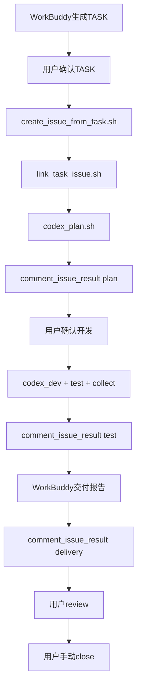

# GitHub Issue 任务留痕流程（V1.2）

> 在 V1.1 本地规程化流水线之上，把每个 TASK 沉淀到 GitHub Issue，形成可追踪、可回看、可复盘的远程留痕系统。

主流程仍见 [`ai_delivery_workflow.md`](ai_delivery_workflow.md)。本文描述 V1.2 扩展的 Issue 留痕层。

---

## 数据源角色

```text
一个 TASK ↔ 一个 GitHub Issue（1:1）
TASK 文件     = 本地标准源（docs/tasks/ 或 .ai/tasks/）
GitHub Issue  = 远程留痕源
PR            = 代码变更源
交付报告      = 验收源
```

---

## 标准流程（12 步）

```text
1.  WorkBuddy 生成 TASK
2.  你确认 TASK
3.  创建 GitHub Issue          → scripts/ai/create_issue_from_task.sh
4.  Issue 编号回填到 TASK      → scripts/ai/link_task_issue.sh
5.  CodeBuddy 执行只读 plan    → scripts/ai/codex_plan.sh
6.  plan 结果回填 Issue        → scripts/ai/comment_issue_result.sh <TASK_ID> plan
7.  你确认开发
8.  CodeBuddy 开发 + 测试 + 收集结果
9.  执行摘要回填 Issue         → comment_issue_result.sh test
10. WorkBuddy 生成交付报告
11. 交付报告回填 Issue         → comment_issue_result.sh delivery
12. 你人工 review → 手动 close Issue / 创建后续 TASK
```



---

## 每步详细说明

### Step 1–2：需求与 TASK 确认

- WorkBuddy 按 [`TASK_TEMPLATE.md`](../tasks/TASK_TEMPLATE.md) 生成任务单
- 元信息 `GitHub Issue` 字段留空，待 Step 4 回填
- 用户审核范围、不做事项、风险

### Step 3：创建 GitHub Issue

```bash
scripts/ai/create_issue_from_task.sh docs/tasks/examples/<TASK_ID>.md
# 或
scripts/ai/create_issue_from_task.sh .ai/tasks/<TASK_ID>.md
```

- 输出 Issue 编号和 URL
- 默认 labels：`type/task`、`status/requirement-ready`
- 首次使用前执行 [`github_labels.md`](github_labels.md) 中的 label 创建命令

### Step 4：回填 Issue 编号

```bash
scripts/ai/link_task_issue.sh <TASK_ID> <ISSUE_NUMBER> [task_file]
```

- 写入 TASK `## 0. 元信息` 中 `GitHub Issue` 字段（`#12` 格式）
- 可选写入 `.ai/results/<TASK_ID>/issue_link.md`

### Step 5–6：只读 Plan + Issue 评论

**Gate**：TASK 元信息中 `GitHub Issue` 必须已回填，否则 CodeBuddy 不得进入 plan。

```bash
TASK_ID=<TASK_ID> scripts/ai/codex_plan.sh <task_file>
# 规范化 plan 结果
cp .ai/results/<TASK_ID>/codex_plan_*.md .ai/results/<TASK_ID>/plan_result.md
scripts/ai/comment_issue_result.sh <TASK_ID> plan
scripts/ai/update_issue_status.sh <TASK_ID> PLAN_READY
```

### Step 7–9：开发、测试、回填

```bash
scripts/ai/codex_dev.sh <task_file> feature/<short-name>
TASK_ID=<TASK_ID> scripts/ai/run_tests.sh
scripts/ai/collect_result.sh <TASK_ID> <task_file>
scripts/ai/make_delivery_summary.sh <TASK_ID> <task_file>
scripts/ai/comment_issue_result.sh <TASK_ID> test
scripts/ai/update_issue_status.sh <TASK_ID> DELIVERY_READY
```

### Step 10–11：交付报告回填

- WorkBuddy 基于 `delivery_report_draft.md` 生成正式报告
- 保存为 `.ai/results/<TASK_ID>/delivery_report.md`（或由 `delivery_report_draft.md` 回退）

```bash
scripts/ai/comment_issue_result.sh <TASK_ID> delivery
```

### Step 12：人工 review 与关闭

- 用户 review diff，决定是否 commit / push / merge
- **关闭 Issue 必须由用户手动确认**：

```bash
scripts/ai/update_issue_status.sh <TASK_ID> CLOSED --close
# 或
gh issue close <ISSUE_NUMBER>
```

---

## 脚本清单（V1.2 新增）

| 脚本 | 说明 |
|------|------|
| `create_issue_from_task.sh` | 从 TASK 文件创建 GitHub Issue |
| `link_task_issue.sh` | Issue 编号回填 TASK |
| `comment_issue_result.sh` | plan / test / delivery 结果评论到 Issue |
| `update_issue_status.sh` | 同步 `status/*` label 与 TASK Status |

---

## Issue Gate（CodeBuddy 强制）

1. TASK 无 GitHub Issue 编号 → **不得**进入 plan / dev
2. 开发结果必须写入 `.ai/results/<TASK_ID>/` 并回填 Issue 评论
3. **不**自动 close Issue（除非用户显式 `--close`）
4. **不**自动创建 PR、push、merge、deploy
5. **不**修改密钥或 `.env`

---

## V1.2 明确不做

- 自动 PR / merge / deploy
- GitHub webhook 触发开发
- n8n / Channels 集成
- WorkBuddy 自动调用 CodeBuddy
- `dispatch_task.sh` 自动调度（V1.4）

---

## 相关文档

- 标签体系：[`github_labels.md`](github_labels.md)
- WorkBuddy 用法：[`workbuddy_github_issue_usage.md`](workbuddy_github_issue_usage.md)
- CodeBuddy：[`CODEBUDDY.md`](../../CODEBUDDY.md)
- 状态机：[`status_machine.md`](status_machine.md)
