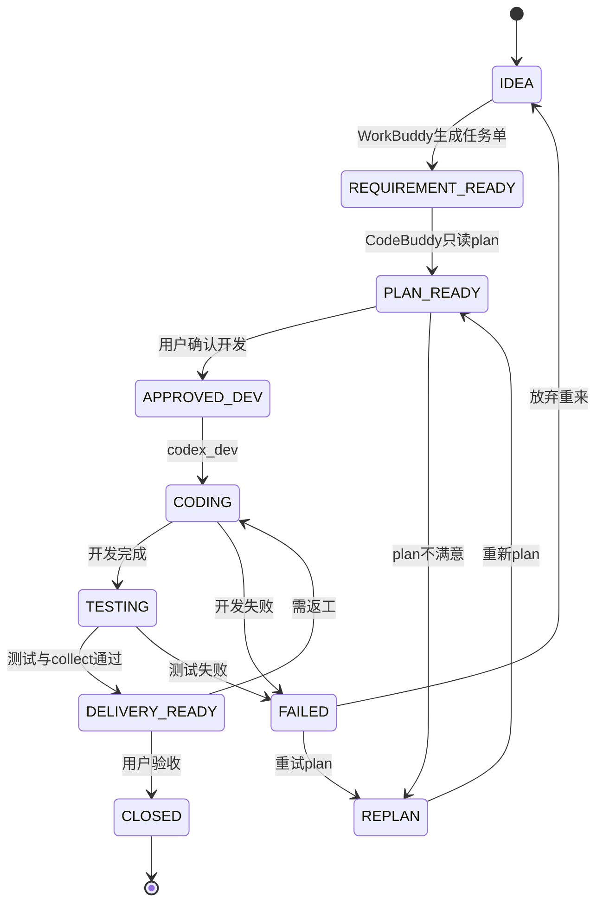

# 任务状态机

> V1.1 规程化 AI 开发流水线的统一任务状态。WorkBuddy、CodeBuddy、Codex 和用户都围绕同一套状态工作。

状态定义与 Gate 对齐见 [`docs/AI_WECHAT_WORKFLOW.md`](../AI_WECHAT_WORKFLOW.md) 的 Required Gates 章节。

---

## 状态一览

| 状态 | 含义 | 负责角色 | 允许操作 | 下一状态 |
|------|------|----------|----------|----------|
| `IDEA` | 原始想法，尚未结构化 | 用户 / WorkBuddy | 整理需求、生成任务单草稿 | `REQUIREMENT_READY` |
| `REQUIREMENT_READY` | 任务单就绪，待用户审核 | WorkBuddy → 用户 | 审核范围、安全性、不做事项 | `PLAN_READY`（plan 后）或退回修改 |
| `PLAN_READY` | 只读 Plan 完成，待用户确认开发 | CodeBuddy → 用户 | 审查 plan 输出 | `APPROVED_DEV` 或 `REPLAN` |
| `APPROVED_DEV` | 用户明确批准进入开发 | 用户 | CodeBuddy 创建分支并调 dev | `CODING` |
| `CODING` | Codex 开发进行中 | CodeBuddy / Codex | workspace-write 修改 | `TESTING` 或 `FAILED` |
| `TESTING` | 测试与结果收集中 | CodeBuddy | `run_tests.sh`、`collect_result.sh` | `DELIVERY_READY` 或 `FAILED` |
| `DELIVERY_READY` | 可交付，待 WorkBuddy 出报告 | CodeBuddy → WorkBuddy | 生成交付报告草稿 | `CLOSED` 或继续 `CODING` |
| `CLOSED` | 任务完成，用户已 review | 用户 | commit / push / merge 决策（人工） | — |
| `FAILED` | 执行失败，需人工介入 | 用户 | 诊断、重试或放弃 | `REPLAN` 或 `IDEA` |
| `REPLAN` | Plan 不满足要求，需重新 plan | CodeBuddy | 只读 plan（Gate 1） | `PLAN_READY` |

---

## 状态流转图

---

## 与 Gate 对齐

### Gate 1：只读 Plan

- 适用状态：`REQUIREMENT_READY` → `PLAN_READY`
- 脚本：`scripts/ai/codex_plan.sh <task_file>`
- 禁止：修改仓库文件
- Codex sandbox：`read-only`

### Gate 2：用户确认

- 适用状态：`PLAN_READY` → `APPROVED_DEV`
- 要求：用户用自然语言明确批准，CodeBuddy 不得推断同意
- 禁止：跳过 plan 直接 dev

### Gate 3：专用分支

- 适用状态：`APPROVED_DEV` → `CODING`
- 脚本：`scripts/ai/codex_dev.sh <task_file> codex/<name>` 或 `feature/<name>`
- 要求：从干净 `main` 创建分支，工作区无未提交变更
- Codex sandbox：`workspace-write`

### Gate 4：不自动发布

- 适用状态：全流程
- 禁止：push、merge、tag、release、deploy、自动 PR
- 用户保留：review、commit、push、merge、部署确认权

---

## 各状态禁止动作

| 状态 | 禁止 |
|------|------|
| `IDEA` | 直接让 Codex 改代码 |
| `REQUIREMENT_READY` | CodeBuddy 未经用户审核就 plan |
| `PLAN_READY` | 未经用户确认就 dev |
| `APPROVED_DEV` | 在非 main 或脏工作区创建 dev 分支 |
| `CODING` | push、merge、改 `.env`、删 data |
| `TESTING` | 自动修复失败测试（只报告） |
| `DELIVERY_READY` | WorkBuddy 自动 merge |
| 任意 | `codex exec --sandbox danger-full-access` |

---

## 状态更新约定

1. 任务单中的「任务状态」字段由 WorkBuddy（创建时）或 CodeBuddy（各阶段完成后）更新。
2. CodeBuddy 每次阶段转换必须在回复中报告当前状态。
3. 交付记录表格（任务单末尾）应填写各阶段时间与输出路径。
4. 运行时产物路径：`.ai/results/<TASK_ID>/`（plan、dev、execution_summary、delivery_report_draft）。

---

## 相关文档

- 主流程：[`ai_delivery_workflow.md`](ai_delivery_workflow.md)
- 任务模板：[`docs/tasks/TASK_TEMPLATE.md`](../tasks/TASK_TEMPLATE.md)
- CodeBuddy：[`CODEBUDDY.md`](../../CODEBUDDY.md)
